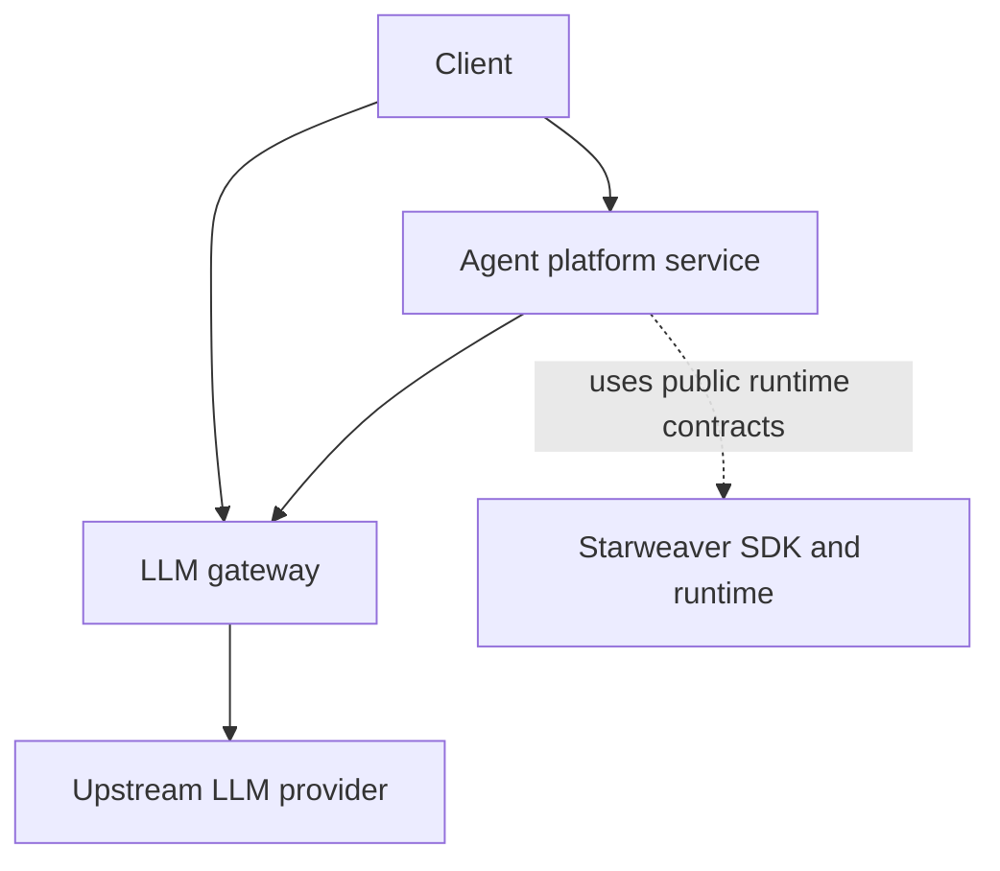

# Starweaver Platform

[](https://github.com/Wh1isper/starweaver-platform/actions/workflows/ci.yml)
[](https://github.com/Wh1isper/starweaver-platform/actions/workflows/docs.yml)
[](https://github.com/Wh1isper/starweaver-platform/actions/workflows/pre-commit.yml)

Starweaver Platform is the enterprise service workspace for the Starweaver agent
platform and LLM gateway.

This repository is separate from the core
[`starweaver`](https://github.com/Wh1isper/starweaver) SDK/runtime repository.
The core repository owns the local runtime, CLI, model/provider abstraction,
tools, envd integration, and host protocols. This repository owns service-side
infrastructure such as tenancy, credentials, policy, audit, usage, deployment,
and hosted APIs.

## Workspace

- `crates/starweaver-platform` - agent control-plane crate.
- `crates/starweaver-gateway` - LLM gateway crate.
- `xtask` - repository automation for docs and CI checks.
- `docs/` - mdBook documentation site.
- `spec/` - design specs and architecture notes.

## Service Boundary



The platform service may route model traffic through the gateway, but that is a
deployment topology. The gateway must remain the model egress plane and should
not import the agent runtime.

## Local Development

Install the Rust toolchain from `rust-toolchain.toml`, then run:

```bash
make ci
```

Useful targets:

```bash
make fmt-check
make check
make test
make docs-check
make docs-build
make scripts-check
make docker-build
make compose-smoke
```

Install local pre-commit hooks with:

```bash
make install
```

The platform service does not enable human login by default, and it does not
create an OIDC provider automatically. For local or simple self-hosted
bootstrap, enable the local single-user provider with:

```bash
export STARWEAVER_PLATFORM_SINGLE_USER_USERNAME=admin
export STARWEAVER_PLATFORM_SINGLE_USER_PASSWORD='change-me'
```

When both values are configured, `/auth/v1/single-user/login` creates an opaque
session and bootstraps the default tenant, organization, project, and owner
grants. The login response includes CSRF metadata; browser clients must send the
returned `x-starweaver-platform-csrf-token` value on session mutation APIs.
Generic OIDC login can be configured later through the admin identity-provider
APIs. Non-OIDC OAuth providers such as GitHub OAuth App need an OIDC broker or
a separate OAuth adapter before they can be used directly.

Platform request handling uses bounded request controls. Override the defaults
with `STARWEAVER_PLATFORM_MAX_BODY_BYTES` and
`STARWEAVER_PLATFORM_REQUEST_TIMEOUT_MS` when a deployment needs tighter or
looser HTTP limits.

For local file-backed usage or audit exports, configure an absolute export
object directory and request `storage_backend: file_object_storage`:

```bash
export STARWEAVER_GATEWAY_EXPORT_OBJECT_STORAGE_DIR=/var/lib/starweaver/gateway-exports
```

For a local gateway stack with PostgreSQL, Redis, migration, and `/readyz`
smoke:

```bash
make compose-smoke
```

## Documentation

The docs site is built with mdBook:

```bash
make docs-build
```

The GitHub Actions docs workflow deploys `book/` to Cloudflare Pages project
`starweaver-platform-docs`.

Detailed service design lives under `spec/`:

- `spec/shared/` - repository and service-suite boundaries.
- `spec/platform/` - hosted agent platform control-plane direction.
- `spec/gateway/` - enterprise LLM gateway specs for tenancy, provider
  credentials, routing groups, runtime protocol, usage, cost budgets,
  notifications, admin API, API keys, authorization, security, operations, and
  rollout.
- `spec/ops/` - release, deployment, migration, and artifact strategy.
