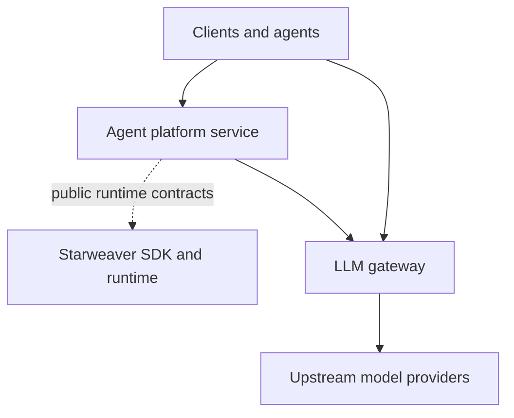

# Service Boundary

The platform repository owns enterprise service infrastructure. The core
Starweaver repository owns the SDK/runtime layer.

## Ownership

| Area                                                   | Owner                      |
| ------------------------------------------------------ | -------------------------- |
| Agent loop, tools, model abstraction, CLI, envd        | Core Starweaver repository |
| Tenancy, credentials, policy, audit, usage, deployment | Platform repository        |
| Model egress routing and upstream credentials          | LLM gateway                |
| Conversations, runs, approvals, evidence archives      | Agent platform service     |

## Rules

- The gateway does not depend on the agent runtime.
- The platform service treats gateway access as a configured HTTP endpoint.
- Shared contracts should stay small and stable.
- Deployment topology is configuration, not compile-time coupling.
