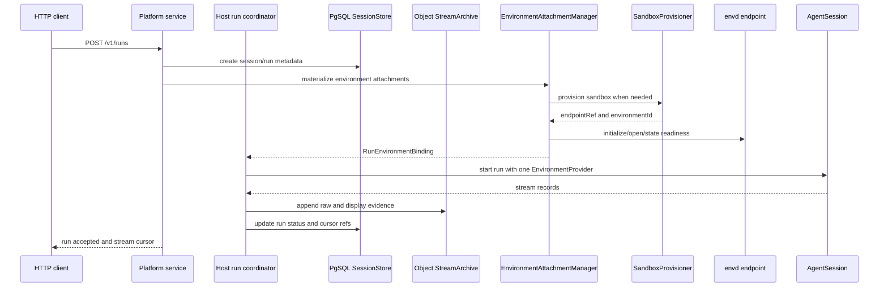
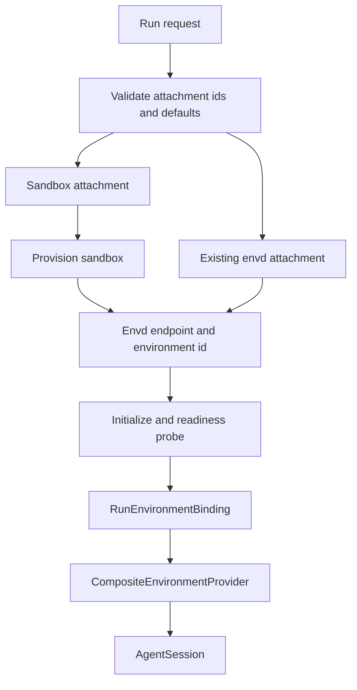

# Platform Service Candidate

Status: exploratory design. This spec describes a possible Starweaver platform
service mode; it is not an implementation commitment.

The platform service would be a networked product host parallel to the local
JSON-RPC host process. It would expose HTTP APIs for conversations, runs, live
streams, approvals, and environment attachments. It would persist conversation
metadata in PostgreSQL and archive large execution evidence such as message
history, raw stream records, display messages, and replay snapshots in object
storage.

## Goals

- Keep the service host compatible with the shared `SessionStore`,
  `StreamArchive`, `ReplayEventLog`, `DisplayMessage`, and environment
  attachment contracts.
- Support multi-tenant HTTP clients without making the runtime multi-tenant.
- Persist metadata and query indexes in PostgreSQL while keeping large ordered
  evidence in object storage.
- Let local Docker and external schedulers such as Kubernetes provide sandbox
  environments through the same host-facing provisioning boundary.
- Keep envd as the environment data/effect plane for file, command, process,
  context, and state operations.

## Non-Goals

- This spec does not require Starweaver to build a hosted platform now.
- The platform service is not a replacement for the local JSON-RPC host process.
- The core runtime must not depend on PostgreSQL, object storage, HTTP service
  types, sandbox schedulers, or envd RPC DTOs.
- Envd should not become a sandbox scheduler. It owns environment state and
  effects after an environment exists.
- Platform v1 should not mutate active run mounts. Attachments are materialized
  before the run starts.

## Boundary Decision

The service has four planes:

| Plane                         | Owner                       | Responsibilities                                                                                   |
| ----------------------------- | --------------------------- | -------------------------------------------------------------------------------------------------- |
| Agent control plane           | Platform service            | HTTP resources, auth, tenancy, run lifecycle, cancellation, steering, approvals, attachment leases |
| Durable evidence plane        | Session and stream adapters | PostgreSQL metadata, object storage archives, replay cursors, compact snapshots                    |
| Environment data/effect plane | envd                        | File, command, process, context rendering, state snapshots, operation/effect records               |
| Sandbox lifecycle plane       | Sandbox provisioner         | Create, probe, and release concrete sandboxes that expose envd endpoints                           |



The runtime sees one SDK `EnvironmentProvider`, usually a
`CompositeEnvironmentProvider`. It does not receive attachment leases, sandbox
ids, provisioner ids, or object storage keys.

## Relationship to JSON-RPC Host

The local JSON-RPC host and the platform service should share host-level
contracts, not necessarily the same wire protocol.

| Area                   | JSON-RPC host                                        | Platform service                                |
| ---------------------- | ---------------------------------------------------- | ----------------------------------------------- |
| Primary use            | Local Desktop, automation, local host process        | Multi-tenant network service                    |
| Transport              | JSON-RPC over stdio or local HTTP                    | REST-style HTTP plus SSE or WebSocket           |
| Storage default        | local SQLite and local archives                      | PostgreSQL metadata and object storage evidence |
| Live stream            | stdio notifications or replay where transport allows | SSE or WebSocket backed by `ReplayEventLog`     |
| Environment attachment | `EnvironmentAttachmentManager`                       | same manager contract with service provisioners |

The platform HTTP API can use resource-oriented routes while reusing
Starweaver-native request records such as `InputPart`, `DisplayMessage`,
`ReplayCursor`, approval records, deferred records, and environment attachment
summaries.

## Durable Storage Split

PostgreSQL stores metadata needed for listing, filtering, authorization,
idempotency, recovery, and cursor lookup:

- tenants, projects, users, API clients, and auth scopes
- conversations and sessions
- runs, run status, model profile, usage, trace ids, and timing
- approval and deferred tool records
- environment attachment leases and safe readiness summaries
- stream cursor refs and object archive manifests
- idempotency keys and service outbox rows

Object storage stores large ordered evidence:

- message history snapshots and deltas
- raw runtime stream records
- projected `DisplayMessage` records
- replay snapshots and compact view snapshots
- optional trace export payloads after redaction

Suggested object key shape:

```text
tenants/{tenant_id}/conversations/{conversation_id}/sessions/{session_id}/runs/{run_id}/message-history/{part}.jsonl.zst
tenants/{tenant_id}/conversations/{conversation_id}/sessions/{session_id}/runs/{run_id}/raw-stream/{part}.jsonl.zst
tenants/{tenant_id}/conversations/{conversation_id}/sessions/{session_id}/runs/{run_id}/display-messages/{part}.jsonl.zst
tenants/{tenant_id}/conversations/{conversation_id}/sessions/{session_id}/runs/{run_id}/snapshots/{cursor}.json.zst
```

Each manifest row should record:

| Field             | Meaning                                                        |
| ----------------- | -------------------------------------------------------------- |
| `objectKey`       | Object storage key                                             |
| `schema`          | Record schema, such as `starweaver.display_message.v1`         |
| `scope`           | Replay scope, such as `run:{run_id}` or `session:{session_id}` |
| `cursorStart`     | First cursor included in the object                            |
| `cursorEnd`       | Last cursor included in the object                             |
| `recordCount`     | Number of records                                              |
| `contentEncoding` | Compression and encoding                                       |
| `checksum`        | Object checksum for integrity checks                           |
| `sealed`          | Whether the object part is immutable                           |

Object parts should be append-buffered by the service and sealed into immutable
objects. Recovery replays sealed manifests and the service outbox rather than
trusting in-memory buffers.

## Live Stream Contract

Live streams should be served from `ReplayEventLog`, not from object storage.
Object storage is the durable archive; it is too coarse for low-latency tailing.

Platform stream routes can support:

```text
GET /v1/runs/{runId}/events?cursor={cursor}
GET /v1/sessions/{sessionId}/events?cursor={cursor}
```

The service should:

- replay events after the requested cursor
- attach a live tail after replay
- emit terminal markers
- allow reconnect by cursor
- project events into `DisplayMessage` by default
- optionally expose raw stream records only to privileged debugging clients

SSE is enough for v1. WebSocket can be added when bidirectional live steering or
interactive approval UX requires one connection.

## HTTP Resource Shape

Candidate endpoints:

```text
POST /v1/conversations
GET  /v1/conversations/{conversationId}
GET  /v1/conversations/{conversationId}/sessions

POST /v1/runs
GET  /v1/runs/{runId}
POST /v1/runs/{runId}:cancel
POST /v1/runs/{runId}:steer
GET  /v1/runs/{runId}/events

POST /v1/approvals/{approvalId}:decide
GET  /v1/deferred-tools
POST /v1/deferred-tools/{deferredToolId}:resume

POST   /v1/environment-attachments
GET    /v1/environment-attachments
GET    /v1/environment-attachments/{attachmentLeaseId}/health
DELETE /v1/environment-attachments/{attachmentLeaseId}
```

Run creation:

```json
{
  "conversation": {
    "policy": "new",
    "title": "Investigate build failure"
  },
  "input": {
    "parts": [
      {
        "kind": "text",
        "text": "Run the tests and explain the failure."
      }
    ]
  },
  "model": {
    "profile": "coding"
  },
  "environmentAttachments": [
    {
      "id": "workspace",
      "kind": "sandbox",
      "provisionerRef": "local-docker",
      "templateRef": "rust-workspace",
      "workspace": {
        "git": {
          "repo": "https://github.com/example/project",
          "ref": "main"
        }
      },
      "mode": "read_write",
      "default": true
    }
  ],
  "stream": {
    "subscribe": true,
    "projection": {
      "formats": ["starweaver.display_message"]
    }
  },
  "idempotencyKey": "client-run-001"
}
```

Run creation result:

```json
{
  "conversationId": "conv_...",
  "sessionId": "session_...",
  "runId": "run_...",
  "status": "running",
  "stream": {
    "cursor": null,
    "eventsUrl": "/v1/runs/run_.../events"
  },
  "environmentAttachments": [
    {
      "attachmentLeaseId": "envatt_...",
      "id": "workspace",
      "kind": "sandbox",
      "mountRoot": "/environment/workspace",
      "status": "ready",
      "readiness": {
        "transport": "ready",
        "environment": "ready",
        "capabilities": {
          "files": ["read", "write", "list", "stat", "glob", "grep"],
          "command": ["run"],
          "process": ["start", "wait", "input", "signal", "kill"]
        }
      }
    }
  ]
}
```

## Environment Attachments

The platform service should preserve the existing attachment model:

- an attachment has an agent-facing `id`
- multiple attachments require exactly one default attachment
- `attachmentLeaseId` is a platform host handle
- `environmentId` is an envd-owned id
- `endpointRef` identifies how the host reaches envd
- the run receives one SDK provider after materialization

Envd attachment source:

```json
{
  "id": "workspace",
  "kind": "envd",
  "endpointRef": "sandbox-envd-123",
  "environmentId": "env_123",
  "mode": "read_write",
  "default": true
}
```

Sandbox attachment source:

```json
{
  "id": "workspace",
  "kind": "sandbox",
  "provisionerRef": "k8s-prod",
  "templateRef": "rust-workspace",
  "workspace": {
    "git": {
      "repo": "https://github.com/example/project",
      "ref": "main"
    }
  },
  "resources": {
    "cpu": "2",
    "memory": "4Gi",
    "disk": "20Gi"
  },
  "ttlSeconds": 7200,
  "mode": "read_write",
  "default": true,
  "metadata": {}
}
```

The platform manager resolves `kind: "sandbox"` by calling a provisioner. The
provisioner returns an envd endpoint and environment id. After that point,
readiness, file operations, command execution, process management, context
rendering, and state export all go through envd.

## Sandbox Provisioner Boundary

`SandboxProvisioner` is a host-side lifecycle contract. It is not part of envd.

Target shape:

```rust
#[async_trait]
pub trait SandboxProvisioner: Send + Sync {
    async fn provision(
        &self,
        request: SandboxProvisionRequest,
    ) -> Result<SandboxProvisionResult, SandboxProvisionError>;

    async fn probe(
        &self,
        lease: SandboxLeaseRef,
    ) -> Result<SandboxReadiness, SandboxProvisionError>;

    async fn release(
        &self,
        lease: SandboxLeaseRef,
        reason: SandboxReleaseReason,
    ) -> Result<(), SandboxProvisionError>;
}
```

Provision request fields:

| Field            | Meaning                                                    |
| ---------------- | ---------------------------------------------------------- |
| `tenantId`       | Tenant boundary for policy and quota                       |
| `conversationId` | Conversation requesting the sandbox                        |
| `sessionId`      | Session requesting the sandbox                             |
| `runId`          | Optional run id when provision happens inside run start    |
| `attachmentId`   | Agent-facing attachment id                                 |
| `templateRef`    | Host-configured sandbox template                           |
| `workspace`      | Git, snapshot, uploaded archive, or empty workspace source |
| `resources`      | CPU, memory, disk, timeout, and network policy hints       |
| `mode`           | Requested read/write mode                                  |
| `ttlSeconds`     | Requested lease lifetime                                   |
| `idempotencyKey` | Provision retry key                                        |
| `metadata`       | Safe host metadata                                         |

Provision result fields:

| Field            | Meaning                              |
| ---------------- | ------------------------------------ |
| `sandboxLeaseId` | Provisioner-owned lifecycle handle   |
| `endpointRef`    | Host-resolved envd endpoint ref      |
| `environmentId`  | Envd environment id                  |
| `expiresAt`      | Lease expiry when known              |
| `capabilities`   | Safe capability summary              |
| `metadata`       | Safe metadata, with secrets redacted |

The provisioner may be implemented by Starweaver, by a host application, or by
an external service. The only required outcome is a reachable envd-compatible
environment.

## Docker Local Example

A local Docker provisioner can implement the sandbox lifecycle as:

1. Pull or build a sandbox image containing `starweaver-envd`.
2. Create a container with a workspace volume mounted read/write or read-only.
3. Start envd inside the container.
4. Bind an envd HTTP endpoint to loopback or a private service network.
5. Return `endpointRef`, `environmentId`, and capabilities.
6. On release or TTL expiry, stop and remove the container and clean temporary
   volumes according to policy.

The Docker provisioner is a reference implementation for local development and
integration tests. It should not define the platform contract by itself.

## External Scheduler Example

A Kubernetes scheduler integration can implement `SandboxProvisioner` by:

1. Creating a Pod, Job, or custom sandbox resource from `templateRef`.
2. Attaching workspace state through a PVC, CSI volume, init container, or
   object-storage sync.
3. Running envd as the primary process or as a sidecar.
4. Exposing envd through a Service, port-forward bridge, or internal gateway.
5. Returning an `endpointRef` that the platform resolver can connect to.
6. Deleting or recycling the sandbox when the Starweaver attachment lease is
   released or expires.

Starweaver should not require Kubernetes concepts in the runtime or envd API.
Kubernetes-specific state remains in provisioner metadata and operator logs.

## Materialization Flow



Materialization rules:

- Required attachment failures fail `run.start` before active-run registration
  when possible.
- If a durable run has already been created, failures mark the run failed rather
  than leaving an active orphan.
- The run record stores safe attachment refs, readiness summaries, object
  manifest refs, and start/end envd state versions when available.
- The run record does not store full envd state, sandbox scheduler state, or
  credentials.
- Active-run attachment changes are out of scope for v1.

## Security and Tenancy

The platform service must treat endpoint and sandbox inputs as privileged host
configuration:

- Prefer configured `endpointRef` and `provisionerRef` aliases over arbitrary
  client-supplied URLs.
- Restrict literal envd endpoints to trusted admin contexts, if supported at
  all.
- Store credentials as secret refs, not as metadata, display messages, object
  archives, or run records.
- Redact provider headers, env vars, shell credentials, and internal network
  addresses from user-visible events.
- Enforce tenant, project, user, and API-client scopes before reading PgSQL rows
  or object storage keys.
- Encrypt object storage and database records according to deployment policy.
- Attach trace ids and audit ids to provisioner calls and envd calls.
- Apply network egress policy in sandbox templates rather than asking the model
  or runtime to self-police.

## Failure Modes

| Failure                                   | Expected handling                                                                    |
| ----------------------------------------- | ------------------------------------------------------------------------------------ |
| Provisioner timeout                       | Attachment materialization fails or reports degraded status under best-effort policy |
| Envd readiness failure                    | `environment` readiness is unavailable; required runs fail before start              |
| Stream object append failure              | Run should fail closed or pause terminalization until evidence is durable            |
| Live event delivery failure               | Client reconnects by replay cursor                                                   |
| PgSQL update failure after archive append | Recovery scans uncommitted outbox/object manifest state                              |
| Sandbox orphan                            | Provisioner reconciliation releases expired leases                                   |
| Object archive corruption                 | Checksum failure marks affected run evidence unavailable until repaired              |

## Open Questions

- Whether message history should be archived as complete snapshots, deltas, or
  both.
- Whether the first platform implementation should use PgSQL outbox, Redis,
  NATS, or Kafka for distributed `ReplayEventLog`.
- Whether object storage archives should be encrypted per tenant or per project.
- Whether platform HTTP should expose a JSON-RPC compatibility route for local
  clients, or stay resource-oriented only.
- How much of `EnvironmentAttachmentManager` should move into a product-neutral
  host crate before platform implementation.
- Whether sandbox provisioner plugins should be in-process Rust adapters,
  external HTTP services, or both.

## Future Acceptance Gates

If this direction graduates into implementation, minimum gates should include:

- contract tests for PostgreSQL `SessionStore`
- contract tests for object-backed `StreamArchive`
- replay-after-cursor tests across sealed object parts
- idempotent run creation and idempotent sandbox provisioning tests
- envd readiness and attachment materialization tests
- local Docker sandbox smoke test
- failure recovery tests for run acceptance, object archive append, and PgSQL
  manifest updates
- docs explaining that envd is the environment plane and provisioners own
  sandbox lifecycle
