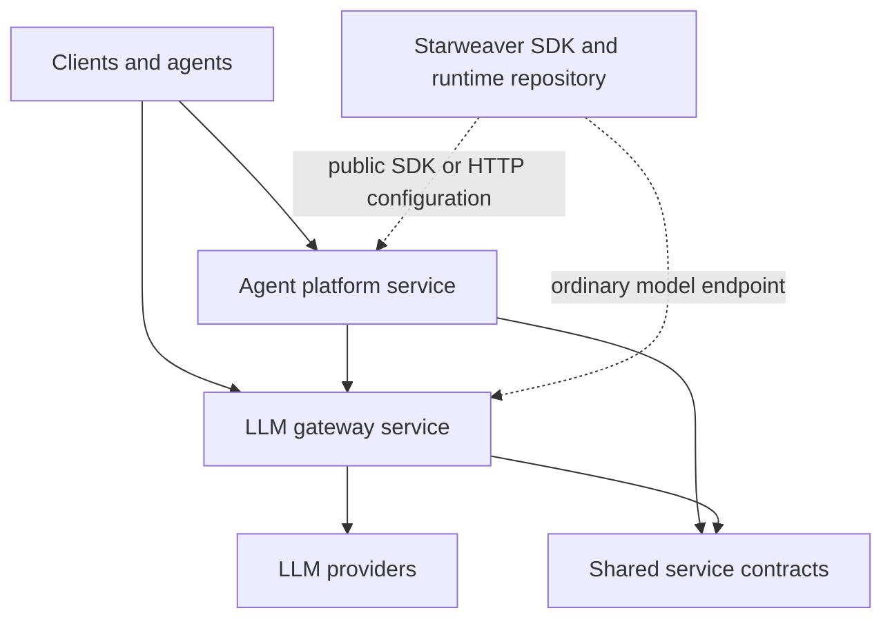

# Starweaver Platform Specs

Status: discussion draft.

This repository is the candidate home for Starweaver service infrastructure:
an LLM gateway and an agent platform service managed in one Git repository and
one workspace. It is intentionally separate from the Starweaver SDK/runtime
repository.

## Design Position

The platform repository owns service-side infrastructure. The Starweaver
SDK/runtime repository owns the agent engine, local CLI, runtime crates, model
adapters, tools, envd integration, and local host protocols.

This repository should not become a dependency of the SDK/runtime repository,
and the gateway should not import the agent runtime.

## Spec Map

- `01-platform-service.md` is the existing detailed candidate for the hosted
  agent platform service shape.
- `shared/01-service-suite-boundary.md` defines the repository, workspace, and
  dependency boundaries for the service suite.
- `gateway/README.md` indexes the enterprise LLM gateway spec set.
- `gateway/00-requirements.md` maps gateway functional capabilities to design
  owners and completion evidence.
- `gateway/01-llm-gateway.md` defines the model egress plane, top-level
  lifecycle, and gateway responsibilities.
- `gateway/02-tenancy-access.md` defines tenant, organization, project,
  principal, API key, caller credential, RBAC, and provider grant boundaries.
- `gateway/03-provider-credential-catalog.md` defines provider endpoints,
  upstream credentials, upstream Codex OAuth, model targets, aliases, and
  pricing SKUs.
- `gateway/04-routing-router.md` defines routing groups, route policies,
  router strategies, health, stickiness, failover, and route decisions.
- `gateway/05-runtime-protocol.md` defines client-facing protocol handling,
  provider adaptation, streaming, usage extraction, and runtime errors.
- `gateway/06-usage-cost-budget-notifications.md` defines cost-only usage
  events, ledgers, budgets, quotas, notifications, webhooks, and exports.
- `gateway/07-admin-config-api.md` defines admin resources, config snapshots,
  validation, audit, route simulation, and API behavior.
- `gateway/08-security-observability-operations.md` defines secret handling,
  redaction, telemetry, storage, deployment, backup, and incident operations.
- `gateway/09-validation-and-rollout.md` defines implementation phases, test
  matrices, compatibility rules, release readiness, and review gates.
- `gateway/10-authorization-api-keys.md` defines user-owned and service-owned
  API keys, REST API authorization, action/resource vocabulary, policy engine
  direction, and permission gates.
- `gateway/11-login-user-management.md` defines GitHub OAuth App login, OIDC
  login, sessions, external identities, invitations, default organizations, and
  user management.
- `gateway/12-dashboards-observability-api.md` defines the Redis-compatible
  realtime operations dashboard, scoped dashboard APIs, usage analytics, model
  observability, and project member consumption views.
- `gateway/memos/` records implementation planning notes such as framework and
  library selection.
- `platform/01-agent-platform-service.md` summarizes the agent control plane
  relationship to the gateway and complements the detailed top-level platform
  service candidate.
- `ops/01-release-and-deployment.md` defines release, image, migration, and
  artifact strategy for this repository.

## Working Rules

- Keep gateway and platform service boundaries explicit.
- Share stable contracts, not business loops.
- Prefer HTTP and versioned schemas between services over crate-internal calls.
- Keep service-side dependencies out of the SDK/runtime repository.
- Treat deployment topology as configuration, not as compile-time coupling.
