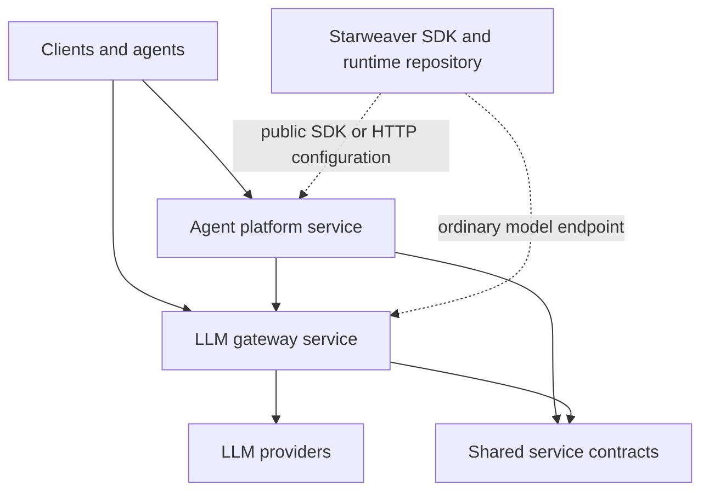

# Starweaver Platform Specs

Status: discussion draft.

This repository is the candidate home for Starweaver service infrastructure:
an LLM gateway and an agent platform service managed in one Git repository and
one workspace. It is intentionally separate from the Starweaver SDK/runtime
repository.

## Design Position

The platform repository owns service-side infrastructure. The Starweaver
SDK/runtime repository owns the agent engine, local CLI, runtime crates, model
adapters, tools, envd integration, and local host protocols.

This repository should not become a dependency of the SDK/runtime repository,
and the gateway should not import the agent runtime.

## Spec Map

- `01-platform-service.md` is the existing detailed candidate for the hosted
  agent platform service shape.
- `shared/01-service-suite-boundary.md` defines the repository, workspace, and
  dependency boundaries for the service suite.
- `gateway/01-llm-gateway.md` defines the model egress plane, enterprise routing
  objects, credential objects, and gateway responsibilities.
- `platform/01-agent-platform-service.md` summarizes the agent control plane
  relationship to the gateway and complements the detailed top-level platform
  service candidate.
- `ops/01-release-and-deployment.md` defines release, image, migration, and
  artifact strategy for this repository.

## Working Rules

- Keep gateway and platform service boundaries explicit.
- Share stable contracts, not business loops.
- Prefer HTTP and versioned schemas between services over crate-internal calls.
- Keep service-side dependencies out of the SDK/runtime repository.
- Treat deployment topology as configuration, not as compile-time coupling.
