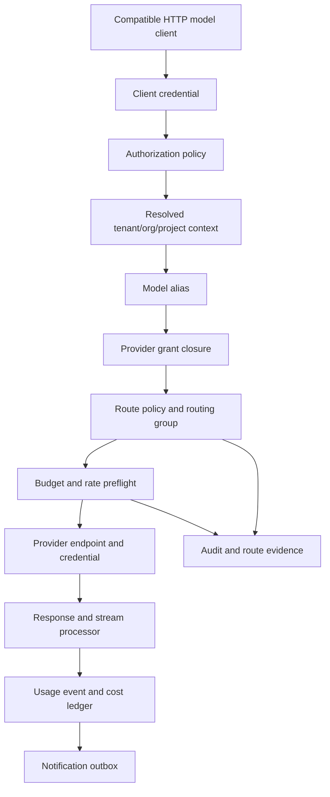

# Gateway Requirements And Capability Map

Status: design draft for review.

This document is the requirements spine for the gateway spec set. It lists the
functional capabilities the gateway must support, the design surfaces that own
each capability, and the evidence required before implementation work can call
that capability complete.

The gateway is a general-purpose enterprise LLM egress service. It is not tied
to one client runtime, UI, provider, or deployment topology.

## Requirement Levels

| Level    | Meaning                                                                |
| -------- | ---------------------------------------------------------------------- |
| required | needed for the minimum complete gateway                                |
| phased   | designed now, implemented after the first runtime path exists          |
| optional | extension point that must not shape the v1 critical path               |
| deferred | explicitly outside v1 and must not leak into APIs as a hard dependency |

## Capability Flow

## Functional Capability Matrix

| ID    | Level    | Capability                         | Design Owner                                   | Completion Evidence                                      |
| ----- | -------- | ---------------------------------- | ---------------------------------------------- | -------------------------------------------------------- |
| G-001 | required | HTTP protocol ingress              | `05-runtime-protocol.md`                       | handler tests for each enabled ingress family            |
| G-002 | required | Client credential authn            | `02-tenancy-access.md`, `10-authorization-*`   | API key prefix/hash tests and disabled-key tests         |
| G-003 | required | Unified authorization              | `10-authorization-api-keys.md`                 | action/resource tests and Cedar schema validation        |
| G-004 | required | Tenant/org/project resolution      | `02-tenancy-access.md`                         | context-resolution tests for header, key, and delegation |
| G-005 | required | Provider grant closure             | `02-tenancy-access.md`, `04-routing-router.md` | route simulation proves allow/deny closure behavior      |
| G-006 | required | Provider endpoint catalog          | `03-provider-credential-catalog.md`            | catalog validation rejects incompatible resources        |
| G-007 | required | Upstream credential safety         | `03-provider-credential-catalog.md`, `08-*`    | no read API returns raw secret material                  |
| G-008 | required | Model alias resolution             | `03-provider-credential-catalog.md`, `05-*`    | alias extraction and protocol mismatch tests             |
| G-009 | required | Routing group execution            | `04-routing-router.md`                         | deterministic route tests for enabled strategies         |
| G-010 | required | Route decision evidence            | `04-routing-router.md`                         | persisted decision and attempt event tests               |
| G-011 | required | Streaming passthrough              | `05-runtime-protocol.md`                       | fake provider SSE/stream tests                           |
| G-012 | required | Streaming failover boundary        | `04-routing-router.md`, `05-*`                 | tests prove no mixed-provider visible stream             |
| G-013 | required | Usage event recording              | `06-usage-cost-budget-notifications.md`        | idempotent usage writes under retry                      |
| G-014 | required | Cost estimate and ledger           | `06-*`, `03-*`                                 | fixed-point cost tests with pricing version              |
| G-015 | required | Budget preflight and finalizer     | `06-*`, `08-*`                                 | hard-budget stale-state and reservation tests            |
| G-016 | required | Rate and quota limits              | `06-*`, `08-*`                                 | limit window tests with cache loss behavior              |
| G-017 | required | Admin resource API                 | `07-admin-config-api.md`                       | route/action matrix tests and schema snapshots           |
| G-018 | required | Config snapshot publication        | `07-*`, `08-*`                                 | workers converge after DB polling and cache loss         |
| G-019 | required | Audit evidence                     | `07-*`, `08-*`                                 | mutation and runtime evidence is append-only             |
| G-020 | required | Redaction policy                   | `08-security-observability-operations.md`      | fixture tests for logs, traces, webhooks, exports        |
| G-021 | required | Hot-state cache discipline         | `08-*`, `04-*`, `06-*`, memo                   | key TTL, atomic script, and fail-mode tests              |
| G-022 | required | Database schema ownership          | `08-*`, `07-*`, `06-*`                         | migrations and constraints cover each resource family    |
| G-023 | required | Local deterministic validation     | `09-validation-and-rollout.md`                 | CI runs without live provider credentials                |
| G-024 | required | Human OAuth/OIDC login and session | `11-*`, `08-*`, `10-*`                         | GitHub OAuth App, OIDC validation, and session tests     |
| G-025 | required | User and membership management     | `11-*`, `02-*`, `07-*`, `10-*`                 | invite, membership, project-role, and default-org tests  |
| G-026 | required | Usage dashboard APIs               | `12-*`, `06-*`, `07-*`, `10-*`                 | scoped dashboard tests by org, project, and member       |
| G-027 | required | Model observability APIs           | `12-*`, `06-*`, `08-*`, `10-*`                 | model latency/error/usage dashboard tests                |
| G-028 | phased   | Notification delivery              | `06-*`                                         | outbox delivery and idempotent receiver contract tests   |
| G-029 | phased   | Webhook subscriptions              | `06-*`, `07-*`                                 | signed delivery, retry, disable, and backlog tests       |
| G-030 | phased   | Route simulation                   | `07-*`, `02-*`, `04-*`                         | simulation explains filtered and selected targets        |
| G-031 | phased   | Emergency disable and drain        | `07-*`, `04-*`, `08-*`                         | endpoint/key/route drain tests with audit evidence       |
| G-032 | phased   | Usage export                       | `06-*`, `08-*`                                 | export pagination, retention, and redaction tests        |
| G-033 | phased   | Upstream provider OAuth            | `03-*`, `08-*`                                 | provider-specific token lifecycle and redaction tests    |
| G-034 | optional | External authorization backend     | `10-*`, memo                                   | parity tests against in-process authorization            |
| G-035 | optional | Multi-region accounting            | `06-*`, `08-*`                                 | documented consistency model before implementation       |
| G-036 | deferred | Commercial billing workflows       | none                                           | no invoice, plan, seat, or payment API in gateway specs  |

## Ingress Requirements

Protocol ingress is required for model traffic and must stay compatible with
ordinary provider-style HTTP clients.

Required behavior:

- accept only configured protocol family paths
- extract the client-visible model alias without rewriting unrelated fields
- enforce request body size limits before upstream dispatch
- attach a gateway request id to all logs, errors, usage events, and route
  evidence
- reject incompatible alias/protocol combinations before selecting an upstream
  target
- preserve provider-compatible response shape unless the configured protocol
  adapter explicitly owns the transformation

Implementation evidence:

- path mount tests for root, protocol mount, and scoped mount variants
- malformed body and over-limit body tests
- protocol mismatch tests
- non-streaming success and error envelope tests
- streaming success, upstream error, and client disconnect tests

## Identity And Access Requirements

The gateway must separate authentication, authorization, and upstream provider
credentials.

Required behavior:

- API keys are public bearer credentials and are returned only once at creation
- durable API key storage uses a prefix for lookup and a one-way hash for
  verification
- API key permissions can only narrow the owner principal
- internal service credentials can delegate tenant/project context only when
  explicitly permitted
- untrusted context headers are ignored, not treated as authorization input
- every runtime request and admin route maps to a stable action/resource check

Implementation evidence:

- key lookup tests for valid, disabled, expired, and rotated keys
- policy tests for user-owned and service-owned keys
- header trust tests for ordinary clients and trusted internal credentials
- REST API action matrix tests

## Human Login And Session Requirements

Human admin and dashboard login uses configured login providers. GitHub OAuth
App is the required v1 bare-deploy provider. Generic OIDC is the required v1
enterprise SSO provider. This surface is separate from upstream provider OAuth
credentials.

Required behavior:

- login uses OAuth 2.0 authorization code flow with provider-specific
  validation
- GitHub OAuth App callbacks validate state, code exchange, stable GitHub user
  id, and verified email lookup when email matching is required
- OIDC callbacks validate state, nonce, PKCE, issuer, audience, signature, and
  expiration
- external identities link to gateway-local user principals
- every active user principal has a default organization
- browser sessions use opaque server-side cookies, not self-contained JWTs
- sessions can be revoked by the user and by authorized administrators
- mutating browser APIs require CSRF protection
- login provider client secrets and login session cookies are redacted

Implementation evidence:

- GitHub OAuth App login start and callback tests for valid and invalid state,
  failed code exchange, missing stable user id, and verified email behavior
- OIDC login start and callback tests for valid and invalid state/nonce/PKCE
- ID token validation tests for wrong issuer, audience, expiry, and key id
- session cookie flag and CSRF tests
- user disable and session revocation tests
- account link and external identity uniqueness tests

## Organization And Project Membership Requirements

The user-facing permission boundary is organization then project. `Tenant`
remains the outer deployment or account isolation boundary, while
`Organization` is the product-facing tenant that users join and where projects
are created.

Required behavior:

- every user principal has a default organization
- organization admins can invite users into an organization
- organization membership can be active, invited, suspended, or removed
- organizations own projects
- project membership assigns a user's role inside one project
- usage attribution can answer "what did this person consume in this project"
- users may belong to multiple organizations and projects, but one default
  organization is used for first login and default UI/API scope

Implementation evidence:

- invite creation, acceptance, expiry, revoke, and duplicate-invite tests
- default organization resolution tests
- project membership role tests
- usage dashboard tests by organization, project, and project member

## Provider And Catalog Requirements

The provider catalog must describe what can be called without exposing how
secrets are stored.

Required behavior:

- provider endpoint owns base URL, protocol family, auth mode, region, and
  operational metadata
- upstream credential owns secret reference, rotation state, auth material type,
  and allowed endpoint/provider scope
- model target owns provider-specific model id and capability metadata
- model alias owns the client-visible name and links to a route policy
- pricing documents are versioned and immutable once used by a usage event
- provider import can add draft catalog data but cannot publish runtime config
  without validation

Implementation evidence:

- validation rejects missing credentials, protocol mismatch, disabled endpoint
  use, and invalid pricing units
- read APIs return masked metadata and secret references only
- config snapshots include only runtime-safe fields

## Routing Requirements

Routing must explain both selection and exclusion.

Required behavior:

- route policy resolves from a model alias and names ordered routing groups
- routing groups contain eligible model targets for one protocol family
- eligibility filters apply tenant/org/project grants, endpoint state, target
  state, budget pressure, health, and route policy constraints
- strategy implementations are deterministic for a given config version and
  request seed unless the strategy declares exploration
- route decisions store selection evidence and append attempt events
- streaming failover cannot splice visible content from multiple upstream
  providers

Implementation evidence:

- route simulation output includes allowed, denied, filtered, and selected
  candidate sets
- weighted, priority, health-aware, sticky, and failover tests use fixed seeds
- attempt events prove retry/failover order
- emergency drain and disable tests cover active and future traffic

## Usage, Budget, And Quota Requirements

Usage and budget logic must be cost-control infrastructure, not billing.

Required behavior:

- each terminal request creates at most one usage event per idempotency key
- usage extraction records confidence and missing-usage policy outcome
- cost estimates use fixed-point units and a pricing version
- hard budget checks run before upstream dispatch when configured
- final usage reconciles reservation, actual usage, and ledger adjustment
- hard budget stale-state defaults to fail-closed unless policy declares a
  bounded fail-limited emergency mode
- rate limits and quotas define the window, scope, key, and cache-loss behavior

Implementation evidence:

- retry and duplicate delivery tests do not double-count usage
- missing provider usage tests cover allow, estimate, require, and hold modes
- reservation tests cover success, upstream failure, and client cancellation
- cache loss tests cover fail-open, fail-closed, and fail-limited policies

## Dashboard And Observability Requirements

Dashboard APIs are first-class read APIs, not UI-only queries. They must use the
same authorization model as other admin/evidence APIs.

Required dashboard scopes:

- tenant operator overview
- organization overview
- project overview
- project member usage
- API key or service account usage
- model alias observability
- model target/provider endpoint observability
- budget and rate-limit posture

Required dashboard measures:

- request count and status
- token and media usage
- estimated provider cost
- budget remaining and burn rate
- latency, time to first token, and throughput
- provider error rate and error classes
- route selection, filtering, and failover counts
- usage confidence and missing usage count

Implementation evidence:

- scoped dashboard permission tests
- aggregation correctness tests for organization, project, user-in-project, API
  key, model alias, and provider endpoint dimensions
- model observability tests for latency percentiles, error rates, failover, and
  usage confidence
- redaction tests proving dashboards do not expose raw prompts, completions, or
  secrets

## Config And Admin Requirements

Admin APIs must manage configuration without letting runtime workers mutate
long-lived config.

Required behavior:

- config changes are draft, validated, published, and rolled back through
  explicit operations
- every write requires idempotency and optimistic concurrency
- every mutation writes audit evidence with actor, resource, old/new redacted
  diff, and config version
- config snapshots are immutable and monotonic
- workers never apply an older snapshot after observing a newer snapshot
- route simulation and validation use the same policy/resource closure as
  runtime routing

Implementation evidence:

- idempotency tests for create/update/publish routes
- validation rejects partial resource graphs
- worker reload tests cover startup, polling, PubSub invalidation, missed
  PubSub, rollback, and stale snapshot rejection

## Storage And Hot-State Requirements

Durable state and hot state have different responsibilities.

Required behavior:

- PostgreSQL is the source of truth for resources, config snapshots, usage
  events, ledger buckets, audit events, and notification outbox
- Redis or Valkey is hot state only
- hot state may accelerate counters, stickiness, provider health, circuit
  breakers, and config invalidation
- hot state entries must have explicit key ownership, TTL policy, recovery path,
  and loss behavior
- no durable audit, usage, or configuration decision depends only on Redis
- atomic counter updates must use a single Redis command or script when a race
  would violate policy

Implementation evidence:

- migration tests cover durable schema constraints
- cache key tests cover namespace, tenant scoping, TTL, and redaction
- failure tests cover Redis loss before request, during request, and after usage
  finalization

## Security And Observability Requirements

The gateway is a high-value egress control point and must be safe by default.

Required behavior:

- raw prompts, completions, API keys, upstream secrets, OAuth tokens, and
  secret-like headers are not logged or traced by default
- debug capture is separately authorized, scoped, retained, and audited
- telemetry uses gateway-owned names and stable error codes
- health endpoints expose dependency status without leaking secret metadata
- backup and restore account for database, secret backend, and hot-state
  recovery assumptions

Implementation evidence:

- redaction fixture tests cover logs, traces, audits, webhooks, and exports
- debug capture tests prove retention and authorization boundaries
- health/readiness tests cover database, cache, secret backend, and config load

## Validation Requirements

Every implementation phase must leave the repository in a shippable state.

Required behavior:

- ordinary CI cannot require live provider credentials
- fake provider tests cover runtime and streaming behavior
- Postgres/Redis integration tests cover durable and hot-state contracts
- security tests run before production deployment
- docs state implemented behavior and clearly mark illustrative examples

Implementation evidence:

- `make ci` passes
- docs examples check passes
- phase-specific test matrices are satisfied for implemented capabilities
- release readiness includes migrations, rollback, and operational runbooks
