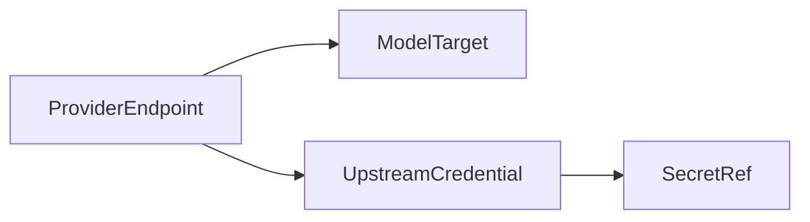
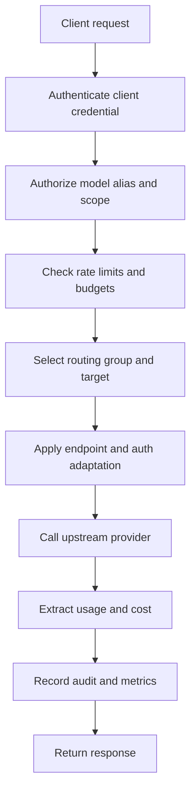

# LLM Gateway

Status: discussion draft.

The LLM gateway is the model egress plane for Starweaver service deployments.
It provides enterprise model routing, credential management, policy enforcement,
budget tracking, and observability for outbound model traffic.

## Goals

- Expose model endpoints that clients and the agent platform can call.
- Manage provider endpoints independently from credentials.
- Support enterprise routing groups, policy-based failover, sticky routing, and
  load balancing.
- Enforce client credential authorization, rate limits, budgets, and audit
  policy.
- Track usage and cost with enough detail for tenant, project, model, provider,
  and route group reporting.
- Keep protocol-family boundaries explicit.

## Non-Goals

- Do not become the Starweaver agent runtime.
- Do not depend on the Starweaver SDK/runtime repository.
- Do not implement arbitrary semantic conversion between unrelated model
  protocols.
- Do not expose raw upstream credentials to clients or admin read APIs.

## Protocol Position

The gateway should route within compatible protocol families. It may adapt
endpoint URL, authentication, provider-specific headers, and stream framing, but
it should not promise general OpenAI-to-Anthropic or Anthropic-to-OpenAI message
translation.

Protocol family determines the client-facing API shape:

| Protocol Family    | Client Shape                  | Gateway Work                                           |
| ------------------ | ----------------------------- | ------------------------------------------------------ |
| OpenAI Responses   | OpenAI Responses compatible   | URL, auth, headers, model replacement, stream handling |
| OpenAI Chat        | Chat Completions compatible   | URL, auth, headers, model replacement, stream handling |
| Anthropic Messages | Anthropic Messages compatible | URL, auth, headers, model replacement, stream handling |
| Gemini             | Gemini compatible             | URL, auth, headers, model replacement, stream handling |
| Bedrock Native     | Bedrock native                | auth and endpoint routing                              |

## Core Objects

| Object               | Responsibility                                                              |
| -------------------- | --------------------------------------------------------------------------- |
| `Tenant`             | Enterprise account boundary                                                 |
| `Project`            | Isolation and reporting boundary under a tenant                             |
| `ClientCredential`   | Inbound API key or service account credential with scopes and policy        |
| `UpstreamCredential` | Secret-backed upstream credential object                                    |
| `ProviderEndpoint`   | One concrete upstream endpoint, region, protocol family, and auth mode      |
| `ModelTarget`        | Provider-specific model identifier available on an endpoint                 |
| `RoutingGroup`       | Named group of targets, such as `prod-us`, `cheap-batch`, or `regulated-eu` |
| `ModelAlias`         | Client-visible model name bound to protocol family and routing policy       |
| `RoutePolicy`        | Selection, failover, sticky, compliance, and budget behavior                |
| `UsageBudget`        | Tenant, project, credential, alias, or route-group budget                   |
| `AuditLog`           | Immutable administrative and runtime decision evidence                      |

## Credential Model

Provider endpoints must not embed secret values. They reference upstream
credential objects.



Supported credential families should include:

- static API key
- bearer token
- OAuth token with refresh state
- AWS SigV4 or IAM role
- GCP Workload Identity or OAuth bearer token
- Azure AD or API key
- external secret manager reference

Credential read APIs return masked metadata only. Runtime paths fetch usable
secret material through explicit secret access code.

## Routing Groups

Routing groups are the enterprise routing unit. A model alias should not point
directly at a flat provider list when policy needs region, cost, compliance, or
traffic separation.

Example:

```yaml
model_aliases:
  claude-sonnet:
    protocol_family: anthropic_messages
    route_policy: balanced-prod
    routing_groups:
      - regulated-eu
      - prod-us
      - fallback-global
```

Route policies may support:

- weighted selection
- priority and failover
- latency-aware selection
- throughput-aware selection
- cost-aware selection
- sticky session routing
- compliance and residency constraints
- per-credential or per-route-group budgets
- fail-open or fail-closed behavior

## Request Lifecycle



## Sticky Routing

Sticky routing should use an explicit gateway session identifier when provided.
When absent, policy can fall back to a stable credential or project identifier.

Supported sources:

- `x-session-id`
- platform-provided run or conversation affinity key
- client credential id fallback

The gateway owns route affinity. It may forward provider-specific cache affinity
fields when the protocol supports them, but clients should not control those
fields directly when gateway policy is enabled.

## Usage And Cost

Usage events should record:

- tenant id
- project id
- client credential id
- model alias
- provider endpoint id
- routing group id
- target model id
- request id
- trace id
- input, cache write, cache read, output, and total tokens
- cost estimate in micro USD
- stream timing, TTFT, latency, and throughput when available

Pricing should be managed by SKUs that can match multiple provider model ids for
the same logical model.

## Observability

The gateway should emit:

- request spans
- routing decision spans or events
- upstream provider spans
- retry and failover events
- budget and rate limit events
- usage events
- config version in runtime decisions

Sensitive headers, prompts, API keys, OAuth tokens, and raw secret material must
be redacted by default.

## Admin API Surface

Candidate resource groups:

```text
/v1/tenants
/v1/projects
/v1/client-credentials
/v1/upstream-credentials
/v1/provider-endpoints
/v1/model-targets
/v1/routing-groups
/v1/model-aliases
/v1/route-policies
/v1/pricing-skus
/v1/budgets
/v1/audit-events
```

Every mutating operation should record actor, config version, diff summary, and
outbox invalidation event.
