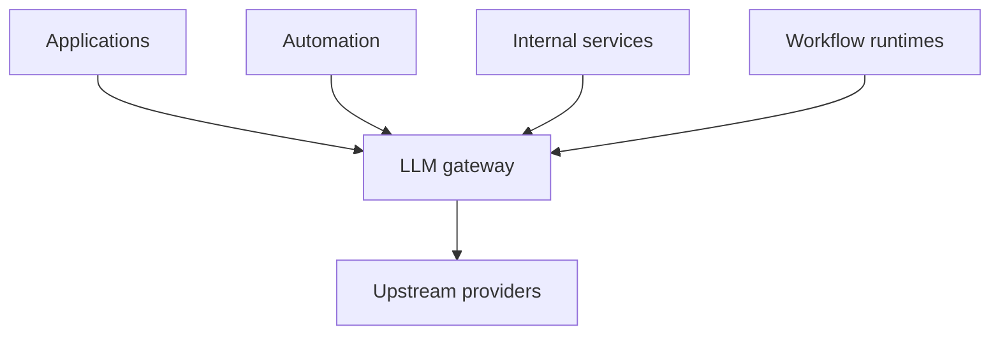
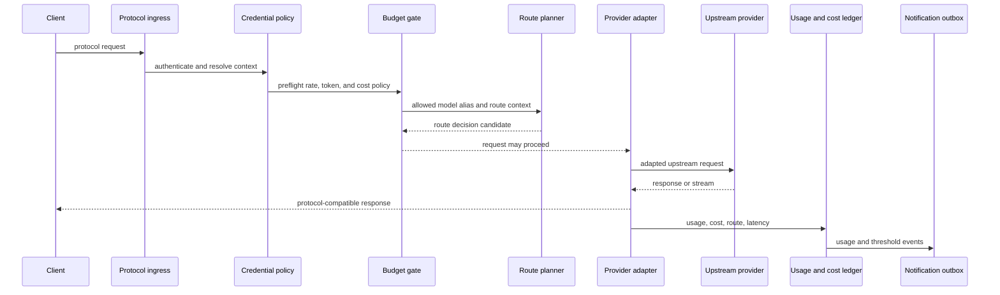
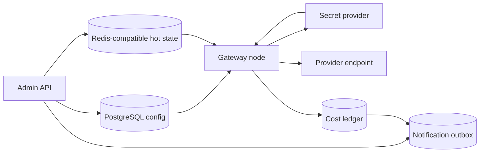

# LLM Gateway

Status: design draft for review.

The LLM gateway is a general-purpose service-side model egress plane. It
centralizes access to upstream model providers for applications, automation,
internal services, and any compatible HTTP model client. It receives
protocol-compatible model requests, applies tenant and organization policy,
selects a target through routing groups, adapts endpoint/auth/header/stream
behavior inside the selected protocol family, records provider cost, and emits
audit and notification evidence.

The gateway is open source infrastructure. It tracks cost and usage; it does
not implement paid plans, invoices, revenue accounting, or customer billing.
Commercial operators can integrate external billing systems through usage
notifications, webhook deliveries, event export, or future notification sinks.

## Goals

- Provide one managed model egress service for applications, automation,
  internal services, and any compatible HTTP model client.
- Support multi-tenant isolation across tenants, organizations, projects, users,
  service accounts, API keys, caller credentials, upstream credentials, budgets,
  and audit evidence.
- Let administrators create upstream credentials without exposing secret values
  to ordinary users, API keys, or caller credentials.
- Let organizations choose which provider endpoints and model aliases are
  available to their projects.
- Make routing groups first-class objects so enterprise policy can express
  production pools, fallback pools, compliance pools, experimental pools,
  low-cost pools, and regional pools.
- Keep route selection explicit through route policies, route attempts,
  decisions, health signals, failure classification, sticky affinity, and cost
  awareness.
- Track usage and provider cost at tenant, organization, project, credential,
  route group, provider endpoint, model alias, and model target levels.
- Emit notifications for usage events, budget thresholds, budget blocks, route
  failures, provider health transitions, credential rotation, and configuration
  changes.
- Restrict OAuth-backed upstream provider support to Codex. Other upstream
  providers use API keys, bearer tokens, cloud IAM, workload identity, external
  secret references, or operator-managed credentials.
- Support human admin and dashboard login through local single-user bootstrap
  and configured generic OIDC login providers without mixing login identity
  with upstream provider credentials.
- Remain independent from web UI implementation. The UI will be redesigned and
  must treat this spec as a backend contract, not as a visual design.

## Non-Goals

- Do not become an application runtime, workflow engine, tool executor,
  environment host, or local developer CLI.
- Do not depend on a specific client SDK, application runtime, or gateway crate
  implementation.
- Do not translate arbitrary requests between unrelated model protocols.
- Do not expose raw upstream secrets through read APIs, traces, logs, webhooks,
  or export files.
- Do not implement paid subscriptions, invoice generation, revenue reporting, or
  product billing.
- Do not bind the gateway to one frontend implementation.
- Do not assume a single organization, a single global provider list, or a flat
  caller-key-only model.
- Do not make provider-specific cache affinity fields user-controlled when
  gateway policy owns route affinity.

## Client Compatibility

The gateway exposes ordinary HTTP endpoints and does not require any specific
client SDK, application runtime, or gateway crate type. Any compatible client
can use the gateway in low-coupling ways:

1. Configure the gateway as a provider-compatible base URL.
2. Send an API key or caller credential accepted by gateway policy.
3. Use a client-visible model alias that resolves to a routing policy.
4. Optionally pass request, session, trace, or project metadata through
   approved headers.

Product-specific context headers are optional metadata conveniences. They are
not a design prerequisite and must not be required for generic clients.

## Protocol Position

The gateway routes within protocol families. It may change URL, authentication,
provider headers, selected upstream model id, and stream envelope formatting
when those changes preserve the client-facing protocol. It must not promise
semantic request conversion between protocol families.

| Protocol Family           | Client Shape                       | Gateway Work                                                                                                |
| ------------------------- | ---------------------------------- | ----------------------------------------------------------------------------------------------------------- |
| `openai_responses`        | OpenAI Responses compatible        | validate caller, choose compatible target, replace model alias, apply auth, forward or stream response      |
| `openai_chat`             | OpenAI Chat Completions compatible | validate caller, choose compatible target, replace model alias, apply auth, include usage hints when needed |
| `anthropic_messages`      | Anthropic Messages compatible      | validate caller, choose compatible target, adapt endpoint/auth, preserve Anthropic message body             |
| `gemini_generate_content` | Gemini Generate Content compatible | validate caller, choose compatible target, adapt endpoint/auth, preserve Gemini request shape               |
| `bedrock_converse`        | Bedrock Converse compatible        | validate caller, choose compatible target, apply AWS auth or external signing policy                        |
| `provider_native`         | Provider-specific native routes    | allow only for provider endpoints explicitly declared native and exposed to the organization                |

Protocol families are part of `ModelAlias`, `ModelTarget`, and `ProviderEndpoint`
validation. A routing group cannot mix incompatible protocol families.

## Core Objects

| Object               | Responsibility                                                                                 |
| -------------------- | ---------------------------------------------------------------------------------------------- |
| `Tenant`             | top isolation boundary, usually one enterprise installation account                            |
| `Organization`       | administrative boundary that grants provider availability to projects                          |
| `Project`            | application/workload boundary under an organization                                            |
| `Principal`          | human user, service account, automation actor, or system actor                                 |
| `ApiKey`             | user-owned or service-owned bearer credential for model APIs and authorized REST APIs          |
| `ClientCredential`   | internal umbrella for API key, service token, mTLS identity, or session authentication         |
| `PermissionAction`   | stable action id used for model ingress and REST API authorization                             |
| `UpstreamCredential` | encrypted or externally referenced secret used to call an upstream provider                    |
| `ProviderEndpoint`   | one upstream API endpoint, protocol family, auth mode, region, and operational metadata        |
| `ModelTarget`        | one provider-specific model id available on a provider endpoint                                |
| `ModelAlias`         | client-visible model name bound to protocol family and route policy                            |
| `RoutingGroup`       | named pool of model targets with enterprise purpose and policy metadata                        |
| `RoutePolicy`        | ordered routing group plan and selection/failover behavior                                     |
| `RouteDecision`      | route selection header plus append-only attempt and finalization evidence                      |
| `UsageEvent`         | normalized request usage, cost estimate, route metadata, and audit ids                         |
| `CostLedger`         | durable cost aggregation for reporting and budget enforcement                                  |
| `BudgetPolicy`       | cost and token limits for tenant, organization, project, credential, alias, group, or endpoint |
| `NotificationSink`   | webhook or future delivery target for outbound integration events                              |
| `AuditEvent`         | immutable administrative or runtime control evidence                                           |

## Request Lifecycle

## Enterprise Design Decisions

### Tenancy is not a key property

Inbound keys are not the root object. A user-owned or service-owned API key is
owned by a principal, can be bound to a project, and can authenticate both model
protocol requests and authorized REST API calls. Policies can be attached at
every level and merge through deterministic precedence.

### Provider availability is organization-controlled

Administrators can create provider endpoints and upstream credentials at tenant
or organization level. Organizations then receive explicit grants that make a
provider endpoint, model target, model alias, or routing group available. A
project can narrow its organization grants but cannot widen them.

### Routing groups are the control unit

A model alias should not directly point at a provider list. It points at a route
policy, and the route policy references ordered routing groups. Each routing
group has purpose, compliance labels, budget labels, region labels, targets,
selection strategy, and failure behavior.

### Cost tracking is open-source infrastructure

The gateway reports cost estimates and ledger entries. It never decides what an
end user owes. Operators can integrate billing, chargeback, accounting, or data
warehouse systems through notifications.

### Upstream provider OAuth is narrow

Generic upstream provider OAuth support creates a large security and product
surface. Gateway v1 allows one OAuth upstream family: Codex. Codex OAuth token
handling has a dedicated auth kind, fixed profile constraints, refresh
lifecycle, and redaction rules. All other upstream OAuth-like providers wait
for a concrete use case and separate review.

Human login is a separate OAuth/OIDC client surface for admin and dashboard
users. Local single-user mode supports bare-deploy bootstrap, and generic OIDC
is the standard external login shape. Non-OIDC OAuth providers require an OIDC
broker or a separately reviewed OAuth adapter before direct login support is
exposed. This is covered by `11-login-user-management.md` and does not turn the
gateway into a generic upstream OAuth broker.

## High-Level Data Flow

## Runtime Planes

| Plane              | Owned By             | Runtime Data                          | Durable Data                                   |
| ------------------ | -------------------- | ------------------------------------- | ---------------------------------------------- |
| ingress plane      | gateway nodes        | request body, headers, caller context | audit envelope, optional redacted sample       |
| policy plane       | auth/budget services | policy snapshot, credential grants    | policy versions, credential state              |
| routing plane      | router               | health windows, sticky mappings       | route policies, groups, decisions              |
| provider plane     | adapters             | upstream request, auth material       | provider endpoints, model targets, credentials |
| usage plane        | ledger writer        | token counts, latency, estimated cost | usage events, ledgers, budget counters         |
| notification plane | outbox workers       | delivery attempts                     | event payloads, retry state                    |
| admin plane        | admin API            | request actor, form payload           | config rows, audit events, version history     |

## Configuration Consistency Model

The gateway should prefer fast local reads but preserve a durable source of
truth:

- PostgreSQL is the source of truth for configuration, grants, audit, ledgers,
  and outbox state.
- Redis is hot state for short-lived config versions, sticky routes, rate limit
  counters, health windows, and delivery locks.
- Gateway nodes load an immutable config snapshot with a `config_version`.
- Admin mutations write database rows, append audit events, and publish
  invalidation messages.
- Gateway nodes reload snapshots on invalidation and also poll as a fallback.
- Every route decision records the config version it used.

## API Families

The gateway has three HTTP API families:

| Family           | Audience                        | Authentication                                   | Examples                                                   |
| ---------------- | ------------------------------- | ------------------------------------------------ | ---------------------------------------------------------- |
| protocol ingress | model clients                   | API key, mTLS, service token, or session         | `/v1/responses`, `/v1/chat/completions`, `/v1/messages`    |
| admin API        | administrators and automation   | API key, admin session, service account, or mTLS | `/admin/v1/provider-endpoints`, `/admin/v1/routing-groups` |
| internal API     | operators and platform services | internal service identity                        | `/internal/v1/health`, `/internal/v1/config/reload`        |

Protocol ingress must remain provider-compatible where possible. Admin and
internal APIs are gateway-owned and versioned independently.

## Requirement Ownership

`00-requirements.md` is the gateway capability map. Each required capability
must have:

- one owning spec file
- explicit runtime or admin behavior
- state and consistency rules when the capability touches storage or cache
- security and redaction rules when the capability touches credentials,
  prompts, responses, usage, or audit evidence
- completion evidence in validation or rollout specs

Detailed specs may add implementation constraints, but they should not create a
new required gateway capability without adding it to the capability map.

## Error Model

Errors should separate caller policy failures from gateway runtime failures and
upstream provider failures.

| Category                   | Typical HTTP Status | Retry Guidance                                |
| -------------------------- | ------------------- | --------------------------------------------- |
| missing credential         | 401                 | caller must provide valid credential          |
| forbidden model or project | 403                 | caller must request allowed alias or scope    |
| budget blocked             | 403 or 429          | caller must reduce usage or wait/reset budget |
| rate limited by gateway    | 429                 | retry after returned delay                    |
| route unavailable          | 503                 | retry later or select another alias           |
| upstream transient         | propagated or 503   | retryable according to response metadata      |
| upstream permanent         | propagated or 4xx   | caller request or provider config must change |
| gateway internal           | 500                 | operator investigation                        |

All errors should include a gateway request id. Sensitive route and credential
details appear only in privileged audit views.

## Review Checklist

- Does every gateway resource have a tenant or system scope?
- Can an organization restrict available providers independently from global
  provider registration?
- Can a route policy explain why a target was selected?
- Can budgets block or notify without representing product billing?
- Can operators rotate upstream credentials without revealing old secret
  material?
- Can ordinary HTTP clients use the gateway without importing platform crates or
  product-specific client libraries?
- Can any compatible HTTP client use the same protocol ingress?
- Can usage notifications be delivered exactly once from the receiver point of
  view, even when the gateway retries?
- Can a failed provider be suppressed without deleting it from configuration?
- Can every runtime decision be traced back to a config version and actor-owned
  mutation history?
- Can one API key permission model authorize both model requests and REST API
  requests?
- Does every REST endpoint map to a stable action/resource authorization check?
