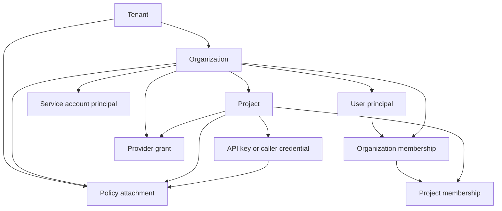
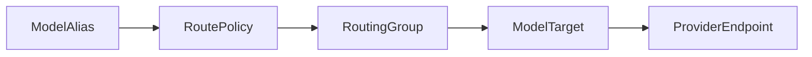
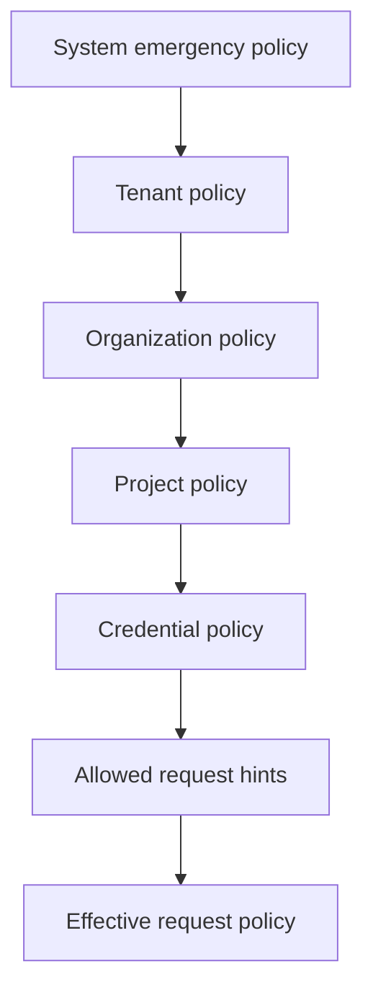

# Tenancy, Access, And Provider Grants

Status: design draft for review.

This spec defines the gateway control model for tenants, organizations,
projects, principals, API keys, caller credentials, scopes, and provider
availability.
The central difference from a flat gateway design is that inbound credentials do
not own the enterprise policy surface. They are only one identity under a
tenant/project hierarchy.

## Goals

- Make tenant, organization, and project identity explicit in every runtime
  request and every administrative mutation.
- Let administrators grant provider availability to organizations and projects
  without exposing upstream secrets.
- Support human users, service accounts, automation actors, and system actors.
- Support API keys and caller credentials that are narrow, revocable, auditable,
  and scoped to projects, model aliases, and REST API actions.
- Allow policy inheritance while keeping override order deterministic.
- Keep authorization independent from the future web UI.

## Non-Goals

- Do not require a SaaS billing account model.
- Do not assume one tenant equals one paying customer.
- Do not store raw API keys after creation.
- Do not let API keys inspect upstream credentials unless an explicit REST API
  action and resource policy allows the redacted metadata view.
- Do not let project-level administrators grant providers that the organization
  has not been granted.

## Identity Hierarchy



## Resource Ownership

| Resource             | Required Scope                            | Notes                                                |
| -------------------- | ----------------------------------------- | ---------------------------------------------------- |
| `Tenant`             | system                                    | created by operator or bootstrap migration           |
| `Organization`       | tenant                                    | receives provider grants and owns projects           |
| `Project`            | organization                              | owns API keys and workload budgets                   |
| `UserPrincipal`      | tenant or organization                    | maps external identity to gateway roles              |
| `OrganizationMember` | organization                              | user membership and default organization visibility  |
| `ProjectMember`      | project                                   | user role and consumption attribution in one project |
| `ServiceAccount`     | organization or project                   | machine actor for automation and CI                  |
| `ApiKey`             | principal or project                      | authenticates model and authorized REST API requests |
| `ProviderGrant`      | organization or project                   | makes provider resources visible                     |
| `RoleBinding`        | tenant, organization, project             | grants admin or read permissions                     |
| `PolicyAttachment`   | tenant, organization, project, credential | limits models, routes, cost, tokens, headers         |
| `AuditEvent`         | tenant                                    | records actor and target scope                       |

## Tenant

`Tenant` is the outer isolation boundary. A single open-source deployment can
run one tenant or many. Tenant id appears in:

- config rows
- audit events
- API key or caller credential context
- usage events
- cost ledger entries
- notification events
- provider grants
- budget policies
- route decisions

Tenant fields:

| Field               | Meaning                          |
| ------------------- | -------------------------------- |
| `tenant_id`         | stable unique id                 |
| `slug`              | human-readable unique name       |
| `display_name`      | mutable label                    |
| `status`            | `active`, `suspended`, `deleted` |
| `default_policy_id` | optional baseline policy         |
| `created_at`        | creation timestamp               |
| `updated_at`        | last metadata update             |

Tenant suspension prevents new protocol requests. It does not delete ledgers,
outbox state, or audit evidence.

## Organization

`Organization` is the product-facing tenant boundary. It is the unit that
administrators use to invite users, create projects, decide which providers and
model aliases are available, and inspect team-level usage.

Organization fields:

| Field                       | Meaning                           |
| --------------------------- | --------------------------------- |
| `organization_id`           | stable unique id                  |
| `tenant_id`                 | owning tenant                     |
| `slug`                      | unique within tenant              |
| `display_name`              | mutable label                     |
| `status`                    | `active`, `suspended`, `archived` |
| `default_project_policy_id` | optional project baseline         |
| `created_at`                | creation timestamp                |
| `updated_at`                | last metadata update              |

Organization suspension blocks new protocol requests for all projects under the
organization. Existing notification delivery and audit export should continue.

## Default Organization

Every user principal has one default organization in a tenant. The default
organization is used for first login, default dashboard scope, and API calls
that omit organization context but are otherwise unambiguous.

Default organization rules:

- bootstrap creates an initial organization for the first tenant owner
- a user can belong to multiple organizations
- exactly one active membership can be marked default per user and tenant
- if the default organization is suspended or the membership is removed, the
  user must choose or be assigned another active organization before issuing
  scoped admin calls
- protocol traffic should not rely on default organization when the API key is
  project-bound

Default organization changes are audited because they affect dashboard and
admin API default scope.

## Project

`Project` is the workload boundary. API keys can be project-bound, and project
policy narrows organization policy.

Project fields:

| Field                    | Meaning                                      |
| ------------------------ | -------------------------------------------- |
| `project_id`             | stable unique id                             |
| `tenant_id`              | owning tenant                                |
| `organization_id`        | owning organization                          |
| `slug`                   | unique within organization                   |
| `display_name`           | mutable label                                |
| `status`                 | `active`, `suspended`, `archived`            |
| `default_model_alias_id` | optional default for clients that omit model |
| `created_at`             | creation timestamp                           |
| `updated_at`             | last metadata update                         |

Project suspension blocks protocol requests authenticated by that project. Admin
read APIs can still inspect history if actor role allows it.

## Principal

`Principal` is any actor that calls admin APIs or internal APIs.

Principal kinds:

| Kind              | Use                                                          |
| ----------------- | ------------------------------------------------------------ |
| `user`            | human user authenticated through a configured login provider |
| `service_account` | automation actor with scoped token or mTLS identity          |
| `system`          | gateway or platform subsystem                                |
| `bootstrap`       | initial setup actor used only during install or migration    |

Principal identity should be external-id friendly. The gateway can act as a
generic OIDC login client for human login, but it should not become an identity
provider. Login and user lifecycle details are defined in
`11-login-user-management.md`.

Principal fields:

| Field                     | Meaning                                          |
| ------------------------- | ------------------------------------------------ |
| `principal_id`            | gateway id                                       |
| `tenant_id`               | owning tenant                                    |
| `default_organization_id` | default organization for user principals         |
| `kind`                    | `user`, `service_account`, `system`, `bootstrap` |
| `external_subject`        | login provider subject or workload id            |
| `display_name`            | mutable label                                    |
| `status`                  | `active`, `disabled`                             |
| `created_at`              | creation timestamp                               |
| `updated_at`              | last metadata update                             |

## Organization Membership

`OrganizationMember` records that a user belongs to an organization. It is also
the stable attribution link for organization-level user dashboards.

Fields:

| Field                    | Meaning                                                |
| ------------------------ | ------------------------------------------------------ |
| `organization_member_id` | stable id                                              |
| `tenant_id`              | owning tenant                                          |
| `organization_id`        | organization                                           |
| `principal_id`           | user principal                                         |
| `status`                 | `invited`, `active`, `suspended`, `removed`, `expired` |
| `default_for_principal`  | true when this is the user's default organization      |
| `display_name_snapshot`  | display name at invite or last membership update       |
| `invited_by`             | inviting principal                                     |
| `joined_at`              | membership activation timestamp                        |
| `removed_at`             | removal timestamp                                      |
| `created_at`             | creation timestamp                                     |
| `updated_at`             | last metadata update                                   |

Membership rows should be soft-removed, not hard-deleted, when usage or audit
history references them.

### Organization Invitation

Organization invitations are explicit resources.

| Field             | Meaning                                              |
| ----------------- | ---------------------------------------------------- |
| `invitation_id`   | stable id                                            |
| `tenant_id`       | tenant                                               |
| `organization_id` | organization                                         |
| `email_hash`      | normalized email hash or external identity reference |
| `role`            | initial organization role                            |
| `status`          | `pending`, `accepted`, `revoked`, `expired`          |
| `expires_at`      | expiry timestamp                                     |
| `accepted_by`     | principal created or matched during acceptance       |
| `created_by`      | inviting principal                                   |
| `created_at`      | creation timestamp                                   |
| `updated_at`      | last metadata update                                 |

Invitation acceptance creates or reuses a user principal, creates an
`OrganizationMember`, and may set the accepted organization as the user's
default organization when the user has no active default.

## Project Membership

`ProjectMember` records a user's role in a project and is the primary
attribution dimension for "person in project" usage.

Fields:

| Field                    | Meaning                                                |
| ------------------------ | ------------------------------------------------------ |
| `project_member_id`      | stable id                                              |
| `tenant_id`              | tenant                                                 |
| `organization_id`        | organization                                           |
| `project_id`             | project                                                |
| `organization_member_id` | linked organization membership                         |
| `principal_id`           | user principal                                         |
| `role`                   | `project_admin`, `project_developer`, `project_viewer` |
| `status`                 | `active`, `suspended`, `removed`                       |
| `joined_at`              | activation timestamp                                   |
| `removed_at`             | removal timestamp                                      |
| `created_by`             | actor that added the member                            |
| `created_at`             | creation timestamp                                     |
| `updated_at`             | last metadata update                                   |

Project membership controls project-level dashboards, project API key
management, project budgets, and member-level usage visibility.

Usage events should record `project_member_id` when a request can be attributed
to a user member. Service accounts and project-owned API keys should record a
service account or credential dimension instead; they may also record
`created_by_project_member_id` for ownership reporting when available.

## Role Bindings

Role bindings describe principal permissions. API key grants narrow those
principal permissions. Model ingress and REST APIs use the same authorization
engine, so role bindings, key grants, and resource policy all participate in
one decision.

Built-in roles:

| Role                  | Scope                         | Capabilities                                                             |
| --------------------- | ----------------------------- | ------------------------------------------------------------------------ |
| `tenant_owner`        | tenant                        | full tenant administration, emergency secret disable, audit export       |
| `tenant_admin`        | tenant                        | manage organizations, projects, provider resources, policies             |
| `security_admin`      | tenant                        | manage credentials, rotation, secret refs, redaction policies            |
| `gateway_operator`    | tenant                        | inspect health, reload config, drain endpoints, view operational metrics |
| `organization_admin`  | organization                  | manage projects, project policies, organization grants                   |
| `organization_member` | organization                  | read own organization membership and default dashboards                  |
| `project_admin`       | project                       | manage project API keys, budgets, allowed aliases                        |
| `project_developer`   | project                       | use allowed models and read own project usage                            |
| `project_viewer`      | project                       | read project dashboards and non-sensitive configuration                  |
| `usage_viewer`        | tenant, organization, project | read usage and cost reports                                              |
| `auditor`             | tenant, organization, project | read audit events and route decisions                                    |

Role binding fields:

| Field             | Meaning                             |
| ----------------- | ----------------------------------- |
| `role_binding_id` | stable id                           |
| `tenant_id`       | owning tenant                       |
| `principal_id`    | actor receiving permission          |
| `role`            | built-in or custom role id          |
| `scope_kind`      | `tenant`, `organization`, `project` |
| `scope_id`        | id for the scope                    |
| `expires_at`      | optional expiry                     |
| `created_by`      | principal that granted role         |
| `created_at`      | creation timestamp                  |

The gateway can add custom roles later, but v1 should ship built-ins first.

## API Key And Caller Credential

`ApiKey` is the public bearer credential for users, service accounts, and
automation. It can authenticate model traffic and authorized REST API calls. It
is not an upstream provider secret. It has policy grants, limits, expiration,
and ownership.

`ClientCredential` remains useful as an internal authentication resolution
snapshot for API keys, service tokens, mTLS subjects, sessions, and future
credential kinds. It is not a second persistent API key table. The only
persistent bearer-style API key resource is `ApiKey`.

Credential kinds:

| Kind               | Use                                                                        |
| ------------------ | -------------------------------------------------------------------------- |
| `api_key`          | bearer-style key for SDKs, scripts, REST API automation, and model clients |
| `service_token`    | structured token issued to service accounts                                |
| `mtls_subject`     | certificate subject matched by ingress proxy                               |
| `session`          | human admin session or delegated UI session                                |
| `internal_service` | trusted service-to-gateway calls                                           |

Resolved client credential snapshot fields:

| Field                  | Meaning                                                     |
| ---------------------- | ----------------------------------------------------------- |
| `credential_reference` | source resource id such as API key, session, or token id    |
| `tenant_id`            | resolved tenant                                             |
| `organization_id`      | resolved organization when present                          |
| `project_id`           | resolved project when present                               |
| `kind`                 | credential kind                                             |
| `principal_id`         | owning service account, user, internal service, or system   |
| `api_key_id`           | API key used for authentication when present                |
| `service_token_id`     | service token used for authentication when present          |
| `mtls_subject_hash`    | mTLS subject digest when present                            |
| `session_id`           | server-side session id when present                         |
| `status`               | active, disabled, expired, rotating, or revoked             |
| `grant_policy_ids`     | policies that narrow this credential                        |
| `allowed_actions`      | optional coarse action allowlist after policy compilation   |
| `allowed_resources`    | optional coarse resource allowlist after policy compilation |
| `expires_at`           | optional expiry                                             |
| `resolved_at`          | authentication resolution time                              |
| `config_version`       | config snapshot version used during resolution              |

Raw API key values are returned only once at `ApiKey` creation. Afterwards read
APIs return key prefix, status, ownership, grants, and timestamps through the
`ApiKey` resource. `ClientCredential` snapshots are runtime/authn artifacts and
should not expose secret hashes, prefixes, or legacy scope fields.

## API Key Permissions

Protocol and REST permissions must not become separate authorization systems.
Every protected request maps to a stable action, resource, and context. API keys
can be granted model actions, read-only evidence actions, or carefully scoped
admin/config actions.

| Action                          | Meaning                                                |
| ------------------------------- | ------------------------------------------------------ |
| `gateway.model.invoke`          | call non-streaming model endpoints                     |
| `gateway.model.stream`          | call streaming model endpoints                         |
| `gateway.model.native`          | call provider-native endpoints when explicitly granted |
| `gateway.usage.read`            | read usage in an allowed scope                         |
| `gateway.route.debug.read`      | read route decisions with redacted upstream details    |
| `gateway.budget_policy.read`    | read budget policy configuration                       |
| `gateway.budget_dashboard.read` | read budget dashboard state                            |
| `gateway.quota_dashboard.read`  | read quota and rate-limit dashboard state              |
| `gateway.api_key.create`        | create API keys within allowed owner/project scope     |
| `gateway.api_key.rotate`        | rotate API keys within allowed owner/project scope     |
| `gateway.api_key.disable`       | disable API keys within allowed owner/project scope    |
| `gateway.config.apply`          | apply config bundles in allowed scope                  |

Actions are additive only after the owner principal and resource policy allow
them. A key cannot widen access beyond its owner principal.

See `10-authorization-api-keys.md` for the full action/resource model.

## Provider Grants

Provider grants decide which upstream resources an organization or project may
use. A grant never exposes secret material.

Grantable resource kinds:

| Kind                | Meaning                                           |
| ------------------- | ------------------------------------------------- |
| `provider_endpoint` | concrete upstream endpoint and protocol family    |
| `model_target`      | provider endpoint plus provider-specific model id |
| `routing_group`     | enterprise route group containing targets         |
| `model_alias`       | client-facing model alias and route policy        |
| `pricing_sku`       | cost calculation SKU visible for reporting        |

Grant fields:

| Field               | Meaning                                                   |
| ------------------- | --------------------------------------------------------- |
| `provider_grant_id` | stable id                                                 |
| `tenant_id`         | owning tenant                                             |
| `scope_kind`        | `organization` or `project`                               |
| `scope_id`          | organization or project id                                |
| `resource_kind`     | grantable kind                                            |
| `resource_id`       | id of granted resource                                    |
| `effect`            | `allow` or `deny`                                         |
| `closure_mode`      | `self_only`, `include_descendants`, or `deny_descendants` |
| `reason`            | optional admin note                                       |
| `created_by`        | actor that created grant                                  |
| `created_at`        | creation timestamp                                        |

Grant evaluation:

1. Tenant-level disabled resources always deny.
2. Organization grants establish the maximum available set.
3. Project grants can narrow or explicitly deny organization-granted resources.
4. API key and caller credential policy narrows project availability.
5. Route policy filters targets at request time.

## Provider Grant Closure

Provider availability is compiled into an `AvailabilityGraph` during config
snapshot publication. A model request first resolves a model alias, then expands
the route graph:



A candidate target is eligible only when all required nodes on the selected path
are available after closure:

- `ModelAlias`
- `RoutePolicy`
- selected `RoutingGroup`
- selected `ModelTarget`
- selected `ProviderEndpoint`

Closure rules:

| Rule                        | Behavior                                                                 |
| --------------------------- | ------------------------------------------------------------------------ |
| `self_only` allow           | makes only the named resource available                                  |
| `include_descendants` allow | expands the named alias or group to its compiled route graph descendants |
| `deny` with `self_only`     | removes only the named resource                                          |
| `deny_descendants`          | removes the named resource and its compiled descendants                  |
| deny precedence             | any deny on any node in the selected path removes that candidate         |

Organization grants define the maximum compiled graph. Project grants inherit
that graph by default, then apply project allows and denies. If a project
declares any allow grant for a grantable resource kind, that kind becomes a
project allowlist; deny grants still apply globally inside the project.

Route simulation must expose the compiled closure and filtering reasons to
privileged admins. Runtime route decisions record only safe ids and reason
codes.

## Provider Availability Examples

### Organization Grant

```yaml
organization: research
grants:
  - resource_kind: model_alias
    resource: claude-sonnet
    effect: allow
    closure_mode: include_descendants
  - resource_kind: routing_group
    resource: claude-prod-us
    effect: allow
    closure_mode: include_descendants
  - resource_kind: routing_group
    resource: cheap-batch
    effect: allow
    closure_mode: include_descendants
  - resource_kind: provider_endpoint
    resource: experimental-local
    effect: deny
    closure_mode: deny_descendants
```

### Project Narrowing

```yaml
project: research-agent-prod
grants:
  - resource_kind: model_alias
    resource: claude-sonnet
    effect: allow
    closure_mode: include_descendants
  - resource_kind: routing_group
    resource: cheap-batch
    effect: deny
    closure_mode: deny_descendants
```

The project can call `claude-sonnet` only through routing groups allowed by both
the organization and project.

## Policy Attachments

Policy attachments are reusable policy blocks bound to tenant, organization,
project, or credential scope.

Policy categories:

| Category          | Examples                                                           |
| ----------------- | ------------------------------------------------------------------ |
| model access      | allowed aliases, denied aliases, protocol families                 |
| route access      | allowed route policies, denied routing groups                      |
| budget            | monthly cost ceiling, daily cost ceiling, hard block threshold     |
| quota             | RPM, TPM, concurrent request count, stream duration                |
| compliance        | required regions, denied providers, data residency labels          |
| observability     | content audit level, trace sampling, provider request audit policy |
| notifications     | sinks, filters, budget threshold percentages                       |
| response behavior | fail-open/fail-closed, error detail level                          |

Policy attachment fields:

| Field                  | Meaning                                                  |
| ---------------------- | -------------------------------------------------------- |
| `policy_attachment_id` | stable id                                                |
| `tenant_id`            | owning tenant                                            |
| `scope_kind`           | `tenant`, `organization`, `project`, `client_credential` |
| `scope_id`             | id of attached scope                                     |
| `policy_kind`          | category                                                 |
| `policy_document`      | JSON document validated by schema                        |
| `priority`             | merge order within same scope                            |
| `created_by`           | actor                                                    |
| `created_at`           | creation timestamp                                       |
| `updated_at`           | last update                                              |

## Policy Merge Order

Policy resolution is deterministic:

1. System denylist and emergency operator blocks.
2. Tenant policy.
3. Organization policy.
4. Project policy.
5. API key or caller credential policy.
6. Request-time policy hints, only when the credential policy allows hints.

Deny rules win over allow rules at the same category. Narrower policies can only
reduce access unless a policy schema explicitly declares an additive field.



## Runtime Context Resolution

Every authenticated request resolves a `GatewayRequestContext`.

| Field                  | Source                                                               |
| ---------------------- | -------------------------------------------------------------------- |
| `tenant_id`            | API key or caller credential ownership                               |
| `organization_id`      | API key or caller credential ownership                               |
| `project_id`           | key ownership or trusted project header validated against credential |
| `api_key_id`           | API key lookup when present                                          |
| `client_credential_id` | internal credential lookup                                           |
| `principal_id`         | owning principal                                                     |
| `request_id`           | inbound header or generated                                          |
| `trace_context`        | W3C trace headers or generated                                       |
| `model_alias`          | request body or route path                                           |
| `protocol_family`      | ingress endpoint                                                     |
| `session_affinity_key` | explicit header, trusted run/session context, or credential fallback |
| `config_version`       | active config snapshot                                               |
| `policy_snapshot_id`   | effective policy hash                                                |

Trusted internal services can pass run id, conversation id, session id, and
project metadata as signed or scoped headers. The gateway validates that the
API key or caller credential is allowed to represent that project before trusting the
headers.

### Context Resolution Algorithm

Context resolution must be deterministic for a request and active config
version.

01. Generate or validate `request_id` and trace context.
02. Authenticate the presented API key, service token, mTLS identity, or session.
03. Load the credential owner principal and default tenant/organization/project
    scope.
04. Reject disabled, expired, deleted, or not-yet-active credentials before
    reading any trusted context headers.
05. If trusted delegation headers are present, verify that the credential has a
    delegation grant for the requested tenant, organization, and project.
06. Resolve the effective project. Ordinary API keys default to their bound
    project unless their policy explicitly allows project selection.
07. Resolve the model alias from request data and map it into the effective
    tenant/organization/project namespace.
08. Load role bindings, API key grants, provider grants, budget scopes, and rate
    limit scopes for the effective context.
09. Attach `config_version` and `policy_snapshot_id`.
10. Freeze the context object for the rest of request processing.

Failure at any step produces a stable error code and an audit-safe reason. A
later routing or budget step may enrich the context with route evidence, but it
must not change tenant, organization, project, principal, or credential ids.

## Header Policy

Inbound identity headers from ordinary clients are not trusted. Only internal
credentials or mTLS-authenticated service calls may set trusted context headers.

Header classes:

| Class       | Examples                                                | Behavior                                                |
| ----------- | ------------------------------------------------------- | ------------------------------------------------------- |
| identity    | `x-gateway-tenant-id`, `x-gateway-project-id`           | ignored unless internal credential permits delegation   |
| affinity    | `x-gateway-session-id`, `x-session-id`                  | accepted when key policy permits model invocation       |
| trace       | `traceparent`, `tracestate`, `x-request-id`             | accepted with size and character limits                 |
| policy hint | `x-gateway-route-policy`, `x-gateway-budget-mode`       | accepted only with policy hint action                   |
| debug       | `x-gateway-debug-route`                                 | accepted only for privileged credentials                |
| forbidden   | `authorization`, provider API keys, secret-like headers | never forwarded to upstream unless generated by gateway |

## Rate Limit Ownership

Rate limits can apply at multiple levels:

- tenant aggregate
- organization aggregate
- project aggregate
- API key or caller credential
- model alias
- routing group
- provider endpoint

The gateway should evaluate limits from broad to narrow and return the most
specific exceeded limit that is safe to reveal to the caller.

## Budget Ownership

Budget policies are covered in `06-usage-cost-budget-notifications.md`, but the
identity model decides where budgets attach.

Supported budget scopes:

| Scope                        | Use                                    |
| ---------------------------- | -------------------------------------- |
| tenant                       | cap total deployment cost              |
| organization                 | cap team or business unit cost         |
| project                      | cap workload cost                      |
| API key or caller credential | cap one integration or service account |
| model alias                  | cap one public model name              |
| routing group                | cap one cost pool or compliance pool   |
| provider endpoint            | cap one upstream account or region     |

Budget scope ids appear on usage events so downstream systems can aggregate
without recomputing policy history.

## Admin Visibility

Read visibility should follow resource ownership:

- Tenant admins can see all tenant resources and masked credential metadata.
- Security admins can manage upstream credentials and rotation state.
- Organization admins can see provider grants and route resources granted to
  their organization but cannot view upstream secrets.
- Project admins can manage API keys and budgets within their project.
- Usage viewers can see usage and cost summaries for their scope.
- Auditors can inspect route decisions and audit trails, with prompt/header
  redaction according to policy.

## Deletion And Archival

Use soft-delete or archival states for identity resources. Hard deletion is
reserved for bootstrap mistakes before production traffic.

Deletion rules:

| Resource                     | Behavior                                             |
| ---------------------------- | ---------------------------------------------------- |
| tenant                       | not hard-deleted while usage or audit records exist  |
| organization                 | archived after projects are archived                 |
| project                      | archived after credentials disabled                  |
| API key or caller credential | disabled first, hard delete only after retention     |
| provider grant               | deleted by versioned config mutation, audit retained |
| role binding                 | deleted by versioned admin mutation, audit retained  |

## Audit Requirements

Every admin mutation records:

- actor principal id
- actor role and scope
- target resource id
- old and new config version
- redacted diff summary
- request id
- trace id
- user agent or service identity
- source address, when available
- reason string, when supplied

Protocol requests record route and usage evidence separately. The audit stream
must let an operator answer which credential, project, policy version, and route
policy allowed a provider call.

## Acceptance Gates

- A project cannot access a provider endpoint unless its organization has a
  grant chain for the relevant model alias or routing group.
- An API key or caller credential cannot widen access through request headers.
- Disabling an organization blocks protocol traffic without deleting history.
- Rotating an API key or caller credential changes only inbound auth, not upstream
  credential state.
- Provider grants never reveal upstream secret material.
- Route decisions include tenant, organization, project, API key or caller credential,
  model alias, route policy, routing group, provider endpoint, and config
  version.
- Usage events can be aggregated by every identity level without joining to
  mutable policy rows.
