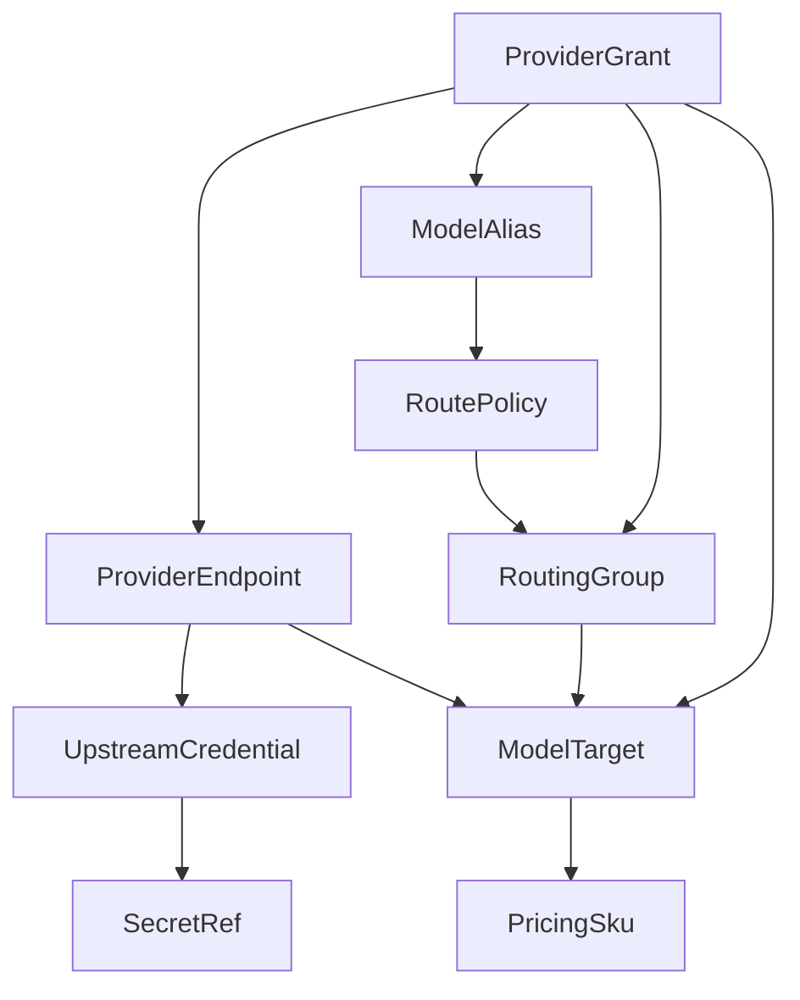
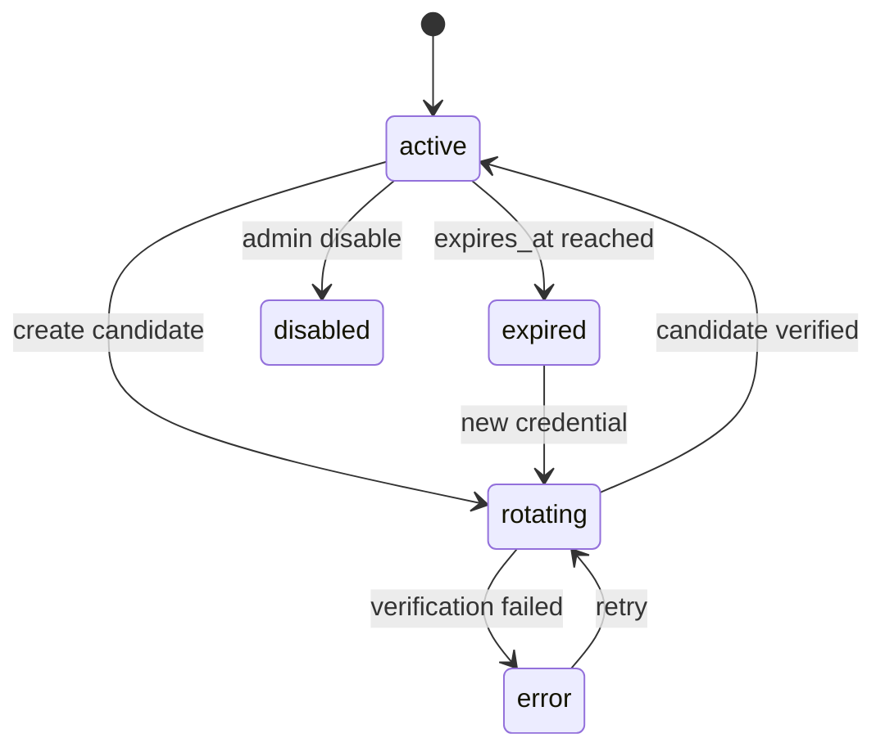
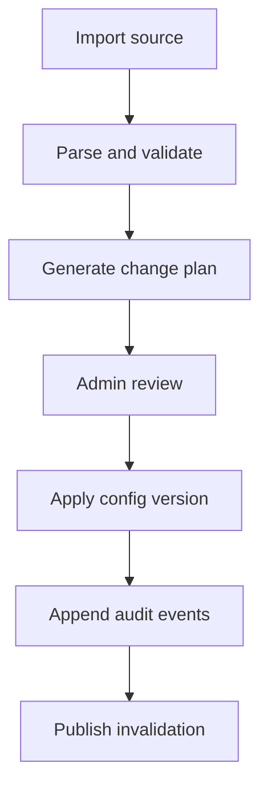

# Provider, Credential, And Model Catalog

Status: design draft for review.

This spec defines the gateway resources that describe upstream providers,
secrets, model targets, model aliases, pricing SKUs, and upstream Codex OAuth.
It keeps upstream credentials separate from provider endpoints and keeps model
catalog objects separate from route policy.

## Goals

- Allow administrators to manage provider endpoints and upstream credentials
  independently.
- Support protocol-family validation before runtime routing.
- Model upstream capabilities with gateway-owned schemas rather than importing
  client runtime types.
- Store only encrypted secret material or external secret references.
- Restrict upstream provider OAuth support to Codex.
- Let pricing match model targets across providers so cost reporting is
  consistent.
- Make provider availability grantable to organizations and projects.

## Non-Goals

- Do not store raw upstream secrets in provider endpoint rows.
- Do not expose upstream secret values through read APIs.
- Do not implement generic upstream OAuth provider onboarding.
- Do not translate provider model names into client-runtime capability profiles
  by importing external runtime code.
- Do not assume every provider endpoint can serve every protocol family.

## Resource Graph



## Provider Endpoint

`ProviderEndpoint` describes one upstream endpoint that the gateway can call.
It is not a credential and not a model alias.

Fields:

| Field                  | Meaning                                                                                                                                                  |
| ---------------------- | -------------------------------------------------------------------------------------------------------------------------------------------------------- |
| `provider_endpoint_id` | stable id                                                                                                                                                |
| `tenant_id`            | owning tenant or system tenant                                                                                                                           |
| `name`                 | admin-visible unique name within tenant                                                                                                                  |
| `provider_kind`        | `openai`, `anthropic`, `azure_openai`, `azure_foundry`, `bedrock`, `vertex`, `google_generative_language`, `codex`, `openai_compatible`, `custom_native` |
| `protocol_families`    | list of supported ingress families                                                                                                                       |
| `upstream_base_url`    | upstream provider base URL used by gateway request builders                                                                                              |
| `region`               | optional geographic or cloud region                                                                                                                      |
| `cloud_account_ref`    | optional cloud account or project reference                                                                                                              |
| `credential_id`        | upstream credential reference                                                                                                                            |
| `status`               | `active`, `disabled`, `draining`, `degraded`, `deleted`                                                                                                  |
| `health_state`         | runtime health summary                                                                                                                                   |
| `compliance_labels`    | labels such as `eu`, `hipaa`, `internal`, `no-training`                                                                                                  |
| `cost_labels`          | labels such as `premium`, `standard`, `batch`, `free-tier`                                                                                               |
| `header_policy_id`     | optional provider header policy                                                                                                                          |
| `timeout_policy_id`    | optional provider timeout policy                                                                                                                         |
| `created_by`           | admin actor                                                                                                                                              |
| `created_at`           | creation timestamp                                                                                                                                       |
| `updated_at`           | last update                                                                                                                                              |

`upstream_base_url` is only the provider-facing endpoint. Client-facing gateway
mount compatibility is defined in `05-runtime-protocol.md` and must not be
stored as provider catalog URL assembly state.

Provider endpoint status behavior:

| Status     | Runtime Behavior                                                  |
| ---------- | ----------------------------------------------------------------- |
| `active`   | eligible when grants and policy allow it                          |
| `disabled` | never eligible                                                    |
| `draining` | existing sticky mappings may finish; new route decisions avoid it |
| `degraded` | eligible only if route policy allows degraded targets             |
| `deleted`  | unavailable; retained only for audit and usage history            |

## Provider Kinds

| Kind                         | Typical Protocol Families                                          | Credential Families                                          |
| ---------------------------- | ------------------------------------------------------------------ | ------------------------------------------------------------ |
| `openai`                     | `openai_responses`, `openai_chat`                                  | API key, external secret                                     |
| `openai_compatible`          | `openai_responses`, `openai_chat` when declared compatible         | API key, bearer token, external secret                       |
| `azure_openai`               | `openai_responses`, `openai_chat`                                  | API key, Azure AD, external secret                           |
| `anthropic`                  | `anthropic_messages`                                               | API key, external secret                                     |
| `azure_foundry`              | `anthropic_messages` when model endpoint is compatible             | API key, Azure AD, external secret                           |
| `bedrock`                    | `anthropic_messages`, `bedrock_converse`, `provider_native`        | AWS IAM role, AWS access keys, bearer token, external signer |
| `vertex`                     | `anthropic_messages`, `gemini_generate_content`, `provider_native` | workload identity, service account, bearer token             |
| `google_generative_language` | `gemini_generate_content`                                          | API key                                                      |
| `codex`                      | `openai_responses`                                                 | Codex OAuth token                                            |
| `custom_native`              | `provider_native` only                                             | explicit custom adapter policy                               |

The same cloud provider can support multiple protocol families, but each model
target must declare exactly one protocol family for a route.

## Protocol Family Validation

Validation rules:

1. `ModelAlias.protocol_family` determines the client-facing protocol.
2. `RoutePolicy` can reference only routing groups with matching protocol
   family.
3. `RoutingGroup` can include only model targets with matching protocol family.
4. `ModelTarget` must belong to a provider endpoint that supports that protocol
   family.
5. Runtime requests whose ingress path implies a different protocol family are
   rejected before route selection.

This validation is config-time when possible and runtime as a final guard.

## Upstream Credential

`UpstreamCredential` is secret-bearing or secret-referencing provider auth
state. Provider endpoints reference it. Admin read APIs return masked metadata.

Fields:

| Field                    | Meaning                                              |
| ------------------------ | ---------------------------------------------------- |
| `upstream_credential_id` | stable id                                            |
| `tenant_id`              | owning tenant                                        |
| `name`                   | admin-visible name                                   |
| `credential_kind`        | kind from table below                                |
| `secret_ref_id`          | gateway secret reference id                          |
| `status`                 | `active`, `disabled`, `rotating`, `expired`, `error` |
| `expires_at`             | optional expiry for token/cert-like credentials      |
| `rotation_policy_id`     | optional rotation schedule                           |
| `last_rotated_at`        | last successful rotation                             |
| `last_error_code`        | safe diagnostic                                      |
| `last_error_message`     | safe diagnostic, no secret values                    |
| `created_by`             | admin actor                                          |
| `created_at`             | creation timestamp                                   |
| `updated_at`             | last update                                          |

Credential kinds:

| Kind                      | Secret Material                      | Notes                               |
| ------------------------- | ------------------------------------ | ----------------------------------- |
| `api_key`                 | API key string                       | masked prefix only in API responses |
| `bearer_token`            | bearer token                         | may expire                          |
| `azure_api_key`           | Azure API key                        | used by Azure provider kinds        |
| `azure_workload_identity` | no stored secret or external ref     | runtime uses workload identity      |
| `aws_iam_role`            | role ARN or external identity        | no long-lived secret required       |
| `aws_access_key`          | access key id plus secret key        | avoid unless role unavailable       |
| `aws_sigv4_signer`        | external signing service reference   | gateway delegates signing           |
| `gcp_workload_identity`   | workload identity reference          | no service account JSON stored      |
| `gcp_service_account`     | service account JSON or external ref | prefer external secret              |
| `external_secret`         | reference only                       | operator-managed secret store       |
| `codex_oauth`             | managed OAuth tokens                 | only supported OAuth provider in v1 |

## SecretRef

Secret references abstract storage.

Supported ref kinds:

| Kind                      | Example                | Runtime Fetch                                  |
| ------------------------- | ---------------------- | ---------------------------------------------- |
| `encrypted_database_blob` | `secret_blob_id`       | decrypt through gateway KMS key                |
| `kubernetes_secret`       | namespace/name/key     | fetch through in-cluster service account       |
| `vault_path`              | path and field         | fetch through Vault token or workload identity |
| `aws_secrets_manager`     | ARN and JSON field     | fetch through IAM                              |
| `gcp_secret_manager`      | project/secret/version | fetch through workload identity                |
| `azure_key_vault`         | vault/secret/version   | fetch through managed identity                 |
| `operator_env`            | env var name           | local/dev only                                 |

Every `SecretRef` has:

- `secret_ref_id`
- `tenant_id`
- `kind`
- `locator_mask`
- `version_hint`
- `mask_hint`
- `created_by`
- `created_at`
- `updated_at`

Raw backend locators can be sensitive for some secret stores. Default reads
return only `secret_ref_id`, kind, version hint, fingerprint or mask metadata,
and timestamps. Raw locator reads require a strong-auth `security_admin` path
and still never return the secret value.

## Secret Handling Rules

- Raw secret values are accepted only by create/rotate APIs.
- Raw values are never returned by read APIs.
- Raw values are not included in audit diffs.
- Raw values are not included in traces, logs, route decisions, usage events, or
  notifications.
- Runtime request builders receive secret material through short-lived in-memory
  handles.
- Secret material must be zeroized or dropped after request construction when
  the implementation language supports it.
- Secret fetch failures produce safe error codes and increment provider health
  failure metrics.

## Credential Rotation

Rotation can be manual or scheduled.



Rotation metadata:

| Field                     | Meaning                                    |
| ------------------------- | ------------------------------------------ |
| `rotation_window_start`   | earliest automatic rotation time           |
| `rotation_window_end`     | latest automatic rotation time             |
| `candidate_secret_ref_id` | optional staged secret reference           |
| `verification_route_id`   | optional target used to test candidate     |
| `previous_secret_ref_id`  | retained only until rollback window closes |
| `rollback_deadline`       | latest rollback time                       |

The gateway should support dual-read rotation for providers that require
non-disruptive key swap. Route decisions record the credential version but never
the secret.

## Upstream Codex OAuth Provider

Upstream provider OAuth is supported only for Codex. The provider kind is
`codex`, and credential kind is `codex_oauth`.

Codex fixed profile:

| Field                  | Value                        |
| ---------------------- | ---------------------------- |
| `auth_issuer`          | fixed OpenAI auth issuer     |
| `device_code_endpoint` | fixed device-code endpoint   |
| `token_endpoint`       | fixed token endpoint         |
| `verification_url`     | fixed Codex verification URL |
| `api_base_url`         | fixed Codex backend API base |
| `protocol_family`      | `openai_responses`           |

Admin APIs must reject attempts to override fixed Codex endpoints unless a
future operator-only escape hatch is explicitly designed.

Codex auth state:

| State             | Meaning                                 |
| ----------------- | --------------------------------------- |
| `unauthenticated` | provider exists but no usable token     |
| `login_pending`   | device flow session active              |
| `active`          | access token usable or refreshable      |
| `expired`         | refresh cannot proceed without re-login |
| `error`           | transient or unknown auth problem       |
| `disabled`        | admin disabled runtime use              |

Codex token tables should be separate from provider endpoint rows:

- auth state table for non-secret status
- token material table for encrypted access/refresh/id tokens
- login session table for short-lived device flow sessions

Runtime behavior:

1. Router considers only active Codex provider endpoints.
2. Request builder fetches token material just in time.
3. If token is near expiry, it attempts one refresh under a concurrency guard.
4. Terminal refresh failure transitions to `expired`.
5. Transient refresh failure transitions to `error`.
6. Runtime auth failure returns route-unavailable behavior, not a leaked token
   error.

## Provider Endpoint Header Policy

Header policies decide which client headers can reach upstream providers.

Policy fields:

| Field               | Meaning                                         |
| ------------------- | ----------------------------------------------- |
| `header_policy_id`  | stable id                                       |
| `tenant_id`         | owning tenant                                   |
| `extra_headers`     | static headers generated by gateway             |
| `allow_passthrough` | patterns allowed from client request            |
| `deny_passthrough`  | patterns always removed                         |
| `provider_required` | required headers generated from provider config |
| `redaction_rules`   | header names or patterns to redact in evidence  |

Rules:

- Deny patterns win over allow patterns.
- Inbound `authorization` is never forwarded as upstream auth.
- Provider auth headers are generated by the gateway.
- Trace and request id headers can be passed only if policy allows them.
- Gateway or deployment context headers should not be forwarded to third-party
  providers unless an explicit provider target requires them and redaction
  policy allows it.

## Model Target

`ModelTarget` is one upstream model id exposed by one provider endpoint.

Fields:

| Field                   | Meaning                                       |
| ----------------------- | --------------------------------------------- |
| `model_target_id`       | stable id                                     |
| `tenant_id`             | owning tenant                                 |
| `provider_endpoint_id`  | upstream endpoint                             |
| `target_model_id`       | provider-specific model id sent upstream      |
| `protocol_family`       | one protocol family                           |
| `display_name`          | admin-visible label                           |
| `status`                | `active`, `disabled`, `deprecated`, `deleted` |
| `capability_profile`    | gateway-local capability descriptor id        |
| `pricing_sku_id`        | optional direct pricing SKU override          |
| `context_window_tokens` | optional operator metadata                    |
| `supports_streaming`    | capability flag                               |
| `supports_tools`        | capability flag                               |
| `supports_images`       | capability flag                               |
| `supports_audio`        | capability flag                               |
| `supports_reasoning`    | capability flag                               |
| `metadata`              | safe JSON metadata                            |
| `created_at`            | creation timestamp                            |
| `updated_at`            | last update                                   |

Capability profiles are gateway-local data. They can be imported from external
knowledge or manually configured, but they must not depend on client-runtime
structs.

### Runtime Target Snapshot

Runtime workers should receive a compact target view rather than full admin
resources.

| Runtime Field              | Source                     | Notes                                                 |
| -------------------------- | -------------------------- | ----------------------------------------------------- |
| `model_target_id`          | `ModelTarget`              | stable id                                             |
| `provider_endpoint_id`     | `ProviderEndpoint`         | endpoint lookup key                                   |
| `target_model_id`          | `ModelTarget`              | sent upstream only after alias authorization          |
| `protocol_family`          | endpoint and target        | must match alias and route group                      |
| `capabilities`             | capability profile         | stream/tools/media/reasoning flags                    |
| `pricing_sku_id`           | target or endpoint default | immutable pricing version selected at request time    |
| `credential_handle_policy` | upstream credential        | how runtime obtains short-lived auth material         |
| `header_policy_id`         | endpoint policy            | allow/deny/redaction rules                            |
| `operational_state`        | endpoint and target state  | active, disabled, draining, degraded, deleted         |
| `health_policy_id`         | endpoint policy            | hot-state health window interpretation                |
| `route_metadata`           | safe metadata              | no secret values, prompt text, or provider API tokens |

Snapshots must exclude raw secret material and admin-only notes. If a target is
disabled or deleted after a worker loaded it, the next config version or hot
disable signal must remove it from eligibility before new attempts.

## Model Alias

`ModelAlias` is the client-visible model name. It must bind to exactly one
protocol family.

Fields:

| Field                       | Meaning                                       |
| --------------------------- | --------------------------------------------- |
| `model_alias_id`            | stable id                                     |
| `tenant_id`                 | owning tenant                                 |
| `name`                      | client-visible model string                   |
| `protocol_family`           | ingress protocol                              |
| `route_policy_id`           | default route policy                          |
| `status`                    | `active`, `disabled`, `deprecated`, `deleted` |
| `default_max_output_tokens` | optional policy default                       |
| `capability_summary`        | safe display metadata                         |
| `created_by`                | admin actor                                   |
| `created_at`                | creation timestamp                            |
| `updated_at`                | last update                                   |

Aliases can be global to a tenant and then granted to organizations. Operators
can also create organization-owned aliases when different teams need different
meaning for the same public model label, but a given project must resolve an
alias name to one unambiguous alias id.

## Alias Resolution

Resolution order:

1. Credential-specific alias override, when configured.
2. Project alias namespace.
3. Organization alias namespace.
4. Tenant alias namespace.
5. Optional prefix routing only if project policy enables it.

Prefix routing is an escape hatch for development and admin debugging. It must
not bypass grants or budget policy. A prefix route still resolves to a model
target and route decision.

## Pricing SKU

Pricing SKU describes provider cost, not product billing.

Fields:

| Field                        | Meaning                                    |
| ---------------------------- | ------------------------------------------ |
| `pricing_sku_id`             | stable id                                  |
| `tenant_id`                  | owning tenant or system preset tenant      |
| `name`                       | SKU name                                   |
| `status`                     | `active`, `disabled`, `superseded`         |
| `currency`                   | ISO currency, usually `USD`                |
| `unit`                       | `micro_usd` or fixed-point decimal config  |
| `model_id_patterns`          | target model ids or patterns               |
| `provider_endpoint_patterns` | optional provider endpoint selectors       |
| `pricing_document`           | versioned token and request pricing config |
| `effective_from`             | start time                                 |
| `effective_until`            | optional end time                          |
| `is_preset`                  | shipped preset or admin-created            |
| `created_at`                 | creation timestamp                         |
| `updated_at`                 | last update                                |

Pricing match order:

1. Explicit `ModelTarget.pricing_sku_id`.
2. Tenant non-preset SKU matching provider endpoint and target model id.
3. System preset SKU matching provider endpoint and target model id.
4. Unknown pricing fallback: record usage with `cost_estimate_unavailable`.

The gateway should keep a complete pricing decision in each usage event so old
usage can be interpreted even after SKU changes.

## Pricing Document

Pricing documents should support:

- input token price
- output token price
- cache read token price
- cache write token price by retention tier
- reasoning token price
- image input/output units
- audio input/output units
- request minimum charge
- per-request flat charge
- provider discount multiplier
- effective precision and rounding mode

Example shape:

```json
{
  "schema": "gateway.pricing.v1",
  "currency": "USD",
  "unit": "micro_usd",
  "rounding": "ceil_per_event",
  "tokens": {
    "input_per_million": 3000,
    "output_per_million": 15000,
    "cache_read_per_million": 300,
    "cache_write_5m_per_million": 3750,
    "cache_write_1h_per_million": 6000
  },
  "flat_request_cost": 0,
  "discount_multiplier": "1.0"
}
```

The numbers above are examples only. Presets must be maintained as data and
reviewed separately.

## Catalog Import

Operators may want to import provider/model/pricing data. Import should be
explicit and reviewable.

Import sources:

| Source                 | Use                                                   |
| ---------------------- | ----------------------------------------------------- |
| static YAML            | bootstrap local deployment                            |
| admin API batch import | controlled production updates                         |
| provider discovery API | optional enrichment, never automatic production write |
| system preset package  | shipped defaults reviewed in repo                     |

Import pipeline:



## Config Versioning

Every catalog mutation creates a new config version. Mutations that should be
atomic across multiple resources use a config transaction.

Config transaction fields:

| Field                | Meaning                         |
| -------------------- | ------------------------------- |
| `config_version`     | monotonic tenant-scoped version |
| `transaction_id`     | id for grouped mutation         |
| `actor_principal_id` | admin actor                     |
| `reason`             | optional reason                 |
| `resource_changes`   | redacted summary                |
| `created_at`         | timestamp                       |

Gateway nodes load snapshots by config version. Route decisions record the
version used.

## Admin API Resource Groups

Candidate admin resources:

```text
/admin/v1/provider-endpoints
/admin/v1/upstream-credentials
/admin/v1/secret-refs
/admin/v1/model-targets
/admin/v1/model-aliases
/admin/v1/pricing-skus
/admin/v1/catalog-imports
/admin/v1/codex/oauth/connections
/admin/v1/codex/oauth/sessions
/admin/v1/codex/oauth/refresh-status
```

Read APIs default to safe metadata. Strong-auth security-admin-only endpoints
can expose raw secret reference locators, still never raw values.

## Runtime Snapshot

Gateway nodes should not query the database for every request. A runtime config
snapshot contains:

- active model aliases visible to the node
- route policies and routing groups
- provider endpoints and safe metadata
- model targets
- provider grant indexes
- pricing SKU indexes
- header policies
- credential status metadata, excluding secret values

Secret material stays outside broad snapshots and is fetched through
credential-specific paths.

## Acceptance Gates

- Provider endpoints cannot be created with embedded raw secrets.
- A model target cannot reference a protocol family unsupported by its provider
  endpoint.
- A routing group cannot mix protocol families.
- A model alias cannot point to a route policy whose groups are incompatible.
- Codex is the only upstream OAuth provider kind accepted by v1 schemas.
- Read APIs return masked upstream credential metadata only.
- Pricing decisions are recorded on usage events with SKU id, version, and
  fallback status.
- Disabling a provider endpoint removes it from new route decisions after config
  invalidation.
- Credential rotation can occur without changing provider endpoint ids.
