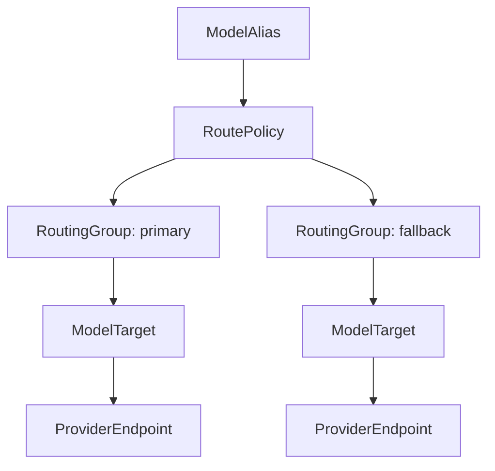
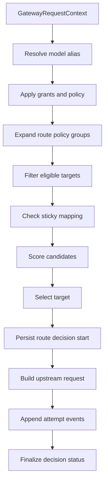

# Routing Groups And Router

Status: design draft for review.

This spec defines the routing model for the gateway. The primary design
choice is that enterprise routing is expressed through `RoutingGroup` and
`RoutePolicy`, not by attaching a flat provider list to a model alias.

## Goals

- Make routing groups the unit for enterprise traffic control.
- Support region, compliance, cost, performance, health, failover, and sticky
  routing without mixing those concerns into model aliases.
- Record every routing decision with enough evidence for audit, debugging,
  usage attribution, and future billing-system integration.
- Allow operators to drain, disable, or degrade endpoints without deleting
  configuration.
- Keep routing independent from client SDKs and application runtime crates.

## Non-Goals

- Do not optimize for one hard-coded selection algorithm.
- Do not expose raw upstream credentials in route decisions.
- Do not let client request fields bypass organization/project provider grants.
- Do not retry after client-visible content has already been streamed unless the
  protocol explicitly supports resumable semantics.
- Do not route across incompatible protocol families.

## Routing Object Model



## RoutingGroup

`RoutingGroup` is a named pool of compatible model targets. It should represent
an operator intention: production US pool, regulated EU pool, low-cost batch
pool, experimental pool, internal Codex pool, or emergency fallback pool.

Fields:

| Field                | Meaning                                                |
| -------------------- | ------------------------------------------------------ |
| `routing_group_id`   | stable id                                              |
| `tenant_id`          | owning tenant                                          |
| `name`               | unique name within tenant                              |
| `protocol_family`    | required protocol family                               |
| `purpose`            | human-readable purpose                                 |
| `status`             | `active`, `disabled`, `draining`, `deleted`            |
| `selection_strategy` | default group-internal strategy                        |
| `health_policy_id`   | health thresholds                                      |
| `budget_policy_refs` | budget scopes this group consumes or enforces          |
| `compliance_labels`  | labels such as `eu`, `us`, `no-training`, `regulated`  |
| `cost_labels`        | labels such as `premium`, `standard`, `cheap`, `batch` |
| `route_hints`        | safe metadata for admins and observability             |
| `created_by`         | actor                                                  |
| `created_at`         | creation timestamp                                     |
| `updated_at`         | last update                                            |

Group membership fields:

| Field                     | Meaning                                         |
| ------------------------- | ----------------------------------------------- |
| `routing_group_member_id` | stable id                                       |
| `routing_group_id`        | group id                                        |
| `model_target_id`         | target id                                       |
| `weight`                  | relative weight for weighted strategies         |
| `priority`                | lower number first for priority strategies      |
| `min_health_state`        | minimum health for eligibility                  |
| `max_cost_tier`           | optional cost ceiling for selection             |
| `sticky_eligible`         | whether sticky affinity may bind to this target |
| `status`                  | `active`, `disabled`, `draining`                |

## RoutePolicy

`RoutePolicy` attaches one or more routing groups to a model alias.

Fields:

| Field                   | Meaning                                 |
| ----------------------- | --------------------------------------- |
| `route_policy_id`       | stable id                               |
| `tenant_id`             | owning tenant                           |
| `name`                  | unique policy name                      |
| `protocol_family`       | protocol family                         |
| `status`                | `active`, `disabled`, `deleted`         |
| `group_plan`            | ordered group references and behavior   |
| `sticky_policy`         | affinity source, ttl, fallback behavior |
| `failover_policy`       | retry and group failover behavior       |
| `request_filter_policy` | allowed request hints and debug flags   |
| `created_by`            | actor                                   |
| `created_at`            | creation timestamp                      |
| `updated_at`            | last update                             |

Group plan entry:

| Field              | Meaning                                              |
| ------------------ | ---------------------------------------------------- |
| `routing_group_id` | group id                                             |
| `role`             | `primary`, `fallback`, `shadow`, `canary`, `blocked` |
| `traffic_percent`  | optional split at policy level                       |
| `condition`        | optional label or request-context condition          |
| `failover_from`    | optional group ids that may fail into this group     |
| `max_attempts`     | max targets from this group per request              |

## Strategy Families

The router should support multiple strategy families. Route policy chooses
strategy at policy or group level.

| Strategy       | Meaning                                                  | Typical Use                |
| -------------- | -------------------------------------------------------- | -------------------------- |
| `weighted`     | random weighted selection among eligible targets         | manual traffic split       |
| `priority`     | try lower priority number first                          | primary/fallback pools     |
| `latency`      | prefer lower recent time-to-first-token                  | interactive requests       |
| `throughput`   | prefer higher output tokens per second                   | long generation and batch  |
| `cost_aware`   | prefer lower estimated cost among healthy targets        | budget-sensitive workloads |
| `health_aware` | prefer best recent success/error state                   | noisy or fragile providers |
| `sticky`       | reuse prior target for affinity key when still eligible  | provider cache affinity    |
| `canary`       | send a bounded percentage to new targets                 | staged rollout             |
| `shadow`       | optionally duplicate metadata-only or replay-safe probes | evaluation, not v1 default |

Strategies are composable through ordered phases rather than one overloaded
algorithm.

## Eligibility Filter

Before scoring, the router filters candidates.

Candidate is eligible only if all are true:

01. Tenant, organization, project, and credential are active.
02. Model alias is active.
03. Route policy is active.
04. Routing group is active or route policy explicitly permits draining.
05. Model target is active.
06. Provider endpoint is active or route policy permits degraded state.
07. Upstream credential status is usable.
08. Protocol family matches ingress.
09. Organization/project/provider grants allow this group or target.
10. Compliance labels satisfy effective policy.
11. Budget preflight allows this group/target.
12. Rate limit preflight allows this group/target.
13. Request body size and streaming mode satisfy provider target constraints.

The route decision records filtered counts by reason, but only privileged debug
views reveal exact hidden provider names.

## Router Pipeline



## Sticky Routing

Sticky routing is useful for provider-side cache affinity. It must be policy
controlled.

Affinity sources in priority order:

| Source                          | Trust Rules                                               |
| ------------------------------- | --------------------------------------------------------- |
| `x-gateway-session-id`          | accepted for trusted internal credentials                 |
| `x-session-id`                  | accepted for external clients if credential policy allows |
| trusted session id              | accepted for trusted internal credentials                 |
| API key or caller credential id | fallback when sticky policy allows credential stickiness  |
| project id                      | coarse fallback only for low-volume workloads             |

Sticky mapping key shape:

```text
gateway:sticky:{tenant_id}:{project_id}:{affinity_hash}:{model_alias_id}
```

Stored value:

```json
{
  "routing_group_id": "uuid",
  "model_target_id": "uuid",
  "provider_endpoint_id": "uuid",
  "credential_version": 12,
  "config_version": 845,
  "expires_at": "timestamp"
}
```

Sticky mapping is reused only when:

- route policy still permits stickiness
- target remains eligible
- provider endpoint is not disabled
- upstream credential version is still usable or rotation policy allows it
- budget policy does not force a cheaper group

Cache is written after the upstream attempt is accepted or after first response,
depending on protocol and failure mode. Avoid caching a target that failed
before any useful response.

## Weighted Strategy

Weighted strategy chooses among eligible targets according to normalized weights.

Rules:

- zero-weight targets are excluded unless all weights are zero
- disabled or ineligible targets do not contribute weight
- weights can be capped by group or policy
- route decision records total weight and selected member weight

Weighted selection is simple and predictable. It is the default for early
production until sufficient metrics exist.

## Priority Strategy

Priority strategy tries the lowest `priority` value first. It can be combined
with weighted selection inside the same priority tier.

Example:

```yaml
route_policy: claude-enterprise
groups:
  - group: regulated-eu
    role: primary
    priority: 10
  - group: prod-us
    role: fallback
    priority: 20
  - group: global-emergency
    role: fallback
    priority: 99
```

Priority failover must record the reason for leaving each tier.

## Health-Aware Scoring

Health-aware scoring reads recent windows from hot state. The router should use
simple, explainable metrics first:

| Metric                      | Meaning                         |
| --------------------------- | ------------------------------- |
| `request_count`             | recent attempts                 |
| `success_count`             | recent successes                |
| `error_count`               | recent errors                   |
| `timeout_count`             | recent timeouts                 |
| `rate_limit_count`          | upstream rate limit responses   |
| `ttft_ms_p50`               | median time to first token      |
| `ttft_ms_p95`               | p95 time to first token         |
| `latency_ms_p50`            | median total latency            |
| `latency_ms_p95`            | p95 total latency               |
| `throughput_tps_p50`        | median output tokens per second |
| `cost_per_1k_output_tokens` | recent estimated cost density   |

Health state:

| State       | Meaning                                  |
| ----------- | ---------------------------------------- |
| `unknown`   | insufficient samples                     |
| `healthy`   | within policy thresholds                 |
| `warmup`    | new target receiving exploration traffic |
| `degraded`  | errors or latency above thresholds       |
| `unhealthy` | should not receive normal traffic        |
| `blocked`   | operator or policy block                 |

The router should distinguish low sample count from poor health.

## Exploration

New targets need some traffic to collect metrics. Exploration is controlled by
policy.

Exploration parameters:

| Parameter             | Meaning                                |
| --------------------- | -------------------------------------- |
| `min_samples`         | samples required before target is warm |
| `exploration_percent` | max percentage for unknown targets     |
| `exploration_window`  | time window for exploration budget     |
| `max_unknown_targets` | cap on unknown targets per decision    |

If every target is unknown, the router falls back to weighted or round-robin
within policy. If some are warm, exploration should be bounded and visible in
route decisions.

## Cost-Aware Routing

Cost-aware routing uses pricing SKUs and recent usage density to prefer lower
cost targets when policy allows.

Cost-aware inputs:

- pricing SKU for target model
- expected token ratio from recent alias usage
- cache-read discount eligibility
- route group cost labels
- budget pressure on project/credential/group/provider

Cost-aware routing must not violate compliance constraints or explicit priority
rules. It is an optimization after eligibility, not a bypass.

## Budget-Aware Routing

Budget-aware routing can either block early or choose a lower-cost group.

Modes:

| Mode                  | Behavior                                           |
| --------------------- | -------------------------------------------------- |
| `block_only`          | reject when effective budget is exceeded           |
| `prefer_low_cost`     | prefer cheaper groups when budget pressure is high |
| `fallback_low_cost`   | use normal groups first, then cheaper fallback     |
| `strict_group_budget` | do not select groups whose own budget is exhausted |

Budget pressure is calculated from durable ledger plus hot counters. The route
decision records budget mode and relevant budget scope ids.

## Failover

Failover covers attempts across targets and groups.

Failover policy fields:

| Field                     | Meaning                                  |
| ------------------------- | ---------------------------------------- |
| `max_attempts_total`      | max attempts for one client request      |
| `max_attempts_per_target` | retry count on same target               |
| `max_groups`              | max routing groups to enter              |
| `retry_backoff`           | backoff schedule                         |
| `retryable_error_classes` | errors retried on same target            |
| `failover_error_classes`  | errors that move to another target       |
| `stream_lock_policy`      | when streaming prevents further failover |
| `degraded_allowed`        | whether degraded targets can be used     |

Error classes:

| Class                       | Same Target Retry | Different Target Failover        |
| --------------------------- | ----------------- | -------------------------------- |
| gateway auth failure        | no                | no                               |
| provider auth failure       | no                | yes if another credential exists |
| upstream 429                | maybe after delay | yes                              |
| upstream 5xx                | yes               | yes                              |
| timeout before response     | yes               | yes                              |
| connection failure          | yes               | yes                              |
| invalid request             | no                | no                               |
| model not found             | no                | yes if alias has another target  |
| content policy rejection    | no                | no by default                    |
| stream error before content | no                | yes if policy permits            |
| stream error after content  | no                | no                               |

## Streaming Failover Boundary

The gateway must not silently splice unrelated provider streams after the
client has received model content.

Stream event phases:

| Phase            | Meaning                                     | Failover Allowed                             |
| ---------------- | ------------------------------------------- | -------------------------------------------- |
| `before_headers` | upstream has not responded                  | yes                                          |
| `headers_only`   | headers received, no body emitted to client | yes if client has not received final headers |
| `envelope`       | protocol metadata with no model content     | policy-dependent                             |
| `content`        | client-visible model output emitted         | no                                           |
| `terminal`       | completion or error marker emitted          | no                                           |

If failover happens after headers but before client content, the gateway should
avoid exposing inconsistent provider metadata. Route attempt events record
buffered phases and the final selected target.

## RouteDecision

Every model request produces a route decision record, even if routing fails
before upstream call. The route decision row is created before the upstream
request. Runtime attempts are appended as separate immutable events, and the
decision is finalized by setting terminal status fields once routing is
complete.

This keeps routing evidence append-only while allowing a request to record
multiple attempts, failover, stream lock, and terminal status.

Fields:

| Field                           | Meaning                                                             |
| ------------------------------- | ------------------------------------------------------------------- |
| `route_decision_id`             | stable id                                                           |
| `tenant_id`                     | tenant                                                              |
| `organization_id`               | organization                                                        |
| `project_id`                    | project                                                             |
| `api_key_id`                    | API key used when present                                           |
| `client_credential_id`          | internal inbound credential id                                      |
| `request_id`                    | gateway request id                                                  |
| `trace_id`                      | trace id                                                            |
| `model_alias_id`                | resolved alias                                                      |
| `route_policy_id`               | policy used                                                         |
| `config_version`                | snapshot version                                                    |
| `policy_snapshot_hash`          | effective policy hash                                               |
| `selected_routing_group_id`     | initial selected group, if any                                      |
| `selected_model_target_id`      | initial selected target, if any                                     |
| `selected_provider_endpoint_id` | initial endpoint selected, if any                                   |
| `final_routing_group_id`        | terminal group after failover, if different                         |
| `final_model_target_id`         | terminal target after failover, if different                        |
| `final_provider_endpoint_id`    | terminal endpoint after failover, if different                      |
| `selection_strategy`            | strategy that selected initial target                               |
| `sticky_hit`                    | whether sticky mapping was used                                     |
| `budget_mode`                   | budget behavior                                                     |
| `filtered_summary`              | counts by filter reason                                             |
| `decision_status`               | `started`, `selected`, `blocked`, `no_route`, `failed`, `completed` |
| `created_at`                    | timestamp                                                           |
| `finalized_at`                  | terminal timestamp                                                  |

## RouteAttemptEvent

Attempt events are append-only records linked to the route decision.

| Field                    | Meaning                                                               |
| ------------------------ | --------------------------------------------------------------------- |
| `route_attempt_event_id` | stable id                                                             |
| `route_decision_id`      | parent decision                                                       |
| `attempt_index`          | zero-based                                                            |
| `routing_group_id`       | group attempted                                                       |
| `model_target_id`        | target attempted                                                      |
| `provider_endpoint_id`   | endpoint attempted                                                    |
| `credential_version`     | upstream credential version                                           |
| `started_at`             | attempt start                                                         |
| `ended_at`               | attempt end                                                           |
| `status`                 | `success`, `retryable_error`, `failover_error`, `locked_stream_error` |
| `error_class`            | safe error class                                                      |
| `http_status`            | upstream status, if any                                               |
| `stream_phase`           | phase at failure                                                      |

Route decisions are privileged evidence. Client-facing debug APIs return only
safe projections.

## Hot State

Redis or an equivalent hot store can hold:

- sticky mappings
- sliding-window route metrics
- endpoint health windows
- rate limit counters
- budget cache counters
- config invalidation channels
- route drain locks

Hot state loss should degrade optimization, not lose durable usage or audit
evidence. Gateway nodes should recover by loading config from PostgreSQL and
starting health windows as unknown.

Hot-state keys should be namespaced and scoped:

| Key Class          | Example Shape                                               | TTL                 | Loss Behavior                                      |
| ------------------ | ----------------------------------------------------------- | ------------------- | -------------------------------------------------- |
| sticky mapping     | `gateway:sticky:{tenant}:{project}:{alias}:{affinity_hash}` | policy TTL          | route without affinity                             |
| route metric       | `gateway:route_metric:{tenant}:{endpoint}:{window}`         | window plus grace   | health score becomes unknown                       |
| endpoint health    | `gateway:endpoint_health:{tenant}:{provider_endpoint_id}`   | short health TTL    | endpoint treated as unknown unless config disables |
| drain lock         | `gateway:drain:{tenant}:{provider_endpoint_id}`             | explicit or bounded | fall back to config snapshot state                 |
| circuit breaker    | `gateway:circuit:{tenant}:{provider_endpoint_id}:{reason}`  | breaker TTL         | breaker opens only through config or fresh errors  |
| config invalidator | `gateway:config:invalidate:{tenant_or_global}`              | message only        | worker relies on version polling                   |
| request seed guard | `gateway:route_seed:{request_id}`                           | request TTL         | request can continue with persisted decision       |

All hot-state values must include the config version or policy version that
created them when the value can outlive a config publication. Workers ignore
values created by a newer incompatible tenant namespace or an older invalidated
policy version.

## Config Examples

### Routing Group

```yaml
routing_groups:
  claude-prod-us:
    protocol_family: anthropic_messages
    purpose: production US Claude pool
    compliance_labels: [us]
    cost_labels: [premium]
    selection_strategy: latency
    targets:
      - model_target: anthropic-sonnet-us
        weight: 70
        priority: 10
      - model_target: bedrock-sonnet-us-east
        weight: 30
        priority: 20
```

### Route Policy

```yaml
route_policies:
  claude-enterprise-balanced:
    protocol_family: anthropic_messages
    sticky_policy:
      enabled: true
      ttl_seconds: 3600
      sources: [gateway_session, x_session_id, credential]
    failover_policy:
      max_attempts_total: 4
      max_attempts_per_target: 1
      stream_lock_policy: no_failover_after_content
    groups:
      - routing_group: claude-prod-us
        role: primary
      - routing_group: claude-regulated-eu
        role: fallback
        condition: required_region == "eu"
      - routing_group: claude-emergency
        role: fallback
```

## Health Updates

Health is updated from request outcomes and optional background probes.

Runtime updates:

- success
- gateway timeout
- upstream HTTP status
- provider auth failure
- stream interruption
- usage extraction failure
- first token latency
- total latency
- throughput

Probe updates:

- optional health request
- credential validation check
- model availability check
- provider status endpoint check

Probe traffic should be opt-in and bounded. Some providers charge for probe
requests or do not have cheap health endpoints.

## Draining And Emergency Blocks

Operators need fast controls.

Control actions:

| Action                      | Behavior                                                           |
| --------------------------- | ------------------------------------------------------------------ |
| disable provider endpoint   | immediately remove from new decisions                              |
| drain provider endpoint     | avoid new non-sticky decisions; allow configured sticky completion |
| block routing group         | remove all group targets from decisions                            |
| force route policy fallback | skip primary groups                                                |
| clear sticky mappings       | remove affinity for selected scope                                 |
| mark credential expired     | remove endpoints using that credential                             |

Every action is an admin mutation with audit evidence and config invalidation.

## Acceptance Gates

- Router rejects route policies that reference routing groups with mismatched
  protocol family.
- Organization/project grants are evaluated before any scoring.
- Sticky mapping cannot revive a disabled provider endpoint.
- Route decisions include filtered summaries and selected config version.
- Streaming failover stops after client-visible model content.
- Cost-aware routing cannot bypass compliance labels.
- A drained endpoint receives no new non-sticky traffic.
- Redis loss does not prevent weighted routing among active config targets.
- Every upstream attempt updates route metrics and safe attempt evidence.
