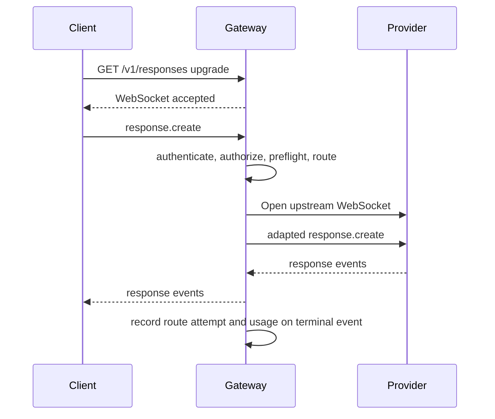
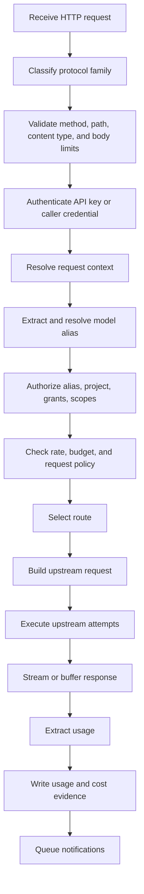
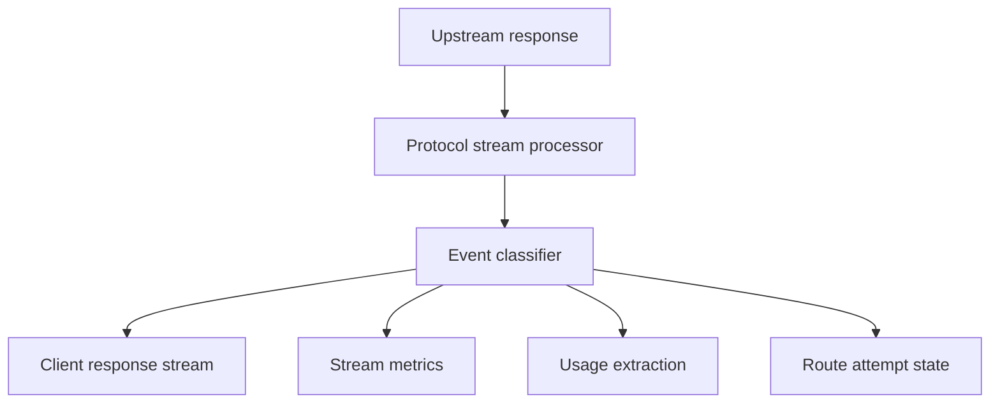

# Runtime Protocol, Streaming, And Errors

Status: design draft for review.

This spec defines the client-facing protocol ingress, provider adaptation
boundary, request lifecycle, stream handling, error taxonomy, and usage
extraction responsibilities for the gateway.

## Goals

- Provide stable HTTP protocol ingress for model clients, internal services,
  automation, workflow runtimes, and other compatible HTTP clients.
- Keep protocol-family boundaries explicit and enforceable.
- Support streaming and non-streaming requests with consistent route, usage,
  and error evidence.
- Allow compatible clients to use the gateway through ordinary provider HTTP
  configuration.
- Record usage and cost signals without exposing secrets or prompts by default.
- Make failover behavior explainable, especially for streams.

## Non-Goals

- Do not promise arbitrary OpenAI-to-Anthropic, Anthropic-to-Gemini, or
  Gemini-to-Bedrock semantic conversion.
- Do not require clients to use gateway-specific types or any other client SDK
  type.
- Do not parse every model-specific option into a gateway-native AST.
- Do not perform prompt rewriting, tool schema rewriting, or response semantic
  normalization as a default behavior.
- Do not hide upstream provider errors when the client needs protocol-compatible
  error details.

## Ingress Families

The gateway exposes protocol-compatible ingress paths. Each path maps to one
`ProtocolFamily`.

| Family                    | Candidate Paths                                    | Notes                                                                |
| ------------------------- | -------------------------------------------------- | -------------------------------------------------------------------- |
| `openai_responses`        | `POST /v1/responses`, `GET /v1/responses`          | OpenAI Responses-compatible HTTP body, stream, and WebSocket upgrade |
| `openai_chat`             | `POST /v1/chat/completions`                        | Chat Completions-compatible body and stream                          |
| `anthropic_messages`      | `POST /v1/messages`, optional vendor mount path    | Anthropic Messages-compatible body and SSE                           |
| `gemini_generate_content` | Gemini-style generate and stream paths             | Developer API or Vertex-compatible path by target config             |
| `bedrock_converse`        | Bedrock Converse-compatible paths                  | native AWS shape, auth owned by gateway                              |
| `provider_native`         | explicit `/native/{provider_kind}/...` style paths | disabled by default; requires native scope and grant                 |

The first implementation can support a smaller set, but the spec reserves the
families to prevent ad hoc route growth.

## Mount Compatibility

The gateway should be compatible with common provider-style HTTP client
configuration. Clients often set either a provider root URL or a protocol mount
URL:

| Base URL Shape                                     | Gateway Meaning                                                   |
| -------------------------------------------------- | ----------------------------------------------------------------- |
| `https://gateway.example`                          | gateway root; client/provider config may append provider API root |
| `https://gateway.example/v1`                       | gateway protocol mount; endpoint path is appended directly        |
| `https://gateway.example/org/acme/project/prod/v1` | scoped gateway mount; endpoint path is appended directly          |

Gateway should not require client-specific route paths. It may offer scoped
mounts for operators, but every mount resolves to the same request lifecycle.

Example:

```text
POST https://gateway.example/v1/responses
POST https://gateway.example/tenants/t1/projects/p1/v1/responses
POST https://gateway.example/gateway/default/v1/messages
```

Scoped paths are optional. Authenticated credential ownership remains the source
of truth for tenant/project context unless the credential has delegation scope.

## Responses WebSocket Proxy

`GET /v1/responses` upgrades to an OpenAI Responses-compatible WebSocket
session. The WebSocket path uses the same gateway authentication middleware,
model alias resolution, route policy, provider grant checks, budget preflight,
usage extraction, and route evidence model as `POST /v1/responses`.

The first valid `response.create` frame pins the WebSocket connection to the
selected model alias, model target, provider endpoint, credential, and upstream
WebSocket. Later `response.create` frames on the same connection must use the
same model alias. Clients that need a different model must open a new WebSocket
connection.



Provider adaptation rewrites the `model` field to the selected upstream model
and injects a gateway-owned `prompt_cache_key` derived from
`x-gateway-session-id`, `x-session-id`, API key id, or actor id. OpenAI-compatible
provider endpoints and Codex OAuth provider endpoints are supported. Codex
provider endpoints also receive `session_id` and `x-client-request-id` headers
derived from the same session id.

The proxy forwards upstream text frames as received. It records terminal usage
from `response.completed.response.usage` when present. Mid-stream failover is
not attempted because the upstream WebSocket is stateful and provider events are
not replayable in a provider-neutral way.

## Request Lifecycle



## Request State Machine

Every runtime request should move through explicit states. State transitions
must be visible in route evidence, audit evidence, or structured telemetry.

| State                    | Entered When                                      | Terminal | Required Evidence                                      |
| ------------------------ | ------------------------------------------------- | -------- | ------------------------------------------------------ |
| `received`               | HTTP request accepted by ingress                  | no       | request id, method, path, received timestamp           |
| `classified`             | protocol family and mount resolved                | no       | protocol family and mount kind                         |
| `rejected_pre_auth`      | method, path, body, or content type rejected      | yes      | safe error code and rejection reason                   |
| `authenticated`          | API key or caller credential verified             | no       | credential id, principal id, auth method               |
| `rejected_auth`          | credential missing, invalid, expired, or disabled | yes      | safe auth failure code                                 |
| `context_resolved`       | tenant, organization, project, and trace resolved | no       | context source and config version                      |
| `authorized`             | action/resource decision allowed                  | no       | policy snapshot id and decision id                     |
| `rejected_policy`        | authorization, provider grant, or budget denied   | yes      | policy decision id and safe denial class               |
| `route_selected`         | route policy selects first target                 | no       | route decision id                                      |
| `upstream_attempting`    | an upstream attempt starts                        | no       | route attempt event id                                 |
| `streaming_or_buffering` | response body is being processed                  | no       | stream processor and visible-content lock state        |
| `usage_recording`        | terminal usage event is being persisted           | no       | usage event id or missing usage policy                 |
| `completed`              | response and accounting completed                 | yes      | final status, usage confidence, and ledger write state |
| `cancelled`              | client disconnect or deadline cancellation        | yes      | cancellation phase and accounting outcome              |
| `failed`                 | gateway or upstream failure ends request          | yes      | stable error code and retry guidance                   |

No state transition may require reading raw prompt or response text for
telemetry. Prompt/body inspection is limited to protocol fields needed for
alias extraction, stream mode, usage hints, and provider adaptation.

## Request Context Headers

Accepted headers:

| Header                   | Source            | Behavior                                                                                      |
| ------------------------ | ----------------- | --------------------------------------------------------------------------------------------- |
| `authorization`          | client            | inbound credential only; never forwarded upstream                                             |
| `x-api-key`              | client            | optional inbound credential for Anthropic-compatible clients; never forwarded as upstream key |
| `x-gateway-request-id`   | trusted caller    | accepted if well formed; otherwise generated                                                  |
| `x-request-id`           | client            | accepted as secondary request id                                                              |
| `traceparent`            | client            | accepted for W3C trace propagation                                                            |
| `tracestate`             | client            | accepted with size limits                                                                     |
| `x-gateway-session-id`   | trusted caller    | affinity source if credential permits                                                         |
| `x-session-id`           | client            | affinity source if policy permits                                                             |
| `x-gateway-route-policy` | privileged client | request hint, not authority                                                                   |
| `x-gateway-debug-route`  | privileged client | enables safe route decision projection                                                        |

Rejected or stripped headers:

- provider API keys
- raw upstream bearer tokens
- cloud provider auth headers
- secret-like custom headers not allowlisted
- Deployment-specific identity headers from untrusted credentials

## Model Alias Extraction

The gateway extracts the requested model alias from the protocol body or path.

| Family                    | Alias Source                                        |
| ------------------------- | --------------------------------------------------- |
| `openai_responses`        | JSON `model`                                        |
| `openai_chat`             | JSON `model`                                        |
| `anthropic_messages`      | JSON `model`                                        |
| `gemini_generate_content` | path model segment or JSON model field when present |
| `bedrock_converse`        | path model id                                       |
| `provider_native`         | path or provider-specific location                  |

After extraction, the gateway resolves alias names using tenant/organization
project namespace rules. It replaces the alias with `ModelTarget.target_model_id`
only inside the upstream request builder.

## Body Handling

The gateway should avoid deep request parsing unless needed for:

- model alias extraction
- stream mode detection
- body size and content type validation
- usage-hint injection for budget-tracked streams
- provider target model replacement
- protocol-required URL or header adaptation
- redacted audit samples when policy enables them

Large or multipart bodies should use bounded memory. The implementation should
stream request bodies to upstream where possible and spill or reject according
to configured body-size policy.

Body policies:

| Policy                     | Meaning                                             |
| -------------------------- | --------------------------------------------------- |
| `max_body_bytes`           | global or alias/provider limit                      |
| `max_multipart_file_bytes` | per-file limit for image or file routes             |
| `max_parts`                | multipart part limit                                |
| `allow_streaming_upload`   | whether streaming upload is allowed                 |
| `audit_body_policy`        | `none`, `metadata`, `redacted_sample`, `full_debug` |

`full_debug` requires explicit local/debug policy and must be disabled in
default production profiles.

## Provider Adaptation Boundary

Provider adapters can perform:

- base URL replacement
- path construction
- query parameter injection
- upstream auth header generation
- static header injection
- allowlisted client header passthrough
- denied header stripping
- model alias replacement
- stream envelope conversion within compatible family
- provider-specific retry metadata parsing

Provider adapters cannot perform by default:

- arbitrary prompt conversion
- message role rewriting between protocol families
- tool schema conversion between incompatible APIs
- user identity impersonation
- silent provider-side storage opt-in
- prompt or response modification for product behavior

## Adapter Contract

A provider adapter receives:

| Input                      | Meaning                                             |
| -------------------------- | --------------------------------------------------- |
| `GatewayRequestContext`    | resolved tenant/project/credential/request metadata |
| `RouteDecision`            | selected target and attempt metadata                |
| `ProtocolFamily`           | ingress protocol family                             |
| `ProviderEndpoint`         | safe provider endpoint metadata                     |
| `ModelTarget`              | selected upstream model id                          |
| `UpstreamCredentialHandle` | short-lived auth material handle                    |
| `HeaderPolicy`             | allowed upstream headers                            |
| `RequestBodyHandle`        | bounded body or stream handle                       |

It returns:

| Output                      | Meaning                                            |
| --------------------------- | -------------------------------------------------- |
| `method`                    | upstream method                                    |
| `url`                       | upstream URL                                       |
| `headers`                   | upstream headers after redaction policy validation |
| `body`                      | adapted body or stream                             |
| `stream_processor`          | optional stream processor for response             |
| `usage_extractor`           | protocol-specific usage extractor                  |
| `provider_request_metadata` | safe metadata for audit                            |

## Streaming Architecture

The gateway should model response streams as typed events while preserving the
client protocol.



Stream event classes:

| Class           | Meaning                                                      |
| --------------- | ------------------------------------------------------------ |
| `metadata`      | provider envelope, id, role, created event, no model content |
| `content_delta` | model text/tool/image/audio delta visible to client          |
| `tool_delta`    | tool-call argument or metadata delta visible to client       |
| `usage_delta`   | usage metadata                                               |
| `error`         | provider or gateway error event                              |
| `terminal`      | completion marker                                            |
| `binary`        | provider-native binary frame                                 |

The stream processor should expose enough classification for failover and usage
without forcing semantic conversion into application runtime events.

## Stream Processors

Candidate processors:

| Processor                            | Input                    | Output                                          |
| ------------------------------------ | ------------------------ | ----------------------------------------------- |
| `SseTextProcessor`                   | text/event-stream bytes  | client SSE events plus classified metadata      |
| `JsonLineProcessor`                  | newline-delimited JSON   | JSON events                                     |
| `AwsEventStreamToSseProcessor`       | AWS event stream         | compatible SSE events when target family allows |
| `AwsEventStreamPassthroughProcessor` | AWS event stream         | native binary frames plus parsed metadata       |
| `GeminiStreamProcessor`              | Gemini streaming format  | Gemini-compatible output and usage metadata     |
| `OpaqueByteStreamProcessor`          | unknown or native stream | passthrough with byte metrics only              |

Processors are selected by `ProviderEndpoint`, `ProtocolFamily`, and
`ModelTarget`.

## Streaming Failover Rules

Failover is allowed only while the client has not received model content. The
exact lock point depends on protocol and processor classification.

| Condition                                             | Failover                                 |
| ----------------------------------------------------- | ---------------------------------------- |
| connection failed before upstream response            | yes                                      |
| upstream returned retryable status before body        | yes                                      |
| stream error before client-visible content            | policy-dependent                         |
| stream emitted metadata only                          | policy-dependent                         |
| stream emitted model content                          | no                                       |
| client disconnected                                   | no failover; cancel upstream if possible |
| provider returned terminal error event before content | policy-dependent                         |

If failover is not allowed after content begins, the gateway should forward or
translate the error according to protocol rules and record `locked_stream_error`
in the route attempt.

## Usage Extraction

Usage extraction normalizes provider usage into `GatewayUsage`.

Fields:

| Field                    | Meaning                                                 |
| ------------------------ | ------------------------------------------------------- |
| `input_tokens`           | billable or raw input tokens when provider reports them |
| `output_tokens`          | generated output tokens                                 |
| `total_tokens`           | provider total or computed total                        |
| `cache_read_tokens`      | input tokens served from provider cache                 |
| `cache_write_tokens`     | input tokens written to cache                           |
| `cache_write_tier`       | provider retention tier when known                      |
| `reasoning_tokens`       | thinking/reasoning tokens                               |
| `tool_tokens`            | tool-specific token count when known                    |
| `image_units`            | image generation/edit units                             |
| `audio_units`            | audio input/output units                                |
| `provider_raw_usage_ref` | optional redacted raw usage reference                   |
| `usage_confidence`       | `exact`, `partial`, `estimated`, `missing`              |

Usage extraction is best effort unless budget policy requires exact usage. If
exact usage is required and the provider cannot return it, the route should be
ineligible or the request should be rejected before upstream call.

## Usage Extraction By Family

| Family                    | Non-Streaming Source       | Streaming Source                      |
| ------------------------- | -------------------------- | ------------------------------------- |
| `openai_responses`        | response usage object      | completed/terminal usage event        |
| `openai_chat`             | response usage object      | final usage chunk when requested      |
| `anthropic_messages`      | response usage object      | message delta or terminal usage event |
| `gemini_generate_content` | usage metadata object      | final chunk usage metadata            |
| `bedrock_converse`        | response usage object      | metadata frame                        |
| `provider_native`         | adapter-specific extractor | adapter-specific extractor            |

For budget-tracked OpenAI-compatible streaming calls, the gateway may inject a
usage-inclusion option when the protocol supports it and the client did not
already request contradictory behavior. The route decision records that the
gateway added a usage hint.

## Cost Calculation Boundary

Runtime request handling calculates an estimated provider cost after usage is
known. It should not perform product billing.

Inputs:

- normalized usage
- pricing SKU decision
- route decision
- provider endpoint id
- model target id
- budget policy snapshot
- request timestamp

Output:

- `CostEstimate` in fixed-point micro currency units
- pricing SKU id and version
- confidence level
- missing-field diagnostics

Cost ledgers and notifications are defined in
`06-usage-cost-budget-notifications.md`.

## Error Taxonomy

Gateway errors use stable categories and provider-compatible responses.

| Category                | Code Family             | Safe Client Message                    |
| ----------------------- | ----------------------- | -------------------------------------- |
| `auth_missing`          | 401                     | credential missing                     |
| `auth_invalid`          | 401                     | credential invalid                     |
| `auth_expired`          | 401                     | credential expired                     |
| `scope_denied`          | 403                     | credential lacks required scope        |
| `model_denied`          | 403                     | model not allowed                      |
| `provider_grant_denied` | 403                     | route not available for project        |
| `budget_exceeded`       | 403 or 429              | budget limit reached                   |
| `rate_limited`          | 429                     | rate limit reached                     |
| `body_too_large`        | 413                     | request too large                      |
| `unsupported_protocol`  | 400                     | endpoint or protocol unsupported       |
| `protocol_mismatch`     | 400                     | alias does not match endpoint protocol |
| `no_route`              | 503                     | no eligible provider target            |
| `upstream_unavailable`  | 503                     | provider unavailable                   |
| `upstream_timeout`      | 504                     | provider timed out                     |
| `upstream_error`        | upstream or 502         | provider returned error                |
| `usage_missing`         | 502 or 200 with warning | usage required but missing             |
| `internal_error`        | 500                     | gateway internal error                 |

Error response should include:

- `error.type`
- `error.code`
- `error.message`
- `request_id`
- `retry_after` when applicable
- `route_decision_id` only when credential may see route debug metadata

## Provider Error Mapping

Provider errors are classified for retry/failover and then projected to the
client.

| Provider Signal                       | Gateway Class                       | Retry           | Failover                                         |
| ------------------------------------- | ----------------------------------- | --------------- | ------------------------------------------------ |
| HTTP 401/403 from upstream            | provider auth or permission failure | no              | yes if alternate target has different credential |
| HTTP 404 model missing                | model target invalid                | no              | yes if alternate target exists                   |
| HTTP 408/timeout                      | timeout                             | yes             | yes                                              |
| HTTP 429                              | provider rate limit                 | yes after delay | yes                                              |
| HTTP 500/502/503/504                  | provider transient                  | yes             | yes                                              |
| malformed JSON on non-stream response | provider protocol error             | no              | yes if before client response                    |
| invalid stream frame                  | provider stream error               | no              | depends on stream phase                          |
| content safety rejection              | provider content policy             | no              | no by default                                    |

The gateway should avoid rewriting provider error bodies except to redact
sensitive data or conform to a client protocol. Route attempt evidence stores
safe classification.

## Request Audit Levels

Provider request audit is separate from normal traces.

| Level              | Captures                                              | Default                |
| ------------------ | ----------------------------------------------------- | ---------------------- |
| `none`             | no provider request payload                           | production default     |
| `metadata`         | URL host, method, route ids, body size, header names  | safe default for debug |
| `redacted_payload` | scrubbed JSON/multipart metadata and redacted headers | explicit policy        |
| `full_payload`     | raw headers/body after secret removal                 | local debug only       |

Even `full_payload` must strip generated upstream auth headers. It should require
operator-only policy and short retention.

## Client Disconnects And Cancellation

When a client disconnects:

- gateway cancels upstream request when transport supports it
- stream metrics record client disconnect
- usage is recorded only if usage is known
- route decision attempt status becomes `client_disconnected`
- cost ledger entry is omitted or marked partial according to usage confidence
- notification event can be emitted when policy requests disconnect events

For trusted internal services, cancellation may arrive as a request to cancel an
active upstream call. Gateway v1 can treat cancellation as connection
termination unless a later bidirectional protocol is designed.

## Timeouts

Timeout scopes:

| Timeout                       | Meaning                                |
| ----------------------------- | -------------------------------------- |
| `request_headers_timeout`     | time to receive client request headers |
| `request_body_timeout`        | time to read client body               |
| `route_decision_timeout`      | time to compute route                  |
| `secret_fetch_timeout`        | time to fetch upstream secret          |
| `upstream_connect_timeout`    | TCP/TLS connect                        |
| `upstream_first_byte_timeout` | time to upstream response start        |
| `stream_idle_timeout`         | maximum idle gap in stream             |
| `total_request_timeout`       | whole gateway request ceiling          |

Timeouts can be configured globally, per alias, per route policy, and per
provider endpoint. Narrower scopes can reduce but not exceed broader limits
unless policy allows it.

## Idempotency

Model requests are usually not safe to replay after upstream execution begins.
Gateway idempotency therefore applies to gateway-side evidence, not automatic
model replay.

Idempotency support:

- optional `idempotency_key` accepted from trusted clients
- deduplicate usage notification delivery
- prevent duplicate admin mutations
- avoid double ledger writes when gateway retries persistence after successful
  upstream call

Do not retry a completed model generation solely because the client did not
receive the response.

## Response Headers

Gateway response headers:

| Header                        | Meaning                                                    |
| ----------------------------- | ---------------------------------------------------------- |
| `x-gateway-request-id`        | gateway request id                                         |
| `x-gateway-route-decision-id` | present only when safe/debug policy permits                |
| `x-gateway-model-alias`       | resolved alias when safe                                   |
| `x-gateway-usage-confidence`  | optional usage confidence                                  |
| `x-ratelimit-*`               | standard or gateway-scoped rate-limit headers when enabled |
| `retry-after`                 | retry guidance for 429/503 where applicable                |

Provider-specific headers are forwarded only through response header policy.
Sensitive provider account headers should be stripped.

## Validation Matrix

Runtime protocol tests should cover:

- each ingress route maps to expected protocol family
- alias extraction for JSON, path, and multipart bodies
- protocol mismatch rejection
- scoped mount compatibility with root and `/v1` paths
- inbound auth headers are not forwarded upstream
- provider auth headers are generated from upstream credentials
- route decision created for success, denial, no route, and upstream failure
- streaming failover before content
- streaming lock after content
- usage extraction success, partial, and missing cases
- body-size rejection
- provider non-JSON error classification
- client disconnect handling

## Acceptance Gates

- Compatible clients can call gateway through ordinary HTTP provider config.
- Ordinary applications, workflow runtimes, and internal services can call
  protocol-compatible routes with API keys or caller credentials.
- Gateway rejects aliases whose protocol family does not match ingress path.
- Provider adapters do not receive raw inbound credentials as upstream secrets.
- Streaming failover never splices content from two providers.
- Usage extraction confidence is persisted with every ledger decision.
- Error responses include request id and stable gateway error code.
- Request audit defaults do not capture prompt or secret payloads.
