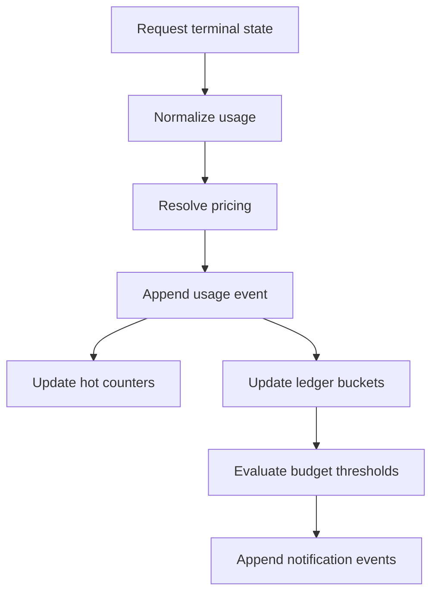
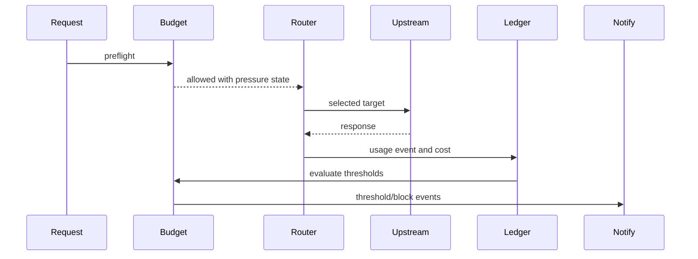

# Usage, Cost, Budgets, And Notifications

Status: design draft for review.

This spec defines how the gateway records usage, estimates provider cost,
enforces cost and quota policy, and notifies external systems. The gateway is
an open-source cost-control and integration component, not a billing product.

## Goals

- Record durable usage events for every model request when possible.
- Estimate provider cost with explicit pricing version and confidence.
- Enforce budget and quota policies across tenant, organization, project,
  credential, alias, routing group, provider endpoint, and model target scopes.
- Emit integration events for usage, thresholds, blocks, health, route failures,
  and configuration changes.
- Allow commercial operators to build their own billing systems without putting
  paid-product logic in the gateway.
- Keep usage and cost evidence useful for audit, chargeback, FinOps, and data
  warehouse export.

## Non-Goals

- Do not generate invoices.
- Do not manage paid plans, seats, tax, discounts, subscription lifecycle, or
  payment methods.
- Do not decide customer-facing price.
- Do not require exactly-once outbound webhooks; instead provide idempotent
  delivery semantics.
- Do not block usage recording when a non-critical notification sink is down.

## Cost-Only Position

The gateway records provider cost estimates. Operators can choose whether to:

- expose cost to users as informational spend
- enforce budget caps
- export usage into internal accounting
- forward usage to a billing system
- ignore cost and use only quota/rate limits

The gateway should avoid fields named `invoice`, `plan`, `subscription`,
`customer_charge`, or `revenue`. When external billing is needed, the gateway
emits usage and budget events with stable ids and lets another system interpret
them.

## UsageEvent

`UsageEvent` is the immutable event written after a request reaches a terminal
state or after a partial terminal condition such as disconnect.

Fields:

| Field                    | Meaning                                              |
| ------------------------ | ---------------------------------------------------- |
| `usage_event_id`         | stable id                                            |
| `tenant_id`              | tenant                                               |
| `organization_id`        | organization                                         |
| `project_id`             | project                                              |
| `organization_member_id` | user membership in organization, when applicable     |
| `project_member_id`      | user membership in project, when applicable          |
| `api_key_id`             | API key used for authentication, when present        |
| `client_credential_id`   | internal inbound credential id                       |
| `principal_id`           | optional owning principal                            |
| `service_account_id`     | service account actor, when applicable               |
| `actor_kind`             | `user`, `service_account`, `api_key`, `system`       |
| `request_id`             | gateway request id                                   |
| `trace_id`               | trace id                                             |
| `route_decision_id`      | route evidence                                       |
| `model_alias_id`         | resolved alias                                       |
| `route_policy_id`        | route policy used                                    |
| `routing_group_id`       | selected group                                       |
| `model_target_id`        | selected target                                      |
| `provider_endpoint_id`   | selected endpoint                                    |
| `upstream_credential_id` | selected credential id, no secret                    |
| `protocol_family`        | ingress family                                       |
| `streaming`              | request stream mode                                  |
| `status`                 | `success`, `error`, `partial`, `blocked`, `canceled` |
| `usage`                  | normalized usage struct                              |
| `cost_estimate`          | estimated provider cost                              |
| `pricing_sku_id`         | pricing SKU used, if any                             |
| `pricing_version`        | immutable pricing version                            |
| `usage_confidence`       | `exact`, `partial`, `estimated`, `missing`           |
| `latency_ms`             | total request latency                                |
| `ttft_ms`                | time to first token when known                       |
| `throughput_tps`         | output tokens per second when known                  |
| `started_at`             | request start                                        |
| `completed_at`           | terminal time                                        |
| `created_at`             | event creation                                       |

`UsageEvent` should be append-only. Corrections are represented by compensating
events or ledger adjustments.

## Usage Attribution

Usage attribution must be immutable at request time.

Attribution rules:

- user-owned API key requests record `principal_id`, `organization_member_id`,
  and `project_member_id` when the project membership is known
- project-owned API keys record `api_key_id`, `project_id`, and the owning
  project; they record `project_member_id` only when the key is explicitly tied
  to a user member
- service account requests record `service_account_id` and project or
  organization scope
- internal credentials record `client_credential_id` and any delegated project
  scope after authorization
- dashboard display names use current profile metadata when safe, but the
  durable event keeps historical membership ids for correctness

The gateway should not answer member usage by joining only current membership
tables. Historical queries must use the ids captured on `UsageEvent` and then
optionally decorate rows with current or snapshot display metadata.

## Normalized Usage

Normalized usage fields:

| Field                     | Meaning                                         |
| ------------------------- | ----------------------------------------------- |
| `input_tokens`            | input tokens reported by provider or estimator  |
| `output_tokens`           | output tokens reported by provider or estimator |
| `total_tokens`            | total when provider reports it or computed sum  |
| `cache_read_tokens`       | input tokens served from provider cache         |
| `cache_write_tokens`      | input tokens written to provider cache          |
| `cache_write_5m_tokens`   | short retention cache write tokens              |
| `cache_write_1h_tokens`   | long retention cache write tokens               |
| `reasoning_tokens`        | reasoning/thinking tokens                       |
| `tool_tokens`             | provider-reported tool token units              |
| `image_input_units`       | image input units                               |
| `image_output_units`      | generated image units                           |
| `audio_input_units`       | audio input units                               |
| `audio_output_units`      | audio output units                              |
| `request_units`           | provider-specific request units                 |
| `provider_usage_metadata` | redacted provider usage metadata                |

Fields absent from provider output should be null or zero according to schema
rules and accompanied by `usage_confidence`.

## CostEstimate

Cost estimate fields:

| Field              | Meaning                                     |
| ------------------ | ------------------------------------------- |
| `currency`         | ISO currency, normally `USD`                |
| `unit`             | fixed-point unit such as `micro_usd`        |
| `input_cost`       | cost portion                                |
| `output_cost`      | cost portion                                |
| `cache_read_cost`  | cost portion                                |
| `cache_write_cost` | cost portion                                |
| `reasoning_cost`   | cost portion                                |
| `media_cost`       | cost portion                                |
| `request_cost`     | flat or request unit portion                |
| `total_cost`       | sum                                         |
| `rounding_mode`    | pricing rounding behavior                   |
| `confidence`       | `exact`, `estimated`, `unpriced`, `partial` |
| `diagnostics`      | safe missing-pricing or missing-usage notes |

Use fixed-point integer storage for durable ledgers. Avoid floating-point
storage for persisted cost totals.

## Ledger Model

The ledger aggregates usage events into queryable balances. It must support
reporting by identity and routing dimensions.

Ledger dimensions:

- tenant
- organization
- project
- organization member
- project member
- principal
- service account
- API key
- caller credential
- model alias
- route policy
- routing group
- provider endpoint
- model target
- upstream credential
- protocol family
- pricing SKU
- time bucket

Ledger buckets:

| Bucket | Use                                                                  |
| ------ | -------------------------------------------------------------------- |
| minute | low-latency usage analytics rollups and near-real-time budget checks |
| hour   | operational reports                                                  |
| day    | cost summaries                                                       |
| month  | budget and chargeback summaries                                      |
| event  | immutable source event                                               |

The event ledger is the source of truth for reconstruction. Aggregated buckets
are derived materializations.

Ledger buckets feed usage analytics. They are not the Redis-compatible
hot-state source for the built-in realtime operations dashboard.

Dashboard buckets should materialize common views:

| View                    | Required Dimensions                                      |
| ----------------------- | -------------------------------------------------------- |
| organization overview   | organization, time bucket                                |
| project overview        | organization, project, time bucket                       |
| project member usage    | organization, project, project member, time bucket       |
| API key usage           | project, API key, time bucket                            |
| model alias usage       | organization, project, model alias, time bucket          |
| provider endpoint usage | provider endpoint, model target, status, time bucket     |
| model observability     | model alias, model target, latency bucket, status bucket |

## Write Path



The durable write should be idempotent by `usage_event_id` or request terminal
id. If ledger aggregation fails after event append, a reconciliation worker can
derive missing aggregates from immutable usage events.

## BudgetPolicy

Budget policies enforce cost or usage thresholds. They are not paid plans.

Fields:

| Field              | Meaning                                                                   |
| ------------------ | ------------------------------------------------------------------------- |
| `budget_policy_id` | stable id                                                                 |
| `tenant_id`        | owning tenant                                                             |
| `scope_kind`       | tenant, organization, project, credential, alias, group, endpoint, target |
| `scope_id`         | owning scope                                                              |
| `currency`         | cost currency                                                             |
| `period`           | `rolling`, `calendar_day`, `calendar_month`, `lifetime`, `custom_window`  |
| `limit_kind`       | `cost`, `tokens`, `requests`, `concurrency`, `stream_seconds`             |
| `hard_limit`       | optional hard block threshold                                             |
| `soft_limit`       | optional notification threshold                                           |
| `thresholds`       | notification percentages or absolute values                               |
| `reset_policy`     | reset behavior                                                            |
| `overage_mode`     | behavior after threshold                                                  |
| `status`           | `active`, `disabled`, `deleted`                                           |
| `created_by`       | actor                                                                     |
| `created_at`       | creation timestamp                                                        |
| `updated_at`       | last update                                                               |

Overage modes:

| Mode                      | Behavior                                           |
| ------------------------- | -------------------------------------------------- |
| `notify_only`             | never block; emit threshold events                 |
| `block_new_requests`      | block preflight after hard threshold               |
| `prefer_low_cost_route`   | ask router to prefer cheaper groups under pressure |
| `fallback_low_cost_route` | normal routing until pressure, then fallback       |
| `require_exact_usage`     | allow only targets that return usable exact usage  |

## Budget Evaluation

Budget checks happen at three points:

1. Preflight before routing or before upstream call.
2. Route selection when budget pressure influences target choice.
3. Terminal accounting after usage is known.

Preflight can only use current ledger state and estimates. Terminal accounting
uses actual provider usage when available.



## Budget Consistency

Budget enforcement has a consistency tradeoff. The gateway should define policy
modes:

| Mode               | Behavior                                                    |
| ------------------ | ----------------------------------------------------------- |
| `eventual`         | use hot counters and periodic ledger reconciliation         |
| `strong_preflight` | transactionally reserve estimated cost before upstream call |
| `strong_terminal`  | allow request but transactionally update terminal cost      |
| `manual_review`    | notify only; no automatic block                             |

Initial open-source gateway can default to `eventual` for ordinary cost caps and
support `strong_terminal` for stricter deployments. `strong_preflight` requires
cost reservation and should be an explicit later phase.

## Hard Budget Staleness

Hard budget policy must define behavior when ledger or hot counter state is
stale.

Rules:

- If a scope has an active hard cost or usage cap, stale budget state cannot
  silently fall back to unrestricted `eventual` behavior.
- If durable ledger writes are unavailable, `usage_buffering` is allowed only
  for scopes whose budget policies are `notify_only` or `manual_review`.
- If hot counters are unavailable for a hard-capped scope, the gateway enters
  `budget_conservative` mode for that scope.
- `budget_conservative` defaults to fail-closed for strict production policies
  and fail-limited only when the policy explicitly declares a bounded emergency
  allowance.
- Terminal reconciliation must emit an audit or notification event when a
  stale-state decision affected enforcement.

Phase 3 cannot be considered complete until hard budget stale-state behavior is
covered by tests.

## Cost Reservation

Cost reservation is optional. It is useful for strict budgets but difficult for
streaming and unknown output length.

Reservation fields:

| Field              | Meaning                                      |
| ------------------ | -------------------------------------------- |
| `reservation_id`   | stable id                                    |
| `budget_policy_id` | budget                                       |
| `request_id`       | request                                      |
| `reserved_cost`    | fixed-point amount                           |
| `actual_cost`      | terminal actual                              |
| `status`           | `reserved`, `settled`, `released`, `expired` |
| `expires_at`       | automatic release deadline                   |

Reservation should be avoided in v1 unless a concrete deployment needs strong
preflight semantics.

## Rate And Quota Limits

Quota policies are not cost budgets but share evaluation infrastructure.

Quota types:

| Type                | Scope                                   |
| ------------------- | --------------------------------------- |
| requests per minute | tenant, org, project, credential, alias |
| tokens per minute   | tenant, org, project, credential, alias |
| concurrent requests | tenant, org, project, credential        |
| concurrent streams  | tenant, org, project, credential        |
| stream duration     | credential, alias, endpoint             |
| request body bytes  | credential, alias, protocol family      |

Counters can use Redis-compatible hot state with durable usage events as
reconciliation source. Hot-state loss should fail according to policy:
`fail_open`,
`fail_limited`, or `fail_closed`.

### Counter Algorithm

Each quota or rate policy must define the counter key, increment source, window,
and loss behavior.

| Counter Kind        | Increment Source                 | Window                 | Atomicity Requirement                      |
| ------------------- | -------------------------------- | ---------------------- | ------------------------------------------ |
| request rate        | accepted preflight request       | fixed or sliding       | increment and expire in one command/script |
| token estimate rate | request estimate before dispatch | fixed or sliding       | reserve estimate before route selection    |
| token actual rate   | terminal usage event             | fixed or ledger bucket | reconcile with durable usage event         |
| concurrent request  | preflight acquire, terminal free | request lifetime       | acquire with TTL and release idempotently  |
| concurrent stream   | stream start/end                 | stream lifetime        | acquire before upstream call               |
| budget hot counter  | reservation or terminal cost     | budget reset window    | compare-and-increment must be atomic       |

Redis scripts or single atomic commands are required when a race could allow a
hard limit to be exceeded beyond the policy's declared tolerance. Every counter
key must include tenant id, scope kind, scope id, policy id, and window id.

Durable reconciliation:

1. Terminal usage writes append-only `UsageEvent`.
2. Ledger worker folds usage into durable buckets.
3. Reconciliation compares durable buckets with hot counters.
4. If hot counters are lower than durable usage for a hard-capped scope, the
   scope enters `budget_conservative` until counters are repaired or policy
   explicitly permits fail-limited operation.
5. Reconciliation writes audit evidence for any enforcement-impacting repair.

## Notification Model

Notifications are integration events emitted to sinks. They are not UI-only
messages.

Notification event families:

| Family          | Examples                                                     |
| --------------- | ------------------------------------------------------------ |
| usage           | request completed, usage missing, cost unavailable           |
| budget          | threshold reached, hard block activated, budget reset        |
| quota           | rate limit exceeded, concurrency saturation                  |
| routing         | no route, failover, degraded provider selected               |
| provider health | endpoint degraded, endpoint recovered, credential expired    |
| credential      | upstream credential rotated, API key disabled                |
| admin           | config changed, provider grant changed, route policy changed |
| delivery        | webhook retry exhausted, sink disabled                       |

Events are appended to an outbox and delivered asynchronously.

## NotificationSink

Sink types:

| Type            | Use                                    |
| --------------- | -------------------------------------- |
| `webhook`       | HTTP POST to external system           |
| `object_export` | batched JSONL object storage export    |
| `pubsub`        | future message bus integration         |
| `stdout`        | local development                      |
| `disabled`      | explicit no-op sink for policy testing |

Webhook sink fields:

| Field                  | Meaning                             |
| ---------------------- | ----------------------------------- |
| `notification_sink_id` | stable id                           |
| `tenant_id`            | tenant                              |
| `scope_kind`           | tenant, organization, project       |
| `scope_id`             | owner scope                         |
| `name`                 | label                               |
| `url`                  | target URL                          |
| `secret_ref`           | signing secret reference            |
| `event_filters`        | event families and resource filters |
| `status`               | `active`, `disabled`, `error`       |
| `retry_policy`         | retry schedule                      |
| `created_by`           | actor                               |
| `created_at`           | creation timestamp                  |
| `updated_at`           | last update                         |

## Webhook Payload

Webhook payloads should use a versioned envelope:

```json
{
  "schema": "gateway.notification.v1",
  "event_id": "evt_...",
  "event_type": "gateway.usage.completed",
  "tenant_id": "ten_...",
  "organization_id": "org_...",
  "project_id": "prj_...",
  "created_at": "2026-06-24T00:00:00Z",
  "idempotency_key": "evt_...",
  "data": {
    "usage_event_id": "use_...",
    "request_id": "req_...",
    "model_alias": "claude-sonnet",
    "cost": {
      "currency": "USD",
      "unit": "micro_usd",
      "total": 12345
    }
  }
}
```

Do not include raw prompts, raw responses, upstream API keys, OAuth tokens, or
unredacted provider headers.

## Webhook Signing

Webhook requests should include:

| Header                  | Meaning                                |
| ----------------------- | -------------------------------------- |
| `x-gateway-event-id`    | event id                               |
| `x-gateway-event-type`  | event type                             |
| `x-gateway-delivery-id` | delivery attempt id                    |
| `x-gateway-signature`   | HMAC signature over timestamp and body |
| `x-gateway-timestamp`   | signing timestamp                      |
| `x-gateway-schema`      | schema version                         |

Receivers use event id as idempotency key. Gateway may retry deliveries, so
receivers must treat duplicate event ids as safe duplicates.

## Outbox

Outbox fields:

| Field             | Meaning                                                           |
| ----------------- | ----------------------------------------------------------------- |
| `outbox_event_id` | stable id                                                         |
| `tenant_id`       | tenant                                                            |
| `event_type`      | event type                                                        |
| `scope_kind`      | tenant, organization, project, credential, route                  |
| `scope_id`        | resource scope                                                    |
| `payload`         | redacted event payload                                            |
| `schema_version`  | payload schema                                                    |
| `status`          | `pending`, `delivering`, `delivered`, `retrying`, `dead_lettered` |
| `attempt_count`   | delivery attempts                                                 |
| `next_attempt_at` | retry schedule                                                    |
| `created_at`      | event creation                                                    |
| `updated_at`      | last delivery update                                              |

Outbox write should be transactionally linked to usage or admin mutation when
the event is required for integration correctness.

## Delivery Semantics

Delivery is at-least-once. Idempotency is receiver-visible through stable event
ids.

Retry policy:

- bounded exponential backoff with jitter
- max retry duration configurable per sink
- dead-letter after retry budget exhausted
- disable sink automatically only for explicit policy, not by default
- delivery failures do not block gateway runtime requests

For high-volume usage, webhook sinks should support batching:

```json
{
  "schema": "gateway.notification_batch.v1",
  "batch_id": "bat_...",
  "events": [
    { "event_id": "evt_1", "event_type": "gateway.usage.completed" },
    { "event_id": "evt_2", "event_type": "gateway.usage.completed" }
  ]
}
```

## Usage Export

Some operators prefer pull-based export. The gateway should support:

- admin API pagination over usage events
- object storage JSONL export by time bucket
- signed URL or storage path manifests
- watermarks for data warehouse ingestion
- schema version in every record

Export files must follow the same redaction policy as webhooks.

V1 export job creation accepts `storage_backend: inline_manifest` or
`storage_backend: object_storage`. `inline_manifest` is the local/default backend
used for small self-hosted deployments and tests. `object_storage` is an explicit
operator choice; when no object storage writer is configured, the gateway records
a failed export job and a redacted failure manifest instead of returning a false
success. Failure manifests include the storage backend, connection state, retryable
failure reason, filtered record count, checksum evidence, and no exported rows.
Manifest reads must enforce `expires_at`; expired manifests are not returned even
though the export job metadata remains auditable.

## Budget Reset

Budget reset is an audited admin action. It does not delete usage events.

Reset behavior:

| Reset Type                | Behavior                                            |
| ------------------------- | --------------------------------------------------- |
| `manual_counter_reset`    | set budget counter baseline to current ledger total |
| `periodic_window_reset`   | advance window for calendar budgets                 |
| `policy_replacement`      | disable old policy, create new policy               |
| `compensating_adjustment` | append positive or negative ledger adjustment       |

Every reset emits a notification event when sinks subscribe to budget events.

## Ledger Adjustment

Adjustments correct cost after pricing update, provider correction, or operator
manual fix.

Fields:

| Field                    | Meaning            |
| ------------------------ | ------------------ |
| `ledger_adjustment_id`   | stable id          |
| `tenant_id`              | tenant             |
| `scope_kind`             | scope              |
| `scope_id`               | scope id           |
| `amount_delta`           | fixed-point amount |
| `currency`               | currency           |
| `reason`                 | admin reason       |
| `related_usage_event_id` | optional event     |
| `created_by`             | actor              |
| `created_at`             | timestamp          |

Adjustments are append-only and included in budget totals.

## Missing Usage

Providers or stream failures can produce missing usage.

Policy options:

| Option                    | Behavior                                         |
| ------------------------- | ------------------------------------------------ |
| `allow_missing_usage`     | record event with missing confidence and no cost |
| `estimate_missing_usage`  | estimate from request/response size or tokenizer |
| `require_provider_usage`  | reject routes that cannot provide usage          |
| `hold_for_reconciliation` | mark event pending until external reconciliation |

Default should be `allow_missing_usage` for low-risk development and
`require_provider_usage` for budget-enforced production aliases.

## Data Retention

Suggested retention:

| Data                         | Retention                                     |
| ---------------------------- | --------------------------------------------- |
| usage events                 | configurable, default long-lived              |
| ledger buckets               | long-lived                                    |
| notification outbox payloads | configurable, shorter than ledger if exported |
| webhook delivery attempts    | medium retention                              |
| route decisions              | medium to long depending on audit policy      |
| redacted debug payloads      | short retention                               |

Retention jobs must not break ledger reconstruction unless aggregate buckets are
sealed and exported.

## Acceptance Gates

- Usage events are append-only and idempotent.
- Cost is stored in fixed-point units with pricing SKU version.
- Budget policies can be attached to every required identity and routing scope.
- Gateway does not contain paid-plan or invoice concepts.
- Hard budget blocks are auditable and emit notification events.
- Webhooks are signed, versioned, redacted, and idempotent for receivers.
- Notification delivery failures do not drop durable outbox events.
- Missing usage has explicit confidence and policy behavior.
- External billing integration can consume usage notifications without access to
  prompts or upstream secrets.
