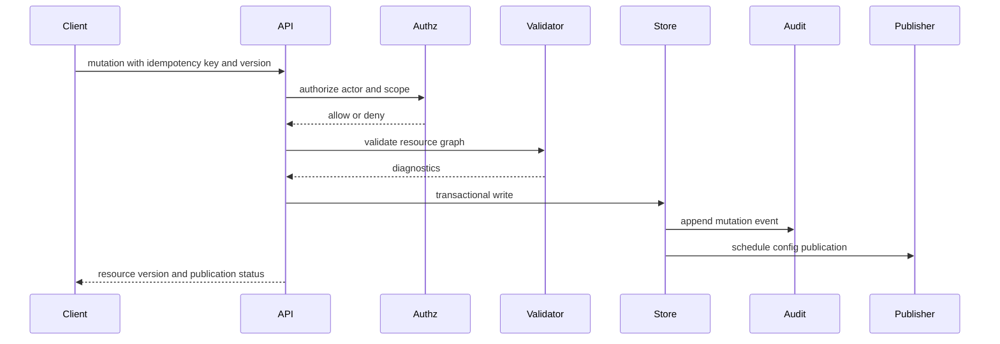
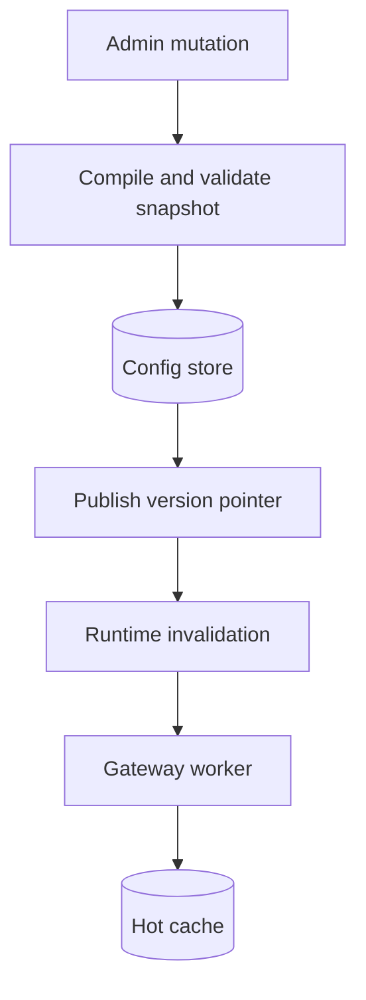

# Admin And Config API

Status: design draft for review.

This spec defines the gateway control plane API. The API owns
tenant resources, provider access, upstream credentials, routing groups, budget
policies, notification sinks, and runtime configuration publication.

The admin API is not the model serving protocol. Model requests enter through
runtime protocol endpoints described in `05-runtime-protocol.md`. Admin callers
manage configuration and inspect operational evidence.

## Goals

- Provide a versioned administrative surface for all gateway configuration.
- Make every config mutation auditable and attributable to an actor.
- Support UI, CLI, Terraform-style automation, and internal platform service
  integration without separate resource semantics.
- Publish config snapshots to gateway workers with clear consistency rules.
- Keep secret values out of read APIs, audit records, traces, and notifications.
- Support enterprise change workflow: draft, validate, apply, rollback, and
  emergency disable.

## Non-Goals

- Do not expose an end-user billing product API.
- Do not couple the API to a specific future web UI.
- Do not let runtime workers mutate long-lived configuration except through
  narrow health and usage write paths.
- Do not become a generic identity provider. The gateway may act as a
  configured login client for generic OIDC admin login and manages
  gateway-local principals, memberships, sessions, and authorization resources.
- Do not expose raw upstream provider secrets after creation.

## API Principles

Admin API behavior should follow these principles:

| Principle              | Meaning                                                                  |
| ---------------------- | ------------------------------------------------------------------------ |
| Versioned resources    | every public request and response uses a schema version                  |
| Idempotent writes      | create and update calls accept idempotency keys                          |
| Optimistic concurrency | updates include resource version or ETag                                 |
| Explicit scope         | every resource belongs to tenant, organization, project, or system scope |
| Audited mutation       | every mutation creates an immutable audit event                          |
| Redacted reads         | secrets and sensitive headers are never returned                         |
| Validated publication  | config can be checked before runtime workers use it                      |
| Stable errors          | API errors use machine-readable codes                                    |

## API Families

The admin API is grouped by resource family:

| Family        | Resources                                                                                                          |
| ------------- | ------------------------------------------------------------------------------------------------------------------ |
| tenancy       | tenants, organizations, organization members, projects, project members                                            |
| identity      | identity providers, principals, external identities, sessions, invitations, roles, role bindings, service accounts |
| access        | API keys, caller credentials, action grants, provider grants                                                       |
| providers     | provider endpoints, upstream credentials, OAuth connections                                                        |
| catalog       | model targets, model aliases, pricing SKUs                                                                         |
| routing       | routing groups, route policies, route rules, health overrides                                                      |
| policy        | budgets, quotas, admission policy, redaction policy                                                                |
| notifications | sinks, subscriptions, delivery attempts                                                                            |
| evidence      | usage events, route decisions, audit events, exports                                                               |
| dashboards    | realtime operations, overview, usage analytics, model observability, budget posture                                |
| operations    | config snapshots, validation, runtime health, maintenance windows, observability export config                     |

The first implementation can expose only the resources needed for gateway v1,
but the resource vocabulary should not change when UI and automation arrive.

## Resource Envelope

All admin resources should share a common envelope.

```json
{
  "schema": "gateway.admin.resource.v1",
  "resource": {
    "kind": "routing_group",
    "id": "rg_...",
    "tenant_id": "ten_...",
    "organization_id": "org_...",
    "version": 12,
    "status": "active",
    "created_at": "2026-06-24T00:00:00Z",
    "updated_at": "2026-06-24T00:00:00Z",
    "created_by": "principal_...",
    "updated_by": "principal_..."
  }
}
```

The envelope is useful for audit, UI lists, partial cache invalidation, and
generic admin tooling.

### Write Request Envelope

Create, update, patch, publish, and emergency operations should use a common
request envelope.

```json
{
  "schema": "gateway.admin.write.v1",
  "idempotency_key": "idem_...",
  "expected_version": 12,
  "reason": "Rotate provider credential before expiry.",
  "resource": {
    "kind": "provider_endpoint",
    "id": "pe_..."
  }
}
```

Rules:

- `idempotency_key` is required for create, publish, emergency, and any
  operation that can trigger side effects.
- `expected_version` is required for update, patch, disable, and delete.
- `reason` is required for emergency operations, secret rotation, hard budget
  override, route drain, and config rollback.
- request envelopes must not include raw secret values except on dedicated
  secret write endpoints.
- responses return the resource envelope, audit event id, and config version
  impact when applicable.

## Actor Context

Every admin request resolves an actor context:

| Field             | Meaning                                                            |
| ----------------- | ------------------------------------------------------------------ |
| `tenant_id`       | tenant boundary for the request                                    |
| `organization_id` | optional organization boundary                                     |
| `project_id`      | optional project boundary                                          |
| `principal_id`    | user, service account, API key owner, or system actor              |
| `api_key_id`      | authenticating API key when present                                |
| `actor_kind`      | `user`, `service_account`, `api_key`, `internal_service`, `system` |
| `auth_method`     | deployment-specific authentication method                          |
| `role_bindings`   | effective role bindings used for authorization                     |
| `request_id`      | admin request id                                                   |
| `trace_id`        | trace id                                                           |
| `source_ip`       | optional remote address                                            |
| `user_agent`      | optional caller agent                                              |

Actor context is written into audit events. It should not be inferred later
from mutable identity tables.

## Canonical Roles

The admin API uses the same canonical role vocabulary as
`02-tenancy-access.md`. Do not introduce a second `gateway_*` role family in
handlers. Capability-specific admin bundles should compile to action grants or
custom policies through the authorization engine.

Initial roles:

| Role                  | Scope                         | Capabilities                                                             |
| --------------------- | ----------------------------- | ------------------------------------------------------------------------ |
| `tenant_owner`        | tenant                        | full tenant administration, emergency secret disable, audit export       |
| `tenant_admin`        | tenant                        | manage organizations, projects, provider resources, policies             |
| `security_admin`      | tenant                        | manage API keys, caller credentials, secret refs, and redaction policies |
| `gateway_operator`    | tenant                        | inspect health, reload config, drain endpoints, view operational metrics |
| `organization_admin`  | organization                  | manage projects, project policies, organization grants                   |
| `organization_member` | organization                  | read own organization membership and default dashboards                  |
| `project_admin`       | project                       | manage project API keys, budgets, allowed aliases                        |
| `project_developer`   | project                       | use allowed models and read own project usage                            |
| `project_viewer`      | project                       | read project dashboards and non-sensitive configuration                  |
| `usage_viewer`        | tenant, organization, project | read usage and cost reports                                              |
| `auditor`             | tenant, organization, project | read audit events and route decisions                                    |

Roles are scoped. A tenant owner can manage all organizations in the tenant. An
organization admin can manage resources granted to the organization but cannot
read or mutate resources outside that organization.

## Authorization Engine

Admin REST APIs and model protocol ingress must use the same authorization
decision path. Each handler maps to a stable action id and resource kind before
loading or mutating state.

Decision input:

| Field       | Meaning                                                                 |
| ----------- | ----------------------------------------------------------------------- |
| `principal` | authenticated actor, including API key when used                        |
| `action`    | stable gateway action id                                                |
| `resource`  | target resource or collection scope                                     |
| `context`   | request metadata, config version, network class, time, and policy hints |

The recommended v1 engine is an embedded Cedar policy evaluator behind an
internal `AuthorizationEngine` abstraction. Policy bundles are validated during
config publication and shipped to runtime workers as part of the immutable
config snapshot. Future OpenFGA, SpiceDB, or OPA integrations can implement the
same internal interface if deployments need external authorization services.

API keys are valid REST API actors when their owner principal and key policy
allow the requested action. A key can never exceed its owner principal's
effective permissions.

## Write Flow



Validation happens before the write when possible and again during snapshot
publication. The second pass catches cross-resource changes made concurrently.

## Config Lifecycle

Config resources move through states:

| State        | Meaning                                              |
| ------------ | ---------------------------------------------------- |
| `draft`      | persisted but not used by runtime                    |
| `validating` | graph validation is running                          |
| `active`     | included in published runtime snapshots              |
| `disabled`   | retained but ignored by runtime                      |
| `deprecated` | still active but scheduled for replacement           |
| `deleted`    | tombstoned, not hard-deleted until retention expires |

Most resources can be edited directly as active resources with optimistic
concurrency. High-risk resources, such as route policy replacement across many
organizations, should support draft-and-apply.

## Config Snapshot

Runtime workers should consume a compiled config snapshot.

Snapshot fields:

| Field               | Meaning                                           |
| ------------------- | ------------------------------------------------- |
| `snapshot_id`       | stable id                                         |
| `tenant_id`         | tenant                                            |
| `organization_id`   | optional organization partition                   |
| `version`           | monotonic publication version                     |
| `resource_versions` | resource ids and versions included                |
| `compiled_at`       | build time                                        |
| `compiled_by`       | system actor                                      |
| `checksum`          | deterministic checksum                            |
| `status`            | `pending`, `published`, `rejected`, `rolled_back` |
| `diagnostics`       | validation warnings or errors                     |

Snapshots are immutable. Rollback publishes an earlier valid snapshot as the
current runtime version.

## Snapshot Contents

A runtime snapshot contains only data needed for serving:

- API key hashes and action grants
- caller credential status
- provider grants
- active model aliases
- active model targets
- route policy graph
- routing group membership
- provider endpoint connection settings
- upstream credential secret references, not secret values
- redaction policy
- budget and quota policy summaries
- notification sink routing metadata
- OpenTelemetry export configuration metadata and exporter secret references,
  not exporter header values

It should not contain UI-only metadata, audit text, deleted resources, or raw
secret material.

## Config Publication

Publication can use database polling first and a cache notification later.



Runtime workers should support:

- periodic refresh as a correctness fallback
- event-driven invalidation for low-latency updates
- monotonic snapshot application
- stale snapshot detection
- last-known-good snapshot if a new snapshot is invalid

### Publication Convergence Algorithm

Workers must converge even when cache invalidation messages are delayed or
lost.

01. Admin API validates a draft bundle against the current database state.
02. Admin API writes an immutable snapshot and marks it `published`.
03. The database transaction advances the tenant or global version pointer.
04. The publisher emits a best-effort hot-cache invalidation message containing
    scope, version, snapshot id, and publication time.
05. Each worker compares the incoming version with its loaded version.
06. If incoming version is newer, the worker loads the snapshot from PostgreSQL,
    validates its schema version, compiles policy/router indexes, and warms safe
    runtime caches.
07. The worker atomically swaps the active snapshot only after compilation
    succeeds.
08. If compilation fails, the worker keeps last-known-good, reports degraded
    health, and emits an operator-visible error. It must not partially apply the
    failed snapshot.
09. Periodic polling repeats the version comparison so missed invalidation
    messages converge without operator action.
10. Rollback publishes a new snapshot version that points to prior resource
    content; workers still treat it as a newer version.

Runtime evidence must record the config version used for every request. Admin
health APIs should show loaded version, latest published version, last reload
time, last reload status, and last-known-good age per worker.

## Consistency Classes

Different resources need different propagation behavior.

| Resource                               | Propagation                                               |
| -------------------------------------- | --------------------------------------------------------- |
| disabling API key or caller credential | near-immediate, fail closed when stale                    |
| rotating upstream credential           | near-immediate, last-known-good until new secret resolves |
| changing route weights                 | eventual, bounded by refresh interval                     |
| hard budget block                      | near-immediate for hot counters                           |
| pricing update                         | eventual for estimates, durable for new usage events      |
| notification sink update               | eventual, affects future deliveries                       |
| redaction policy update                | near-immediate for debug capture                          |
| OpenTelemetry export config update     | eventual for exporter workers, never blocks request path  |

The API should expose publication status so administrators know whether a
mutation has reached runtime workers.

## Validation API

Administrators need validation without applying a change.

Validation inputs:

- resource patch
- full resource body
- config bundle
- target scope
- optional sample model request metadata

Validation outputs:

| Field                | Meaning                         |
| -------------------- | ------------------------------- |
| `valid`              | boolean                         |
| `errors`             | blocking diagnostics            |
| `warnings`           | non-blocking diagnostics        |
| `affected_resources` | resources that would be touched |
| `route_simulation`   | optional route decision preview |
| `budget_simulation`  | optional budget impact preview  |
| `publication_plan`   | expected snapshot partitions    |

Validation should catch broken route graphs, missing provider grants, disabled
credential references, incompatible protocol families, missing pricing for
budget-enforced aliases, redaction policy gaps, invalid OpenTelemetry export
endpoints, unsupported OTLP protocols, missing exporter header secret
references, unsupported signal combinations, and unsafe metric label
cardinality.

## Route Simulation API

Route simulation is read-only evidence for admins.

Inputs:

| Field                  | Meaning                            |
| ---------------------- | ---------------------------------- |
| `tenant_id`            | tenant                             |
| `organization_id`      | organization                       |
| `project_id`           | optional project                   |
| `client_credential_id` | optional credential                |
| `model`                | requested model alias              |
| `protocol_family`      | ingress protocol                   |
| `metadata`             | safe request metadata              |
| `budget_mode`          | optional simulated budget pressure |

Outputs:

- matched client scope
- matched provider grant
- candidate routing groups
- candidate model targets
- filtered targets with reasons
- selected target for deterministic strategies
- possible failover sequence
- policy diagnostics

Simulation must not call upstream providers and must not require raw prompts.

## Resource APIs

The exact HTTP paths can evolve, but the resource operations should be stable.

Common operations:

| Operation | Requirement                                       |
| --------- | ------------------------------------------------- |
| list      | filter by scope, status, labels, and updated time |
| get       | return redacted resource plus version             |
| create    | require idempotency key                           |
| update    | require expected version                          |
| patch     | require expected version                          |
| disable   | write tombstone or status change                  |
| delete    | soft delete and audit                             |
| validate  | dry-run validation                                |
| history   | audit and version history                         |

### Resource Operation Matrix

| Resource Family         | Required Operations                                   | Special Rules                                             |
| ----------------------- | ----------------------------------------------------- | --------------------------------------------------------- |
| tenants                 | list, get, create, update, disable, history           | system scope only for create/disable                      |
| organizations           | list, get, create, update, disable, history           | tenant scoped                                             |
| organization members    | list, get, invite, update, suspend, remove, history   | invitation and default organization semantics             |
| projects                | list, get, create, update, disable, history           | organization scoped                                       |
| project members         | list, get, create, update, suspend, remove, history   | project role controls usage/dashboard visibility          |
| identity providers      | list, get, create, update, disable, validate, history | human login providers, not upstream provider credentials  |
| principals              | list, get, update, disable, history                   | identity source may be external                           |
| service accounts        | list, get, create, update, disable, history           | own API keys and automation grants                        |
| external identities     | list, get, link, unlink, disable, history             | issuer/subject links to gateway principals                |
| auth sessions           | list, get, revoke, history                            | opaque browser/admin sessions                             |
| role definitions        | list, get, create, update, disable, history           | built-in roles are immutable; custom roles are phased     |
| API keys                | list, get, create, rotate, disable, history           | raw key returned only once                                |
| caller credentials      | list, get, disable, history                           | resolved credential views; API keys remain `ApiKey`       |
| action grants           | list, get, create, update, disable, history           | narrow API keys, service accounts, or custom roles        |
| provider endpoints      | list, get, create, update, disable, validate, history | cannot update protocol family after use                   |
| upstream credentials    | list, get, create, rotate, disable, validate, history | read returns only secret reference and metadata           |
| secret refs             | list, get, validate, history                          | safe metadata only; raw locators require strong auth      |
| Codex OAuth connections | list, get, create, update, disable, validate, history | Codex-only upstream OAuth, not human login OAuth          |
| Codex OAuth sessions    | create, get, revoke, history                          | device/session flow state with token values hidden        |
| model targets           | list, get, create, update, disable, validate, history | protocol family must match endpoint                       |
| model aliases           | list, get, create, update, disable, validate, history | name uniqueness by tenant/org/project namespace           |
| pricing SKUs            | list, get, create, update, disable, validate, history | fixed-point pricing versions for estimates                |
| routing groups          | list, get, create, update, disable, validate, history | all targets must share protocol family                    |
| route policies          | list, get, create, update, disable, validate, history | route simulation should be available before publish       |
| provider grants         | list, get, create, update, disable, validate, history | deny closure must be visible in simulation                |
| budget policies         | list, get, create, update, disable, validate, history | hard-cap stale behavior required                          |
| quota policies          | list, get, create, update, disable, validate, history | cache-loss mode required                                  |
| admission policies      | list, get, create, update, disable, validate, history | request admission before route selection                  |
| redaction policies      | list, get, create, update, disable, validate, history | controls evidence, logs, debug capture, and exports       |
| notification sinks      | list, get, create, update, disable, validate, history | signing secret write-only                                 |
| config snapshots        | list, get, validate, publish, rollback, history       | immutable after publication                               |
| usage and audit views   | list, get, export                                     | read-only, cursor pagination required                     |
| dashboard views         | list, get, query                                      | read-only, scoped aggregation and freshness required      |
| usage exports           | list, get, create                                     | asynchronous export manifests, no raw prompt payloads     |
| catalog imports         | create, get, validate, history                        | bulk catalog ingestion with validation diagnostics        |
| maintenance windows     | list, get, create, update, disable, history           | scoped operational windows with audit                     |
| observability exports   | list, get, create, update, disable, validate, history | OpenTelemetry export config, secret values write-only     |
| emergency operations    | create, get, list                                     | reason, expiry, strong audit, and operator alert required |

Generated OpenAPI must include the required action id for every operation.

Bulk import/export should use config bundles, not many uncoordinated writes.

## Config Bundle

A config bundle is a signed or checksummed document used for automation.

Bundle contents:

| Field                   | Meaning                                                |
| ----------------------- | ------------------------------------------------------ |
| `schema`                | bundle schema version                                  |
| `tenant_id`             | target tenant                                          |
| `resources`             | list of resources                                      |
| `mode`                  | `validate`, `apply`, `replace_scope`, `delete_missing` |
| `expected_base_version` | optional snapshot version                              |
| `checksum`              | payload checksum                                       |

Use cases:

- bootstrap local development
- seed a test environment
- move config between staging and production
- Terraform-style plan and apply
- rollback to known-good config

Bundles must not contain raw upstream secrets. They may contain secret
reference names or instructions to create secrets out of band.

## Secret Write API

Upstream credential creation has a write-only secret path.

Pattern:

1. Admin creates or updates a secret value through a dedicated secret write.
2. Gateway stores the value in the configured secret backend.
3. Gateway returns a `secret_ref_id`, safe purpose, version, and fingerprint.
4. Admin attaches the `secret_ref_id` to an upstream credential resource.
5. Default read APIs return only `secret_ref_id`, purpose, version,
   fingerprint, mask, backend class, and timestamps.
6. Raw backend locators require a strong-auth security-admin path and are still
   never raw secret values.

The API should support provider-specific validation without returning the
secret. For example, a credential test can call the upstream provider and return
only status, provider account metadata, and redacted diagnostics.

## Upstream OAuth Connections

Upstream provider OAuth support is intentionally restricted to Codex for the
initial gateway design. Human login providers are configured through
`11-login-user-management.md` and are not upstream provider credentials.

Codex OAuth resources:

| Resource                     | Meaning                                       |
| ---------------------------- | --------------------------------------------- |
| `codex_oauth_connection`     | tenant or organization-owned OAuth connection |
| `codex_oauth_credential`     | upstream credential backed by OAuth tokens    |
| `codex_oauth_refresh_status` | operational refresh state                     |

Rules:

- do not add a generic upstream OAuth provider abstraction in v1
- do not store refresh tokens in ordinary config tables
- do not expose token values through read APIs
- do not allow arbitrary third-party OAuth discovery
- require explicit provider endpoint compatibility

## Audit Events

Every mutation writes an audit event.

Audit event fields:

| Field            | Meaning                 |
| ---------------- | ----------------------- |
| `audit_event_id` | stable id               |
| `event_type`     | mutation event name     |
| `tenant_id`      | tenant                  |
| `scope_kind`     | resource scope          |
| `scope_id`       | resource scope id       |
| `resource_kind`  | mutated resource kind   |
| `resource_id`    | mutated resource id     |
| `before_version` | previous version        |
| `after_version`  | new version             |
| `actor_context`  | immutable actor context |
| `request_id`     | admin request id        |
| `trace_id`       | trace id                |
| `redacted_diff`  | safe diff               |
| `created_at`     | event timestamp         |

Audit records should be append-only. They can be exported, but not mutated by
ordinary admin APIs.

## Redacted Diff

Diffs should include structural changes and policy changes, not secret values.

Examples:

| Change                             | Diff Behavior                                         |
| ---------------------------------- | ----------------------------------------------------- |
| upstream credential secret changed | show secret reference version and fingerprint changed |
| provider endpoint URL changed      | show old and new host/path, redact query secrets      |
| routing weights changed            | show before and after weights                         |
| API key secret rotated             | show key prefix and hash version only                 |
| budget limit changed               | show numeric limit                                    |
| notification URL changed           | show host and path, redact embedded credentials       |

## Admin Errors

Errors use a stable envelope:

```json
{
  "schema": "gateway.error.v1",
  "error": {
    "code": "gateway.config.validation_failed",
    "message": "The routing group references a disabled provider endpoint.",
    "retryable": false,
    "request_id": "req_...",
    "details": [
      {
        "resource_kind": "routing_group",
        "resource_id": "rg_...",
        "field": "targets[0].provider_endpoint_id",
        "reason": "disabled_endpoint"
      }
    ]
  }
}
```

Error messages are safe for operators. They must not include raw secrets,
prompt text, or upstream response bodies unless explicitly redacted.

## Admin Pagination

List APIs should support cursor pagination.

Pagination fields:

| Field         | Meaning            |
| ------------- | ------------------ |
| `limit`       | page size          |
| `cursor`      | opaque cursor      |
| `sort`        | stable sort key    |
| `filter`      | structured filters |
| `next_cursor` | next page          |

Offset pagination is acceptable for local development but not for high-volume
usage events, audit events, or delivery attempts.

## Search And Filtering

Filtering should be structured and indexed.

Common filters:

- tenant id
- organization id
- project id
- status
- resource kind
- resource label
- provider kind
- protocol family
- model alias name
- routing group id
- time range
- actor id

Free-text search can be added later, but it should not be required for
correctness.

## OpenAPI Contract

The repository should generate an OpenAPI document for the admin API once the
service exists.

OpenAPI requirements:

- all schemas use stable names
- every operation includes required action id, resource kind, auth method, and
  scope requirements
- examples are redacted
- errors use the shared error envelope
- write operations document idempotency behavior
- mutation operations document audit side effects
- resources document publication behavior

The OpenAPI document is a contract artifact and should be versioned in CI.

## Admin CLI Contract

The admin CLI should be a thin client over the admin API.

Expected commands:

- validate config bundle
- apply config bundle
- list provider endpoints
- create upstream credential from secret input
- grant provider endpoint to organization
- create model alias
- create routing group
- simulate route
- show usage and cost summary
- inspect notification delivery
- disable API key or caller credential
- rollback config snapshot

The CLI must not use private database access.

## Terraform Provider Direction

Infrastructure-as-code should map to the same resources.

Good Terraform resources:

- tenant-scoped provider endpoint
- organization provider grant
- upstream credential secret reference
- model target
- model alias
- routing group
- route policy
- budget policy
- notification sink

Avoid Terraform resources for high-volume operational evidence such as usage
events or route decisions.

## Runtime Health Writes

Runtime workers may write operational state:

- provider endpoint health samples
- credential failure counters
- route target circuit breaker state
- usage events
- route decisions
- notification delivery attempts
- worker heartbeats

These writes are not admin config writes. They should not bypass config audit
for persistent configuration changes.

## Emergency Operations

Emergency operations need clear semantics.

| Operation                   | Behavior                              |
| --------------------------- | ------------------------------------- |
| disable credential          | stop accepting inbound credential     |
| disable upstream credential | remove from routing immediately       |
| disable provider endpoint   | remove all targets from candidate set |
| freeze config               | reject non-emergency mutations        |
| force budget block          | block a scope regardless of ledger    |
| drain routing group         | stop selecting group for new requests |
| rollback snapshot           | publish previous valid config         |

Emergency operations still require authorization and audit.

## Admin API Milestones

Milestone A:

- resource schema definitions
- CRUD for provider endpoint, upstream credential, model alias, routing group
- config validation
- audit events
- snapshot publication by database version

Milestone B:

- tenant and organization provider grants
- budget and notification resources
- route simulation
- config bundles
- admin CLI

Milestone C:

- Terraform provider
- event-driven invalidation
- advanced approval workflow
- multi-region publication

## Acceptance Gates

- Every admin mutation creates an audit event with actor context.
- Secret write APIs never return secret values.
- Read APIs are redacted by default.
- Runtime workers consume immutable config snapshots.
- Disabling an API key, caller credential, or upstream credential propagates
  according to the configured consistency class.
- Route simulation explains selected and filtered targets without calling
  upstream providers.
- Config validation rejects incompatible protocol, missing grant, and disabled
  credential graphs.
- Admin API can be used by UI, CLI, and automation without changing resource
  semantics.
- Codex is the only upstream OAuth provider family in v1.
