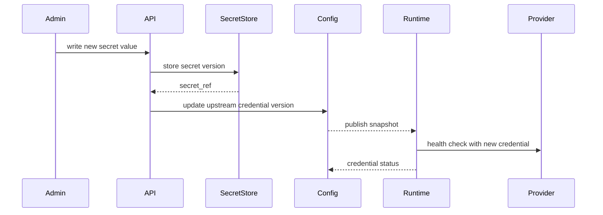
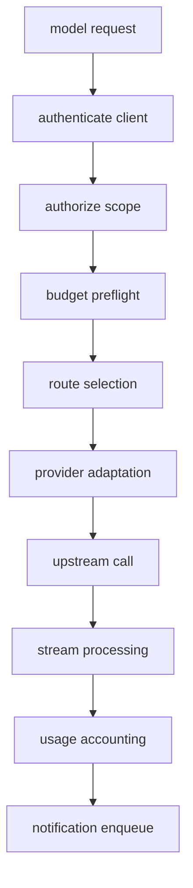

# Security, Observability, And Operations

Status: design draft for review.

This spec defines the operational baseline for the gateway. It covers
secret handling, redaction, audit evidence, telemetry, storage, deployment,
backup, incident response, and operational readiness.

The gateway is a high-value egress control point. A deployment can continue
without a web UI, but it cannot be considered enterprise-ready without clear
security and operations behavior.

## Goals

- Protect inbound API keys, caller credentials, upstream credentials, login
  provider secrets, OAuth tokens, and sensitive model payloads.
- Produce enough observability to debug routing, usage, provider health, and
  policy decisions.
- Keep audit evidence durable and redacted.
- Support predictable deployment and upgrade behavior.
- Define failure modes before implementation adds service dependencies.
- Keep the open-source gateway usable without a large vendor platform.

## Non-Goals

- Do not design a full SIEM product.
- Do not store raw prompts or raw completions by default.
- Do not implement payment compliance or tax reporting.
- Do not require Kubernetes for local or small production deployments.
- Do not rely on a future UI for operational safety.

## Security Boundary

The gateway protects four trust boundaries:

| Boundary             | Protected Material                                         |
| -------------------- | ---------------------------------------------------------- |
| inbound client       | API keys, caller credentials, scopes, tenant context       |
| admin control plane  | configuration, secret references, audit events             |
| upstream provider    | provider API keys, OAuth tokens, provider account metadata |
| observability/export | traces, logs, usage events, notifications, debug payloads  |

Runtime workers should treat all model request bodies and provider responses as
sensitive even when a deployment marks the data as non-PII.

## Credential Types

Credential classes:

| Credential                   | Direction                 | Storage                              |
| ---------------------------- | ------------------------- | ------------------------------------ |
| API key                      | caller to gateway         | hash only                            |
| login session cookie         | browser to gateway        | opaque token hash in session store   |
| login provider client secret | gateway to login provider | secret backend                       |
| upstream API key             | gateway to provider       | secret backend                       |
| Codex OAuth token            | gateway to Codex provider | secret backend with refresh metadata |
| webhook signing secret       | gateway to external sink  | secret backend                       |
| admin service token          | admin caller to gateway   | deployment identity provider or hash |

The config database stores references, metadata, hashes, and key prefixes. It
does not store raw secret values unless the deployment explicitly uses an
embedded development secret backend.

## Secret Backends

Supported backend classes:

| Backend                | Use                           |
| ---------------------- | ----------------------------- |
| `memory`               | tests only                    |
| `file`                 | local development only        |
| `database_encrypted`   | small self-hosted deployment  |
| `cloud_secret_manager` | managed production deployment |
| `external_vault`       | enterprise deployment         |

The API should expose a `SecretRef` abstraction so provider credentials can move
between backends without changing routing resources.

## SecretRef

Secret reference fields:

| Field         | Meaning                                                           |
| ------------- | ----------------------------------------------------------------- |
| `secret_ref`  | opaque reference string                                           |
| `backend`     | configured secret backend                                         |
| `scope_kind`  | tenant, organization, system                                      |
| `scope_id`    | owning scope                                                      |
| `purpose`     | upstream credential, login provider, webhook signing, OAuth token |
| `version`     | backend version if available                                      |
| `created_at`  | creation time                                                     |
| `rotated_at`  | last rotation time                                                |
| `expires_at`  | optional expiry                                                   |
| `fingerprint` | non-secret digest for audit                                       |

`secret_ref` values should be treated as sensitive metadata. They are safer than
raw secrets, but they can still reveal provider or tenant structure.

## Secret Rotation

Rotation flow:

Rotation policy should support:

- staged rotation with both old and new secret temporarily valid
- immediate revocation for compromised credentials
- scheduled expiration reminders
- validation before promotion when provider supports low-cost health checks
- audit events without secret material

## API Key Hashing

API keys and bearer caller credentials should be stored as salted hashes.

Required metadata:

| Field            | Meaning                          |
| ---------------- | -------------------------------- |
| `key_prefix`     | short display prefix             |
| `hash_algorithm` | hash algorithm                   |
| `hash_version`   | version for future rehash        |
| `last_used_at`   | last accepted request            |
| `last_used_ip`   | optional redacted remote address |
| `status`         | active, disabled, expired        |

Key lookup can use the prefix to narrow candidates, then constant-time hash
comparison for verification.

## Redaction Policy

Redaction policy applies to logs, traces, audit events, notification payloads,
debug captures, and admin read APIs.

Redaction levels:

| Level                      | Behavior                                                 |
| -------------------------- | -------------------------------------------------------- |
| `metadata_only`            | no prompt or completion text                             |
| `structured_safe`          | include safe counters and selected ids                   |
| `sampled_redacted_payload` | include truncated payload after filters                  |
| `explicit_capture`         | capture raw payload only with short-lived admin approval |

Default production level should be `metadata_only`.

## Sensitive Fields

Always redact:

- authorization headers
- provider API keys
- OAuth access tokens
- OAuth refresh tokens
- login authorization codes and login session cookies
- webhook signing secrets
- cookies
- raw API keys or caller credentials
- raw provider error bodies unless parsed and redacted
- prompt text unless explicit capture is enabled
- completion text unless explicit capture is enabled
- tool outputs unless policy classifies them as safe

The redaction library should be shared by runtime logging, admin audit, and
notification serialization.

## Debug Capture

Debug capture is useful but dangerous.

Requirements:

- disabled by default
- scoped by tenant, organization, project, credential, alias, or request id
- short retention window
- explicit actor and reason
- redaction policy applied before storage
- separate permission from ordinary viewer access
- notification or audit event when enabled and disabled

Raw capture should be avoided in the open-source default configuration.

## Audit Evidence

Audit evidence classes:

| Class              | Examples                                          |
| ------------------ | ------------------------------------------------- |
| admin mutation     | route policy changed, credential disabled         |
| runtime decision   | route target selected, candidate filtered         |
| security event     | invalid credential, denied scope, secret rotation |
| budget event       | threshold reached, request blocked                |
| notification event | webhook delivery failed                           |
| provider event     | endpoint degraded, credential expired             |

Audit records should include `tenant_id`, `organization_id` when applicable,
`request_id`, `trace_id`, actor or credential context, resource ids, and safe
diagnostics.

## Logging

Runtime logs should be structured.

Common log fields:

| Field                  | Meaning              |
| ---------------------- | -------------------- |
| `timestamp`            | event time           |
| `level`                | log severity         |
| `target`               | module or component  |
| `request_id`           | gateway request id   |
| `trace_id`             | distributed trace id |
| `tenant_id`            | tenant               |
| `organization_id`      | organization         |
| `project_id`           | project              |
| `model_alias`          | requested alias      |
| `routing_group_id`     | selected group       |
| `provider_endpoint_id` | selected endpoint    |
| `error_code`           | stable error code    |

Logs are for operators, not for reconstructing complete usage. Usage events and
route decisions are the durable evidence.

## Metrics

Metric families:

| Metric                         | Dimensions                                            |
| ------------------------------ | ----------------------------------------------------- |
| request count                  | tenant, org, project, member, alias, protocol, status |
| request latency                | protocol, alias, route group, endpoint, status        |
| time to first token            | protocol, alias, target, endpoint                     |
| stream duration                | alias, target, endpoint, status                       |
| token throughput               | alias, target, endpoint                               |
| provider error count           | endpoint, provider kind, error class                  |
| route filter count             | reason, policy, group                                 |
| failover count                 | group, from endpoint, to endpoint, reason             |
| budget block count             | scope, policy, reason                                 |
| rate limit count               | scope, policy                                         |
| dashboard freshness lag        | scope, rollup kind                                    |
| usage rollup lag               | tenant, org, project                                  |
| model observability rollup lag | alias, target, endpoint                               |
| notification delivery count    | sink, event type, status                              |
| config publication lag         | tenant, snapshot status                               |
| secret resolution failure      | backend, purpose                                      |

High-cardinality labels should be controlled. Avoid raw request ids and raw
model ids as unbounded metric labels unless the backend supports exemplars.

## Tracing

Trace spans:

Span attributes should use gateway-owned names:

- `gateway.tenant_id`
- `gateway.organization_id`
- `gateway.model_alias`
- `gateway.routing_group_id`
- `gateway.route_decision_id`
- `gateway.provider_endpoint_id`
- `gateway.error_code`

Do not place raw prompt or completion text in trace attributes.

## Health Model

Health is tracked at multiple layers:

| Layer               | Signal                                          |
| ------------------- | ----------------------------------------------- |
| process             | worker heartbeat, build info, config version    |
| database            | connectivity and migration version              |
| secret backend      | read/write capability                           |
| cache               | read/write and PubSub capability                |
| provider endpoint   | latency, error rate, auth failure, probe result |
| upstream credential | auth success, expiry, quota symptoms            |
| route target        | combined endpoint and model availability        |
| notification sink   | delivery success and retry backlog              |

Provider health should not be a single global bit. A provider endpoint can be
healthy for one model target and degraded for another.

## Readiness And Liveness

Liveness answers whether the process should be restarted. Readiness answers
whether it should receive traffic.

Readiness requirements:

- config snapshot loaded
- database connection available, unless worker is in read-only degraded mode
- secret backend available for selected credentials
- cache state available when rate limiting is configured fail-closed
- clock skew within configured tolerance

Workers may stay live while not ready.

## Degraded Modes

Degraded modes should be explicit:

| Mode                   | Behavior                                                                             |
| ---------------------- | ------------------------------------------------------------------------------------ |
| `config_read_only`     | serve last-known-good config, reject admin writes                                    |
| `usage_buffering`      | buffer usage only for scopes without active hard budget enforcement                  |
| `fail_limited_cache`   | allow bounded requests when cache is unavailable and policy permits fail-limited use |
| `notification_delayed` | outbox grows but runtime traffic continues                                           |
| `provider_degraded`    | router avoids affected targets                                                       |
| `budget_conservative`  | block or restrict traffic when budget state is stale                                 |

Each degraded mode should emit metrics, logs, and audit or operational events.

## Storage Components

V1 production baseline storage split:

| Component       | Data                                                                  |
| --------------- | --------------------------------------------------------------------- |
| PostgreSQL      | config, audit, usage events, ledger, outbox                           |
| Redis or Valkey | hot counters, config hints, health state, route stickiness            |
| secret backend  | raw upstream secrets, login provider client secrets, and OAuth tokens |
| object storage  | exports, optional redacted debug bundles                              |

Local development may run without Redis only in an explicit limited profile.
Production profiles should treat Redis or a compatible hot-state backend as
required for rate limits, budget hot counters, route stickiness, circuit
breakers, and config invalidation. PostgreSQL remains the source of truth.

## Database Requirements

Database requirements:

- transactional config writes and audit events
- append-only usage and audit tables
- idempotency constraints for usage events and admin writes
- indexed scope and time filters
- migration version tracking
- soft delete and retention support
- support for offline backup and restore

Config and runtime evidence can share one database initially, but table design
should keep high-volume usage writes separate from low-volume config writes.

### Durable Schema Groups

PostgreSQL tables should be grouped by write pattern and retention profile.

| Group                   | Example Tables                                                                            | Write Pattern                 | Required Constraints                                      |
| ----------------------- | ----------------------------------------------------------------------------------------- | ----------------------------- | --------------------------------------------------------- |
| identity                | tenants, organizations, org members, project members, principals, role bindings, API keys | low-volume admin writes       | tenant scope, unique stable ids, soft delete              |
| provider catalog        | provider endpoints, upstream credentials, model targets, model aliases, pricing documents | low-volume admin writes       | protocol compatibility, immutable used pricing versions   |
| routing config          | routing groups, route policies, provider grants, config bundles, config snapshots         | low-volume admin writes       | monotonic config versions, snapshot immutability          |
| runtime evidence        | route decisions, route attempt events, authorization decisions                            | request-volume appends        | request id indexes, append-only rows, retention partition |
| usage and ledger        | usage events, cost estimates, ledger buckets, reservations, ledger adjustments            | high-volume appends and folds | idempotency key, fixed-point units, pricing version       |
| dashboard rollups       | usage rollups, model observability rollups, member usage rollups, budget posture rollups  | derived writes                | source watermark, scope, time bucket, freshness metadata  |
| budget and quota policy | budget policies, quota policies, reset schedules, enforcement overrides                   | admin writes plus reads       | scope uniqueness, effective time ranges                   |
| notification delivery   | notification sinks, subscriptions, outbox events, delivery attempts                       | append and retry updates      | idempotency key, receiver event id, retry state           |
| audit                   | admin audit events, emergency actions, redacted diffs, policy publication records         | append-only                   | actor id, resource id, config version                     |
| operations              | migration history, worker heartbeats, config load status, incident markers                | low-volume operational writes | monotonic timestamps, worker id indexes                   |

High-volume tables should be partitionable by tenant and time before production
traffic moves through the gateway. Partitioning is an implementation detail, but
queries and retention jobs must not require scanning all tenants.

### Transaction Patterns

| Operation               | Transaction Requirement                                                              |
| ----------------------- | ------------------------------------------------------------------------------------ |
| admin mutation          | write resource change, redacted diff, audit event, and idempotency record atomically |
| config publish          | write immutable snapshot and advance version pointer atomically                      |
| route decision start    | write route decision header before first upstream attempt                            |
| route attempt append    | append attempt event without mutating prior attempt evidence                         |
| usage terminal write    | write usage event once per request/idempotency key                                   |
| ledger fold             | fold usage into aggregate bucket with idempotent processed-event marker              |
| notification enqueue    | append outbox event in same logical flow as usage/audit source                       |
| hard budget reservation | reserve or reject in one transaction when strong preflight mode is enabled           |

Any path that buffers writes during a dependency outage must document which
durability and budget guarantees are suspended. Hard-capped scopes cannot use
unbounded write buffering as a substitute for durable ledger writes.

## Cache Requirements

Cache uses:

- rate limit counters
- budget hot counters
- route stickiness keys
- circuit breaker state
- config invalidation messages
- short-lived provider health state

Cache loss behavior is policy-specific. Runtime code should not assume cache is
durable evidence.

Cache entries must have an owner, TTL, recovery path, and failure mode.

| Entry Type             | Owner            | Required TTL              | Recovery Path                         | Default Failure Mode       |
| ---------------------- | ---------------- | ------------------------- | ------------------------------------- | -------------------------- |
| rate limit counter     | rate policy      | policy window plus grace  | durable usage or fresh empty window   | policy-defined             |
| budget hot counter     | budget policy    | budget reset plus grace   | durable ledger bucket reconciliation  | fail closed for hard caps  |
| route stickiness       | route policy     | sticky policy TTL         | route without affinity                | degrade optimization       |
| provider health window | health policy    | short rolling window      | unknown until fresh probe or traffic  | health unknown             |
| circuit breaker        | endpoint policy  | breaker cool-down TTL     | config state and fresh attempt errors | closed only if policy says |
| config invalidation    | config publisher | message only              | database version polling              | converge through polling   |
| concurrency lease      | quota policy     | request deadline plus lag | lease expiry and terminal audit       | policy-defined             |

Redis or Valkey deployment must support the atomic operations required by the
enabled policies. If the selected deployment mode cannot provide the needed
atomic compare/increment or lease semantics, that policy cannot be enabled in
production.

## Backup And Restore

Backup scope:

| Data                    | Backup Requirement                                 |
| ----------------------- | -------------------------------------------------- |
| config database         | required                                           |
| audit events            | required                                           |
| usage events and ledger | required unless exported and intentionally dropped |
| outbox                  | required for delivery continuity if not expired    |
| secret backend          | required, separate procedure                       |
| object exports          | required according to retention policy             |

Restore must account for secret references. A database restore without the
matching secret backend can preserve metadata but cannot serve upstream traffic.

## Migration Policy

Migrations should be forward-only by default. Destructive migrations require a
documented data retention decision.

Migration requirements:

- migration id and checksum tracked
- schema migrations run before new worker version becomes ready
- long backfills can run separately from startup
- rollback plan documented for every release
- config schema version compatibility checked during startup
- usage export schema versioned independently from database schema

## Deployment Topologies

Supported topologies:

| Topology                                             | Use                          |
| ---------------------------------------------------- | ---------------------------- |
| single binary, embedded storage                      | local development only       |
| single service plus database                         | small self-hosted deployment |
| stateless workers plus database/cache/secret backend | production                   |
| separated admin and runtime workers                  | enterprise production        |
| multi-region runtime, regional control plane         | later phase                  |

Admin and runtime can live in one binary initially, but internal boundaries
should allow splitting.

## Runtime Worker Classes

Worker classes:

| Worker              | Responsibility                      |
| ------------------- | ----------------------------------- |
| ingress worker      | handles model requests              |
| admin worker        | handles config and evidence APIs    |
| accounting worker   | aggregates usage and budgets        |
| notification worker | delivers outbox events              |
| health worker       | probes endpoints and updates health |
| export worker       | writes usage export files           |

Small deployments can run all workers in one process. Large deployments can
scale runtime and notification workers independently.

## Multi-Region Direction

Multi-region introduces consistency decisions:

- config publication should be region-aware
- budget enforcement can be regional with central reconciliation or strongly
  centralized for strict caps
- route health is regional
- provider endpoints may be region-specific
- notification delivery should avoid duplicate cross-region deliveries
- usage event ids must be globally unique

The v1 gateway should not require multi-region, but schemas should not prevent
it.

## Provider Operations

Provider operations include:

- endpoint creation and validation
- upstream credential rotation
- health probes
- quota and rate-limit symptom detection
- provider incident annotations
- planned maintenance drain
- emergency disable

Provider health should combine passive request outcomes and optional active
probes. Active probes must be low-cost and respect provider terms.

## Budget Operations

Budget operations include:

- view current period usage
- inspect budget threshold history
- reset or replace policy
- force block or unblock scope
- export ledger details
- reconcile missing usage
- adjust cost for pricing correction

Every manual budget operation writes an audit event and can emit a notification
event.

## Notification Operations

Notification operations include:

- test sink delivery with synthetic event
- replay dead-lettered event
- pause sink
- resume sink
- rotate webhook signing secret
- inspect delivery attempts
- export dead letters

Replay must preserve the original event id unless an operator explicitly emits a
new synthetic event.

## Incident Response

Common incident actions:

| Incident            | Action                                                                   |
| ------------------- | ------------------------------------------------------------------------ |
| upstream key leaked | disable upstream credential, rotate secret, audit affected route targets |
| API key leaked      | disable API key, inspect recent usage, issue replacement                 |
| provider outage     | drain endpoint or route group, lower weights, monitor failover           |
| runaway spend       | force budget block, inspect usage by scope, notify external system       |
| bad config publish  | rollback snapshot, freeze config if needed                               |
| webhook storm       | pause sink, inspect backlog, adjust filters                              |
| usage ledger lag    | switch to conservative budget mode, run reconciliation                   |

Incident tools should be available through admin API and CLI, not only through
manual database edits.

## Data Retention Operations

Retention policy should be explicit per data class:

- usage events
- aggregated ledger buckets
- audit events
- route decisions
- notification outbox payloads
- delivery attempts
- debug captures
- provider health samples
- admin request logs

Retention jobs should produce deletion summaries and audit events. They should
not delete immutable evidence required by active budgets or unresolved exports.

## Compliance Posture

The gateway should make compliance possible without claiming a certification.

Capabilities:

- role-based admin access
- secret isolation
- immutable audit events
- redaction controls
- configurable retention
- data export
- deletion workflow for debug captures
- scoped provider grants

Certification, legal policy, and customer-specific data processing terms remain
deployment responsibilities.

## Configuration Defaults

Secure production defaults:

| Setting                         | Default                           |
| ------------------------------- | --------------------------------- |
| prompt capture                  | disabled                          |
| completion capture              | disabled                          |
| admin audit                     | enabled                           |
| runtime route decision evidence | enabled                           |
| webhook signing                 | required                          |
| secret backend                  | external or encrypted database    |
| cache failure for rate limits   | fail limited                      |
| budget stale behavior           | conservative when hard caps exist |
| debug capture retention         | short                             |
| route failover after content    | disabled                          |

Local development can use weaker defaults only under an explicit profile.

## Operational Dashboards

Minimum dashboards:

- request volume and error rate by alias and endpoint
- latency and time to first token by endpoint
- route target selection share by routing group
- provider error classes and failover count
- budget usage and threshold events
- cache and database health
- notification backlog and delivery failures
- config publication lag and runtime snapshot versions
- secret expiry and credential failure count

Dashboards should use metrics and audit data, not raw prompt capture.

## Alerting

Alert examples:

| Alert                         | Trigger                                  |
| ----------------------------- | ---------------------------------------- |
| provider endpoint unavailable | sustained error rate or probe failure    |
| credential auth failure       | repeated unauthorized upstream responses |
| config publication stalled    | snapshot not applied within threshold    |
| usage ledger lag              | usage event backlog exceeds threshold    |
| hard budget reached           | budget policy enters block state         |
| notification backlog          | pending delivery count too high          |
| secret expires soon           | credential expiry within threshold       |
| cache unavailable             | cache health check failure               |
| database migration mismatch   | worker schema incompatible               |

Alerts should include runbook links once runbooks exist.

## Runbook Requirements

Each production feature should include a short runbook:

- symptoms
- dashboard links or metric names
- likely causes
- safe immediate actions
- verification steps
- rollback steps
- escalation path

Runbooks can live in `docs/operations.md` once implementation begins.

## Acceptance Gates

- No raw upstream secret, OAuth token, webhook signing secret, or client
  credential can be returned by admin read APIs.
- Default logs, traces, usage events, audit events, and notifications exclude
  raw prompts and raw completions.
- Secret rotation can be audited and propagated to runtime workers.
- Runtime workers expose readiness, liveness, build info, and config version.
- Provider health is tracked per endpoint and can influence routing.
- Usage and audit stores support backup, restore, and retention.
- Notification failures are observable and replayable without blocking model
  serving.
- Production deployment can run admin, runtime, accounting, notification, and
  health workers as separate roles.
- Incident actions are available through admin API or CLI and emit audit events.
