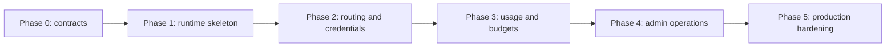

# Validation And Rollout

Status: design draft for review.

This spec defines how the gateway should move from design to implementation.
It translates the earlier gateway specs into phases, acceptance gates, test
coverage, compatibility rules, and review milestones.

The goal is not to freeze every implementation detail. The goal is to prevent
the gateway from becoming a thin proxy without enterprise controls or a
framework-heavy service without validated behavior.

## Goals

- Define implementation phases that can be reviewed independently.
- Keep the first build small enough to complete while preserving enterprise
  resource boundaries.
- Require tests for routing, budget, credential, usage, and notification
  behavior before calling a phase complete.
- Make compatibility with ordinary HTTP model clients explicit.
- Provide clear reviewer checklists for product, security, operations, and
  runtime behavior.

## Non-Goals

- Do not require the future web UI before gateway runtime validation.
- Do not build every provider family in the first phase.
- Do not require paid billing workflows.
- Do not migrate unrelated client SDK, application runtime, or developer CLI code
  into this repository.
- Do not use live provider credentials as the only validation path.

## Phase Overview

Each phase should leave the repository in a shippable state with tests and
documentation matching implemented behavior.

## Phase 0: Contracts And Skeleton Specs

Purpose:

- settle resource vocabulary
- confirm repository boundary
- define API and event schema direction
- create crate scaffolding without service dependencies

Expected artifacts:

- requirements and capability map
- gateway spec directory
- docs overview
- Rust module skeletons
- shared type sketches inside the gateway crate only
- test fixtures for config examples

Exit criteria:

- gateway does not depend on a specific application runtime
- platform service does not import gateway internals
- spec map covers tenancy, provider credentials, routing, runtime protocol,
  usage, admin, security, and rollout
- each required capability in `00-requirements.md` has an owning spec and
  completion evidence
- CI validates docs and crate skeleton

## Phase 1: Runtime Skeleton

Purpose:

- implement a minimal protocol ingress and forwarding path
- validate mount-path compatibility with common provider HTTP client config
- establish request ids, trace ids, and error envelope
- create fake provider harness for deterministic tests

Initial runtime scope:

| Capability        | Requirement                                              |
| ----------------- | -------------------------------------------------------- |
| protocol family   | one OpenAI-compatible family first                       |
| provider endpoint | static config or database-backed config                  |
| authentication    | one API key or caller credential type                    |
| forwarding        | endpoint, auth, headers, model replacement               |
| streaming         | pass-through with controlled error behavior              |
| usage             | record request terminal status, even if usage is missing |

Exit criteria:

- local test can send a model request through the gateway to a fake provider
- gateway returns stable error envelopes for auth, route, provider, and timeout
  failures
- request id appears in logs, response headers, and usage event
- no raw secrets are printed in logs
- docs explain the implemented subset

## Phase 2: Routing And Credentials

Purpose:

- make routing groups first-class
- separate inbound API keys and caller credentials from upstream credentials
- add organization provider grants
- validate route selection and failover behavior

Capabilities:

- provider endpoint CRUD or config bundle import
- upstream credential secret references
- model target and model alias resolution
- routing group membership
- weighted and priority route strategies
- health-aware filtering
- stream failover only before content starts
- route decision evidence

Exit criteria:

- route simulation explains selected, candidate, and filtered targets
- organization without provider grant cannot route to that provider
- disabled upstream credential is removed from candidate set
- provider endpoint health can suppress a target
- sticky routing can be enabled and disabled by policy
- failover tests prove no mid-content stream replay

## Phase 3: Usage, Cost, Budgets, And Notifications

Purpose:

- record durable usage events
- estimate provider cost
- enforce cost-only budget policy
- emit integration notifications

Capabilities:

- normalized usage extraction
- fixed-point cost estimates
- pricing SKU versioning
- usage event append path
- cost ledger aggregation
- dashboard rollups for organization, project, member, model, and provider
  views
- budget policy preflight and terminal evaluation
- rate/quota counters
- notification outbox
- signed webhooks

Exit criteria:

- every terminal request creates at most one usage event under retry
- cost estimates include pricing version and confidence
- hard budget block prevents new requests and writes audit evidence
- hard budget stale-state behavior is tested for ledger loss, cache loss, and
  fail-closed/fail-limited policy
- missing usage follows configured policy
- usage dashboard aggregates answer organization, project, and project member
  consumption questions
- model observability aggregates include latency, TTFT, throughput, errors,
  failover, route filtering, and usage confidence
- webhook payloads are redacted, signed, versioned, and idempotent
- notification delivery failure does not block model serving

## Phase 4: Admin Operations

Purpose:

- expose the gateway control plane
- support UI, CLI, and automation without changing resource semantics
- add audit and publication visibility

Capabilities:

- admin API for primary resources
- organization invitations and membership APIs
- project membership APIs
- GitHub OAuth App and OIDC login provider and session APIs
- dashboard and model observability read APIs
- idempotent mutations
- optimistic concurrency
- config validation
- config snapshot publication
- route simulation
- audit history
- emergency disable and rollback operations

Exit criteria:

- every mutation writes an audit event
- read APIs never return raw secret values
- route simulation works without upstream calls
- GitHub OAuth App login validates state, code exchange, stable user id, and
  verified email behavior
- OIDC login validates state, nonce, PKCE, issuer, audience, signature, and
  expiry
- user disable and session revocation block future admin/dashboard access
- dashboard APIs enforce tenant, organization, project, and project member
  scope permissions before querying aggregates
- config snapshot publication status is visible
- stale worker snapshot is detectable
- rollback publishes an earlier valid snapshot

## Phase 5: Production Hardening

Purpose:

- make the gateway operable under enterprise conditions
- scale runtime and background workers independently
- document production deployment paths

Capabilities:

- readiness and liveness endpoints
- metrics and trace instrumentation
- backup and restore procedure
- migration safety checks
- notification replay and dead-letter operations
- debug capture controls
- incident runbooks
- multi-worker deployment

Exit criteria:

- production profile uses an external or encrypted secret backend
- dashboards cover request, provider, route, budget, config, and notification
  health
- restore rehearsal succeeds in a test environment
- migration checks run in CI and at startup
- incident runbooks exist for credential leak, provider outage, runaway spend,
  bad config publish, and webhook delivery failure

## Test Strategy

Tests should be layered. Unit tests are not enough because routing and budget
behavior is graph-based and stateful.

| Test Type         | Purpose                                               |
| ----------------- | ----------------------------------------------------- |
| unit              | pure policy, parser, redaction, price calculation     |
| schema            | API and event schema compatibility                    |
| integration       | database, cache, secret backend, config snapshot      |
| fake provider     | deterministic runtime forwarding and streaming        |
| replay fixture    | provider response edge cases without live credentials |
| property          | route selection invariants and budget counters        |
| load              | concurrency, streaming, notification backlog          |
| failure injection | provider outage, cache loss, DB lag, webhook failure  |
| migration         | forward migration and rollback rehearsal              |
| docs              | examples and mdBook integrity                         |

Live provider tests can be optional and manually triggered. They should not be
required for ordinary CI.

Capability IDs from `00-requirements.md` should appear in test names, module
names, or test metadata once implementation starts. This keeps phase completion
auditable from CI output instead of relying on prose review alone.

## Route Test Matrix

Routing tests should cover:

| Case                          | Expected Result                         |
| ----------------------------- | --------------------------------------- |
| alias not found               | route error, no upstream call           |
| alias protocol mismatch       | route error with protocol diagnostic    |
| organization lacks grant      | authorization error                     |
| all targets disabled          | no route error                          |
| one target unhealthy          | choose healthy target                   |
| weighted targets              | selection distribution within tolerance |
| priority targets              | choose highest available priority       |
| budget pressure               | choose budget-allowed route or block    |
| sticky key present            | reuse eligible prior target             |
| sticky target invalid         | reselect and explain reason             |
| stream failure before content | failover allowed when policy permits    |
| stream failure after content  | no transparent replay                   |

## Credential Test Matrix

Credential tests should cover:

| Case                               | Expected Result                        |
| ---------------------------------- | -------------------------------------- |
| invalid client key                 | authentication error                   |
| disabled client key                | authentication error and audit event   |
| expired client key                 | authentication error                   |
| API key lacks required action      | authorization error                    |
| upstream key missing               | route target filtered                  |
| upstream key disabled              | route target filtered                  |
| upstream key rotated               | new snapshot uses new secret reference |
| secret backend unavailable         | behavior follows readiness policy      |
| Codex OAuth token refresh succeeds | credential remains eligible            |
| Codex OAuth token refresh fails    | credential degraded or filtered        |

## Budget Test Matrix

Budget tests should cover:

| Case                                    | Expected Result                                  |
| --------------------------------------- | ------------------------------------------------ |
| below soft threshold                    | request allowed                                  |
| soft threshold crossed                  | request allowed and notification emitted         |
| hard threshold crossed                  | new request blocked                              |
| terminal usage exceeds remaining budget | ledger records event and future requests blocked |
| missing usage allowed                   | event recorded with missing confidence           |
| missing usage required                  | route filtered or request rejected               |
| pricing missing                         | cost confidence marks unpriced                   |
| ledger aggregation delayed              | reconciliation restores aggregate                |
| manual adjustment                       | budget total includes adjustment                 |
| period reset                            | new window starts without deleting events        |

## Membership And Dashboard Test Matrix

Membership and dashboard tests should cover:

| Case                              | Expected Result                                      |
| --------------------------------- | ---------------------------------------------------- |
| first user bootstrap              | default organization is created and assigned         |
| invite user to organization       | invitation creates pending membership                |
| accept invitation                 | user becomes active organization member              |
| revoke invitation                 | invitation cannot be accepted                        |
| remove organization member        | future access denied, historical usage remains       |
| add user to project               | project member role controls project APIs            |
| remove project member             | future project access denied                         |
| project member reads own usage    | own project usage returned when policy permits       |
| project admin reads member usage  | all project member usage returned                    |
| organization admin reads projects | organization dashboard includes authorized projects  |
| unauthorized dashboard scope      | authorization error before querying aggregates       |
| retained historical membership    | old usage still attributes to removed project member |

## Login And User Management Test Matrix

Login and user management tests should cover:

| Case                          | Expected Result                                       |
| ----------------------------- | ----------------------------------------------------- |
| GitHub OAuth App login start  | state and optional PKCE verifier are created          |
| GitHub OAuth App callback     | code exchange and user API identity lookup succeed    |
| GitHub no verified email      | email-targeted invitation and domain allowlist reject |
| GitHub subject stability      | email/login changes do not create a second identity   |
| GitHub Enterprise Server URLs | configured auth, token, user, and email APIs are used |
| GitHub token persistence      | login access token is discarded after identity lookup |
| OIDC login start              | state, nonce, and PKCE verifier are created           |
| callback with wrong state     | login rejected and attempt consumed or invalidated    |
| callback with wrong nonce     | login rejected                                        |
| callback with wrong issuer    | login rejected                                        |
| callback with wrong audience  | login rejected                                        |
| callback with expired token   | login rejected                                        |
| unknown signing key           | JWKS refresh attempted, then login rejected if absent |
| first bootstrap login         | tenant owner, default organization, and project exist |
| invite-only unknown user      | login enters denied or pending setup state            |
| invitation accepted           | principal, org member, default org, project roles set |
| user disabled                 | active sessions revoked and new sessions rejected     |
| logout                        | current session revoked                               |
| session cookie flags          | HttpOnly, Secure, and SameSite policy applied         |
| CSRF missing on mutation      | browser mutation rejected                             |
| account link                  | fresh auth required and external identity linked      |
| account link by email only    | rejected unless explicit verified-email policy        |

## Model Observability Test Matrix

Model observability tests should cover:

| Case                              | Expected Result                                      |
| --------------------------------- | ---------------------------------------------------- |
| alias dashboard by project        | usage, cost, latency, and error aggregates returned  |
| target dashboard by operator      | upstream target health and attempts returned         |
| provider endpoint redacted view   | organization/project viewer sees safe provider label |
| provider endpoint privileged view | operator sees endpoint health and credential status  |
| route failover                    | alias dashboard shows failover count and route path  |
| filtered route target             | dashboard shows safe filter reason aggregate         |
| missing provider usage            | usage confidence counts include missing events       |
| rollup lag                        | dashboard response includes freshness warning        |
| retention boundary                | response marks partial data                          |
| prompt-bearing event              | dashboard omits raw prompt and completion            |

## Notification Test Matrix

Notification tests should cover:

| Case                            | Expected Result                         |
| ------------------------------- | --------------------------------------- |
| webhook succeeds                | delivery marked delivered               |
| webhook returns retryable error | retry scheduled                         |
| webhook returns permanent error | dead-letter after policy                |
| sink paused                     | event remains pending or paused         |
| event replayed                  | same event id preserved                 |
| signing secret rotated          | new deliveries use new secret version   |
| batch delivery                  | batch envelope is versioned and signed  |
| payload redaction               | no raw prompts, completions, or secrets |

## Security Test Matrix

Security tests should cover:

| Case                             | Expected Result                             |
| -------------------------------- | ------------------------------------------- |
| admin read upstream credential   | no raw secret returned                      |
| audit diff after secret rotation | secret value absent                         |
| log provider auth failure        | authorization header absent                 |
| trace model request              | prompt and completion absent                |
| debug capture disabled           | no payload capture                          |
| debug capture enabled            | scoped, redacted, audited, retained briefly |
| webhook payload                  | no raw request body or upstream headers     |
| config bundle import             | no embedded raw secrets accepted            |

## Protocol Compatibility

The gateway should remain compatible with common HTTP model client behavior:

- clients can configure gateway as a normal HTTP model endpoint
- clients can mount provider API roots beneath a gateway base URL
- gateway does not require importing client runtime crates
- gateway request headers can carry optional session or trace metadata
- provider-specific runtime adaptation lives in gateway, not in callers

Compatibility tests should use HTTP-level fixtures, not internal Rust crate
calls.

## Schema Compatibility

Public schemas:

- admin API resources
- runtime error envelopes
- usage events
- notification events
- route decision records
- audit events
- config bundles
- export records

Schema rules:

- adding optional fields is compatible
- removing fields requires a new schema version
- changing field meaning requires a new schema version
- enum values can be added only when clients are expected to ignore unknown
  values or version negotiation is present
- examples must be redacted

## Provider Validation Without Live Secrets

The repository should use fake providers for CI.

Fake provider capabilities:

- configurable latency
- configurable stream chunks
- configurable usage payloads
- configurable errors
- auth header inspection without logging secrets
- deterministic request recording
- provider-family response variants

Replay fixtures can supplement fake providers for edge cases, but runtime
correctness should not depend on live upstream credentials in CI.

## Documentation Validation

Docs and specs should stay aligned with implementation.

Validation expectations:

- docs navigation includes user-facing gateway page
- spec map lists all gateway spec chapters
- examples compile or are clearly marked as illustrative
- resource names match code names when implementation exists
- docs avoid paid billing terminology
- docs state that upstream provider OAuth support is Codex-only in v1

## Review Checklist: Product Boundary

Reviewers should confirm:

- gateway is model egress, not an application runtime
- gateway is cost tracking and budget control, not billing
- route groups are first-class
- organizations can be granted provider availability
- administrators manage upstream credentials
- future web UI is not implied by current docs
- open-source users can run without a commercial platform

## Review Checklist: Security

Reviewers should confirm:

- secret values are write-only
- API keys and bearer caller credentials are hashed
- prompt and completion capture is disabled by default
- audit events are append-only
- webhook signing is required for active webhooks
- Codex OAuth token handling is not generic upstream provider OAuth
- debug capture has scope, permission, retention, and audit

## Review Checklist: Runtime

Reviewers should confirm:

- no route crosses incompatible protocol families
- route decisions explain filtering and selection
- stream failover does not replay after content starts
- usage events are idempotent
- budgets are enforced at the documented points
- provider health can affect routing
- runtime errors use stable codes

## Review Checklist: Operations

Reviewers should confirm:

- config snapshots are immutable
- runtime workers can report loaded config version
- rollback is defined
- backup and restore cover database and secret backend
- notification backlog is observable
- incident actions are available outside direct database edits
- migrations have startup checks

## Rollout In A Deployment

Suggested deployment order:

01. Install gateway in observe-only mode with one fake or non-critical provider.
02. Add provider endpoints and upstream credentials.
03. Add model aliases with low-risk routing groups.
04. Enable usage events and cost estimates.
05. Enable notifications to internal test sink.
06. Enable soft budget thresholds.
07. Enable hard budget blocks for one non-critical project.
08. Expand provider grants and route policies by organization.
09. Enable production notification sinks.
10. Move high-volume traffic after dashboards and runbooks are ready.

Observe-only mode means the gateway records decisions and usage but avoids
strict blocking except for authentication and explicit disabled resources.

## Migration From Direct Provider Use

When a client currently calls providers directly:

1. Create provider endpoint and upstream credential.
2. Create model target matching the upstream model id.
3. Create model alias matching the old client model name or a new gateway name.
4. Create routing group with a single target.
5. Create API key with allowed model and REST action grants.
6. Point the client base URL at the gateway.
7. Compare provider responses and usage accounting.
8. Enable budget and notification policy.

This migration should not require client code changes when the client already
supports custom HTTP model endpoints.

## Migration From Earlier Gateway Builds

Early gateway builds should include migration rules:

- resource ids remain stable
- route group names can change without breaking ids
- config snapshot version increases monotonically
- usage event schema versions are preserved
- old notification payload versions remain documented until retired
- deleted resources stay tombstoned through retention

Breaking changes require a migration note and a compatibility window.

## Release Readiness

A gateway release candidate needs:

- all phase exit criteria for included capabilities
- generated API schema artifacts if admin API exists
- database migrations checked
- docs and specs updated
- fake provider tests passing
- no secret leakage in logs under test fixtures
- release notes listing schema or config changes
- rollback procedure documented

Release notes should call out operational actions such as migrations, secret
backend changes, and config schema changes.

## Open Questions For Review

Open questions that should be resolved before implementation hardens:

- Should config snapshots be tenant-partitioned or global in the first build?
- Which provider family is the first non-fake implementation?
- How much of the admin API should be hand-written before generating client
  SDKs?
- Should config bundles be the primary local development bootstrap path?

Framework decisions resolved by `memos/2026-06-24-framework-selection.md`:

- PostgreSQL is the v1 source-of-truth database.
- Redis or Valkey is the v1 production hot-state backend.
- Hard budget stale-state defaults to fail-closed unless policy declares a
  bounded fail-limited emergency allowance.

These questions do not block the spec review, but they should be answered
before Phase 2 is considered implementation-complete.

## Minimum Complete Gateway

The minimum complete gateway is not the smallest proxy. It must include:

- tenant and organization resource boundaries
- default organization, organization membership, and project membership
- GitHub OAuth App login, OIDC login, opaque server-side sessions, and user
  management APIs
- API key authentication
- upstream credential references
- provider endpoint and model target catalog
- model alias resolution
- routing group with at least one real strategy
- route decision evidence
- usage event recording
- immutable usage attribution by project member when applicable
- organization, project, project member, and model dashboard read APIs
- cost estimate with pricing version or unpriced confidence
- budget policy hook, even if only one policy mode is implemented
- redacted logs and audit events
- admin validation path
- fake provider CI tests

Without these pieces, the implementation should be described as a prototype,
not as the gateway.

## Acceptance Gates

- Gateway spec coverage matches the enterprise model described in these specs
  and uses gateway-owned terminology and resource boundaries.
- Multi-tenancy, organization provider grants, admin-managed credentials,
  user-owned and service-owned API keys, REST API permissions, routing groups,
  router strategies, cost-only budgets, GitHub OAuth App login, OIDC login,
  user management,
  organization/project membership, project member usage attribution, scoped
  dashboards, model observability, Codex-only upstream OAuth, and notifications
  are all covered by implementation phases and tests.
- CI can validate docs, schemas, and Rust crates without live provider secrets.
- Each phase has objective exit criteria.
- Security and operational gates are explicit before production deployment.
- Client compatibility is expressed through HTTP behavior, not crate
  dependency.
