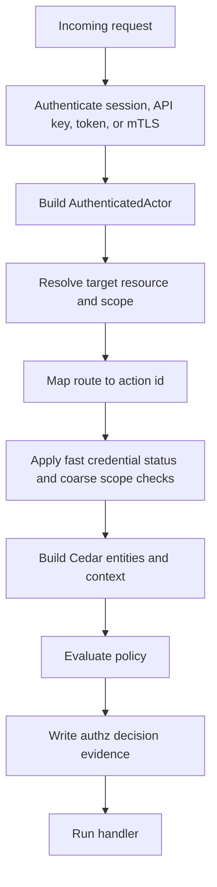

# Authorization And API Keys

Status: design draft for review.

This spec tightens the gateway authorization model. It replaces any flat
`virtual key` concept with user-owned or service-owned API keys, and it makes
REST API authorization part of the same permission system as model invocation.

The main design rule is simple: every gateway request is authorized as
`principal, action, resource, context`, regardless of whether the request enters
through model protocol ingress or the REST admin API.

## Design Constraints

The authorization design follows these constraints:

- `ClientCredential` is an internal authentication resolution snapshot; API
  keys are first-class persistent resources and may call model ingress or REST
  APIs when policy permits.
- Admin roles, API key grants, service account grants, and model invocation
  scopes use one action/resource vocabulary.
- REST API resources have an explicit action matrix.
- Authorization engine selection and policy validation are part of the v1
  contract.
- List endpoints need item-level authorization, not only route-level access.
- API keys need an owner model so a key can be revoked, audited, narrowed, and
  rotated independently from the owning user or service account.

## Decisions

- Public product terminology is `API key`, not `virtual key`.
- `ApiKey` is a first-class gateway credential and may authenticate both model
  protocol requests and REST API requests.
- `ClientCredential` can remain an internal umbrella for API key, service token,
  mTLS subject, and future credential types, but public docs and REST resources
  should use `ApiKey` for bearer-style keys.
- A key is owned by a `UserPrincipal` or `ServiceAccount` and is optionally bound
  to a project.
- A key can never exceed the owner principal's effective permissions.
- Human sessions, service tokens, mTLS identities, and API keys all resolve to
  one `AuthenticatedActor`.
- Authorization decisions use one engine and one action/resource vocabulary for
  model ingress and REST APIs.
- v1 should use an embedded Rust authorization engine. External authorization
  services can be optional later integrations, not mandatory gateway
  dependencies.

## Recommended Library Direction

Use Cedar as the v1 embedded policy engine.

| Candidate            | Fit                                                                                                                     | Decision                                                                                                                             |
| -------------------- | ----------------------------------------------------------------------------------------------------------------------- | ------------------------------------------------------------------------------------------------------------------------------------ |
| Cedar `cedar-policy` | Rust-native policy language and evaluator, schema validation, RBAC/ABAC-friendly, policy separate from application code | recommended v1 default                                                                                                               |
| Casbin               | mature multi-language library, supports RBAC/ABAC/ReBAC-style models and adapters                                       | viable fallback for simpler deployments, but less typed around resource schemas                                                      |
| OpenFGA              | strong relationship-based authorization system with tuples and central store                                            | good optional backend later for multi-service ReBAC, not a v1 hard dependency                                                        |
| SpiceDB/Authzed      | mature Zanzibar-style authorization service                                                                             | good later option, but Rust support is community-oriented and it adds an external service dependency                                 |
| OPA                  | powerful general policy engine and sidecar/WASM pattern                                                                 | too broad for v1 gateway authorization unless operators already standardize on OPA                                                   |
| Oso                  | embedded policy engine with Rust bindings                                                                               | not recommended for v1 because the Rust crate is comparatively early and upstream project signals are weaker than Cedar for this use |
| Gatehouse            | Rust-native in-process RBAC/ABAC/ReBAC policy composition                                                               | promising, but too new to make the primary enterprise baseline now                                                                   |

The gateway should wrap the chosen engine behind an internal
`AuthorizationEngine` interface so future OpenFGA, SpiceDB, or OPA integrations
can be added without rewriting REST handlers.

## Library Usage Boundaries

Cedar should own authorization decisions, not authentication or secret storage.

Use these libraries around the authorization boundary:

| Area                  | Library Direction                                                |
| --------------------- | ---------------------------------------------------------------- |
| API key hashing       | `argon2` with PHC string storage and per-key salt                |
| Secret wrappers       | `secrecy` for in-memory secret values                            |
| Secret zeroing        | `zeroize` through `secrecy` and direct zeroing where needed      |
| Constant-time compare | `subtle` or `constant_time_eq` for fixed-size secret comparisons |
| Policy evaluation     | `cedar-policy`                                                   |
| Policy validation     | Cedar schema validation during config publication                |

The key hash is for authentication. Cedar evaluates permissions after the actor
is authenticated.

## Actor Model

Every request resolves an `AuthenticatedActor`.

| Field              | Meaning                                                            |
| ------------------ | ------------------------------------------------------------------ |
| `actor_id`         | stable actor id for audit                                          |
| `actor_kind`       | `user`, `service_account`, `api_key`, `internal_service`, `system` |
| `tenant_id`        | tenant boundary                                                    |
| `organization_id`  | optional organization boundary                                     |
| `project_id`       | optional project boundary                                          |
| `principal_id`     | owning user or service account when present                        |
| `api_key_id`       | API key used for authentication when present                       |
| `credential_kind`  | `api_key`, `service_token`, `mtls_subject`, `session`, `system`    |
| `auth_strength`    | relative strength for sensitive actions                            |
| `expires_at`       | actor credential expiry when present                               |
| `effective_groups` | optional group ids from login provider                             |
| `request_id`       | gateway request id                                                 |

An API key actor is not anonymous. It acts on behalf of its owner principal, but
its key grants narrow what the owner can do through that key.

## API Key Resource

`ApiKey` replaces virtual-key thinking. It is not an upstream provider
credential and it is not a billing object.

Fields:

| Field                | Meaning                                                |
| -------------------- | ------------------------------------------------------ |
| `api_key_id`         | stable id                                              |
| `tenant_id`          | owning tenant                                          |
| `organization_id`    | optional organization                                  |
| `project_id`         | optional project binding                               |
| `owner_principal_id` | user or service account owner                          |
| `name`               | human label                                            |
| `key_prefix`         | visible prefix for lookup and display                  |
| `secret_hash`        | salted Argon2 hash or equivalent password-hash string  |
| `hash_version`       | hashing profile version                                |
| `status`             | `active`, `disabled`, `expired`, `rotating`, `deleted` |
| `grant_policy_ids`   | policies that narrow this key                          |
| `allowed_actions`    | optional coarse action allowlist for fast prefilter    |
| `allowed_resources`  | optional coarse resource allowlist for fast prefilter  |
| `rate_policy_id`     | optional rate policy                                   |
| `budget_policy_id`   | optional budget policy                                 |
| `expires_at`         | optional expiry                                        |
| `last_used_at`       | last accepted request                                  |
| `last_used_ip_hash`  | optional privacy-preserving remote address hash        |
| `created_by`         | creating actor                                         |
| `created_at`         | creation timestamp                                     |
| `updated_at`         | last metadata update                                   |

The raw key value is returned only once. All read APIs return metadata only.

### API Key Verification Pipeline

API key verification must be bounded and safe under abuse.

1. Parse key format and reject malformed values before database lookup.
2. Extract `key_prefix` and load a small candidate set scoped by prefix.
3. Reject disabled, deleted, expired, or not-yet-active candidates before
   expensive hash verification when status is available.
4. Verify the presented secret against the stored PHC hash.
5. Apply tenant, organization, project, and allowed action prefilters.
6. Check failed-auth rate policy before returning detailed retry guidance.
7. Build `AuthenticatedActor` only after hash verification succeeds.
8. Schedule `last_used_at` and `last_used_ip_hash` updates out of the hot path
   or batch them so accepted traffic does not create a write bottleneck.

The gateway may cache prefix lookup metadata, but it must not accept a cached
success for a disabled, rotated, or expired key. Any positive cache must be
short-lived, scoped to key version, and invalidated by config publication or
credential status changes.

## API Key Grant Modes

Grant modes:

| Mode                 | Behavior                                                           |
| -------------------- | ------------------------------------------------------------------ |
| `owner_narrowed`     | key can do only actions allowed to owner and key policy            |
| `service_account`    | key acts as a service account principal                            |
| `project_bound`      | key cannot leave its project even if owner has broader rights      |
| `automation_limited` | key can run selected admin/config operations without human session |
| `break_glass`        | short-lived emergency key, higher audit and approval requirements  |

Default mode should be `owner_narrowed`.

## Authorization Request

Every protected operation constructs the same request shape:

| Field       | Meaning                        |
| ----------- | ------------------------------ |
| `principal` | authenticated actor entity     |
| `action`    | stable gateway action id       |
| `resource`  | protected resource entity      |
| `context`   | request context used by policy |

Context fields:

- request id
- tenant id
- organization id
- project id
- organization member id when applicable
- project member id when applicable
- protocol family
- source network class
- user agent class
- API key id when present
- requested model alias when present
- route policy id when present
- config version
- emergency mode flag
- debug capture flag
- current time

Policy must not depend on raw prompt text, raw completion text, upstream secret
values, or raw API key values.

## Action Namespace

Actions should be explicit and stable.

Model actions:

| Action                     | Resource                 |
| -------------------------- | ------------------------ |
| `gateway.model.invoke`     | `ModelAlias`             |
| `gateway.model.stream`     | `ModelAlias`             |
| `gateway.model.native`     | `ProviderNativeEndpoint` |
| `gateway.route.debug.read` | `RouteDecision`          |

Admin/config actions:

| Action                                 | Resource                  |
| -------------------------------------- | ------------------------- |
| `gateway.tenant.read`                  | `Tenant`                  |
| `gateway.tenant.write`                 | `Tenant`                  |
| `gateway.identity_provider.read`       | `IdentityProvider`        |
| `gateway.identity_provider.write`      | `IdentityProvider`        |
| `gateway.user.read`                    | `UserPrincipal`           |
| `gateway.user.write`                   | `UserPrincipal`           |
| `gateway.user.disable`                 | `UserPrincipal`           |
| `gateway.external_identity.read`       | `ExternalIdentity`        |
| `gateway.external_identity.unlink`     | `ExternalIdentity`        |
| `gateway.session.read`                 | `AuthSession`             |
| `gateway.session.revoke`               | `AuthSession`             |
| `gateway.session.update`               | `AuthSession`             |
| `gateway.service_account.read`         | `ServiceAccount`          |
| `gateway.service_account.write`        | `ServiceAccount`          |
| `gateway.service_account.disable`      | `ServiceAccount`          |
| `gateway.organization.read`            | `Organization`            |
| `gateway.organization.write`           | `Organization`            |
| `gateway.organization_member.read`     | `OrganizationMember`      |
| `gateway.organization_member.write`    | `OrganizationMember`      |
| `gateway.organization_invite.read`     | `OrganizationInvite`      |
| `gateway.organization_invite.create`   | `OrganizationInvite`      |
| `gateway.organization_invite.manage`   | `OrganizationInvite`      |
| `gateway.organization_invite.accept`   | `OrganizationInvite`      |
| `gateway.project.read`                 | `Project`                 |
| `gateway.project.write`                | `Project`                 |
| `gateway.project_member.read`          | `ProjectMember`           |
| `gateway.project_member.write`         | `ProjectMember`           |
| `gateway.caller_credential.read`       | `CallerCredential`        |
| `gateway.caller_credential.disable`    | `CallerCredential`        |
| `gateway.action_grant.read`            | `ActionGrant`             |
| `gateway.action_grant.write`           | `ActionGrant`             |
| `gateway.provider_endpoint.read`       | `ProviderEndpoint`        |
| `gateway.provider_endpoint.write`      | `ProviderEndpoint`        |
| `gateway.upstream_credential.read`     | `UpstreamCredential`      |
| `gateway.upstream_credential.write`    | `UpstreamCredential`      |
| `gateway.upstream_credential.rotate`   | `UpstreamCredential`      |
| `gateway.secret_ref.read`              | `SecretRef`               |
| `gateway.secret_ref.write`             | `SecretRef`               |
| `gateway.secret_ref.locator.read`      | `SecretRef`               |
| `gateway.codex_oauth_connection.read`  | `CodexOAuthConnection`    |
| `gateway.codex_oauth_connection.write` | `CodexOAuthConnection`    |
| `gateway.codex_oauth_session.read`     | `CodexOAuthSession`       |
| `gateway.codex_oauth_session.start`    | `CodexOAuthSession`       |
| `gateway.codex_oauth_session.revoke`   | `CodexOAuthSession`       |
| `gateway.codex_oauth_refresh.read`     | `CodexOAuthRefreshStatus` |
| `gateway.model_target.read`            | `ModelTarget`             |
| `gateway.model_target.write`           | `ModelTarget`             |
| `gateway.model_alias.read`             | `ModelAlias`              |
| `gateway.model_alias.write`            | `ModelAlias`              |
| `gateway.pricing_sku.read`             | `PricingSku`              |
| `gateway.pricing_sku.write`            | `PricingSku`              |
| `gateway.routing_group.read`           | `RoutingGroup`            |
| `gateway.routing_group.write`          | `RoutingGroup`            |
| `gateway.route_policy.read`            | `RoutePolicy`             |
| `gateway.route_policy.write`           | `RoutePolicy`             |
| `gateway.provider_grant.read`          | `ProviderGrant`           |
| `gateway.provider_grant.write`         | `ProviderGrant`           |
| `gateway.catalog_import.create`        | `CatalogImport`           |
| `gateway.catalog_import.read`          | `CatalogImport`           |
| `gateway.quota_policy.read`            | `QuotaPolicy`             |
| `gateway.quota_policy.write`           | `QuotaPolicy`             |
| `gateway.admission_policy.read`        | `AdmissionPolicy`         |
| `gateway.admission_policy.write`       | `AdmissionPolicy`         |
| `gateway.redaction_policy.read`        | `RedactionPolicy`         |
| `gateway.redaction_policy.write`       | `RedactionPolicy`         |
| `gateway.api_key.create`               | `ApiKey`                  |
| `gateway.api_key.read`                 | `ApiKey`                  |
| `gateway.api_key.rotate`               | `ApiKey`                  |
| `gateway.api_key.disable`              | `ApiKey`                  |
| `gateway.role.read`                    | `RoleDefinition`          |
| `gateway.role.write`                   | `RoleDefinition`          |
| `gateway.role_binding.read`            | `RoleBinding`             |
| `gateway.role_binding.write`           | `RoleBinding`             |
| `gateway.policy.read`                  | `PolicyAttachment`        |
| `gateway.policy.write`                 | `PolicyAttachment`        |
| `gateway.budget_policy.read`           | `BudgetPolicy`            |
| `gateway.budget_policy.write`          | `BudgetPolicy`            |
| `gateway.config.read`                  | `ConfigSnapshot`          |
| `gateway.config.apply`                 | `ConfigBundle`            |
| `gateway.config.publish`               | `ConfigSnapshot`          |
| `gateway.config.rollback`              | `ConfigSnapshot`          |
| `gateway.route_simulation.run`         | `RouteSimulation`         |
| `gateway.catalog_import.create`        | `CatalogImport`           |
| `gateway.catalog_import.read`          | `CatalogImport`           |
| `gateway.maintenance_window.read`      | `MaintenanceWindow`       |
| `gateway.maintenance_window.write`     | `MaintenanceWindow`       |

Evidence and operations actions:

| Action                                   | Resource                                  |
| ---------------------------------------- | ----------------------------------------- |
| `gateway.usage.read`                     | `UsageEvent` or ledger scope              |
| `gateway.usage.summary.read`             | usage aggregate scope                     |
| `gateway.usage.event.read`               | usage event rows                          |
| `gateway.realtime_dashboard.read`        | Redis-compatible realtime dashboard scope |
| `gateway.dashboard.tenant.read`          | tenant dashboard scope                    |
| `gateway.dashboard.organization.read`    | organization dashboard scope              |
| `gateway.dashboard.project.read`         | project dashboard scope                   |
| `gateway.dashboard.project_member.read`  | project member dashboard scope            |
| `gateway.dashboard.api_key.read`         | API key dashboard scope                   |
| `gateway.dashboard.service_account.read` | service account dashboard scope           |
| `gateway.model_observability.read`       | `ModelAlias` or `ModelTarget`             |
| `gateway.provider_observability.read`    | `ProviderEndpoint`                        |
| `gateway.budget_dashboard.read`          | `BudgetPolicy` or budget scope            |
| `gateway.quota_dashboard.read`           | quota or rate-limit scope                 |
| `gateway.audit.read`                     | `AuditEvent`                              |
| `gateway.export.read`                    | export manifest                           |
| `gateway.export.create`                  | export job                                |
| `gateway.notification.read`              | `NotificationSink` or delivery            |
| `gateway.notification.write`             | `NotificationSink`                        |
| `gateway.notification_outbox.write`      | `NotificationOutboxEvent`                 |
| `gateway.observability_export.read`      | `OpenTelemetryExportConfig`               |
| `gateway.observability_export.write`     | `OpenTelemetryExportConfig`               |
| `gateway.health.read`                    | runtime health resource                   |
| `gateway.provider_health.override`       | `ProviderEndpoint`                        |
| `gateway.emergency.disable`              | credential, endpoint, or route resource   |
| `gateway.debug_capture.enable`           | debug capture policy                      |

No handler should invent action strings at runtime. Action ids belong in code,
schema, docs, and OpenAPI extensions.

## REST API Permission Matrix

REST endpoints require action checks before accessing storage.

| Endpoint Family                                                                        | Required Actions                                                                                                       |
| -------------------------------------------------------------------------------------- | ---------------------------------------------------------------------------------------------------------------------- |
| `/admin/v1/tenants/*`                                                                  | `gateway.tenant.read`, `gateway.tenant.write`                                                                          |
| `/admin/v1/identity-providers/*`                                                       | `gateway.identity_provider.read`, `gateway.identity_provider.write`                                                    |
| `/admin/v1/users/*`                                                                    | `gateway.user.read`, `gateway.user.write`, `gateway.user.disable`                                                      |
| `/admin/v1/users/{id}/external-identities/*`                                           | `gateway.external_identity.read`, `gateway.external_identity.unlink`                                                   |
| `/admin/v1/users/{id}/sessions/*`                                                      | `gateway.session.read`, `gateway.session.revoke`                                                                       |
| `/admin/v1/service-accounts/*`                                                         | `gateway.service_account.read`, `gateway.service_account.write`, `gateway.service_account.disable`                     |
| `/admin/v1/organizations/*`                                                            | `gateway.organization.read`, `gateway.organization.write`                                                              |
| `/admin/v1/organizations/{id}/members/*`                                               | `gateway.organization_member.read`, `gateway.organization_member.write`                                                |
| `/admin/v1/organizations/{id}/invitations/*`                                           | `gateway.organization_invite.read`, `gateway.organization_invite.create`, `gateway.organization_invite.manage`         |
| `/admin/v1/projects/*`                                                                 | `gateway.project.read`, `gateway.project.write`                                                                        |
| `/admin/v1/projects/{id}/members/*`                                                    | `gateway.project_member.read`, `gateway.project_member.write`                                                          |
| `/admin/v1/api-keys/*`                                                                 | `gateway.api_key.create`, `gateway.api_key.read`, `gateway.api_key.rotate`, `gateway.api_key.disable`                  |
| `/admin/v1/roles/*`                                                                    | `gateway.role.read`, `gateway.role.write`                                                                              |
| `/admin/v1/caller-credentials/*`                                                       | `gateway.caller_credential.read`, `gateway.caller_credential.disable`                                                  |
| `/admin/v1/action-grants/*`                                                            | `gateway.action_grant.read`, `gateway.action_grant.write`                                                              |
| `/admin/v1/provider-endpoints/*`                                                       | `gateway.provider_endpoint.read`, `gateway.provider_endpoint.write`                                                    |
| `/admin/v1/upstream-credentials/*`                                                     | `gateway.upstream_credential.read`, `gateway.upstream_credential.write`, `gateway.upstream_credential.rotate`          |
| `/admin/v1/secret-refs/*`                                                              | `gateway.secret_ref.read`, `gateway.secret_ref.write`, `gateway.secret_ref.locator.read` for strong-auth locator reads |
| `/admin/v1/codex/oauth/connections/*`                                                  | `gateway.codex_oauth_connection.read`, `gateway.codex_oauth_connection.write`                                          |
| `/admin/v1/codex/oauth/connections/{id}/sessions/*`                                    | `gateway.codex_oauth_session.read`, `gateway.codex_oauth_session.start`                                                |
| `/admin/v1/codex/oauth/sessions/*`                                                     | `gateway.codex_oauth_session.read`, `gateway.codex_oauth_session.revoke`                                               |
| `/admin/v1/codex/oauth/refresh-status/*`                                               | `gateway.codex_oauth_refresh.read`                                                                                     |
| `/admin/v1/provider-grants/*`                                                          | `gateway.provider_grant.read`, `gateway.provider_grant.write`                                                          |
| `/admin/v1/model-targets/*`                                                            | `gateway.model_target.read`, `gateway.model_target.write`                                                              |
| `/admin/v1/model-aliases/*`                                                            | `gateway.model_alias.read`, `gateway.model_alias.write`                                                                |
| `/admin/v1/pricing-skus/*`                                                             | `gateway.pricing_sku.read`, `gateway.pricing_sku.write`                                                                |
| `/admin/v1/routing-groups/*`                                                           | `gateway.routing_group.read`, `gateway.routing_group.write`                                                            |
| `/admin/v1/route-policies/*`                                                           | `gateway.route_policy.read`, `gateway.route_policy.write`                                                              |
| `/admin/v1/budget-policies/*`                                                          | `gateway.budget_policy.read`, `gateway.budget_policy.write`                                                            |
| `/admin/v1/quota-policies/*`                                                           | `gateway.quota_policy.read`, `gateway.quota_policy.write`                                                              |
| `/admin/v1/admission-policies/*`                                                       | `gateway.admission_policy.read`, `gateway.admission_policy.write`                                                      |
| `/admin/v1/redaction-policies/*`                                                       | `gateway.redaction_policy.read`, `gateway.redaction_policy.write`                                                      |
| `/admin/v1/notification/sinks/*`                                                       | `gateway.notification.read`, `gateway.notification.write`                                                              |
| `/admin/v1/notification/outbox/*`                                                      | `gateway.notification_outbox.write` for dead-letter replay                                                             |
| `/admin/v1/usage/summary`, `/admin/v1/usage/timeseries`, `/admin/v1/usage/breakdown/*` | `gateway.usage.summary.read` scoped by tenant/org/project/key                                                          |
| `/admin/v1/usage/events`                                                               | `gateway.usage.event.read` scoped by tenant/org/project/key                                                            |
| `/admin/v1/usage/exports/*`                                                            | `gateway.export.read`, `gateway.export.create`                                                                         |
| `/admin/v1/realtime/*`                                                                 | `gateway.realtime_dashboard.read` scoped by requested realtime scope                                                   |
| `/admin/v1/dashboards/tenant/*`                                                        | `gateway.dashboard.tenant.read`                                                                                        |
| `/admin/v1/dashboards/organizations/*`                                                 | `gateway.dashboard.organization.read`                                                                                  |
| `/admin/v1/dashboards/projects/*`                                                      | `gateway.dashboard.project.read`                                                                                       |
| `/admin/v1/dashboards/project-members/*`                                               | `gateway.dashboard.project_member.read`                                                                                |
| `/admin/v1/dashboards/api-keys/*`                                                      | `gateway.dashboard.api_key.read`                                                                                       |
| `/admin/v1/dashboards/service-accounts/*`                                              | `gateway.dashboard.service_account.read`                                                                               |
| `/admin/v1/models/aliases/{id}/dashboard`                                              | `gateway.model_observability.read` scoped by alias                                                                     |
| `/admin/v1/models/aliases/{id}/routes`                                                 | `gateway.model_observability.read` scoped by alias and route policy                                                    |
| `/admin/v1/models/aliases/{id}/quality`                                                | `gateway.model_observability.read` scoped by alias                                                                     |
| `/admin/v1/models/targets/{id}/dashboard`                                              | `gateway.model_observability.read` scoped by target                                                                    |
| `/admin/v1/provider-endpoints/{id}/observability/model-targets`                        | `gateway.provider_observability.read` scoped by endpoint                                                               |
| `/admin/v1/provider-endpoints/{id}/observability/health`                               | `gateway.provider_observability.read` scoped by endpoint                                                               |
| `/admin/v1/provider-endpoints/{id}/observability/usage`                                | `gateway.provider_observability.read` scoped by endpoint                                                               |
| `/admin/v1/provider-endpoints/{id}/observability/failover`                             | `gateway.provider_observability.read` scoped by endpoint                                                               |
| `/admin/v1/provider-endpoints/{id}/observability/credentials`                          | `gateway.provider_observability.read` plus upstream credential read policy                                             |
| `/admin/v1/budgets/dashboard`, `/admin/v1/budgets/{id}/timeseries`                     | `gateway.budget_dashboard.read` scoped by budget policy                                                                |
| `/admin/v1/quotas/dashboard`, `/admin/v1/rate-limits/{id}/timeseries`                  | `gateway.quota_dashboard.read` scoped by quota or rate-limit policy                                                    |
| `/admin/v1/observability/otel-export/*`                                                | `gateway.observability_export.read`, `gateway.observability_export.write`                                              |
| `/admin/v1/audit-events/*`                                                             | `gateway.audit.read` with stronger audit role                                                                          |
| `/admin/v1/config-snapshots/*`                                                         | `gateway.config.read`, `gateway.config.publish`, `gateway.config.rollback`                                             |
| `/admin/v1/config-bundles/*`                                                           | `gateway.config.apply`                                                                                                 |
| `/admin/v1/catalog-imports/*`                                                          | `gateway.catalog_import.create`, `gateway.catalog_import.read`                                                         |
| `/admin/v1/maintenance-windows/*`                                                      | `gateway.maintenance_window.read`, `gateway.maintenance_window.write`                                                  |
| `/admin/v1/runtime-health/*`                                                           | `gateway.health.read`                                                                                                  |
| `/admin/v1/health-overrides/*`                                                         | `gateway.provider_health.override`                                                                                     |
| `/admin/v1/route-simulations`                                                          | `gateway.route_simulation.run` plus referenced resource read actions                                                   |
| `/admin/v1/emergency/*`                                                                | `gateway.emergency.disable` plus break-glass policy                                                                    |

## Auth API Permission Matrix

Auth endpoints use the same policy engine, but login start and callback routes
also have pre-auth state, nonce, issuer, and code-verifier checks.

| Endpoint Family                                 | Required Checks                                                        |
| ----------------------------------------------- | ---------------------------------------------------------------------- |
| `GET /auth/v1/providers`                        | pre-auth safe provider metadata, rate-limited                          |
| `POST /auth/v1/single-user/login`               | disabled unless env credentials exist, constant-time password check    |
| `GET /auth/v1/providers/{provider_id}/login`    | pre-auth login state creation, provider enabled                        |
| `GET /auth/v1/providers/{provider_id}/callback` | pre-auth state, nonce, code, issuer, audience, and JWKS validation     |
| `POST /auth/v1/logout`                          | `gateway.session.revoke` for the current session                       |
| `GET /auth/v1/session`                          | `gateway.session.read` for the current session                         |
| `POST /auth/v1/session/default-organization`    | `gateway.session.update` plus active organization membership           |
| `POST /auth/v1/session/active-organization`     | `gateway.session.update` plus active organization membership           |
| `POST /auth/v1/session/active-project`          | `gateway.session.update` plus active project membership                |
| `GET /auth/v1/invitations/{token}/preview`      | `gateway.organization_invite.read` on safe invitation metadata         |
| `POST /auth/v1/invitations/{token}/accept`      | `gateway.organization_invite.accept` for the invited principal or flow |

OpenAPI should annotate every operation with:

- required action id
- resource kind
- scope path parameter
- whether API keys are allowed
- whether human session or stronger auth is required
- audit event emitted on success or denial

## API Keys Calling REST APIs

API keys may call REST APIs when policy permits. Examples:

| Key Use Case           | Allowed REST Actions                                                     |
| ---------------------- | ------------------------------------------------------------------------ |
| project automation key | create/rotate keys in same project, read usage, update budget thresholds |
| routing operator key   | update route weights, drain routing group, run route simulation          |
| provider operator key  | rotate upstream credential, disable endpoint, read provider health       |
| usage exporter key     | paginate usage events, read ledger buckets, export manifests             |
| CI bootstrap key       | apply config bundle in staging scope                                     |

API keys should be denied for these by default:

- creating tenant owners
- reading raw secret material
- changing their own grant policy unless explicitly allowed
- disabling audit
- widening provider grants beyond owner permission
- enabling raw debug capture without stronger approval

## Cedar Entity Mapping

Suggested Cedar entity types:

| Gateway Entity     | Cedar Entity       |
| ------------------ | ------------------ |
| `UserPrincipal`    | `User`             |
| `ServiceAccount`   | `ServiceAccount`   |
| `ApiKey`           | `ApiKey`           |
| `Tenant`           | `Tenant`           |
| `Organization`     | `Organization`     |
| `Project`          | `Project`          |
| `ProviderEndpoint` | `ProviderEndpoint` |
| `ModelAlias`       | `ModelAlias`       |
| `RoutingGroup`     | `RoutingGroup`     |
| `RoutePolicy`      | `RoutePolicy`      |
| `UsageScope`       | `UsageScope`       |
| `AuditScope`       | `AuditScope`       |
| `ConfigSnapshot`   | `ConfigSnapshot`   |

`ApiKey` should have a parent relationship to its owner principal and project.
Policies can require that a key is active, unexpired, and still within its
project boundary.

## Built-In Policy Shape

Built-in roles can compile to Cedar policies or policy templates.

Example intent:

```text
permit tenant_owner roles to manage resources in their tenant.
permit organization_admin roles to manage projects in their organization.
permit project_admin roles to manage API keys and budgets in their project.
permit API keys to perform only actions granted to the key and allowed to the owner.
forbid disabled, expired, or deleted API keys from all actions.
forbid project-bound API keys from resources outside their project.
forbid all actors from reading raw upstream secret values.
```

The exact Cedar syntax should be authored with the implementation so it can be
validated against the generated schema.

## Authorization Pipeline



Fast prefilters are allowed for performance, but they must not be the only
authorization mechanism for REST APIs.

## List Authorization

List endpoints need two checks:

1. A collection-level check to see whether the actor may list resources in the
   requested scope.
2. An item-level filter so the response never includes resources outside the
   actor's effective policy.

The data layer should receive an authorization-aware scope filter whenever
possible. Fetch-all-then-filter is acceptable only for small bounded lists and
must not be used for usage events, audit events, or large resource lists.

## Policy Publication

Policy changes follow the same config snapshot lifecycle as route policy.

Publication steps:

1. Parse policy bundle.
2. Validate against Cedar schema.
3. Validate referenced gateway resources.
4. Run built-in safety tests.
5. Compile or cache the policy set.
6. Publish as part of config snapshot.
7. Runtime workers switch monotonically to the new snapshot.

If policy publication fails, workers keep the last-known-good policy snapshot.

## Authorization Cache And Invalidation

Authorization may cache compiled policy and entity indexes, but request
decisions remain policy evaluations.

Cacheable data:

- compiled Cedar policy set by `policy_snapshot_id`
- resource hierarchy indexes by config version
- provider grant closure indexes by config version
- action metadata and REST route mappings
- negative lookup cache for malformed or unknown API key prefixes

Not cacheable as durable authorization:

- raw API key verification success without key version and expiry
- per-request delegation headers
- debug or emergency grants after expiry
- list endpoint result sets that could include resources added after the cache
  was built

Invalidation rules:

- API key disable, rotation, or expiry change invalidates key metadata.
- Role binding changes invalidate actor policy indexes.
- Provider grant changes invalidate route eligibility indexes.
- Config publish invalidates all policy/resource indexes for the affected
  tenant or global scope.
- Workers must reject a request rather than use a policy snapshot older than the
  configured maximum staleness for credential disable or hard-deny changes.

Authorization evidence records whether a cache was used, the
`policy_snapshot_id`, the resource version, and the final allow/deny decision.

## Authorization Evidence

Every denied request writes a redacted authorization decision event. Sensitive
successful operations also write decision evidence.

Fields:

| Field                | Meaning                 |
| -------------------- | ----------------------- |
| `authz_decision_id`  | stable id               |
| `request_id`         | gateway request         |
| `actor_id`           | authenticated actor     |
| `api_key_id`         | key used, if any        |
| `action`             | action id               |
| `resource_kind`      | resource kind           |
| `resource_id`        | resource id or scope id |
| `decision`           | `allow` or `deny`       |
| `reason_code`        | stable reason           |
| `policy_snapshot_id` | policy snapshot used    |
| `created_at`         | timestamp               |

Do not store raw request bodies, API key values, or upstream secrets in
authorization evidence.

## Implementation Phases

Phase 1:

- define action/resource vocabulary
- add `ApiKey` resource and hash storage
- make model ingress and admin REST resolve `AuthenticatedActor`
- enforce built-in roles and API key narrowing through a static policy bundle

Phase 2:

- add Cedar schema generation or checked static schema
- validate policy bundles before config publication
- add OpenAPI action annotations
- add list authorization filters

Phase 3:

- add custom tenant policy attachments
- add policy simulation and explain output
- add optional external authorization backend interface

## Anti-Designs To Avoid

- Do not keep `virtual key` as a separate product concept.
- Do not make API keys model-only while human sessions call REST APIs.
- Do not implement route handlers with ad hoc `if role == admin` checks.
- Do not put authorization rules only in UI.
- Do not allow list endpoints to leak resource ids that item policy would deny.
- Do not let a key owner widen a key beyond the owner's own permission.
- Do not mix upstream provider credentials with caller API keys.
- Do not store raw API keys, even encrypted, after creation.

## Acceptance Gates

- API keys can authenticate both model protocol requests and REST API requests.
- Every protected endpoint maps to a stable action and resource kind.
- API key permissions are narrower than or equal to the owner principal's
  effective permissions.
- Built-in roles and API key grants use the same authorization decision path.
- Cedar policies or equivalent built-in policy bundles are validated before
  publication.
- Denied REST API calls produce redacted authorization evidence.
- List endpoints enforce both collection-level and item-level authorization.
- OpenAPI exposes required action ids for admin and evidence operations.
- No gateway spec relies on a `virtual key` product concept.
