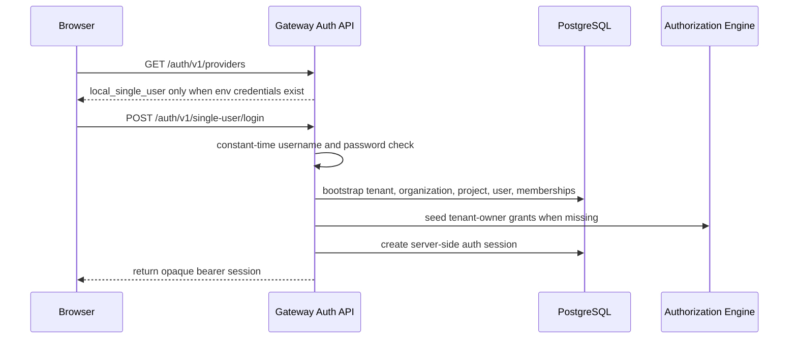
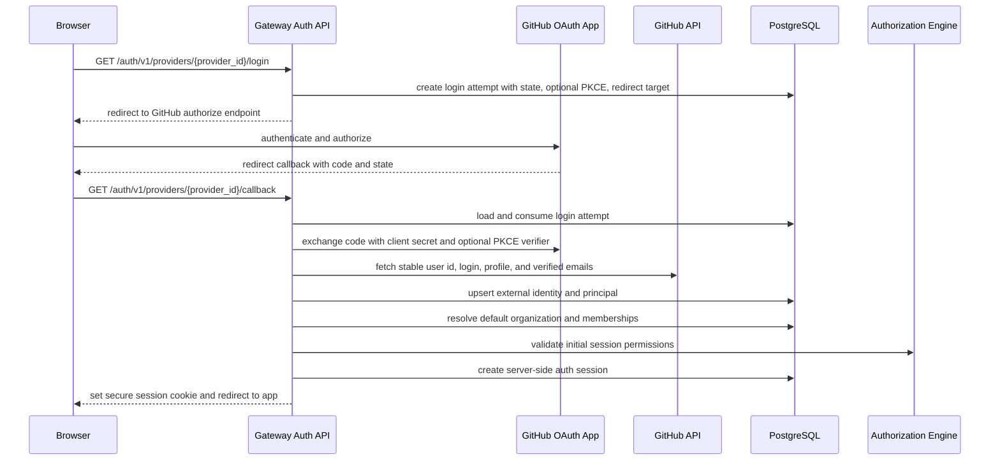
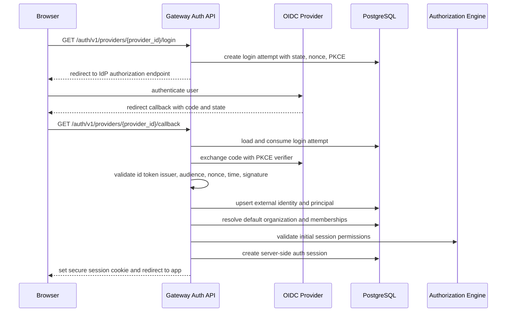

# Login, Identity, And User Management

Status: design draft for review.

This spec defines human login, identity linking, user lifecycle, organization
membership, project membership, and browser/admin session behavior for the
gateway control plane.

Human login OAuth/OIDC is separate from upstream provider OAuth. Upstream
provider OAuth is credential material used by the gateway to call a model
provider. Human login is how an operator, organization admin, project member,
or viewer authenticates to the admin and dashboard APIs.

Bare deployments must not require the operator to already own an enterprise
OIDC provider. The gateway ships a local single-user mode that is disabled by
default and becomes available only when an operator configures a username and
password through environment variables. External login providers can be enabled
after bootstrap. GitHub OAuth App is the recommended v1 bare-deploy external
adapter. Generic OIDC is the required v1 enterprise adapter.

## Goals

- Support bare-deploy bootstrap through an environment-configured local
  single-user account.
- Support bare-deploy external login through a configured GitHub OAuth App.
- Support enterprise login through configured OIDC providers.
- Use OAuth 2.0 authorization code flow with provider-appropriate validation:
  `state` for all providers, PKCE and ID token validation for OIDC providers,
  and provider API identity verification for GitHub OAuth App.
- Keep the gateway as a login client/relying party, not an identity provider.
- Map external identities into gateway-local principals, organizations,
  projects, roles, sessions, API keys, usage attribution, and audit events.
- Ensure every user has a default organization before using organization or
  project scoped APIs.
- Support inviting users into organizations and assigning users to projects.
- Make sessions revocable, auditable, and safe for browser admin usage.

## Non-Goals

- Do not build a general multi-user password authentication system in v1.
- Do not store login provider passwords. The local single-user password is read
  from process environment and is intended for bootstrap and simple self-hosted
  operation.
- Do not become a general identity provider or SCIM directory in v1.
- Do not auto-link accounts by email unless an explicit verified-email policy
  permits it.
- Do not expose upstream provider OAuth tokens through human login APIs.
- Do not require one specific hosted login provider or UI framework.
- Do not require external enterprise SSO for a single-node or small-team
  deployment.

## Decision Summary

| Area                    | V1 Decision                                                                  |
| ----------------------- | ---------------------------------------------------------------------------- |
| Bare-deploy provider    | local single-user password mode, then optional GitHub OAuth App              |
| Enterprise provider     | generic OIDC provider config                                                 |
| Provider adapters       | `github_oauth_app`, `oidc`                                                   |
| Login protocol          | OAuth 2.0 authorization code flow                                            |
| OIDC validation         | PKCE, state, nonce, issuer, audience, signature, and expiry                  |
| GitHub validation       | state, callback code exchange, GitHub user id, and verified email lookup     |
| User identity           | gateway `Principal` linked to one or more `ExternalIdentity` records         |
| Session type            | opaque server-side session cookie                                            |
| Session source of truth | PostgreSQL session table with optional Redis/Valkey hot cache                |
| Admin API auth          | session, API key, service token, or mTLS all resolve to `AuthenticatedActor` |
| Default organization    | required for active user principals                                          |
| User provisioning       | bootstrap, invite acceptance, domain allowlist, or self-service org policy   |
| Account linking         | explicit re-authenticated operation, never raw email-only by default         |

## Login Provider Kinds

`IdentityProvider` is the gateway-local resource for a human login provider.
The name does not mean the gateway becomes an identity provider, and it does
not describe upstream model provider credentials.

V1 supports three login provider kinds:

| Kind                   | Primary Use                                   | Protocol Shape                             |
| ---------------------- | --------------------------------------------- | ------------------------------------------ |
| `single_user_password` | single-node bootstrap and simple self-hosting | local password check from environment      |
| `github_oauth_app`     | bare deployments and small teams              | GitHub OAuth App authorization code flow   |
| `oidc`                 | enterprise SSO                                | OIDC authorization code flow with ID token |

The local single-user provider is not a configurable `IdentityProvider`
resource. It is exposed by `/auth/v1/providers` only when both
`STARWEAVER_GATEWAY_SINGLE_USER_USERNAME` and
`STARWEAVER_GATEWAY_SINGLE_USER_PASSWORD` are non-empty. Login uses
`POST /auth/v1/single-user/login`, creates an opaque server-side session, and
bootstraps the default tenant, organization, project, user, membership graph,
and tenant-owner grants if they do not already exist.

For hosted SaaS, the operator may run a shared GitHub OAuth App. For
self-hosted deployments that want external login, the administrator configures
their own GitHub OAuth App by supplying the client id, client secret reference,
public base URL, and optional organization/domain allow rules. The gateway
derives the callback URL from the public base URL unless the operator overrides
it.

## Single-User Login Flow



Required environment variables:

```text
STARWEAVER_GATEWAY_SINGLE_USER_USERNAME=admin
STARWEAVER_GATEWAY_SINGLE_USER_PASSWORD=...
```

Optional environment variables:

```text
STARWEAVER_GATEWAY_SINGLE_USER_EMAIL=admin@example.com
STARWEAVER_GATEWAY_SINGLE_USER_DISPLAY_NAME=Admin
STARWEAVER_GATEWAY_SINGLE_USER_SESSION_TTL_SECONDS=43200
```

## GitHub OAuth App Login Flow



GitHub access tokens returned during login are transient identity lookup
material. The gateway should discard them after fetching the required identity
metadata unless a future, separately reviewed integration needs durable GitHub
API access.

## OIDC Login Flow



## Identity Provider Resource

Fields:

| Field                          | Meaning                                                  |
| ------------------------------ | -------------------------------------------------------- |
| `identity_provider_id`         | stable id                                                |
| `tenant_id`                    | tenant                                                   |
| `kind`                         | `github_oauth_app` or `oidc`                             |
| `display_name`                 | operator-facing provider name                            |
| `client_id`                    | OAuth client id                                          |
| `client_secret_ref`            | secret reference for confidential clients                |
| `redirect_uri`                 | registered callback URL                                  |
| `scopes`                       | provider-specific login scopes                           |
| `issuer`                       | OIDC issuer URL, only for `oidc`                         |
| `discovery_url`                | optional OIDC discovery document URL                     |
| `authorization_url`            | optional explicit OAuth authorization URL                |
| `token_url`                    | optional explicit OAuth token URL                        |
| `user_api_url`                 | GitHub user API URL or GitHub Enterprise Server API URL  |
| `emails_api_url`               | GitHub emails API URL when required                      |
| `allowed_email_domains`        | optional verified email domain allowlist                 |
| `allowed_github_organizations` | optional GitHub org allowlist for `github_oauth_app`     |
| `claim_mapping`                | maps provider claims or API fields into profile fields   |
| `provisioning_mode`            | `invite_only`, `domain_allowlist`, `self_service_org`    |
| `default_role_policy_id`       | optional baseline role policy for auto-provisioned users |
| `status`                       | `active`, `disabled`, `deleted`                          |
| `created_at`                   | creation timestamp                                       |
| `updated_at`                   | last metadata update                                     |

Provider discovery data and JWKS should be cached with issuer and cache expiry.
Workers must re-fetch keys when a token `kid` is unknown and the provider is
healthy. A failed JWKS refresh should fail login, not bypass signature checks.

GitHub OAuth App providers do not have OIDC discovery or JWKS. They validate
the callback state, exchange the authorization code, call the configured GitHub
API endpoints, and use the stable GitHub numeric user id or node id as the
external identity subject. Email is used only for invitation, allowlist, and
profile metadata after the gateway verifies it through the provider API.

Recommended GitHub OAuth App scopes:

| Scope        | Use                                          |
| ------------ | -------------------------------------------- |
| `read:user`  | profile metadata such as login and avatar    |
| `user:email` | verified primary or visible email resolution |

Self-hosted GitHub Enterprise Server should be modeled as the same provider
kind with explicit authorization, token, user, and email API base URLs.

## Bare Deployment Bootstrap

A bare deployment should be able to become usable without an existing
enterprise SSO tenant. The minimum path is local single-user mode:

```text
STARWEAVER_GATEWAY_SINGLE_USER_USERNAME=admin
STARWEAVER_GATEWAY_SINGLE_USER_PASSWORD=...
```

This mode is disabled when either value is absent or empty. It does not create
additional password users, invitation flows, or reusable password credentials.

After bootstrap, a deployment that wants external identity can add a GitHub
OAuth App provider.

GitHub OAuth App configuration:

```yaml
public_base_url: https://gateway.example.com
login_providers:
  - kind: github_oauth_app
    identity_provider_id: github
    display_name: GitHub
    client_id: "${GATEWAY_LOGIN_GITHUB_CLIENT_ID}"
    client_secret_ref: "secret://gateway/login/github/client-secret"
    callback_path: /auth/v1/providers/github/callback
    scopes:
      - read:user
      - user:email
    provisioning_mode: bootstrap
```

Environment-only development config may use:

```text
GATEWAY_PUBLIC_BASE_URL=https://gateway.example.com
GATEWAY_LOGIN_GITHUB_CLIENT_ID=...
GATEWAY_LOGIN_GITHUB_CLIENT_SECRET=...
```

For production, prefer `GATEWAY_LOGIN_GITHUB_CLIENT_SECRET_REF` over raw secret
environment variables. Raw environment secrets are acceptable only for local
development and simple self-hosted bootstrap when the deployment has no secret
backend yet.

## External Identity

`ExternalIdentity` links a login provider subject to a gateway principal.

Fields:

| Field                     | Meaning                                                |
| ------------------------- | ------------------------------------------------------ |
| `external_identity_id`    | stable id                                              |
| `tenant_id`               | tenant                                                 |
| `identity_provider_id`    | login provider                                         |
| `provider_key`            | normalized issuer or provider namespace                |
| `provider_subject`        | stable subject from provider                           |
| `provider_login_snapshot` | GitHub login or OIDC preferred username at last login  |
| `principal_id`            | linked gateway principal                               |
| `email_hash`              | normalized email hash when available                   |
| `email_verified`          | provider asserted email verification                   |
| `display_name_snapshot`   | display name at last login                             |
| `last_login_at`           | last successful login                                  |
| `status`                  | `active`, `disabled`, `deleted`; unlink sets `deleted` |
| `created_at`              | creation timestamp                                     |
| `updated_at`              | last metadata update                                   |

Uniqueness:

- `(tenant_id, identity_provider_id, provider_key, provider_subject)` is
  globally unique.
- Email is not a stable identity key by default.
- Multiple external identities can link to one principal only through an
  explicit account-link operation that requires a fresh authenticated session.

Provider subject rules:

| Provider Kind      | Subject Rule                                                 |
| ------------------ | ------------------------------------------------------------ |
| `github_oauth_app` | GitHub numeric user id or node id, never mutable login/email |
| `oidc`             | OIDC `sub` claim scoped by issuer                            |

## User Principal And Profile

The gateway stores a gateway-local principal so authorization, API keys,
membership, usage attribution, and audit evidence do not depend on mutable
login provider state.

User profile fields:

| Field                     | Meaning                                          |
| ------------------------- | ------------------------------------------------ |
| `principal_id`            | gateway principal                                |
| `tenant_id`               | tenant                                           |
| `primary_email_hash`      | normalized hash for lookup and invitations       |
| `primary_email_verified`  | whether the current primary email is verified    |
| `display_name`            | mutable display name                             |
| `avatar_url`              | optional safe URL                                |
| `default_organization_id` | active default organization                      |
| `status`                  | `active`, `disabled`, `pending_setup`, `deleted` |
| `last_login_at`           | last successful login                            |
| `created_at`              | creation timestamp                               |
| `updated_at`              | last metadata update                             |

Disabling a principal revokes new sessions, invalidates active sessions, and
prevents API key creation. Existing usage and audit evidence remains readable
according to retention and authorization policy.

## Provisioning Modes

| Mode               | Behavior                                                                 |
| ------------------ | ------------------------------------------------------------------------ |
| `bootstrap`        | first verified login creates tenant owner, default organization, project |
| `invite_only`      | login succeeds only for existing users or pending invitations            |
| `domain_allowlist` | verified email domain can create or join configured organization         |
| `self_service_org` | verified user creates a default organization and initial project         |
| `disabled`         | provider cannot create or link users                                     |

Production enterprise deployments should default to `invite_only` after
bootstrap unless the operator explicitly enables domain allowlist or
self-service organization creation.

Every successful user login must end with exactly one active
`default_organization_id`. If the user has no valid organization after login,
the session enters `pending_setup` and may only call setup, invitation, and
logout APIs.

## Organization Invitation

Invitations connect user login with organization membership.

Invitation acceptance rules:

1. Invitation token is presented through a link or accepted after login.
2. Token hash is matched; raw token is never stored.
3. Invitation must be pending and unexpired.
4. Login external identity must provide a verified email or trusted subject that
   matches the invitation target.
5. The gateway creates or reuses a user principal.
6. The gateway creates or activates `OrganizationMember`.
7. If this is the user's first active organization, it becomes the default.
8. Optional project memberships are created when the invitation includes
   project assignments.
9. Audit events record inviter, accepted principal, organization, roles, and
   project assignments.

Invitation tokens must be single-use and revocable.

## Project Assignment

Project membership can be granted by:

- organization admin
- project admin when policy permits
- gateway operator or tenant admin during controlled bootstrap or repair
- invitation with project assignment
- domain allowlist provisioning policy

Project assignment must not grant access outside the parent organization.
Removing a user from an organization suspends or removes all project memberships
inside that organization unless an operator chooses a softer transitional
policy.

## Session Model

Use opaque server-side sessions for human admin and dashboard use.

Session fields:

| Field                    | Meaning                                         |
| ------------------------ | ----------------------------------------------- |
| `session_id`             | stable internal id                              |
| `session_token_hash`     | hash of opaque cookie token                     |
| `tenant_id`              | tenant                                          |
| `principal_id`           | user principal                                  |
| `identity_provider_id`   | login provider                                  |
| `external_identity_id`   | external identity used for login                |
| `active_organization_id` | current organization context                    |
| `active_project_id`      | optional current project context                |
| `auth_time`              | provider authentication time when provided      |
| `created_at`             | session creation                                |
| `last_seen_at`           | last use                                        |
| `expires_at`             | absolute expiry                                 |
| `idle_expires_at`        | idle timeout                                    |
| `revoked_at`             | revocation timestamp                            |
| `assurance_level`        | login assurance or MFA indicator when available |
| `csrf_secret_hash`       | CSRF token verifier for browser mutations       |
| `user_agent_hash`        | optional privacy-preserving client fingerprint  |
| `source_ip_hash`         | optional privacy-preserving remote address hash |

Session rules:

- cookie value is opaque, random, and stored only as a hash
- cookie uses `HttpOnly`, `Secure`, and `SameSite=Lax` by default
- session is rotated after login and account-link operations
- logout revokes the current session
- admin users can revoke their own sessions
- tenant owners or security admins can revoke sessions in their scope
- high-risk operations can require recent login or stronger assurance

Server-side session state lives in PostgreSQL. Redis or Valkey may cache active
session metadata, but revocation and principal disable must converge through the
database and config/session invalidation path.

## Auth API

Auth endpoints are versioned separately from model ingress.

| Endpoint                                        | Purpose                                      |
| ----------------------------------------------- | -------------------------------------------- |
| `GET /auth/v1/providers`                        | list enabled login providers                 |
| `POST /auth/v1/single-user/login`               | log in with configured local credentials     |
| `GET /auth/v1/providers/{provider_id}/login`    | start provider-specific login                |
| `GET /auth/v1/providers/{provider_id}/callback` | complete provider-specific login             |
| `POST /auth/v1/logout`                          | revoke current session                       |
| `GET /auth/v1/session`                          | read current session and memberships         |
| `POST /auth/v1/session/default-organization`    | change default organization                  |
| `POST /auth/v1/session/active-organization`     | switch active organization context           |
| `POST /auth/v1/session/active-project`          | switch active project context                |
| `GET /auth/v1/invitations/{token}/preview`      | preview safe invitation metadata             |
| `POST /auth/v1/invitations/{token}/accept`      | accept invitation after login or during flow |

Auth APIs return only safe profile and membership metadata. They do not return
ID tokens, access tokens, refresh tokens, client secrets, or raw invitation
tokens.

Provider-specific aliases such as
`/auth/v1/oauth/github/{provider_id}/login` may exist for frontend routing
compatibility, but the canonical API is provider-id based.

## Admin User Management API

Admin APIs manage identity resources and memberships.

| Endpoint Family                              | Purpose                                  |
| -------------------------------------------- | ---------------------------------------- |
| `/admin/v1/identity-providers/*`             | configure human login providers          |
| `/admin/v1/users/*`                          | list, read, disable, restore users       |
| `/admin/v1/users/{id}/external-identities/*` | inspect or unlink external identities    |
| `/admin/v1/users/{id}/sessions/*`            | list or revoke sessions                  |
| `/admin/v1/organizations/{id}/invitations/*` | create, revoke, resend, list invitations |
| `/admin/v1/organizations/{id}/members/*`     | list, update, suspend, remove members    |
| `/admin/v1/projects/{id}/members/*`          | list, add, update, suspend, remove users |
| `/admin/v1/users/{id}/default-organization`  | assign or repair default organization    |

User management changes are audited and should appear in organization and
project activity feeds when those exist.

## Authorization

Login and user management introduce explicit actions.

| Action                               | Resource                 |
| ------------------------------------ | ------------------------ |
| `gateway.identity_provider.read`     | `IdentityProvider`       |
| `gateway.identity_provider.write`    | `IdentityProvider`       |
| `gateway.user.read`                  | `UserPrincipal`          |
| `gateway.user.write`                 | `UserPrincipal`          |
| `gateway.user.disable`               | `UserPrincipal`          |
| `gateway.external_identity.read`     | `ExternalIdentity`       |
| `gateway.external_identity.unlink`   | `ExternalIdentity`       |
| `gateway.session.read`               | `AuthSession`            |
| `gateway.session.revoke`             | `AuthSession`            |
| `gateway.session.update`             | `AuthSession`            |
| `gateway.organization_invite.read`   | `OrganizationInvitation` |
| `gateway.organization_invite.create` | `OrganizationInvitation` |
| `gateway.organization_invite.manage` | `OrganizationInvitation` |
| `gateway.organization_invite.accept` | `OrganizationInvitation` |
| `gateway.organization_member.read`   | `OrganizationMember`     |
| `gateway.organization_member.write`  | `OrganizationMember`     |
| `gateway.project_member.read`        | `ProjectMember`          |
| `gateway.project_member.write`       | `ProjectMember`          |

Self-service session APIs still require policy checks. For example, a user can
read their own session, but cannot switch to an organization where they lack an
active membership.

The canonical endpoint and action matrix for `/auth/v1/*` and user-management
admin APIs is defined in `10-authorization-api-keys.md`. This spec should not
introduce additional role names or route aliases beyond that matrix.

## Security Rules

- Validate OIDC issuer, audience, signature, expiration, nonce, PKCE, and
  hosted provider constraints.
- Validate GitHub OAuth App callbacks with state, authorization code exchange,
  configured endpoints, stable user id lookup, and verified email lookup.
- Use PKCE for authorization code flow when the provider supports it. OIDC
  providers must support PKCE. GitHub OAuth App providers should use PKCE when
  available and must still use confidential-client token exchange.
- Store login attempts with state, provider id, redirect target, short expiry,
  and provider-specific fields such as nonce or PKCE verifier hash.
- Reject callback requests with missing, reused, expired, or mismatched state.
- Allow callback redirects only to configured application origins or relative
  paths.
- Treat `email_verified=false` as insufficient for invite matching unless a
  deployment explicitly trusts that provider's subject mapping.
- For GitHub OAuth App, require a verified email for email-targeted
  invitations and domain allowlist provisioning. If GitHub returns no verified
  email, login may create a pending principal only when bootstrap or setup
  policy permits it.
- Do not persist GitHub login access tokens unless a future GitHub integration
  owns a separate token lifecycle, scope review, and revocation model.
- Rate-limit login starts, callbacks, failed invitations, and account-link
  attempts.
- Require recent session or stronger assurance for login provider config edits,
  user disable, session revocation outside self, and emergency actions.
- Audit login success, login failure class, logout, session revocation,
  invitation create/accept/revoke, membership change, and account link/unlink.

## Framework Direction

Use `oauth2` for GitHub OAuth App authorization URL construction, callback code
exchange, state handling, and optional PKCE helpers. Use `openidconnect` for
OIDC discovery, authorization code flow helpers, ID token validation, nonce
handling, and JWKS validation.

Session management must remain opaque and server-side. The implementation can
use a tower/axum session middleware only if it supports the gateway's
PostgreSQL source-of-truth session model, revocation, CSRF requirements, and
tenant-scoped audit evidence. Otherwise, implement a small gateway-owned
session layer.

## Tests

Required tests:

- GitHub OAuth App login start creates state and optional PKCE verifier
- GitHub OAuth App callback rejects wrong state, failed code exchange, missing
  stable user id, and unavailable user API
- GitHub OAuth App verified email lookup gates invite acceptance and domain
  allowlist provisioning
- GitHub OAuth App subject remains stable across login and email changes
- GitHub Enterprise Server base URLs are honored for auth, token, user, and
  email APIs
- GitHub login access token is not persisted after identity lookup
- OIDC discovery and JWKS cache behavior
- login start creates state, nonce, and PKCE verifier
- callback rejects wrong state, reused state, wrong nonce, wrong issuer, wrong
  audience, expired token, and unknown signing key
- verified invite acceptance creates principal, organization member, default
  organization, and optional project memberships
- unverified email cannot accept an email-targeted invitation
- disabled user cannot create a new session
- disabling user revokes active sessions
- session cookie flags are secure
- CSRF protection rejects browser mutations without token
- active organization/project switch rejects memberships the user does not have
- account link requires fresh authentication and audit evidence
- admin user management APIs enforce action/resource permissions

## Acceptance Gates

- Bare deployments can enable GitHub OAuth App login with public base URL,
  client id, and client secret reference.
- Enterprise deployments can enable OIDC login with discovery, PKCE, nonce, and
  ID token validation.
- Human login OAuth/OIDC is clearly separate from upstream provider OAuth.
- Users have a default organization before normal admin/dashboard usage.
- Organization invitations and project assignments are explicit resources.
- Sessions are opaque, server-side, revocable, and audited.
- User management APIs have action ids, scope rules, and audit requirements.
- No login API returns login provider tokens, client secrets, raw invitation
  tokens, or upstream provider OAuth material.
