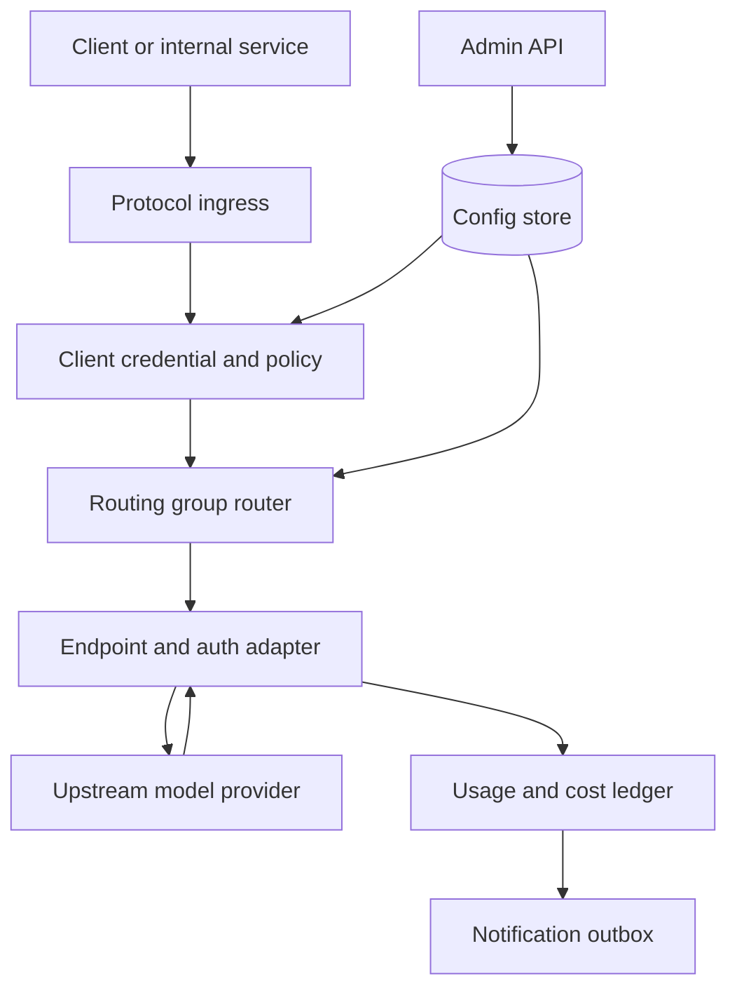

# LLM Gateway Specs

Status: design draft for review.

This directory defines the gateway as a general-purpose enterprise LLM gateway.
It can serve direct application clients, workflow runtimes, automation,
internal services, and any operator that wants centralized provider governance
for model traffic.

## Design Position

The gateway is not an application runtime, not a billing product, and not a
protocol translator between unrelated model APIs. It is a service boundary that
receives protocol-compatible model requests, authenticates the caller, selects
an allowed upstream target, adapts endpoint/auth/header/stream details inside
that protocol family, records cost and usage evidence, and emits integration
events for systems outside the open-source project.

## Spec Map

| File                                      | Scope                                                                                        |
| ----------------------------------------- | -------------------------------------------------------------------------------------------- |
| `00-requirements.md`                      | functional capability map, requirement levels, and completion evidence                       |
| `01-llm-gateway.md`                       | product boundary, non-goals, top-level lifecycle, and glossary                               |
| `02-tenancy-access.md`                    | tenant, organization, project, API key, caller credential, RBAC, and provider grants         |
| `03-provider-credential-catalog.md`       | provider endpoint, upstream credential, upstream Codex OAuth, model catalog, pricing         |
| `04-routing-router.md`                    | routing group, route policy, strategy, health, failover, stickiness, and decisions           |
| `05-runtime-protocol.md`                  | client-facing protocols, endpoint adaptation, streaming, retries, usage extraction           |
| `06-usage-cost-budget-notifications.md`   | cost-only usage ledger, budgets, quotas, notifications, and webhook/outbox model             |
| `07-admin-config-api.md`                  | admin resources, versioned config lifecycle, audit, invalidation, and OpenAPI shape          |
| `08-security-observability-operations.md` | secret safety, redaction, telemetry, Redis-compatible hot state, OTel export, and operations |
| `09-validation-and-rollout.md`            | implementation phases, acceptance gates, migration policy, and test matrix                   |
| `10-authorization-api-keys.md`            | API keys, REST API permissions, authorization engine, actions, and policy gates              |
| `11-login-user-management.md`             | GitHub OAuth App login, OIDC login, sessions, user lifecycle, and memberships                |
| `12-dashboards-observability-api.md`      | realtime operations dashboard, usage analytics, model observability, and aggregations        |
| `memos/`                                  | implementation planning notes, including framework selection                                 |

## Requirements Covered

- Multi-tenant gateway model.
- Organization-scoped provider availability.
- Administrator-managed upstream credentials.
- Routing groups as first-class enterprise routing units.
- Router concepts for weighted, priority, health-aware, cost-aware, sticky, and
  failover behavior.
- Budget management focused on provider cost, not product billing.
- Usage notifications and webhook integration points for external billing or
  analytics systems.
- Upstream provider OAuth support restricted to Codex.
- Human login through configured login providers: GitHub OAuth App for bare
  deployments and OIDC for enterprise SSO.
- User-owned and service-owned API keys that can call model APIs and authorized
  REST APIs.
- Unified authorization for model ingress and admin/evidence REST APIs.
- Future web UI work is a separate product design.
- No dependency on a specific application runtime, developer CLI, or client SDK
  implementation.

## Naming Rules

Use gateway-owned names in this repository:

- `gateway.*` for traces, events, schemas, cache keys, and audit families.
- `API key` for user-owned or service-owned bearer credentials.
- `client credential` only as an internal umbrella for API keys, service
  tokens, mTLS identities, and sessions.
- `upstream credential` for secrets used to call providers.
- `provider endpoint` for one upstream API endpoint and protocol family.
- `model target` for one upstream model id exposed by a provider endpoint.
- `model alias` for the model name used by gateway clients.
- `routing group` for the enterprise unit of traffic selection.
- `usage event` and `cost ledger` for open-source cost tracking.
