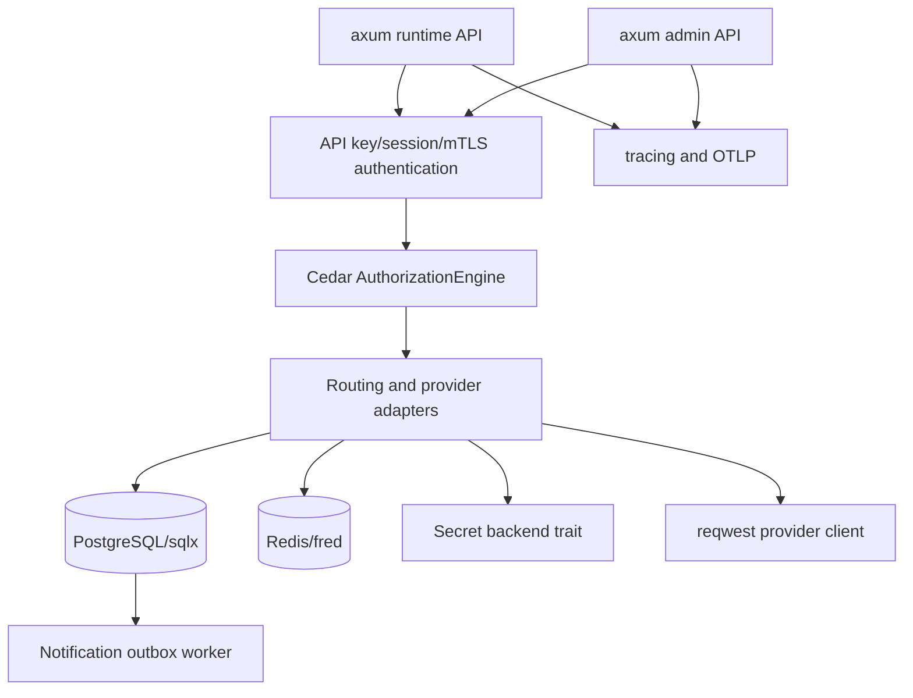

# Framework Selection Memo

Status: implementation planning memo.

Date: 2026-06-24.

This memo selects the first implementation stack for the gateway. The goal is a
concrete Rust service baseline that can implement the gateway specs without
adding unnecessary distributed-system dependencies too early.

## Decision Summary

Use a small Rust service stack:

| Area                 | v1 Selection                                                                | Reason                                                                                             |
| -------------------- | --------------------------------------------------------------------------- | -------------------------------------------------------------------------------------------------- |
| Async runtime        | `tokio`                                                                     | Rust async ecosystem baseline and required by selected web, DB, and HTTP crates                    |
| HTTP server          | `axum` + `tower` + `tower-http`                                             | Typed routing, middleware composition, streaming support, and low framework lock-in                |
| HTTP client          | `reqwest` with `rustls-tls` and streaming                                   | Provider egress needs JSON, bytes, streaming, timeouts, and TLS consistency                        |
| Database             | PostgreSQL + `sqlx`                                                         | SQL-first schema, async pool, migrations, offline query checking, and explicit data model          |
| Cache / hot state    | Redis through `fred`                                                        | PubSub, scripts, hashes, counters, rustls, and async ergonomics for config invalidation and limits |
| Authorization engine | `cedar-policy` behind `AuthorizationEngine`                                 | Rust-native policy evaluator, schema validation, RBAC/ABAC fit, and no required external service   |
| Human login          | generic OIDC through `openidconnect`; opaque server-side sessions           | External login, enterprise SSO, revocation, and auditability                                       |
| API key hashing      | `argon2` PHC strings                                                        | Password-hash style storage for high-entropy bearer keys with future hash upgrades                 |
| Secret handling      | `secrecy` + `zeroize`                                                       | Avoid accidental debug/display leaks and clear in-memory secret material                           |
| Constant-time checks | `subtle` or `constant_time_eq`                                              | Avoid timing-sensitive comparisons for key verification                                            |
| OpenAPI              | `utoipa` + Swagger UI only for dev/admin                                    | Rust-native schema generation and operation annotations                                            |
| Serialization        | `serde`, `serde_json`, `serde_with` when needed                             | Stable Rust serialization baseline                                                                 |
| Errors               | `thiserror` in libraries, `anyhow` in binaries/tasks                        | Typed service errors with pragmatic command/task plumbing                                          |
| Observability        | `tracing`, `tower-http` trace, OpenTelemetry OTLP                           | Structured logs and distributed traces without vendor lock-in                                      |
| Testing              | `axum-test`, fake providers, `testcontainers` or compose for Postgres/Redis | Fast handler tests plus deterministic integration coverage                                         |
| Local deployment     | Docker Compose for Postgres/Redis/service roles                             | Keeps local validation reproducible without forcing Kubernetes                                     |

## Architecture Shape



The first binary can run all roles in one process for local development. The
internal module boundaries should still allow splitting runtime, admin,
accounting, notification, health, and migration roles.

## Body And Stream Handling

Gateway v1 needs explicit body strategy per route family:

| Route Class                     | Body Strategy                                      |
| ------------------------------- | -------------------------------------------------- |
| model JSON request              | bounded read with configurable max bytes           |
| streaming upstream response     | pass through stream with event classification      |
| multipart or future media route | reject in v1 unless a dedicated body policy exists |
| admin JSON request              | bounded read with smaller admin limit              |
| debug capture                   | disabled by default; separate audited storage path |

When a body exceeds the in-memory limit, v1 should reject unless a concrete
route has a spill-to-temp-file design and cleanup tests. The gateway must never
buffer unbounded provider streams for retry or tracing.

## Config Cache And Invalidation

Use PostgreSQL as source of truth and Redis PubSub only as an acceleration
channel.

Runtime workers need all three recovery paths:

- event-driven invalidation through Redis PubSub
- periodic polling by config version
- startup load from PostgreSQL last published snapshot

If PubSub messages are lost, workers must converge through version polling.
Config snapshots remain monotonic; workers never apply an older snapshot after a
newer one.

## Authorization Performance Risks

Cedar is the v1 authorization choice, but the implementation must prove it is
safe on the hot path.

Validation items:

- benchmark model ingress authorization latency with realistic entity sets
- cache compiled policy snapshots per config version
- avoid rebuilding full tenant entity graphs on every request
- provide authorization-aware SQL filters for large list endpoints
- bound entity construction cost for route simulation and usage export
- cache API key prefix lookup and Argon2 verification carefully without
  accepting stale disabled keys
- rate-limit failed API key authentication to reduce hash-amplification DoS
- record policy snapshot size and worker load time

If these checks fail, keep the `AuthorizationEngine` trait but add a narrower
fast path only when it is proven equivalent to the Cedar decision for the
covered action/resource set.

## Redaction And Observability Risks

The gateway must default to metadata-only telemetry.

Never record by default:

- prompt body
- completion body
- provider request body
- provider response chunks
- API key values
- upstream secrets
- OAuth tokens
- secret-like headers

Debug capture requires a separate permission, bounded scope, short retention,
and audit evidence.

## Testing Order

The implementation should add tests in this order:

1. Unit tests for action mapping, redaction, policy closure, and route filters.
2. Fake provider contract tests for non-streaming and streaming behavior.
3. `axum-test` handler tests for authn/authz and error envelopes.
4. Postgres/Redis integration tests for snapshots, usage ledger, and outbox.
5. Cedar policy validation and built-in safety tests.
6. Redis loss and PubSub recovery tests.
7. Provider edge-case fixture tests.
8. Optional live provider smoke tests.

Real provider tests should never be required for ordinary CI.

## Required V1 Crates

The initial gateway crate should add dependencies only when code uses them:

```toml
[dependencies]
tokio = { version = "1.52", features = ["rt-multi-thread", "macros", "signal"] }
axum = { version = "0.8", features = ["macros", "json"] }
tower = "0.5"
tower-http = { version = "0.7", features = ["trace", "cors", "timeout", "limit"] }
reqwest = { version = "0.13", default-features = false, features = ["json", "stream", "rustls-tls"] }
serde = { version = "1", features = ["derive"] }
serde_json = "1"
sqlx = { version = "0.9", features = ["runtime-tokio", "postgres", "uuid", "chrono", "json", "rust_decimal", "migrate"] }
fred = { version = "10", features = ["subscriber-client", "i-keys", "i-hashes", "i-scripts", "i-pubsub", "enable-rustls-ring"] }
cedar-policy = "4"
oauth2 = "5"
openidconnect = "4"
# Prefer the latest stable argon2 release; avoid adopting a release candidate
# unless implementation review explicitly accepts it.
argon2 = "0.5"
secrecy = "0.10"
zeroize = "1"
subtle = "2"
uuid = { version = "1", features = ["v7", "serde"] }
chrono = { version = "0.4", features = ["serde"] }
rust_decimal = { version = "1", features = ["serde"] }
thiserror = "2"
anyhow = "1"
tracing = "0.1"
tracing-subscriber = { version = "0.3", features = ["env-filter", "json"] }
opentelemetry = "0.32"
opentelemetry-otlp = { version = "0.32", features = ["tonic", "http-proto", "reqwest-client"] }
opentelemetry_sdk = { version = "0.32", features = ["rt-tokio"] }
tracing-opentelemetry = "0.33"
utoipa = { version = "5", features = ["axum_extras", "chrono", "uuid"] }

[dev-dependencies]
axum-test = "20"
testcontainers = "0.27"
```

These versions reflect the crates.io index checked on 2026-06-24. Before
implementation, run `cargo info` for exact feature names and MSRV constraints.
Do not copy this list blindly into `Cargo.toml`.

## Authorization Decision

Use Cedar in-process for v1.

Reasons:

- It matches the gateway action/resource/context model.
- It keeps model ingress and REST API authorization in one policy path.
- Schema validation fits config snapshot publication.
- It avoids running OpenFGA, SpiceDB, or OPA as required infrastructure before
  gateway resource boundaries harden.
- It can still be wrapped behind an `AuthorizationEngine` trait for later
  external backends.

Fallbacks:

| Option    | When To Use                                                                  |
| --------- | ---------------------------------------------------------------------------- |
| Casbin    | if Cedar policy authoring proves too heavy for the first prototype           |
| OpenFGA   | if multi-service relationship authorization becomes a product requirement    |
| SpiceDB   | if Zanzibar-style global relationship checks become central                  |
| OPA       | if an operator already standardizes policy across many infrastructure layers |
| Gatehouse | revisit after maturity if an all-Rust composable engine is preferable        |

Do not use Oso for v1. Its Rust surface and upstream signals are weaker for
this gateway baseline.

## API Key Decision

Use `ApiKey` as the public credential.

Implementation requirements:

- raw key returned only once
- key prefix used for lookup
- Argon2 PHC hash for durable storage
- key owner is a user principal or service account
- key policy narrows the owner principal's permissions
- key can authenticate model APIs and REST APIs
- every REST route maps to action/resource before handler execution
- OpenAPI documents required action id and whether API keys may call the route

Avoid the term `virtual key` outside migration notes or anti-design discussion.

## Login And Session Decision

Use generic OIDC authorization code flow for human admin and dashboard login.
Local single-user password mode is the v1 bare-deployment bootstrap path, and
generic OIDC is the standard v1 external login adapter after bootstrap. The
gateway acts as a login client/relying party for configured OIDC providers and
maps external identities into gateway-local principals, organization
memberships, project memberships, and sessions.

Use opaque server-side sessions:

- cookie stores only an opaque random token
- durable session state lives in PostgreSQL
- Redis or Valkey may cache active session metadata
- session revocation, user disable, and organization membership changes must
  converge through durable state
- mutating browser APIs require CSRF protection

Do not use self-contained JWT browser sessions for v1. They make revocation,
default organization repair, project membership changes, and audit behavior
harder to reason about.

The `openidconnect` crate is the v1 baseline for OIDC discovery, PKCE, nonce,
ID token, and JWKS validation. Do not mix human login OAuth/OIDC with upstream
provider OAuth credential storage. Non-OIDC OAuth providers can be introduced
later only through a separately reviewed adapter or through an external OIDC
broker.

## Storage Decision

Use PostgreSQL as the system of record.

Use SQL migrations and `sqlx` query checking. Avoid an ORM in v1 because the
gateway needs explicit control over tenant scopes, append-only evidence,
idempotency constraints, and high-volume usage writes.

Recommended schema groups:

- identity and API keys
- provider catalog and upstream credentials
- routing graph and config snapshots
- usage events and cost ledger
- audit and authorization evidence
- notification outbox and delivery attempts

Use Redis only for hot state:

- rate-limit counters
- budget hot counters
- route stickiness
- provider health hints
- circuit breaker state
- config invalidation PubSub

Redis is not the durable source of truth.

## Observability Decision

Use `tracing` as the instrumentation API and OpenTelemetry OTLP as the standard
export path. Do not make DogStatsD or a vendor-specific metrics path the v1
primary interface.

Minimum span boundaries:

- request ingress
- authentication
- authorization decision
- budget preflight
- route selection
- provider adaptation
- upstream attempt
- stream processing
- usage accounting
- notification enqueue

Default logs and traces must not include prompts, completions, raw API keys, or
upstream secrets.

## Testing Decision

Use a layered test plan:

- unit tests for policy/action mapping, redaction, pricing, route filters
- `axum-test` for handlers and middleware
- fake provider servers for streaming and provider error behavior
- Postgres/Redis integration tests through `testcontainers` or compose
- provider edge-case fixture tests
- OpenAPI snapshot checks once admin routes exist
- Cedar policy schema and built-in safety tests in CI

Fake providers should be the first CI path so ordinary validation does not
depend on live credentials or large fixture sets.

## Deferred Choices

Do not decide these in v1:

- Kubernetes operator or Helm chart layout
- external authorization service as a required dependency
- dedicated queue framework
- full UI framework
- commercial billing integration
- arbitrary provider OAuth onboarding
- multi-region strong budget accounting

The specs leave extension points for these, but the implementation should not
carry them before the first runtime and admin API are real.

## Acceptance Gates

- Framework choices map directly to gateway spec requirements.
- V1 required dependencies can run locally with only the gateway binary,
  PostgreSQL, Redis, and a secret backend profile.
- Authorization is not ad hoc in route handlers.
- API keys can authorize both model and REST API calls.
- Persistent data lives in PostgreSQL; Redis is hot state only.
- Provider egress and streaming can be tested without live provider credentials.
- Observability is vendor-neutral by default.
