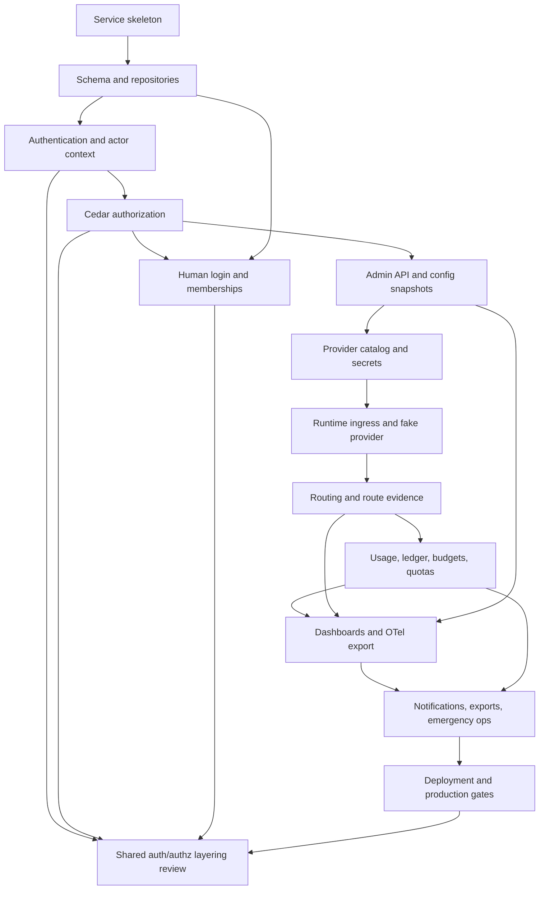

# Gateway Implementation Plan Memo

Status: implementation planning memo.

Date: 2026-06-24.

This memo translates the gateway specs into an implementation sequence. It is
not a schedule and does not estimate time. It defines the order that minimizes
rework, keeps CI useful, and preserves the service boundaries described in the
gateway specs.

## Scope

This plan covers the first production-shaped implementation of
`crates/starweaver-gateway`.

Included:

- HTTP runtime and admin service skeleton
- PostgreSQL migrations and repository layer
- Redis-compatible hot-state integration
- API key authentication and session authentication
- Cedar-backed authorization
- provider catalog, model aliases, routing groups, and route policies
- OpenAI-compatible fake provider and first real provider adapter boundary
- usage events, cost ledger, budgets, quotas, and rate limits
- config snapshot publication and worker reload
- built-in realtime dashboard backed by hot state
- OpenTelemetry metrics export for user-owned dashboards
- generic OIDC login, users, organizations, and projects
- Codex upstream OAuth credential lifecycle
- notifications, exports, operational runbooks, and deployment packaging
- final shared auth/authz layering review with the agent platform once both
  services have concrete requirements

Excluded from v1:

- generic upstream OAuth provider discovery beyond Codex
- paid billing, invoices, seats, plans, and payment APIs
- multi-region accounting as a required runtime property
- external authorization services as required infrastructure
- early shared service crates before a second concrete service owner exists
- platform service implementation details beyond versioned HTTP contracts

## Implementation Progress

Last updated: 2026-06-28.

Completed foundation slices:

- Gateway service shell with health, readiness, version, request id, error
  envelope, typed configuration, and fake local dependencies.
- Gateway request-id middleware now preserves safe client request ids, replaces
  unsafe request ids, and injects the effective id into structured error
  envelopes as well as response headers.
- Gateway trace-id middleware now preserves safe gateway trace ids, derives
  trace ids from W3C `traceparent` when present, generates trace ids when
  absent, and carries the effective trace id into error envelopes, actor
  context, route decisions, usage events, and audit evidence.
- Gateway request handling now enforces a configurable inbound timeout through
  the shared middleware chain and returns the stable gateway error envelope with
  the effective request id.
- Durable schema and in-memory repository boundaries for tenants,
  organizations, projects, users, API keys, role bindings, action grants,
  provider grants, catalog resources, config snapshots, usage, audit, sessions,
  invitations, and idempotency keys.
- API key authentication foundations with tenant, organization, project,
  principal, key-status, expiry, action, and resource narrowing evidence.
- Runtime ingress foundation for the supported protocol families, fake provider
  replay, route planning, route evidence, and catalog-backed model alias
  resolution.
- Fake provider replay now has explicit deterministic negative outcomes for
  provider errors, throttling, timeouts, malformed streams, and client
  disconnects, with authorization evidence still recorded before the provider
  outcome is applied.
- Authorization foundations with canonical gateway actions, built-in role
  grants, API key owner narrowing, item-level helpers, Cedar policy validation,
  and Cedar policy evaluation from the latest published config snapshot.
- Route metadata now records action id, resource kind, scope parameters, API key
  allowance, strong-auth requirement, and audit event type for each foundation
  route.
- Route simulation now exposes a read-only admin API over the same published
  catalog, provider grant closure, hot-state health filters, and route planner
  used by runtime ingress. Simulation responses explain selected, blocked, and
  no-route outcomes and explicitly report that no upstream call was made.
- Route decision and route attempt evidence now have strong-auth admin read
  APIs with tenant-bound filtering, cursor pagination, detail reads, route
  debug authorization, API-key denial, OpenAPI coverage, and parent-decision
  scope checks for attempt evidence.
- PostgreSQL route evidence foundations now include additive migration coverage
  for trace and sticky-route fields, release checksum coverage, and durable
  adapter methods for inserting and listing route decisions and attempts by
  tenant.
- Gateway route evidence runtime paths now use an explicit AppState durable
  bridge: runtime route decisions, runtime policy blocks, and provider attempt
  evidence continue to be observable in the in-memory foundation store while
  optionally writing to PostgreSQL, and admin route evidence APIs read from the
  durable adapter when it is attached.
- Gateway startup now builds app state through an explicit startup path that
  validates configuration, bootstraps local single-user state, connects to
  PostgreSQL when `STARWEAVER_GATEWAY_DATABASE_URL` is configured, runs embedded
  migrations, and attaches the durable route-evidence bridge before the router
  and background workers are exposed.
- Gateway HTTP authentication now uses the attached PostgreSQL store for API
  key candidate lookup, session-token lookup, project-membership checks, and
  API-key last-used updates when durable storage is configured, while preserving
  the deterministic in-memory resolver for local replay and foundation tests.
- Runtime route simulation and model ingress now load the latest tenant-scoped
  published config snapshot document from PostgreSQL when durable storage is
  attached, so catalog routing and runtime Cedar policy evaluation no longer
  depend only on the in-memory config snapshot store.
- Runtime ingress now constructs a redaction-safe provider adapter request
  boundary from the selected catalog route, provider endpoint, upstream model
  id, and optional runtime credential material. The current execution path
  remains deterministic fake-provider replay, but the provider-facing URL,
  model rewrite, authorization header shape, and safe metadata contract are now
  covered before enabling live provider transport.
- Sticky routing now uses Redis-compatible hot-state mappings keyed by tenant,
  project, model alias, and a hashed affinity header. Runtime routing reuses a
  fresh sticky target when it is still eligible, records sticky hit or miss
  evidence on route decisions, rewrites mappings after successful selections,
  and reports sticky hit and miss counts in built-in dashboard rollups.
- Provider grants support organization and project scopes, allow and deny
  effects, closure modes, descendant traversal over alias, route policy,
  routing group, model target, provider endpoint, and pricing SKU resources,
  plus legacy provider endpoint grant compatibility.
- Admin config snapshot API kernel exposes list, get, validate, publish, and
  rollback routes over the shared authorization path. Publish and rollback use
  session strong-auth, idempotency replay protection, immutable snapshot
  writes, and append-only audit events. Validation is a dry run and does not
  publish snapshots.
- Config publication convergence now writes a durable latest-publication
  pointer, Redis-compatible invalidation event evidence, and worker reload
  evidence. Realtime dashboards report whether workers converged by
  invalidation or durable pointer polling, including missed-invalidation count,
  last-known-good snapshot, and publication lag.
- Project admin API exposes list, get, and status update routes using the
  common resource envelope. Project list uses item-level authorization
  filtering, and status updates enforce optimistic concurrency and write
  append-only audit events.
- Organization, organization member, and project member admin APIs expose list,
  get, and status update routes. Lists use item-level authorization filtering,
  and status updates enforce optimistic concurrency and write append-only audit
  events for the affected organization or membership resource.
- Provider endpoint and upstream credential admin APIs expose dry-run
  validation, idempotent create, list, get, and status update routes. Provider
  endpoint validation rejects unsafe base URLs, and upstream credential read
  APIs return only safe credential metadata and `secret_ref_id`, never raw
  secret material.
- Codex-only upstream OAuth foundations now expose strong-auth admin APIs for
  connection create/list/get/status update, connection-scoped session
  start/list, session get/revoke, and refresh status. Token bundles are stored
  through `SecretRef`, session and audit responses mask secret refs, API-key
  access is denied for lifecycle routes, and generic upstream OAuth remains out
  of v1.
- Model target admin API exposes dry-run validation, idempotent create, list,
  get, and status update routes. Validation checks provider endpoint protocol
  compatibility and upstream credential endpoint consistency before targets can
  be persisted.
- Routing group and routing group target admin APIs expose dry-run validation,
  idempotent create, list, get, and status update routes. Routing group
  validation checks scoped name uniqueness and required protocol family. Group
  target validation checks routing group and model target ownership, protocol
  compatibility, organization compatibility, duplicate membership, and nonzero
  selection weight. Route policy and model alias APIs remain the next
  graph-binding slice so draft and publish semantics can be made explicit.
- Model alias and route policy admin APIs expose dry-run validation,
  idempotent create, list, get, and status update or binding routes. Model
  aliases are created as drafts without `route_policy_id`; route policies bind
  an existing alias to a compatible routing group; alias update then binds the
  default route policy. Validation checks alias namespace uniqueness, scoped
  project ownership, route policy name uniqueness, graph ownership, protocol
  compatibility, and organization compatibility.
- Provider grant admin API exposes spec-shape dry-run validation, idempotent
  create, list, get, and status update routes for organization and project
  scopes. Validation checks scope ownership, supported grant resource kinds,
  resource existence, allow/deny closure-mode compatibility, and duplicate
  grants.
- Pricing SKU admin API exposes dry-run validation, idempotent create, list,
  get, and status update routes. Pricing documents are created with immutable
  `pricing_version`, fixed-point `micro_usd` unit validation, ISO currency
  checks, effective-window validation, model/provider pattern validation, and
  safe audit diffs. Provider grants now accept `pricing_sku` resources once the
  SKU exists.
- Budget policy admin API exposes dry-run validation, idempotent create, list,
  get, and status update routes for tenant, organization, project, credential,
  alias, group, endpoint, and target scopes. Validation checks scope ownership,
  supported periods, limit kinds, cost-only currency, positive hard and soft
  thresholds, soft-limit ordering, overage mode, conservative consistency mode,
  duplicate policy shape, and safe audit diffs. Runtime preflight,
  reservations, terminal ledger-backed finalization, and deduplicated redacted
  budget threshold notifications are handled incrementally in the usage/ledger
  and policy enforcement slices.
- Quota policy admin API exposes dry-run validation, idempotent create, list,
  get, and status update routes for rate, token, concurrency, stream-duration,
  and request-body counters. Validation checks tenant-owned scopes, protocol
  family scopes, counter/window/increment-source compatibility, hot-state loss
  behavior, positive limits, fail-limited fallback bounds, duplicate policy
  shape, and safe audit diffs. Runtime request-rate, request-body, concurrency
  reservation, terminal token-actual, stream-duration, policy-defined hot-state
  loss behavior, durable repair for usage-derived counters, and budget lease
  TTL reconciliation are implemented.
- OpenTelemetry export config admin API exposes dry-run validation,
  idempotent create, list, get, full config update, and disable routes behind
  observability export actions. Validation checks HTTPS collector endpoints,
  metrics-only v1 signal support, secret-backed header refs, bounded static
  resource attributes, tenant/project scope consistency, duplicate config
  shape, strong-auth write access, and safe audit diffs.
- OpenTelemetry exporter worker execution now performs real OTLP/HTTP metrics
  export with secret-backed collector headers, bounded JSON payloads, request
  timeouts, collector response handling, dropped-metric accounting, exporter
  health evidence, and readiness/realtime-dashboard health reporting. Synthetic
  exporter transport remains available only for deterministic outage tests and
  dry-run harnesses. `otlp_grpc` configs are not treated as delivered until a
  real gRPC transport is implemented.
- Production background worker scheduling now runs inside the gateway process
  when enabled. Each tick scans known tenants, delivers due notification outbox
  events with a bounded per-tenant batch limit, exports only due OpenTelemetry
  configs according to their configured intervals, and runs runtime policy
  reconciliation without stopping the scheduler on a failed tenant subtask.
- Notification sink and subscription admin APIs expose dry-run validation,
  idempotent create, list, get, and status update routes behind notification
  actions. Validation checks tenant/project scope consistency, HTTPS webhook
  endpoints, secret-backed webhook signing refs, safe endpoint and filter
  documents, supported event families, duplicate config shape, strong-auth
  write access, and safe audit diffs.
- Realtime overview dashboard API exposes the first built-in operational
  dashboard read endpoint backed by Redis-compatible hot-state boundaries and
  durable route evidence. The response reports provider health and drain
  posture, route decision counts, active budget and quota policy counts,
  config version, partial-data markers, and unavailable source markers without
  querying an OpenTelemetry metrics backend.
- Scoped dashboard overview APIs expose tenant, organization, project, and
  project-member read endpoints over the shared authorization path. The first
  responses aggregate durable route decision and attempt evidence, preserve
  tenant boundaries even when organization or project ids overlap, and mark
  usage ledger, budget, quota, and latency rollups as unavailable until the
  accounting rollup slice lands.
- API key, model alias, model target, and provider endpoint observability
  dashboard read endpoints now use the same route evidence aggregation path.
  They validate the requested resource in the tenant, preserve tenant
  boundaries across overlapping ids, and expose source markers without raw
  prompts, completions, credentials, or provider payloads.
- Service account admin and dashboard APIs expose concrete service account
  resources with idempotent create, list, get, status update, audit evidence,
  and service-account dashboard scopes from durable route evidence.
- Validation diagnostics now persist safe dry-run validation evidence for admin
  validation APIs, expose a tenant-scoped diagnostic list, and surface validation
  health in realtime dashboards without mutating config snapshots or audit logs.
- Audit event admin API now exposes a tenant-scoped, strong-auth-only event list
  endpoint with exact-match filters, bounded cursor pagination, route-level API
  key denial, and redacted diff responses. Upstream credential audit diffs now
  mask secret ref ids before events are stored.
- Runtime success paths now append immutable usage events with request, actor,
  membership, route, provider, protocol, usage confidence, token, latency, and
  fixed-point cost metadata, then fold them idempotently into event, minute,
  hour, day, and month ledger buckets. Built-in dashboard overview APIs consume
  these durable ledger buckets for token, cost, usage-confidence, and latency
  measures across tenant, organization, project, project member, API key, model,
  target, and provider scopes without reading the OpenTelemetry backend.
- Usage analytics admin APIs now expose summary, timeseries, paginated event
  rows, and project, project-member, model, and provider-endpoint breakdowns
  from durable usage events and ledger buckets. Scope resolution uses the same
  tenant, organization, project, member, API key, service-account, model,
  provider, route-policy, routing-group, and protocol-family boundaries as the
  dashboard authorization path, and never queries the OpenTelemetry backend.
- Runtime policy preflight now enforces active hard budget policies with
  `block_new_requests` over request, token, and cost ledger dimensions, plus
  active request-rate and request-body-byte quota policies over the
  Redis-compatible hot counter boundary. Blocked requests return stable 429
  error codes, record blocked route evidence, and do not write route attempts or
  terminal usage events.
- Runtime policy ordering now records route authorization before budget and
  quota checks, enforces budget/quota preflight before provider attempts, and
  only builds provider responses after runtime policy gates pass. Request-count
  hard budget policies now acquire Redis-compatible in-flight reservations and
  release them after terminal usage, so overlapping preflights cannot exceed the
  hard request cap before the durable ledger catches up.
- Runtime quota enforcement now acquires and releases `concurrent_request` and
  `concurrent_stream` reservations over the Redis-compatible policy counter
  boundary. Terminal usage events increment `token_actual_rate` counters, and
  terminal streaming requests increment `stream_duration` counters so later
  preflights can block once actual token usage or stream duration reaches the
  configured quota window limit.
- Runtime policy reconciliation now repairs usage-derived quota hot counters
  from durable usage events for `token_actual_rate` and `stream_duration`, only
  increasing counters when durable evidence proves hot state is stale. Each
  enforcement-impacting repair writes redacted audit evidence without raw
  hot-state keys.
- Runtime request-budget reservations now record short-lived lease evidence.
  Runtime policy reconciliation expires stale budget leases after their TTL,
  decrements the in-flight reservation counter idempotently, and writes redacted
  system audit evidence so strict budget scopes can recover from crashed or
  abandoned preflights without treating the lease counter as durable usage.
- Built-in realtime overview now surfaces budget conservative-mode operator
  evidence for hard-blocking budget policies when runtime policy hot state is
  unavailable, including affected scope metadata, fail-closed fallback, and
  runtime budget lease counts.
- Notification outbox foundations now persist redacted outbox events and
  delivery attempt evidence. Runtime budget and quota policy blocks enqueue
  subscribed budget or quota events without including request bodies, provider
  bodies, or secret material. The delivery worker marks stdout sinks delivered
  and now performs real HTTP webhook `POST` delivery with bounded timeouts,
  HMAC signatures, safe delivery metadata, response-status classification,
  retryable failure scheduling, permanent failure recording, and dead-letter
  transition after the configured retry budget. Synthetic delivery remains
  available only for deterministic tests and dry-run harnesses. Webhook URLs
  require HTTPS except for loopback HTTP in local/test profiles. Delivery
  polling has explicit coverage for bounded batch limits, created-order
  delivery, real local HTTP delivery, signing secret rotation, retryable
  failures, permanent failures, dead-letter replay, and payload redaction.
- Usage and audit export job foundations now expose strong-auth admin APIs for
  creating export jobs, listing jobs with cursor pagination, reading job
  metadata, and reading manifests. The in-memory object writer boundary emits
  deterministic object refs, retention expiry, byte counts, checksums, and
  redacted inline manifests while keeping raw request bodies, provider bodies,
  and secret material out of export payloads.
- Object-backed exports now support both local file-backed and external HTTP
  object storage writers. `storage_backend: file_object_storage` writes
  redacted JSON payloads under the absolute directory configured by
  `STARWEAVER_GATEWAY_EXPORT_OBJECT_STORAGE_DIR` and returns logical object refs
  without leaking the local root. `storage_backend: object_storage` writes the
  same redacted payload with `PUT {base}/{tenant_id}/{export_job_id}.json` to
  the HTTPS base URL configured by
  `STARWEAVER_GATEWAY_EXPORT_OBJECT_STORAGE_URL`, optionally using
  `STARWEAVER_GATEWAY_EXPORT_OBJECT_STORAGE_AUTHORIZATION`. Both object-backed
  paths preserve fail-closed manifests for unconfigured writers, unsafe URLs, or
  write failures.
- Emergency operation foundations now expose strong-auth admin APIs for
  disabling upstream credentials, disabling provider endpoints, draining
  routing groups, freezing config mutations, rolling back config snapshots,
  forcing budget blocks, and listing or reading emergency operation evidence.
  Each operation requires a reason, expiry, idempotency key, audit event, and
  operator-alert evidence; config freeze blocks non-emergency admin mutations
  while still allowing emergency operations and config rollback.
- Operations docs now include incident runbooks for upstream credential leaks,
  provider outages, runaway spend, failed migrations, OpenTelemetry exporter
  outages, and Redis-compatible hot-state outages.
- Gateway deployment packaging now includes a Linux `amd64` Docker image,
  local Makefile image build target, pull-request image smoke build, scheduled
  `main` nightly GCR publication, and release-tag or GitHub-release GCR
  publication using GitHub OIDC Workload Identity Federation. Published nightly
  and release images now request BuildKit SBOM and provenance attestations and
  upload image metadata artifacts containing the image digest, tags, labels,
  generated OpenAPI schemas, generated migration checksums, and `SHA256SUMS`.
- Agent platform deployment packaging now includes public health, readiness,
  and version probes plus a Linux `amd64` Docker image. The image workflow uses
  a service matrix so both gateway and platform images are smoke-tested on pull
  requests and published as nightly or release images to GCR with the same
  artifact metadata contract.
- Production profile gates now reject unsafe startup configuration when
  `STARWEAVER_GATEWAY_ENV` is `prod` or `production`: missing PostgreSQL URL,
  missing Redis-compatible URL, in-memory HTTP runtime store, unsupported
  runtime store profiles before PostgreSQL repository wiring is complete,
  in-memory secret backend, disabled telemetry, missing HTTPS public base URL,
  missing or unsafe CORS origins, insecure browser session cookie policy,
  missing published-snapshot requirement, or an invalid body limit. `/readyz`
  now reports profile validity and dependency readiness details.
- Fake-provider load and soak harnesses now run through `xtask` and Makefile
  targets. The default CI-sized harnesses exercise every foundation protocol
  replay case, including streaming behavior and provider-native denial, through
  the shared authorization path without live provider secrets or external
  services.
- Gateway contract checks now run through `xtask` and `make ci`, tying route
  metadata, replay cases, protocol family coverage, authorization action ids,
  provider-native denial contracts, and generated OpenAPI extensions together so
  a protocol cannot be added to one surface without the others.
- GitHub Actions now exposes OpenAPI and gateway contract checks as named CI
  steps, and repository automation verifies that image release artifacts carry
  the generated OpenAPI schemas alongside image metadata.
- Release migration checksum manifest generation and checks now cover embedded
  gateway and platform SQL migrations, run through `make ci`, and are included
  in nightly and release image artifact bundles.
- GitHub Actions now runs the gateway fake-provider load harness, soak harness,
  and restore rehearsal as a named Linux CI job instead of relying only on local
  `make ci`.
- Backup and restore operations docs now cover PostgreSQL, object storage,
  secret refs, config snapshots, audit evidence, usage evidence, release
  metadata, restore ordering, and verification gates. A deterministic
  `gateway-restore-rehearsal` target restores config snapshots, secret refs plus
  backend values, audit events, usage events, and rebuilt ledger aggregates into
  a fresh in-memory store and runs in `make ci`.
- Shared auth/authz layering review now records a decision draft under
  `spec/shared/02-auth-authz-layering.md`: keep gateway and platform authn/authz
  service-local for now, share only versioned contracts, and extract shared
  identity or policy crates only after both services have concrete owners and
  contract tests. Initial cross-service contract tests now prove gateway/platform
  action namespace separation, shared tenant/organization/project scope labels,
  service-specific actor gates, resource-kind compatibility, and built-in role
  namespace isolation without adding a shared runtime crate.
- Agent platform auth/authz foundations now define platform-local
  `platform.*` actions, built-in roles, actors, resource refs, grants,
  in-memory authorization, and item filtering for conversations, sessions, runs,
  approvals, deferred tools, environment attachments, and evidence archives.
  Tests prove namespace separation from gateway actions, project and
  organization scope behavior, resource-kind compatibility, item-level filtering,
  and user-only action denial for service accounts.
- Agent platform route metadata now maps the first conversation, run, approval,
  deferred-tool, environment-attachment, and evidence-archive HTTP surfaces to
  stable platform actions, resource kinds, path resource ids, and user-only route
  requirements before any handler can read or mutate resources.
- Agent platform storage ownership foundations now record resource kind, resource
  id, tenant, organization, and project ownership independently of handler
  business records. Tests prove owner-key kind/id separation, invalid ownership
  shape rejection, route metadata to owner resolution, and cross-project denial
  from resolved owner metadata.
- Agent platform HTTP authorization foundation now connects route metadata,
  resource ownership, and platform-local authorization before handler business
  logic. Tests cover concrete run, conversation, approval, environment
  attachment, and evidence archive routes, including missing authentication,
  missing owner, cross-project denial, service-account denial for user-only
  approval decisions, and colon action path matching.
- Agent platform authentication foundation now resolves `Authorization: Bearer`
  opaque session tokens through a platform-local session store before route
  authorization. Session tokens are stored by hash, active sessions resolve to
  `AuthenticatedActor`, and revoked, unknown, missing, or malformed sessions are
  rejected before resource ownership checks.
- Agent platform bearer credential foundation now resolves API key and service
  token credentials through the same actor-resolution boundary. Credential
  tokens are stored by hash, API keys can authorize read handlers through the
  same ownership and grant path as sessions, service tokens resolve to
  service-account actors and cannot use user-only actions, and a revoked session
  does not fall back to an API key with the same raw bearer token.
- Agent platform business resource foundations now store safe typed projections
  for conversations, runs, approvals, deferred tools, environment attachments,
  and evidence archives separately from authorization ownership. Authorized
  handlers return concrete business envelopes for conversation read, run read
  and cancel, approval decision, environment health, and evidence archive read
  routes. Missing owner records and missing business records return `404` at
  the appropriate phase.
- Human login documentation now treats generic OIDC as the standard external
  login provider. Non-OIDC OAuth providers require an OIDC broker or a
  separately reviewed OAuth adapter before direct login support is exposed.
  OIDC remains separate from upstream provider OAuth credentials and validates
  issuer, audience, nonce, PKCE, expiry, JWKS-backed ID token signatures, and
  unknown signing-key rejection.
- Gateway human-login runtime now accepts only generic OIDC identity providers.
  Direct non-OIDC OAuth adapter paths, callback exchange paths, test mocks, and
  schema allowances were removed; deployments that want non-OIDC identity
  sources must configure an OIDC broker or wait for a separately reviewed OAuth
  adapter.
- Agent platform durable schema foundation now embeds the first platform
  PostgreSQL migration and migration entrypoint. The schema covers tenant,
  organization, project, principal, membership, identity provider, generic OIDC
  external identity, auth session, bearer credential, resource owner, safe
  business-resource, and idempotency-key tables. Tests lock the embedded
  migration version, generic OIDC requirements, resource-owner key shape,
  business table coverage, read-path indexes, and the rule that raw bearer
  credentials are never stored.
- Agent platform PostgreSQL repository adapter now provides typed async methods
  for durable auth session resolution, API key and service-token credential
  resolution, resource owner lookup, and safe business-resource projection
  persistence. Tests lock token-hash-only queries, actor-kind mapping, owner
  kind/id keys, project-scope requirements, and the coverage from every safe
  business projection to its durable table.
- Agent platform mTLS actor-resolution foundation now maps verified client
  certificate subjects or SPIFFE ids to scoped platform actors. The schema,
  in-memory store, PostgreSQL adapter, and HTTP foundation tests cover active,
  unknown, revoked, disabled, expired, and principal-disabled identity states.
  The HTTP surface uses a verified-subject header intended only for trusted
  mTLS terminators that strip inbound spoofed headers before injection.
- Agent platform HTTP state now has an explicit repository backend selector.
  The `in_memory` backend keeps deterministic foundation stores for local
  tests, while the `postgres` backend routes auth session, bearer credential,
  mTLS identity, resource-owner, and safe business-resource reads through the
  durable PostgreSQL adapter without changing route metadata, action ids,
  policy evaluation, or response envelopes.
- Agent platform HTTP request handling now matches the gateway foundation with
  configurable body limits, inbound request timeouts, generated or preserved
  request ids, and request-id injection into structured error envelopes.
- Agent platform startup configuration now reads `STARWEAVER_PLATFORM_*`
  settings for listen address, environment, database URL, and repository
  backend. Production profiles reject accidental in-memory repository exposure,
  and selecting the `postgres` backend requires a durable PostgreSQL URL in any
  environment.
- Agent platform binary startup now validates `PlatformConfig`, builds
  deterministic in-memory foundation state for local replay, or connects to
  PostgreSQL, runs embedded migrations, and constructs repository-backed service
  state before binding the HTTP listener. The binary also exposes `migrate run`
  and `migrate check` commands for the embedded platform schema.
- Agent platform local single-user login foundation now parses
  disabled-by-default environment credentials, redacts the configured password
  from debug output, exposes `POST /auth/v1/single-user/login` only when
  configured, returns an opaque bearer session token, stores only the session
  hash through the existing platform session repository boundary, and grants the
  default local user tenant-owner permissions through the platform-local
  authorization engine.
- Agent platform durable single-user bootstrap repair now seeds or repairs the
  default tenant, organization, project, principal, user, memberships,
  single-user identity provider, external identity, and tenant-owner role
  binding before the PostgreSQL-backed HTTP listener is exposed.
- Agent platform generic OIDC contract foundation now validates tenant-owned
  provider shape and verified ID-token claim envelopes for issuer, audience,
  nonce, subject, expiration, HTTPS endpoints, `openid` scopes, and active
  provider status without sharing gateway HTTP handlers or repositories.
- Agent platform OIDC login-attempt persistence now stores state, nonce, and
  PKCE verifier hashes only, records status, expiry, redirect URI, and consumed
  timestamps, and exposes repository lookup by hashing callback state before
  querying PostgreSQL.
- Agent platform OIDC login completion now has a durable transaction that
  consumes an active unexpired attempt once, repairs the subject-derived local
  user default organization/project, membership graph, organization-admin role,
  external identity, and auth session, and fails closed if a provider subject is
  already linked to a different local principal.
- Agent platform generic OIDC validation now resolves explicit or discovered
  provider metadata, rejects discovery issuer mismatches, accepts only
  asymmetric ID-token signing algorithms, validates JWKS-backed ID-token
  signatures, and enforces issuer, audience, nonce, subject, and expiration
  before producing service-local verified claims.
- Agent platform OIDC HTTP callback foundation now exposes
  `POST /auth/v1/providers/{identity_provider_id}/callback`, loads provider
  config and login attempts through the selected platform repository boundary,
  compares callback nonce and PKCE verifier values against stored hashes before
  token exchange, exchanges authorization codes with public PKCE client form
  parameters, fetches JWKS through a testable HTTP transport boundary, validates
  ID tokens, records the auth session, and rejects replayed attempts.
- Agent platform identity-provider and secret-ref management now exposes
  service-local admin/read APIs for generic OIDC provider config and platform
  `SecretRef` metadata, writes resource-owner rows for authorization, rejects
  raw provider client secrets, masks attached provider secret refs, keeps raw
  secret values out of durable tables and read responses, and supports
  confidential generic OIDC callbacks with `client_secret_basic` or
  `client_secret_post` token endpoint authentication through the platform secret
  repository boundary.
- Agent platform auth provider discovery and generic OIDC login/start APIs now
  expose safe public login projections, list the single-user password provider
  only when configured, list active generic OIDC providers only for an explicit
  tenant query, create one-time login attempts through the selected repository
  backend, support both `GET /auth/v1/providers/{id}/login` and
  `POST /auth/v1/providers/{id}/start`, and return authorization URLs with
  PKCE S256 client state without leaking provider client secrets, secret refs,
  authorization codes, ID tokens, provider access tokens, or refresh tokens.
- Agent platform `/auth/v1/*` route metadata now classifies public login,
  session-bound browser, and action-authorized routes explicitly. OIDC callback
  and single-user login use canonical `platform.auth_session.create` evidence
  instead of reusing read/update/revoke session actions.
- Agent platform membership admin foundations now expose organization and
  project membership list/get/status routes, canonical membership read/write
  actions, optimistic concurrency on status mutation, in-memory and PostgreSQL
  repository paths, and organization-member inactive-status cascade to child
  project memberships so project access cannot outlive organization access.
- Agent platform organization-member create/reactivate API now exposes
  `POST /admin/v1/organizations/{organization_id}/members`. It validates
  membership kind, uses canonical `platform.organization_member.write`, is
  idempotent by organization/principal, reactivates suspended or removed
  memberships, and supports in-memory and PostgreSQL repository backends.
- Agent platform organization invitation foundations now expose admin
  create/list/get/revoke routes plus public preview and authenticated accept
  routes. Raw invitation tokens are returned only once, durable storage keeps
  token hashes only, principal-target accept upserts organization and project
  memberships, and email-target invitations are safe to create/preview without
  granting access by email until a verified user-profile lookup contract exists.
- Agent platform user session self-management now exposes current-session read,
  logout, active-organization switch, and active-project switch APIs. These
  APIs resolve only opaque user auth sessions, return session-bound CSRF
  metadata on login and session read, require
  `x-starweaver-platform-csrf-token` for session mutations and invitation
  accept, validate active organization/project membership before context
  switches, and never return session token hashes after login. Single-user and
  generic OIDC logins now share this browser session contract.
- Agent platform project-member create/reactivate API now exposes
  `POST /admin/v1/projects/{project_id}/members`. It requires an active parent
  organization membership, derives principal and membership kind from that
  parent record, uses the canonical `platform.project_member.write` path,
  supports in-memory and PostgreSQL repository backends, and rejects inactive
  parents or cross-organization project assignment.
- Agent platform external identity management now exposes user-scoped admin
  list/get/unlink routes. Generic OIDC and single-user login paths record
  external identity links in the in-memory and PostgreSQL repository contracts,
  unlink marks non-single-user identities deleted, single-user identities cannot
  be unlinked through admin API, and canonical
  `platform.external_identity.read`/`platform.external_identity.unlink`
  actions are covered by route metadata and tests.
- Agent platform role binding management now exposes admin
  list/create/get/status APIs over tenant, organization, and project scopes.
  Dynamic role bindings are stored in in-memory and PostgreSQL repository
  backends, feed the same canonical action-grant authorization path as static
  grants, and require active organization or project membership before scoped
  bindings grant access.
- Agent platform organization member removal now has an explicit
  `POST /admin/v1/organizations/{organization_id}/members/{member_id}/remove`
  route. Removal uses optimistic concurrency, cascades child project
  memberships, deletes matching organization/project role bindings, and shares
  the same cascade behavior when the generic status route sets `removed`.
- Agent platform tenant-scoped user administration now exposes
  `GET /admin/v1/users`, `GET /admin/v1/users/{user_id}`, and
  `POST /admin/v1/users/{user_id}/status`. User records are stored behind
  in-memory and PostgreSQL repository contracts, status updates use optimistic
  concurrency, disabled or deleted users cannot obtain new single-user or
  generic OIDC login sessions, and disabling or deleting a user marks active
  sessions as `principal_disabled`.
- Agent platform admin user-session management now exposes
  `GET /admin/v1/users/{user_id}/sessions` and
  `POST /admin/v1/users/{user_id}/sessions/{auth_session_id}/revoke`. The
  routes are tenant scoped, use canonical `platform.auth_session.read` and
  `platform.auth_session.revoke` authorization, verify that sessions belong to
  the target user, and return only redacted session projections.
- Agent platform audit-event foundations now provide redacted in-memory and
  PostgreSQL event envelopes for sensitive user status and user-session revoke
  mutations. Those mutations require an explicit strong-auth confirmation field
  before mutating state and return the written audit event id.
- Agent platform audit-event admin listing now exposes
  `GET /admin/v1/audit-events` over canonical `platform.audit_event.read`
  authorization. The endpoint requires explicit strong-auth confirmation, supports
  tenant/org/project-scoped filtering and pagination, and returns only redacted
  audit event envelopes.

Next implementation focus:

- Keep shared auth/authz extraction deferred behind the two-owner contract-test
  gate now that both gateway and platform have concrete auth evidence.
- Continue hardening any required OTLP/gRPC transport only when the metrics
  backend contract needs it.

## Implementation Principles

- Implement one binary first, with internal role boundaries that can later split
  into runtime, admin, accounting, notification, and migration roles.
- Keep PostgreSQL as the system of record. Redis-compatible hot state is for
  realtime operations, counters, health hints, stickiness, config
  invalidation, and dynamic decisions.
- Treat OpenTelemetry as the operator-owned export surface for long-term
  dashboards. Do not query the metrics backend for the built-in realtime
  dashboard.
- Build route/action/resource authorization once and use it for model ingress,
  admin APIs, auth APIs, dashboards, and exports.
- Add only the dependencies needed by the current implementation stage.
- Prefer fake provider and local deterministic tests before any live provider
  smoke test.
- Keep every stage mergeable with CI green.

## Stage 0: Service Skeleton And CI Baseline

Goal: turn the gateway crate from a placeholder into a runnable service shell
without committing to storage or provider behavior too early.

Work items:

- Add an `axum` binary entry point under `crates/starweaver-gateway`.
- Add typed configuration loading for listen address, environment profile,
  database URL, Redis URL, secret backend profile, and telemetry profile.
- Add `/healthz`, `/readyz`, and build/version endpoints.
- Add request id, trace id, structured error envelope, body size limits, and
  timeout middleware.
- Add a typed `AppState` with dependency traits, not concrete global clients.
- Add local dev configuration examples and keep existing Makefile/CI targets
  green.

Acceptance evidence:

- `cargo test --workspace --all-targets --all-features --locked` passes.
- Handler tests cover health, readiness, request context propagation, and error
  envelope shape.
- Docs explain how to run the gateway locally with fake dependencies.

Feasibility review:

- This stage is low risk because it does not require database schema, provider
  logic, or policy compilation.
- The main risk is adding framework abstractions that later hide tenancy or
  authorization context. Keep the state and middleware explicit.

Ordering rationale:

- Every later stage needs a real service shell for handler tests, OpenAPI
  annotations, middleware behavior, telemetry, and deployment packaging.

## Stage 1: Schema, Migrations, And Repository Boundaries

Goal: establish durable resource ownership before implementing runtime
behavior.

Work items:

- Add SQL migrations for tenants, organizations, projects, users, service
  accounts, API keys, role bindings, action grants, provider grants, provider
  endpoints, upstream credentials, secret refs, model targets, model aliases,
  routing groups, route policies, config snapshots, usage events, ledger
  buckets, audit events, auth sessions, login providers, invitations, and
  idempotency keys.
- Add repository traits and `sqlx` implementations for each resource family.
- Add optimistic concurrency fields, soft-delete/status fields, audit actor
  fields, and schema version fields.
- Add migration checks to startup and CI.
- Add test fixtures for tenant, organization, project, user, and API key seed
  data.

Acceptance evidence:

- Migrations apply from an empty database.
- Migrations reject missing required indexes and constraints in repository
  tests.
- Repository tests prove tenant/org/project scoping, idempotent create, status
  transitions, and optimistic concurrency.
- No read path returns raw secret values or raw API key material.

Feasibility review:

- This stage is feasible with `sqlx` and PostgreSQL, but the schema is large.
  Keep the first migration complete enough for v1 boundaries, then use additive
  migrations for later columns.
- The risk is trying to implement handler behavior while the resource model is
  still moving. Keep stage output focused on storage contracts and fixtures.

Ordering rationale:

- Auth, config publication, routing, usage, dashboards, and audits all depend
  on stable durable ids and scope columns.

## Stage 2: Authentication Foundations

Goal: resolve every request into a stable authenticated actor.

Work items:

- Implement API key creation with one-time raw key return, visible prefix, PHC
  Argon2 hash, hash profile version, status, expiration, owner principal, and
  project binding.
- Implement bounded API key verification by prefix candidate lookup, status
  prefilter, Argon2 verification, and failed-auth rate limiting.
- Implement opaque server-side session storage for future login flows.
- Implement an `AuthenticatedActor` builder that handles user sessions, API
  keys, service account tokens, internal service identities, and system tasks.
- Add auth middleware that produces actor context before route authorization.
- Add secret wrappers and redaction-safe debug output for authn structures.

Acceptance evidence:

- Tests cover malformed keys, wrong prefix, wrong secret, disabled keys, expired
  keys, rotated keys, owner narrowing, and last-used update batching.
- Session token hashes are stored; raw session tokens are not stored.
- Actor context is persisted into audit tests without relying on mutable user
  table lookup after the request.

Feasibility review:

- API key auth is straightforward. The sensitive part is avoiding
  hash-amplification DoS and stale positive caches after key disable.
- Keep positive auth caches short-lived and version-scoped, and do not cache a
  successful key verification in a way that bypasses status changes.

Ordering rationale:

- Authorization and all protected handlers need authenticated actor context.
  Implementing authn before policy avoids route-specific shortcuts.

## Stage 3: Authorization Engine And Canonical Action Matrix

Goal: make model ingress, admin APIs, auth APIs, dashboards, and exports use one
authorization path.

Work items:

- Add `AuthorizationEngine` trait and Cedar-backed implementation.
- Generate or hand-maintain a Cedar schema from canonical resource kinds,
  action ids, and context fields.
- Encode built-in roles from `02-tenancy-access.md`.
- Encode API key owner narrowing, project-bound keys, disabled/expired key
  forbids, and provider grant closure checks.
- Add route metadata for required action id, resource kind, scope parameters,
  API key allowance, strong-auth requirement, and audit event type.
- Add item-level authorization helpers for list endpoints and export jobs.
- Add policy validation during config snapshot publication.

Acceptance evidence:

- Tests cover every action id in `10-authorization-api-keys.md`.
- Tests prove no handler uses an unregistered action string.
- List endpoint tests prove unauthorized items are filtered or denied.
- API key REST calls are denied unless both owner policy and key grant allow
  the action.
- Cedar schema validation runs in CI.

Feasibility review:

- Cedar is a good fit, but entity construction cost can become a hot-path risk.
  Benchmark realistic entity sets early and cache compiled policies per config
  version.
- If a narrow fast path becomes necessary, prove it is equivalent to Cedar for
  the covered action/resource set before enabling it.

Ordering rationale:

- A shared policy path must exist before admin CRUD, routing, dashboards, or
  exports are exposed. Otherwise handlers will grow incompatible permission
  checks.

## Stage 4: Admin Resource API And Config Lifecycle

Goal: make durable config manageable, validated, audited, published, and
rollbackable.

Work items:

- Implement admin CRUD for identity, tenancy, access, provider, catalog,
  routing, budget, quota, redaction, notification, dashboard, and observability
  export resources required by v1.
- Implement idempotency keys, optimistic concurrency, status transitions, soft
  delete, validation, history, and redacted audit diffs.
- Implement config bundles for validate/apply bootstrap flows.
- Implement immutable config snapshots with resource versions, checksum,
  diagnostics, and status.
- Implement publication convergence: database version pointer, Redis-compatible
  invalidation, worker polling, last-known-good snapshot, and rollback as a new
  snapshot version.
- Include `OpenTelemetryExportConfig` in runtime snapshot contents.
- [x] Add OpenAPI generation and annotate operation action ids.

Acceptance evidence:

- Admin handler tests cover create, update, patch, disable, validate, history,
  idempotency, and stale version conflicts.
- Snapshot tests prove workers converge after missed invalidation.
- Rollback tests prove workers load the newer rollback version, not an older
  snapshot number.
- Secret read tests return only `secret_ref_id`, mask, version, fingerprint,
  purpose, and timestamps unless a strong-auth locator path is used.

Feasibility review:

- The stage is broad. Keep it mergeable by enabling resource families in slices
  while preserving the common resource envelope and audit path.
- The key risk is making publication depend on Redis-compatible invalidation.
  Polling by config version must remain the correctness fallback.

Ordering rationale:

- Provider catalog, routing, budgets, login providers, dashboards, and telemetry
  export all need a config lifecycle before runtime workers can consume them
  safely.

## Stage 5: Provider Catalog, Secret Backend, And Codex Upstream OAuth

Goal: represent provider endpoints, upstream credentials, model targets, model
aliases, pricing SKUs, and Codex upstream OAuth without leaking secrets.

Work items:

- Implement `SecretBackend` trait with memory, file, database-encrypted, and
  external backend placeholders.
- Implement secret write, rotate, validate, masked read, and strong-auth raw
  locator read paths.
- Implement provider endpoint catalog using `upstream_base_url`, protocol
  families, health status, region/account metadata, timeout/header policies,
  and compliance labels.
- Implement upstream credentials with `secret_ref_id`, rotation state, dual-read
  rotation metadata, and credential validation hooks.
- Implement model targets, model aliases, pricing SKUs, and provider grants.
- Implement Codex-only upstream OAuth connection, session start/revoke,
  refresh status, and token storage through the secret backend.

Acceptance evidence:

- Tests prove no admin read, audit diff, log, trace, route decision, usage
  event, or dashboard response includes raw secret values.
- Catalog validation rejects protocol family mismatches, disabled credential
  references, invalid `upstream_base_url`, missing pricing for budget-enforced
  aliases, and attempts to configure generic upstream OAuth in v1.
- Codex OAuth tests prove token values stay in the secret backend and refresh
  status is safe metadata.

Feasibility review:

- Provider catalog is feasible once schema and config lifecycle exist. Secret
  backends are the main risk because production deployments vary widely.
- Keep backend-specific code behind a trait and start with memory/file/test
  implementations plus database-encrypted for small self-hosted deployments.

Ordering rationale:

- Routing cannot select targets until catalog, credentials, grants, and aliases
  exist. Codex OAuth is included here because it is an upstream credential
  lifecycle, not human login.

## Stage 6: Runtime Protocol Ingress And Fake Provider

Goal: run the complete request lifecycle against deterministic providers.

Work items:

- Implement OpenAI Responses-compatible ingress first, with bounded JSON body
  handling and streaming response support.
- Add request context extraction for tenant, organization, project, API key,
  model alias, protocol family, request id, and trace id.
- Implement fake provider adapters for non-streaming, streaming, errors,
  throttling, partial usage, missing usage, and malformed stream frames.
- Implement provider request builder boundary using provider endpoint,
  credential resolver, model target, headers, timeouts, and protocol family.
- Implement normalized error envelopes while preserving provider-compatible
  response shapes where promised.
- Reject unsupported multipart/media routes until a bounded body policy exists.

Acceptance evidence:

- Fake provider tests cover non-streaming success, streaming success, provider
  errors, timeouts, malformed responses, missing usage, and client disconnects.
- Request lifecycle tests cover authn, authz, alias resolution, provider grant
  closure, route selection, budget preflight stub, upstream attempt, usage event
  stub, and audit evidence.
- No provider stream is buffered unboundedly for retry, logging, or tracing.

Feasibility review:

- This stage is feasible if it starts with one protocol family and fake
  providers. Adding many provider families before the lifecycle is stable would
  multiply route and usage edge cases.
- Streaming cancellation and partial usage extraction are the main risks; fake
  provider fixtures should force these cases early.

Ordering rationale:

- Runtime ingress should come after catalog and authorization, but before real
  provider work. Fake providers let CI validate behavior without secrets.

## Stage 7: Routing, Health, Stickiness, And Failover

Goal: select provider targets predictably and record why every decision was
made.

Work items:

- Implement routing groups, route policies, route rules, weights, priority,
  deterministic selection, health filtering, provider grants, and model target
  compatibility checks.
- Implement Redis-compatible hot-state use for health hints, circuit state,
  stickiness, drain flags, and config invalidation.
- Implement route decision evidence and attempt evidence.
- Implement failover before response bytes are visible to the client; forbid
  mixed-provider visible streams.
- Implement route simulation using the same authorization and routing engine.
- Add provider endpoint health overrides and emergency drain.

Acceptance evidence:

- Tests cover allow/deny provider grants, target filtering reasons, disabled
  endpoints, health degradation, sticky routing hit/miss, drain behavior,
  deterministic route selection, and failover boundaries.
- Redis-compatible hot-state loss degrades according to policy and does not
  lose durable route evidence.
- Route simulation explains selected and filtered targets without calling
  upstream providers.

Feasibility review:

- Routing is feasible if route decision evidence is implemented with the router,
  not added later. Without evidence, dashboards and audits will need to infer
  mutable state.
- The main risk is sticky routing creating hidden state. Every sticky value
  needs owner, scope, TTL, and recovery behavior.

Ordering rationale:

- Budgets, usage, dashboards, and provider observability all depend on route
  decisions and attempt evidence.

## Stage 8: Usage, Cost Ledger, Budgets, Quotas, And Rate Limits

Goal: record usage and enforce cost-control policies without paid billing
features.

Work items:

- Implemented foundation:
  - usage events are recorded as immutable durable evidence and folded into
    event, minute, hour, day, and month ledger buckets;
  - runtime request budget preflight and reservation release block overlapping
    hard request budgets without double-reserving;
  - terminal usage finalization updates token-actual quota counters from
    provider usage payloads;
  - streaming runtime preflight acquires concurrent-stream reservations and
    terminal streaming finalization records stream-duration quota counters;
  - runtime policy reconciliation repairs usage-derived quota counters from
    durable usage events and records redacted audit evidence;
  - runtime budget reservations record TTL-bound lease evidence, and runtime
    policy reconciliation expires stale request-budget leases with redacted audit
    evidence;
  - realtime overview reports budget conservative-mode state, fail-closed
    fallback, affected scopes, and runtime lease counts for operator triage;
  - terminal budget finalization evaluates the just-written durable ledger,
    detects soft, hard, and custom threshold crossings, and enqueues deduplicated
    redacted budget notification events;
  - runtime policy hot-state loss is explicit: hard request-budget reservations
    fail closed, quota policies honor `fail_closed`, `fail_open`, and
    `fail_limited` with bounded local allowance evidence.
- Implement usage event writes with idempotency and immutable attribution:
  tenant, organization, project, project member, principal, API key, service
  account, model alias, model target, route policy, routing group, provider
  endpoint, protocol family, usage confidence, pricing SKU, and request status.
- Implement fixed-point cost estimates with pricing version.
- Implement ledger bucket folding for minute, hour, day, month, and event
  buckets.
- Implement budget policy preflight, reservation, finalizer, conservative stale
  mode, and hard-cap fail-closed default.
- Implement quota and rate-limit policies using Redis-compatible hot state and
  durable reconciliation where spend controls are affected.
- Implement usage export job records and cursor pagination.

Acceptance evidence:

- Tests prove retries do not double-count usage.
- Tests cover exact, partial, estimated, and missing usage.
- Ledger tests prove fixed-point cost and pricing version behavior.
- Budget tests cover reservation, finalizer, stale hot state, hard block,
  fail-limited emergency allowance, and reconciliation from durable ledger.
- Quota/rate-limit tests cover windowing, concurrency, cache loss, and policy
  fail mode.

Feasibility review:

- Usage writes are straightforward. Budget correctness is the hard part because
  hot counters and durable ledgers can diverge.
- Implement cost-only budgets first and keep paid billing out of the schema and
  API until explicitly designed.

Ordering rationale:

- Dashboards, notifications, exports, and model observability require durable
  usage, cost, and budget evidence.

## Stage 9: Human Login, Users, Organizations, And Projects

Goal: make the gateway usable by bare deployments and enterprise SSO without
depending on an external hosted identity product.

Work items:

- Implemented foundation:
  - local single-user password login is disabled by default and only enabled
    when `STARWEAVER_GATEWAY_SINGLE_USER_USERNAME` and
    `STARWEAVER_GATEWAY_SINGLE_USER_PASSWORD` are configured;
  - single-user login bootstraps the default tenant, organization, project,
    user, membership graph, and tenant-owner grants before issuing an opaque
    server-side session;
  - public auth provider discovery exposes the single-user password provider
    only when configured;
  - admin identity-provider configuration supports tenant-owned generic OIDC
    config documents with secret-reference redaction; non-OIDC OAuth providers
    are deferred behind an OIDC broker or a separately reviewed OAuth adapter;
  - external login start builds OAuth/OIDC authorization URLs with state, OIDC
    nonce, and PKCE S256 code challenge without returning client secrets or
    code verifiers;
  - external login start now persists one-time login attempts with hashed
    state, nonce, and PKCE verifier evidence plus a short-lived verifier secret,
    and the local deterministic callback adapter consumes attempts exactly once;
  - generic OIDC callbacks now exchange authorization codes with PKCE verifiers,
    resolve issuer discovery when endpoints are not configured explicitly, fetch
    JWKS, validate asymmetric signed ID tokens, enforce issuer, audience, nonce,
    expiry, and unknown signing-key checks, and avoid returning or auditing raw
    tokens;
  - local deterministic generic OIDC callback tests create or link local users
    and external identities, issue opaque sessions without granting
    organization or project access by email alone, reject reused state, validate
    OIDC issuer, audience, expiry, and nonce;
  - admin user list, get, and status update API foundations are tenant scoped
    and mark active sessions `principal_disabled` when a user is disabled or
    deleted; status mutation requires explicit strong-auth confirmation and
    records redacted audit evidence;
  - admin user session list and revoke API foundations are tenant scoped,
    item-authorized, redacted, and verify target-user ownership before mutation;
    revoke mutation requires explicit strong-auth confirmation and records
    redacted audit evidence;
  - admin audit-event list API is tenant scoped, supports org/project filters,
    requires explicit strong-auth confirmation, and uses canonical
    `platform.audit_event.read` authorization before returning redacted event
    envelopes;
  - admin external identity list, get, and unlink APIs are tenant scoped,
    item-authorized, redacted, require strong auth for unlink, forbid
    single-user identity unlink, record redacted audit evidence, and share
    in-memory/PostgreSQL repository behavior;
  - organization member suspension and removal cascade to project memberships
    inside the organization so project-scoped access cannot outlive organization
    access;
  - admin project member create/upsert API requires an active parent organization
    membership, is tenant scoped, idempotent, audited, and rejects cross-boundary
    project assignment;
  - admin role binding list/create/get/status APIs are tenant scoped,
    role-shape validated, idempotent by equivalent scope/principal/role, and
    feed dynamic grants only while the bound organization or project membership
    remains active;
  - explicit organization member removal cascades to project memberships and
    organization/project role bindings, so removed users cannot keep access via
    stale bindings;
  - browser session login and read responses return session-bound CSRF metadata;
    logout, active/default context updates, and invitation accept reject missing
    or wrong service-specific CSRF headers;
  - `/auth/v1/*` route metadata now wires public login, provider discovery,
    OIDC start/callback, single-user login, invitation preview/accept, session
    read/update, and logout routes to canonical action ids and explicit public
    or session access classes.

Acceptance evidence:

- Tests cover generic OIDC callback, wrong state, wrong nonce, wrong issuer,
  wrong audience, expired token, unknown signing key, disabled user, logout,
  CSRF failure, invite accept, default organization repair, and project
  membership visibility.
- Browser session APIs never return ID tokens, access tokens, refresh tokens,
  client secrets, or raw invitation tokens.

Feasibility review:

- Login is feasible with `oauth2`, `openidconnect`, and opaque sessions. The
  risk is conflating human login OAuth with upstream Codex OAuth. Keep storage,
  actions, and secret refs separate.
- Invite and bootstrap flows should be heavily tested because they create the
  initial tenant/org/project permission graph.

Ordering rationale:

- Login depends on schema, sessions, authorization, and admin resources. It can
  be built after model ingress is working because API keys are enough for early
  deterministic runtime tests.

## Stage 10: Dashboards, Realtime Operations, And OpenTelemetry Export

Goal: expose built-in operational dashboards and external telemetry export
without mixing their data planes.

Work items:

- Implement built-in realtime operations endpoints under `/admin/v1/realtime/*`
  using Redis-compatible hot state plus recent safe operational evidence.
- Implement dashboard APIs for tenant, organization, project, project member,
  API key, service account, model alias, model target, provider endpoint,
  budget, quota, and rate-limit scopes.
- Implement usage analytics endpoints for summary, timeseries, breakdown, and
  event rows.
- Implement model observability endpoints for alias dashboard, target
  dashboard, routes, quality, and provider endpoint observability.
- Implement `OpenTelemetryExportConfig` admin APIs, validation, publication,
  snapshot loading, exporter health, failure count, dropped metric count, and
  disabled exporter behavior.
- Emit OTLP metrics for provider latency, TTFT, throughput, provider errors,
  failover, runtime health, dashboard freshness, usage rollup lag, config
  publication lag, and exporter health.

Acceptance evidence:

- Dashboard permission tests cover tenant, organization, project, member,
  API key, service account, model alias, model target, and provider endpoint
  scopes.
- Realtime tests prove hot-state values include TTL, freshness, source metadata,
  and fallback explanation.
- OTel tests prove invalid endpoint/protocol/header secret/signals/cardinality
  config is rejected.
- Exporter outage tests prove model requests continue and exporter health
  reports failure and dropped metrics.
- Dashboard redaction tests prove no raw prompts, completions, credentials, or
  secret headers are returned.

Feasibility review:

- Built-in dashboards are feasible after usage, route, budget, and hot-state
  evidence exists. Implementing dashboards earlier would force placeholder
  aggregation semantics.
- OTel export is feasible as a config-managed worker path. The risk is metric
  label cardinality; default metrics must avoid unbounded user/request labels.

Ordering rationale:

- Dashboards should not define source-of-truth behavior. They should read
  already-built durable evidence, rollups, route decisions, and hot state.

## Stage 11: Notifications, Exports, And Operational Evidence

Goal: make the gateway operable after the core request path is stable.

Work items:

- Implement notification sinks, subscriptions, outbox events, delivery
  attempts, retry policy, dead-letter state, signing secret rotation, and
  delivery redaction.
- Implement usage and audit export jobs with retention, pagination, manifest
  records, and object storage hooks.
- Implement audit/event APIs with redaction policy and stronger authorization.
- Implement emergency operations for credential disable, upstream credential
  disable, provider endpoint disable, config freeze, budget force block,
  routing group drain, and snapshot rollback.
- Implement operational runbooks for credential leak, provider outage, runaway
  spend, failed migration, exporter outage, and cache outage.

Acceptance evidence:

- Notification tests cover success, retryable failure, permanent failure,
  paused sink, replay, signing secret rotation, batching, and payload redaction.
- Export tests cover cursor pagination, manifest integrity, retention boundary,
  object storage failure, and redacted payloads.
- Emergency operation tests prove strong auth, reason, expiry, audit evidence,
  operator alert, and runtime convergence.

Feasibility review:

- Notifications and exports are feasible after durable evidence and object
  storage boundaries exist. They should not block the first runtime path.
- The main risk is accidental payload leakage through webhooks or exports. Keep
  redaction fixtures mandatory.

Ordering rationale:

- These features consume evidence produced by earlier stages and are less useful
  before ingress, usage, route, audit, and dashboard paths exist.

## Stage 12: Deployment Profiles And Production Gates

Goal: define deployable profiles and prove the service can fail predictably.

Work items:

- [x] Add Docker image, docker-compose profile, migration command, and local secret
  backend wiring.
- [x] Add production profile checks for PostgreSQL, Redis-compatible backend,
  secret backend, TLS, cookie security, CORS, body limits, telemetry, and
  migration status.
- [x] Add readiness detail for database, hot-state backend, secret backend,
  loaded config version, latest published config version, exporter health, and
  worker roles.
- [x] Add backup/restore docs for PostgreSQL, object storage, secret refs, config
  snapshots, and audit evidence.
- [x] Add load and soak test harnesses using fake providers.
- [x] Keep live provider smoke tests optional and manually triggered.

Acceptance evidence:

- [x] `make ci` stays green without live provider secrets.
- [x] Compose-based local validation can run migrations and fake-provider smoke
  tests.
- [x] Production profile refuses unsafe missing secret backend, insecure cookies,
  missing database, and unsupported hot-state policy configuration.
- [x] Restore rehearsal proves config snapshots, secret refs, and audit/usage
  evidence remain consistent.

Feasibility review:

- Deployment packaging is feasible after runtime and worker roles exist. Doing
  it too early tends to hard-code temporary environment variables and service
  names.
- The main risk is treating readiness as a single boolean. Readiness details
  must distinguish admin, runtime, exporter, and background-worker degradation.

Ordering rationale:

- Production gates need the full dependency graph. Earlier stages can use
  lightweight local profiles.

## Stage 13: Shared Auth/Authz Layering Review

Goal: decide whether authentication, identity, authorization, and policy
modules should remain gateway-local, become shared service contracts, or split
into reusable layers for the agent platform.

This is the fourteenth implementation step because the plan starts at Stage 0.
It is kept as an explicit final step so auth, identity, membership, and policy
can be discussed with real gateway and agent platform evidence before any module
is extracted.

This is intentionally a final-stage review, not an early extraction step. The
gateway and agent platform are likely to share identity, organization, project,
session, service account, role binding, and policy concepts. They are also
likely to diverge on resource kinds, action ids, approval semantics, run
ownership, environment access, and evidence retention. The split should follow
proven service boundaries, not convenience.

Work items:

- Inventory gateway authn/authz modules after they have been exercised by
  runtime ingress, admin APIs, login, dashboards, exports, and emergency
  operations.
- Inventory the first concrete agent platform authn/authz use cases: runs,
  conversations, agents, environments, approvals, evidence archives, project
  membership, and model egress through the gateway.
- Classify auth-related code into layers:
  - shared stable contracts: ids, actor context, tenant/org/project scope,
    principal references, service account references, session references, and
    error envelopes
  - shared domain candidates: identity provider config, users, external
    identities, sessions, service accounts, organization membership, project
    membership, role bindings, and action grants
  - shared policy candidates: action registry shape, resource registry shape,
    Cedar schema generation, policy validation, built-in role templates, and
    audit context mapping
  - gateway-local code: model actions, provider grants, API key limits,
    upstream credentials, model routing resources, budgets, quotas, realtime
    dashboard scopes, and provider observability
  - platform-local code: run actions, agent actions, conversation actions,
    environment attachment actions, approval actions, evidence archive actions,
    and platform-specific retention rules
- Decide whether to extract shared crates, keep duplicated service-local
  modules, or share only versioned HTTP/schema contracts.
- If shared crates are justified, define package boundaries before moving code:
  contracts, identity domain, policy domain, storage adapters, and service
  integration adapters.
- Define migration rules for any extraction: no schema ownership ambiguity, no
  gateway dependency on platform internals, no platform dependency on gateway
  internals, and no shared crate that owns long-running service loops.
- Add contract tests proving gateway and platform use the shared layer without
  widening either service's permissions.

Acceptance evidence:

- A written layering decision documents what stays gateway-local, what becomes
  platform-local, what is shared as schema/HTTP contracts, and what is extracted
  into crates.
- At least two concrete use cases need every extracted shared module: one from
  gateway and one from agent platform.
- Shared action/resource registries support service-specific namespaces without
  mixing gateway model permissions with platform run/environment permissions.
- Storage ownership is explicit. A shared repository or schema module cannot
  cause two services to write the same state without a clear owner.
- Contract tests prove equivalent actor context, role binding, policy
  validation, and audit context behavior across services.

Feasibility review:

- Sharing auth and authorization foundations is likely useful, but extracting
  them too early would freeze abstractions before platform resource semantics
  are known.
- The safest first shared layer is stable contracts and test fixtures. Shared
  domain crates should wait until gateway and platform both need the same
  behavior, not only the same nouns.
- Policy sharing is feasible if the action/resource namespace remains
  service-specific. A single policy engine can exist without a single global
  action table.

Ordering rationale:

- This review belongs after deployment gates because it needs evidence from the
  full gateway auth path and at least one concrete platform auth path. Before
  that, shared crates would be guesswork.

## Cross-Stage Implementation Order

Recommended order:

01. service skeleton and CI baseline
02. schema, migrations, repositories, and seed fixtures
03. API key/session authentication and actor context
04. Cedar authorization and route/action metadata
05. admin resource APIs and config snapshot publication
06. provider catalog, secret backend, and Codex upstream OAuth
07. runtime protocol ingress with fake provider
08. routing, health, stickiness, failover, and route simulation
09. usage, cost ledger, budgets, quotas, and rate limits
10. human login, users, organizations, projects, and invitations
11. dashboards, realtime operations, model observability, and OTel export
12. notifications, exports, emergency operations, and runbooks
13. deployment profiles, restore rehearsal, and production gates
14. shared auth/authz layering review with the agent platform

This order is intentionally storage and authorization first, provider behavior
second, analytics/operations third. It avoids building dashboards from
placeholder data, prevents API handlers from inventing local authorization, and
keeps live provider work optional until the fake provider path proves the
gateway lifecycle.

## Capability Coverage Map

| Capability IDs                           | Primary Stage | Coverage Notes                                                                 |
| ---------------------------------------- | ------------- | ------------------------------------------------------------------------------ |
| G-001, G-011, G-012                      | Stage 6       | HTTP ingress, streaming passthrough, and streaming failover boundary           |
| G-002, G-004                             | Stage 2       | client credential authentication and resolved tenant/org/project context       |
| G-003                                    | Stage 3       | unified authorization, Cedar schema, action matrix, and item-level checks      |
| G-005, G-009, G-010, G-030, G-031        | Stage 7       | provider grant closure, routing groups, route evidence, simulation, and drain  |
| G-006, G-007, G-008, G-033               | Stage 5       | provider catalog, credential safety, alias resolution, and Codex OAuth         |
| G-013, G-014, G-015, G-016, G-032        | Stage 8       | usage, cost, budgets, quotas, and exports                                      |
| G-017, G-018, G-019, G-020, G-021, G-022 | Stage 4       | admin API, config publication, audit, redaction, hot-state discipline, schema  |
| G-023                                    | Stage 0       | deterministic CI starts at the skeleton and stays required through every stage |
| G-024, G-025                             | Stage 9       | human login, sessions, users, organization/project memberships                 |
| G-026, G-027                             | Stage 10      | scoped dashboards, realtime operations, model observability, and OTel export   |
| G-028, G-029                             | Stage 11      | notification delivery and webhook subscriptions                                |
| G-034                                    | Stage 3 guard | external authorization stays optional behind `AuthorizationEngine`             |
| G-035                                    | Stage 8 guard | multi-region accounting stays optional and must not shape local ledger v1      |
| G-036                                    | Stage 8 guard | commercial billing stays deferred; implement cost-only budgets                 |
| G-037                                    | Stage 5 guard | generic upstream OAuth stays deferred; implement Codex-only upstream OAuth     |

The deferred and optional capabilities stay visible in the implementation plan
so code does not accidentally close off those extensions. They are not required
for the first complete runtime path unless their spec level changes.

Stage 13 is an explicit cross-service layering review, not a gateway capability.
It validates whether authn/authz foundations should remain service-local, become
shared contracts, or move into shared crates after the agent platform has
concrete requirements.

## Dependency Graph

## Feasibility Review

Overall feasibility is good if the implementation stays staged and avoids
early breadth. The design is large, but the critical path can be kept narrow:
fake provider, one protocol family, one binary, PostgreSQL source of truth,
Redis-compatible hot state, Cedar in-process authorization, and OTLP metrics
export.

High-confidence areas:

- `axum`/`tower` HTTP service skeleton
- PostgreSQL migrations and `sqlx` repositories
- API key hashing and opaque sessions
- fake provider test harness
- config snapshot publication with database polling fallback
- usage event and ledger storage
- dashboard read APIs after durable evidence exists

Medium-risk areas:

- Cedar hot-path performance with large entity graphs
- budget correctness when hot counters and durable ledgers diverge
- streaming failover and client disconnect behavior
- OTel metric cardinality controls
- human login bootstrap and invitation edge cases
- Codex upstream OAuth token refresh and redaction

Risk controls:

- Benchmark Cedar entity construction and policy evaluation before enabling
  broad list endpoints.
- Keep config snapshots immutable and versioned; never rely only on
  Redis-compatible invalidation.
- Make fake provider fixtures cover streaming, malformed frames, disconnects,
  partial usage, missing usage, throttling, and provider errors.
- Treat Redis-compatible hot state as recoverable; document owner, TTL, fail
  mode, and recovery for every key class.
- Keep metric labels bounded by default and require policy opt-in for
  tenant/user/API key labels.
- Keep human login OAuth/OIDC storage separate from upstream Codex OAuth
  credentials.

## Sequencing Review

The proposed order is feasible because each stage creates inputs required by
the next stage:

- schema before authentication: actor and key ids need durable ownership
- authentication before authorization: policy needs stable actor context
- authorization before admin handlers: handlers need action/resource metadata
- admin/config before catalog runtime: workers need validated snapshots
- catalog before ingress: request builders need endpoints, targets, and
  credentials
- fake ingress before real providers: CI needs deterministic lifecycle coverage
- routing before usage dashboards: dashboards need route and attempt evidence
- usage before budget dashboards: budget posture needs durable ledger and hot
  counter annotations
- login after API key auth: API keys unblock runtime tests before browser flows
- dashboards after evidence: dashboards should read source-of-truth evidence,
  not define it
- deployment gates after workers: production readiness needs the full dependency
  graph
- shared auth/authz layering after gateway and platform use cases: extraction
  needs two concrete service owners

The only intentional overlap is login and runtime work. API key auth can carry
early runtime testing, while login can start once session storage and
authorization are stable. Do not expose dashboard UI flows that require login
until membership and dashboard authorization tests pass.

The shared auth/authz layering discussion can start before the final Stage 13
review, but code extraction should wait until both services have concrete
authn/authz paths and contract tests.

## Review Gates

Before moving from one stage to the next, verify:

- no handler bypasses authentication or route/action authorization
- no durable schema lacks tenant or scope ownership where required
- no read response exposes raw secrets, raw API keys, OAuth tokens, or raw
  invitation tokens
- config snapshot publication has a polling correctness fallback
- fake provider CI covers streaming and non-streaming behavior
- hot-state use has TTL, owner, failure mode, and recovery path
- usage writes are idempotent under retry
- dashboard responses include freshness and partial-data markers
- OTel exporter failure does not affect model request handling
- shared auth/authz extraction has two concrete service owners before code is
  moved out of gateway-local modules
- `make ci` passes without live provider credentials

## First Concrete Milestone

The first useful milestone is not a provider proxy. It is a locally runnable
gateway service with:

- health/readiness endpoints
- PostgreSQL migrations for core identity, API key, provider catalog, routing,
  usage, audit, and config snapshot tables
- API key authentication
- Cedar authorization for a small action set
- admin create/read for tenant, organization, project, API key, provider
  endpoint, upstream credential reference, model target, model alias, routing
  group, and route policy
- config snapshot publication and worker reload by polling
- fake OpenAI Responses-compatible non-streaming and streaming provider
- route decision and usage event evidence
- `make ci` green without live secrets

This milestone proves the irreversible foundations: resource ids, scoping,
authn/authz, config publication, provider-adapter boundary, streaming shape, and
durable evidence. After it passes, adding budgets, login, dashboards, OTel
export, and notifications is additive rather than architectural.
