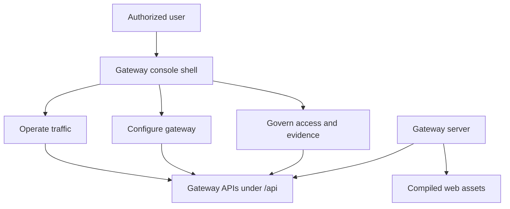
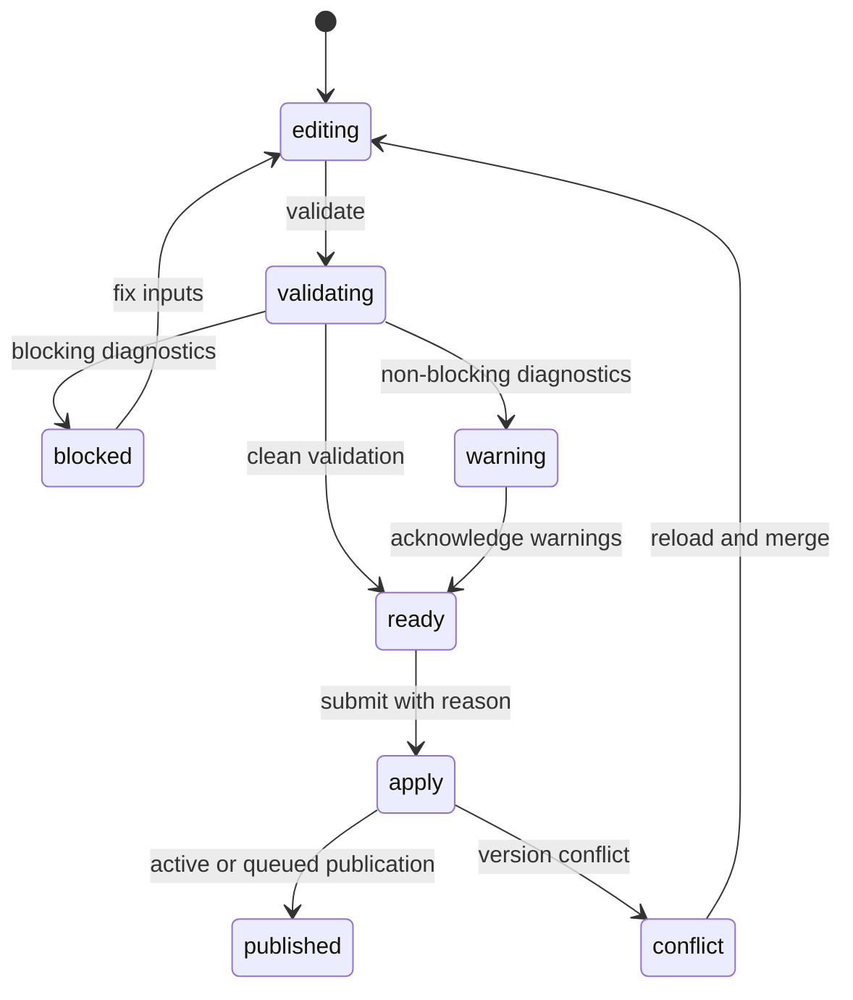

# Gateway Admin Console UI

Status: design draft for review.

This spec defines the gateway admin console product surface, frontend
architecture, information architecture, shared UX patterns, and visual
direction. Module-level UI/UX reviews live under `reviews/`.

## Goals

- Provide a first-class web console for operating and governing enterprise LLM
  egress through the gateway.
- Serve the web console from the gateway server by default, with all APIs under
  `/api`.
- Keep UI semantics aligned with the admin API resource vocabulary and
  authorization model.
- Make realtime operations, usage, routing, cost-control, and evidence
  explainable without exposing sensitive payloads or secrets.
- Support enterprise workflows: validate before publish, reason capture,
  optimistic concurrency, audit trail, rollback, and emergency action.
- Use mature frontend libraries with typed API contracts, testable components,
  and accessible interaction primitives.
- Follow a warm, restrained, Claude-inspired product style while using
  Starweaver-owned colors, copy, spacing, and assets.

## Non-Goals

- Do not create a separate frontend service as the required deployment path.
- Do not add paid billing, invoices, seats, plans, or payment reporting.
- Do not make UI-only APIs or UI-only resource semantics.
- Do not expose raw prompts, completions, provider request/response bodies, API
  key values, upstream secrets, OAuth tokens, or raw secret locators.
- Do not require an external metrics backend for the built-in realtime
  dashboard.
- Do not copy Claude brand assets, typography, wording, illustrations, or exact
  visual identity.

## Product Model

The console is organized around operator tasks rather than backend file
boundaries.



The main product modes are:

| Mode      | Purpose                                                                                                                 | Primary users                                                           |
| --------- | ----------------------------------------------------------------------------------------------------------------------- | ----------------------------------------------------------------------- |
| Operate   | Understand current routing, provider, budget, quota, and worker posture                                                 | `gateway_operator`, `tenant_admin`, `tenant_owner`                      |
| Configure | Manage providers, credentials, model catalog, route policies, grants, budgets, quotas, and exports                      | `tenant_admin`, `security_admin`, `organization_admin`, `project_admin` |
| Govern    | Manage organizations, projects, users, API keys, service accounts, audit, evidence, redaction, and emergency operations | `tenant_owner`, `tenant_admin`, `security_admin`, `auditor`             |

## User Roles

The UI must render capabilities from the same authorization model used by
gateway APIs.

| Role                  | UI posture                                                                         |
| --------------------- | ---------------------------------------------------------------------------------- |
| `tenant_owner`        | Full tenant administration, emergency actions, audit export, and security repair   |
| `tenant_admin`        | Most tenant, provider, routing, budget, quota, and organization management         |
| `security_admin`      | Credentials, secret refs, API keys, sessions, redaction, provider security posture |
| `gateway_operator`    | Realtime operations, provider health, route drain, worker status, dashboards       |
| `organization_admin`  | Organization projects, provider grants, project policies, organization dashboards  |
| `organization_member` | Limited organization context and permitted dashboards                              |
| `project_admin`       | Project API keys, project budgets, allowed aliases, member usage                   |
| `project_developer`   | Allowed models, own project usage, limited project dashboards                      |
| `project_viewer`      | Read-only project dashboards and non-sensitive configuration                       |
| `usage_viewer`        | Usage and cost reports for assigned scope                                          |
| `auditor`             | Audit events, route decisions, usage rows, and redacted evidence                   |

UI authorization rules:

- Navigation items are hidden only when the actor has no read action for that
  surface.
- Deep links to unauthorized resources show a clear access-denied state, not an
  empty page.
- Mutating controls are disabled or hidden according to the exact write action
  and resource scope.
- The UI must never rely on hidden controls as an authorization boundary.
- Strong-auth routes must be treated as re-auth/confirmation flows in the UI,
  especially exports, Codex OAuth lifecycle, identity provider writes,
  notification writes, user/session security mutations, and emergency actions.

## Routing And Serving Contract

The gateway server is the default web host.

The external serving contract uses `/api` for APIs. As of the backend readiness
review on 2026-06-28, the gateway exposes auth, admin, evidence, dashboard, and
provider-compatible protocol APIs under `/api`, mirrors system probes under
`/api/system`, serves the generated external OpenAPI contract at
`/api/openapi.json`, and returns JSON errors for unknown `/api/*` paths. The
remaining Phase 0 delivery work is static web asset serving, SPA fallback, web
CI, and release image asset packaging.

| External path                                                      | Owner                 | Behavior                                                       |
| ------------------------------------------------------------------ | --------------------- | -------------------------------------------------------------- |
| `/`                                                                | web console           | Serve compiled `index.html`                                    |
| `/assets/*`                                                        | web console           | Serve versioned static assets with long-cache headers          |
| `/favicon.ico`, `/robots.txt`, `/manifest.webmanifest`             | web console           | Serve static public assets when present                        |
| `/overview`, `/routing/groups`, and other browser routes           | web console           | SPA fallback to `index.html`                                   |
| `/api/auth/v1/*`                                                   | gateway auth API      | Browser login, session, invitations, and logout                |
| `/api/admin/v1/*`                                                  | gateway admin API     | Admin, dashboard, evidence, operations, and configuration APIs |
| `/api/v1/*`, `/api/v1beta/*`, `/api/model/*`, `/api/native/*`      | gateway model ingress | Provider-compatible protocol paths under an `/api` base URL    |
| `/api/openapi.json`                                                | gateway API docs      | External OpenAPI contract with `/api` paths                    |
| `/healthz`, `/readyz`, `/version`                                  | probe/system          | Root-level probes for containers and operators                 |
| `/api/system/healthz`, `/api/system/readyz`, `/api/system/version` | probe/system          | Optional API-scoped mirrors for clients that only allow `/api` |

Rules:

- Any path beginning with `/api/` must never fall back to `index.html`.
- Any unknown non-API path should return the SPA shell unless it is a known
  static asset miss.
- Browser session cookies are same-origin. Mutating browser APIs still require
  CSRF protection.
- Browser session APIs return CSRF metadata and require the
  `x-gateway-csrf-token` header for session context changes, logout, and
  invitation acceptance.
- API clients that expect provider-compatible paths should use the gateway base
  URL ending in `/api`.
- Development may proxy from Vite to the Rust server, but release deployment
  must not require a Node runtime.

## Information Architecture

Primary navigation:

| Section      | Pages                                                                                                     |
| ------------ | --------------------------------------------------------------------------------------------------------- |
| Overview     | Tenant, organization, project, member, API key, and service account overview dashboards                   |
| Realtime Ops | Provider health, route pressure, budget pressure, quota pressure, workers, config freshness               |
| Usage        | Summary, timeseries, breakdowns, event rows, exports                                                      |
| Models       | Model aliases, model targets, pricing SKUs, catalog imports                                               |
| Routing      | Routing groups, route policies, simulation, drain, failover, sticky, canary                               |
| Providers    | Provider endpoints, upstream credentials, secret refs, Codex OAuth connections                            |
| Access       | Organizations, projects, members, invitations, users, API keys, service accounts, grants                  |
| Policy       | Provider grants, budgets, quotas, admission, redaction                                                    |
| Evidence     | Route decisions, attempt events, usage events, audit events, redacted diffs                               |
| Operations   | Config snapshots, validate, publish, rollback, OTel export, notifications, maintenance, emergency actions |
| Settings     | Identity providers, current session, personal preferences, organization and project context               |

Secondary layout rules:

- The left sidebar lists product sections.
- The top bar owns tenant, organization, project, time range, search, command
  palette, and user session controls.
- Detail pages use tabs for local subviews such as Overview, Configuration,
  Health, Usage, History, and Audit.
- Dangerous actions live in explicit dialogs with reason capture and current
  resource version.
- Lists use filter chips, saved views, cursor pagination, and column visibility.

## Page Families

| Family              | Primary pages                                                              | Required interactions                                    |
| ------------------- | -------------------------------------------------------------------------- | -------------------------------------------------------- |
| Dashboard           | Overview, Realtime Ops, Usage, Model Observability, Provider Observability | Time range, scope switch, freshness, drilldown, export   |
| Resource Management | Providers, credentials, models, routing groups, route policies, policies   | Create, edit, validate, publish impact, disable, history |
| Access Management   | Organizations, projects, members, users, API keys, service accounts        | Invite, suspend, remove, rotate, revoke, scope, audit    |
| Evidence            | Route decisions, usage events, audit events, exports                       | Search, filter, inspect, redacted diff, copy safe ids    |
| Operations          | Snapshots, OTel export, notifications, maintenance, emergency              | Validate, publish, rollback, drain, freeze, status       |

## Shared UX Patterns

### Validate Before Apply

Every high-risk write must support the same progression:



High-risk writes include:

- route policy publish or rebinding
- upstream credential create or rotation
- provider endpoint disable, drain, or degraded-state change
- budget hard cap or conservative-mode change
- quota fail-open, fail-closed, or fail-limited change
- redaction policy change
- config snapshot publish or rollback
- emergency operation

### Evidence-First Drilldown

Operational pages should drill down from aggregate posture into durable
evidence:

- dashboard total -> filtered usage rows
- route pressure -> route decision list
- provider error spike -> attempt events
- budget block -> budget policy, ledger source, and route decision evidence
- config freshness warning -> snapshot version, worker heartbeat, and
  validation diagnostics

### Freshness And Source Labels

Every dashboard response must surface data source and freshness.

| Source                       | UI marker                                                          |
| ---------------------------- | ------------------------------------------------------------------ |
| durable usage event          | `source: usage events`, watermark, retention state                 |
| durable ledger bucket        | `source: ledger`, aggregation lag                                  |
| route decision evidence      | `source: route evidence`, terminal timestamp                       |
| Redis-compatible hot state   | `source: hot state`, TTL, freshness, approximate/stale/unavailable |
| OpenTelemetry exporter state | `source: exporter health`, last export, dropped metric count       |

### Secret And Payload Redaction

The UI must render secret-bearing resources by safe metadata only:

- Show masked key prefixes, secret ref ids, locator masks, version hints,
  fingerprints, and safe status codes.
- Never show raw API keys after creation.
- Never show upstream secret values.
- Never show prompt or completion bodies.
- Require strong-auth confirmation for raw locator metadata through the
  implemented SecretRef locator API.

### Empty And Partial States

Empty states must be operationally useful:

- `No route decisions yet` should link to model ingress setup and fake provider
  smoke guidance.
- `No provider endpoints` should offer provider endpoint creation and explain
  that upstream credentials are separate.
- `Usage unavailable` should show whether the missing source is ledger rollup,
  retention, authorization, or not yet exposed by the backend.
- `Hot state unavailable` should show runtime fallback behavior, not just a
  dashboard error.

## Frontend Architecture

Recommended stack:

| Area            | Selection                                            | Reason                                                                   |
| --------------- | ---------------------------------------------------- | ------------------------------------------------------------------------ |
| Build           | Vite + React + TypeScript                            | Fast modern build pipeline and simple static output for Rust serving     |
| Package manager | `pnpm` via Corepack                                  | Deterministic installs and workspace-friendly dependency management      |
| Routing         | TanStack Router                                      | Typed routes, nested layouts, search params, and route loaders           |
| Server state    | TanStack Query                                       | Cache, invalidation, retries, background refresh, and mutation states    |
| Tables          | TanStack Table                                       | Large resource lists, event rows, filtering, sorting, and column control |
| UI primitives   | Radix Primitives through shadcn/ui style ownership   | Accessible primitives with locally owned component code                  |
| Styling         | Tailwind CSS plus CSS custom properties              | Token-driven theme and compact enterprise layouts                        |
| Icons           | `lucide-react`                                       | Consistent familiar action icons                                         |
| Forms           | React Hook Form + Zod                                | Complex form state with typed client validation                          |
| API client      | Orval-generated TanStack Query hooks from OpenAPI    | Keeps UI aligned to admin API contract                                   |
| Charts          | Apache ECharts behind internal chart wrappers        | Dense operational time series, status charts, and dashboards             |
| Dates           | `date-fns` or equivalent lightweight date helpers    | Time-window formatting and range math                                    |
| Testing         | Vitest, Testing Library, MSW, Playwright, axe checks | Unit, integration, mock API, e2e, and accessibility coverage             |

Architecture rules:

- Generated API code lives under `src/generated/` and is not hand-edited.
- Domain-specific query hooks may wrap generated hooks for resource naming,
  cache keys, and invalidation policy.
- Components are split into `app`, `features`, `entities`, `shared`, and
  `generated` layers.
- UI state such as table columns, side panel state, and command palette state
  stays local or in URL search params where shareable.
- Server state stays in TanStack Query, not global client stores.
- Browser routes should encode scope, filters, cursor, and time range in URL
  search params when users are likely to share or revisit the view.
- No frontend package may become the source of truth for gateway policy,
  routing, cost, redaction, or authorization semantics.

Suggested source layout:

```text
crates/starweaver-gateway/web/
  package.json
  pnpm-lock.yaml
  vite.config.ts
  index.html
  src/
    app/
      router.tsx
      providers.tsx
      layout/
    generated/
    shared/
      api/
      ui/
      charts/
      forms/
      table/
      time/
    entities/
      gateway-resource/
      scope/
      session/
    features/
      overview/
      realtime-ops/
      usage/
      model-catalog/
      routing/
      providers/
      access/
      policy/
      evidence/
      operations/
    test/
      msw/
```

## API Integration

The UI consumes the external API shape, including the `/api` prefix.

| API family                        | Browser base                                          |
| --------------------------------- | ----------------------------------------------------- |
| Auth/session                      | `/api/auth/v1`                                        |
| Admin resources                   | `/api/admin/v1`                                       |
| Dashboard and observability       | `/api/admin/v1`                                       |
| Evidence and exports              | `/api/admin/v1`                                       |
| Model ingress smoke/debug tooling | `/api/v1`, `/api/v1beta`, `/api/model`, `/api/native` |
| OpenAPI                           | `/api/openapi.json`                                   |

OpenAPI requirements for UI:

- Operation ids are stable and action ids are documented.
- Error envelopes are typed and include machine-readable codes.
- Resource envelopes include kind, id, version, status, scope, timestamps, and
  actor metadata.
- List endpoints expose cursor pagination, sort, and structured filters.
- Mutation endpoints expose idempotency key, expected version, reason, audit
  event id, and publication impact.
- Validation endpoints return blocking errors, warnings, affected resources,
  route simulation, budget simulation, and publication plan when applicable.

## Visual Direction

The visual style should feel calm, focused, and work-oriented. It can be
inspired by Claude's warm neutral surfaces and restrained density, but it must
use Starweaver-owned design tokens.

Design principles:

- Warm neutral background, white or near-white content surfaces, muted borders,
  and low shadow.
- Green is the primary brand accent, used sparingly for selected navigation,
  primary actions, healthy state, and positive deltas.
- Operational states use a broad palette, not only green: amber for warning,
  red for danger, blue for informational, violet only for rare secondary
  grouping.
- Tables, charts, and logs prioritize scan density over decorative cards.
- Cards are only for individual repeated items, compact metric groups, and
  modals. Do not nest cards.
- Border radius should stay at `6px` or `8px`.
- Icons should use familiar symbols through `lucide-react`.
- The UI should avoid visible instructional marketing copy. Operational copy
  should be short and specific.

Initial token direction:

| Token                    | Value     | Use                               |
| ------------------------ | --------- | --------------------------------- |
| `--color-bg`             | `#F7F5EF` | application background            |
| `--color-surface`        | `#FFFDF8` | main content surface              |
| `--color-surface-muted`  | `#F1EFE7` | sidebars and subtle panels        |
| `--color-border`         | `#DAD6C8` | separators and control borders    |
| `--color-text`           | `#24251F` | primary text                      |
| `--color-text-muted`     | `#67695E` | secondary text                    |
| `--color-primary`        | `#2F7D5B` | selected state and primary action |
| `--color-primary-strong` | `#1F5F45` | hover and active primary          |
| `--color-primary-soft`   | `#DCEBE2` | green tint backgrounds            |
| `--color-warning`        | `#B7791F` | warning                           |
| `--color-danger`         | `#B42318` | destructive or failed             |
| `--color-info`           | `#2563A8` | informational                     |

Typography:

- Prefer a modern system font stack for product UI.
- Use tabular numbers for metrics, budgets, latency, cost, and counters.
- Do not scale font size with viewport width.
- Keep letter spacing at `0`.
- Use compact page headings in dense admin surfaces.

## Accessibility

- All dialogs, menus, tooltips, popovers, tabs, selects, checkboxes, switches,
  and sliders must use accessible primitives.
- Keyboard navigation is required for app shell, tables, command palette,
  forms, dialogs, and menus.
- Focus state must be visible.
- Chart information must have table or summary equivalents.
- Color cannot be the only status indicator.
- Destructive actions require explicit accessible labels, confirmation, and
  reason text.
- Automated accessibility checks run in CI for critical pages.

## Performance

Targets:

- Initial console shell loads quickly from the gateway server without Node.
- Route-level code splitting is required for heavy dashboards and editor-like
  forms.
- Tables use cursor pagination and virtualization where row counts can be high.
- Realtime panels use bounded polling or streaming only where APIs support it.
- Chart queries must be bounded by time range and granularity.
- Query refresh intervals must be visible and pause when the tab is hidden.

## Security

- Same-origin browser session is the default web authentication mode.
- CSRF protection is required for browser mutations.
- API key workflows must show raw key values only once after creation.
- Clipboard actions must target safe ids or masked values unless the raw value
  is the one-time key creation response.
- Redaction state must be explicit on evidence and audit pages.
- Strong-auth prompts are required for emergency operations, session
  revocation, secret rotation, raw locator metadata, and config rollback.

## Backend-Ready Surfaces

The 2026-06-28 backend implementation already exposes these surfaces with route
metadata, authorization, and handler tests. UI specs and page work should treat
them as ready for integration after the `/api` mount contract is in place:

- local single-user login, generic OIDC provider discovery, OIDC login start
  and callback, session read, logout, active/default organization/project
  switching, invitation preview, and invitation accept
- tenant/org/project resources, organization members, project members, project
  member create, organization invitations, users, user sessions, external
  identities, and identity providers
- provider endpoints, upstream credentials, secret refs including strong-auth
  raw locator reads, Codex OAuth connections, Codex OAuth sessions, and refresh
  status
- model aliases, model targets, pricing SKUs, routing groups, routing group
  targets, route policies, provider grants, budget policies, and quota policies
- realtime overview, scoped dashboard overviews, usage summary, usage
  timeseries, usage events, usage breakdowns, model dashboards, target
  dashboards, and provider endpoint usage observability
- OpenTelemetry export config, notification sinks, notification subscriptions,
  notification outbox replay, export jobs and manifests, audit event list, and
  emergency operation APIs

## Acceptance Gates

- Gateway server serves the compiled web app at `/` and does not require a Node
  runtime in the release image.
- API routes are externally mounted under `/api`, and unknown `/api` paths do
  not fall back to the SPA.
- CI validates Rust, docs, web lint/typecheck/tests/build, and Docker image
  smoke build.
- The console implements role-aware navigation and deep-link denial states.
- Dashboard pages show source, freshness, and partial data markers.
- High-risk mutations use validate-before-apply, optimistic concurrency,
  reason capture, and audit impact.
- Evidence pages never expose raw prompts, completions, provider payloads,
  credentials, or secret headers.
- Module UI/UX reviews in `reviews/` are resolved before implementation of the
  corresponding module is called complete.
