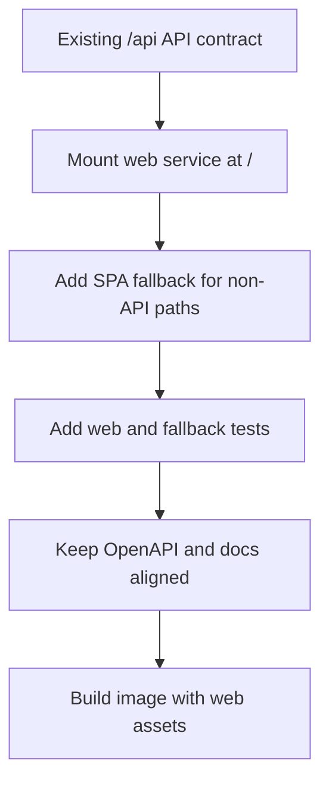

# Gateway UI Implementation Plan

Status: design draft for review.

This plan sequences the gateway admin console implementation. The first UI work
is not page work. Phase 0 establishes web CI, Docker image behavior, and the
server contract that the gateway binary serves the web app while preserving the
implemented external `/api` API surface.

The backend implementation reviewed on 2026-06-28 has already completed most
gateway service surfaces through implementation stages 9 and 10, and includes
parts of notifications, exports, emergency operations, deployment packaging,
production profile gates, restore rehearsal, and shared auth/authz review. This
plan therefore treats those APIs as backend-ready and focuses Phase 0 on the
remaining web asset delivery gap.

## Scope

Included:

- CI gates for frontend, Rust, docs, and Docker image smoke build.
- Gateway Docker image that contains the compiled admin console.
- Gateway server static web serving and SPA fallback.
- Preserve the implemented external API mount under `/api`.
- Auth/session integration for same-origin browser use.
- Enterprise admin console shell, navigation, dashboards, configuration flows,
  evidence views, and operations surfaces.
- Module-level UI/UX review files under `reviews/`.

Excluded:

- A required standalone frontend service.
- Paid billing UX.
- Arbitrary provider OAuth onboarding beyond Codex.
- External metrics backend querying for the built-in realtime dashboard.
- Mobile-first consumer UI. The console must be responsive, but dense desktop
  operations are the primary target.

## Phase 0: CI, Docker Image, And Server-Owned Web Delivery

Goal: make the gateway deliverable as one service artifact before building
product pages. Existing backend CI already runs Rust checks, gateway harnesses,
docs checks, Docker image smoke, compose smoke, and restore rehearsal. Phase 0
adds the web build to that delivery path and verifies that browser serving does
not regress the existing `/api` API shape.

### Work Items

01. Add a service-owned web workspace at `crates/starweaver-gateway/web`.
02. Add `package.json`, `pnpm-lock.yaml`, `vite.config.ts`, TypeScript config,
    lint config, test config, and an initial empty app shell.
03. Add Makefile targets:
    - `gateway-web-install`
    - `gateway-web-check`
    - `gateway-web-test`
    - `gateway-web-build`
    - `gateway-web-ci`
04. Extend repository CI and `make ci` to run web install, lint, typecheck,
    unit tests, and build, while preserving existing gateway harness and restore
    rehearsal gates.
05. Extend image workflow path filters to include `crates/starweaver-gateway/web/**`
    and frontend lock/config files.
06. Update `crates/starweaver-gateway/Dockerfile` to build web assets in a Node
    build stage and copy the compiled assets into the runtime image.
07. Add gateway server configuration for `web_assets_dir`, `web_enabled`, and
    development proxy mode if needed.
08. Extend the Axum router so external routes are:
    - `/` and browser routes -> web static service with SPA fallback
    - `/assets/*` -> static assets with cache headers
    - `/api/auth/v1/*` -> auth APIs
    - `/api/admin/v1/*` -> admin, dashboard, evidence, and operations APIs
    - `/api/v1/*`, `/api/v1beta/*`, `/api/model/*`, `/api/native/*` -> model
      ingress APIs
    - `/healthz`, `/readyz`, `/version` -> root-level probe paths
    - optional mirrors at `/api/system/healthz`, `/api/system/readyz`, and
      `/api/system/version`
09. Ensure unknown `/api/*` paths return JSON API errors, not `index.html`.
10. Add tests for static serving, SPA fallback, API prefix routing, and probe
    paths.
11. Add Docker smoke validation that starts the image and verifies:
    - `GET /` returns HTML
    - `GET /assets/...` returns a static asset
    - `GET /api/admin/v1/realtime/overview` reaches the API path and does not
      return HTML
    - `GET /admin/v1/realtime/overview` is either intentionally unsupported
      externally or explicitly documented as a temporary compatibility alias
    - `GET /healthz` succeeds
12. Update local developer docs once implementation starts.

### Server Route Contract

The current gateway implementation exposes admin, auth, dashboard, evidence,
and model ingress paths under `/api` while preserving canonical route metadata
and root-level compatibility paths for now. UI delivery must keep the external
`/api` mount stable without changing authorization action ids, resource ids,
audit event types, or provider-compatible protocol semantics.

Phase 0 server work:

Rules:

- Internally, route metadata may keep protocol-relative patterns if the API
  mount is applied at the router boundary.
- Externally generated OpenAPI should show `/api` paths.
- Model clients retain provider-compatible paths by setting the gateway base
  URL to `https://gateway.example.com/api`.
- Compatibility aliases at root-level API paths are not the default web console
  contract. They must remain explicit and must not be called by browser code.
- Browser code must never call root-level `/auth/v1`, `/admin/v1`, `/v1`,
  `/v1beta`, `/model`, or `/native` paths after Phase 0.

### CI Gates

Required gates:

| Gate                  | Command direction                                     | Required evidence                            |
| --------------------- | ----------------------------------------------------- | -------------------------------------------- |
| Rust format           | `make fmt-check`                                      | workspace formatting passes                  |
| Rust check and clippy | `make check`                                          | no warnings under existing policy            |
| Rust tests            | `make test`                                           | workspace tests pass                         |
| Docs checks           | `make docs-check` and existing docs build gates       | docs examples and mdBook build pass          |
| Web install           | `pnpm install --frozen-lockfile` in the web workspace | lockfile is deterministic                    |
| Web lint              | package script                                        | no lint errors                               |
| Web typecheck         | package script                                        | strict TypeScript passes                     |
| Web unit tests        | package script                                        | component and utility tests pass             |
| Web build             | package script                                        | static `dist/` is created                    |
| Docker smoke build    | image workflow and local Makefile target              | image includes binary and web assets         |
| Container smoke       | CI job or script                                      | `/`, `/api/...`, and probes behave correctly |

### Acceptance Evidence

- `make ci` or the documented combined equivalent includes web checks after
  Phase 0 lands.
- Pull requests touching web code trigger web and image checks.
- The release image contains no Node runtime requirement.
- The gateway binary can serve a browser route such as `/routing/groups`
  directly.
- `/api/does-not-exist` returns a JSON error, not the SPA.
- Browser code only calls `/api/...` endpoints.

## Phase 1: Frontend Foundation And App Shell

Goal: create the product shell with no high-risk mutations.

Work items:

- Configure Vite, React, TypeScript, TanStack Router, TanStack Query, Tailwind,
  shadcn/ui-style components, Radix primitives, and lucide icons.
- Add app providers for query client, router, theme tokens, session, toasts,
  command palette, and error boundaries.
- Implement single-user login when configured, login-provider list, generic
  OIDC start/callback handling, session read, logout, organization switch,
  project switch, invitation preview/accept, and current actor display against
  `/api/auth/v1`.
- Implement role-aware navigation from session memberships and capability
  hints.
- Add base layouts: sidebar, top bar, scope switcher, time range, breadcrumbs,
  content header, list page, detail page, split inspector, and dialog patterns.
- Add empty mock views for all primary navigation entries.
- Add MSW fixtures that match gateway resource envelopes and error envelopes.

Acceptance evidence:

- Shell works from static serving and from Vite development mode.
- Browser refresh on nested routes works through SPA fallback.
- Unauthorized deep links render an access-denied state.
- Keyboard navigation works for sidebar, top bar, command palette, and dialogs.
- Visual tokens match the warm neutral and green-accent direction.

## Phase 2: Read-Only Dashboards And Observability

Goal: make the console useful for operations without introducing writes.

Work items:

- Implement Overview dashboards for tenant, organization, project, project
  member, API key, and service account scopes.
- Implement Realtime Ops panels for provider health, route pressure, budget
  pressure, quota pressure, workers, and config freshness.
- Implement Usage analytics summary, timeseries, breakdown tables, and event
  rows using the backend-ready usage APIs.
- Implement Model and Provider observability pages with latency, TTFT,
  throughput, error, failover, route filtering, and usage confidence.
- Add source/freshness/partial-data UI in every dashboard response.
- Add chart wrappers around ECharts and table wrappers around TanStack Table.

Acceptance evidence:

- Every dashboard shows scope, time window, source, freshness, and partial-data
  markers.
- Hot-state values show TTL and fallback state.
- No dashboard renders prompts, completions, raw provider payloads, raw
  credentials, or secret headers.
- Drilldowns preserve filters in URL search params.

## Phase 3: Catalog, Provider, And Routing Configuration

Goal: implement core model egress configuration with validation-first UX.

Work items:

- Implement provider endpoints, upstream credentials, secret refs, and Codex
  OAuth pages, including Codex connection/session/refresh-status lifecycle and
  strong-auth secret locator reads.
- Implement model aliases, model targets, pricing SKUs, and catalog imports.
- Implement routing groups, routing group members, route policies, and route
  simulation.
- Implement create/edit flows with React Hook Form, Zod, server validation,
  expected version, idempotency key, reason capture, and audit impact display.
- Implement route graph visualization using mermaid in documentation and
  native UI graph/list components in the app.
- Implement disabled, draining, degraded, rotating, expired, and error states.

Acceptance evidence:

- Protocol-family compatibility errors are visible before publish.
- Route simulation explains selected, allowed, denied, and filtered candidates.
- Credential reads only display safe metadata.
- Destructive routing/provider operations require reason and confirmation.

## Phase 4: Access, Policy, And Cost Controls

Goal: expose governance flows after core configuration and read dashboards are
stable.

Work items:

- Implement organizations, projects, members, invitations, users, external
  identities, sessions, service accounts, identity providers, and role/action
  grant views where backed by current APIs. API key lifecycle pages remain
  blocked until explicit API key admin endpoints exist.
- Implement provider grants, budgets, quotas, admission policies, and redaction
  policies.
- Implement one-time API key reveal and copy UX.
- Implement session revocation and user disable flows with strong-auth where
  required.
- Implement budget/quota pressure previews and simulation when APIs provide
  them.

Acceptance evidence:

- API key values are shown only once.
- Membership and project role changes show impacted scopes.
- Provider grants make deny closure visible.
- Budget and quota policies show stale-state and cache-loss behavior.

## Phase 5: Evidence, Operations, And Emergency Workflows

Goal: close the enterprise control-plane loop.

Work items:

- Implement route decisions, route attempts, usage events, audit events, export
  jobs and manifests, and redacted diffs using the implemented evidence
  endpoints.
- Implement config snapshots, validation diagnostics, publish, rollback, and
  publication convergence pages.
- Implement OpenTelemetry export config, notification sinks, notification
  subscriptions, notification outbox replay, export jobs, and emergency
  operations. Maintenance windows remain blocked until explicit endpoints
  exist.
- Add incident-mode UI patterns for drain, disable, freeze config, force budget
  block, and rollback.
- Add Playwright e2e coverage for critical workflows.

Acceptance evidence:

- Audit and evidence views show actor, resource, before/after redacted diff,
  request id, trace id, and config version where available.
- Snapshot publish and rollback require reason, expected version, strong-auth,
  and audit event display.
- Emergency actions show expiry, affected resources, alert posture, and
  rollback path.

## Phase 6: Hardening And Release Readiness

Goal: make the UI reliable for production operators.

Work items:

- Add accessibility audits for shell, forms, tables, dialogs, and dashboard
  equivalents.
- Add bundle analysis and route-level code splitting checks.
- Add visual regression screenshots for critical layouts.
- Add Playwright smoke against the production Docker image.
- Add docs for local development, image deployment, route prefix, and static
  asset serving.
- Review module UI/UX files and mark unresolved review items as tracked issues
  before release.

Acceptance evidence:

- `make ci` passes.
- Container smoke tests pass.
- Critical e2e flows pass against the built image.
- UI has no known redaction leaks.
- Performance and accessibility budgets are documented and enforced.

## Review Exit Criteria

The UI implementation is not complete until:

- All files in `reviews/` have been checked against the implemented module.
- Any unresolved review item has an explicit issue or follow-up plan.
- Server-owned web delivery is the default release path.
- API paths used by the browser are under `/api`.
- CI and Docker image checks prove the same deployment shape users will run.
