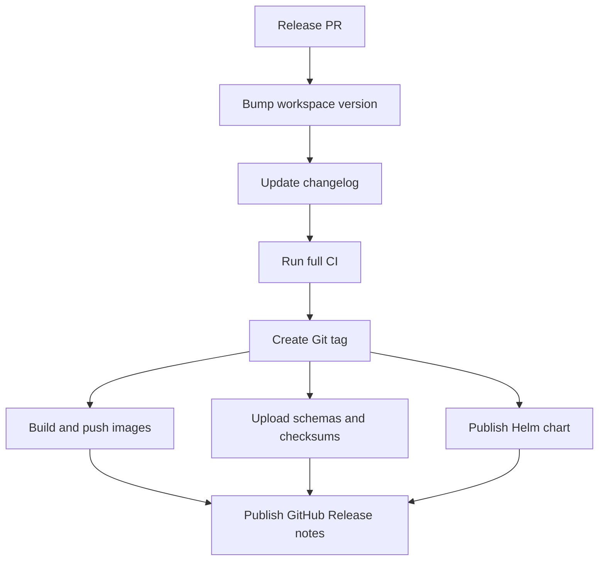

# Release And Deployment

Status: discussion draft.

This spec defines the release strategy for a repository that contains both the
LLM gateway and agent platform service.

## Release Unit

Use one Git release tag for the repository:

```text
v0.1.0
```

The tag represents a compatible set of:

- service binaries
- Docker images
- database migrations
- OpenAPI schemas
- deployment manifests
- admin contracts
- client contracts when published

## Artifacts

Each release should publish service images:

```text
gcr.io/$GCP_PROJECT_ID/starweaver-gateway:v0.1.0
starweaver-platform-service:v0.1.0
starweaver-admin-api:v0.1.0
```

The admin API can be a separate image or part of each service. The release
process should not require that decision before the service boundary is stable.

Release assets should include:

- OpenAPI schemas
- migration checksums
- SBOM files
- container image digests
- Helm chart package when available
- release notes

## Crate Publication

Do not publish internal service crates at the beginning.

Publish crates only when an external user needs stable client or contract APIs.
Candidate crates:

- `starweaver-service-core`
- `starweaver-gateway-client`
- `starweaver-platform-client`

Internal service crates should remain repository artifacts unless there is a
clear external contract.

## Pull Request Gates

Every pull request should run:

```text
cargo fmt --check
cargo check --workspace --locked
cargo test --workspace --locked
migration check
OpenAPI schema check
Docker build smoke
local compose smoke when service files change
```

The exact commands can be added after the workspace and tooling exist.

Current container gate:

- `.github/workflows/images.yml` builds the gateway image on pull requests that
  touch Rust service code, the Dockerfile, or the image workflow.
- The smoke build targets Linux `amd64` because the service deployment target
  is Linux-only.

## Image Publication

Gateway image publication uses Google Workload Identity Federation and pushes
to GCR-compatible registries.

Required GitHub configuration:

| Name                             | Kind               | Purpose                                      |
| -------------------------------- | ------------------ | -------------------------------------------- |
| `GCP_PROJECT_ID`                 | variable or secret | Google Cloud project that owns the registry  |
| `GCP_WORKLOAD_IDENTITY_PROVIDER` | secret             | GitHub OIDC workload identity provider       |
| `GCP_SERVICE_ACCOUNT`            | secret             | service account allowed to push GCR images   |
| `GCR_REGISTRY`                   | variable           | optional registry host, defaults to `gcr.io` |

Nightly builds are published from `main` by the scheduled workflow:

```text
gcr.io/$GCP_PROJECT_ID/starweaver-gateway:nightly
gcr.io/$GCP_PROJECT_ID/starweaver-gateway:nightly-YYYYMMDD-SHORTSHA
gcr.io/$GCP_PROJECT_ID/starweaver-gateway:main-SHORTSHA
```

Release builds are published from `v*.*.*` tags or GitHub release publish
events:

```text
gcr.io/$GCP_PROJECT_ID/starweaver-gateway:v0.1.0
gcr.io/$GCP_PROJECT_ID/starweaver-gateway:0.1.0
gcr.io/$GCP_PROJECT_ID/starweaver-gateway:latest
```

Manual dispatch supports `nightly` and `release` channels. Manual release
dispatch requires a tag such as `v0.1.0`.

## Release Flow

Recommended flow:



## Migration Policy

Database migrations are part of the release contract.

Rules:

- Migrations must be forward-only.
- Gateway and platform migrations can live in separate directories.
- Shared tables must be owned by shared service specs.
- Every release records migration checksums.
- Rollback means deploying a new forward migration, not editing old migrations.

Candidate layout:

```text
migrations/
  shared/
  gateway/
  platform/
```

## Deployment Modes

Initial deployment modes:

| Mode          | Purpose                                                        |
| ------------- | -------------------------------------------------------------- |
| Local compose | Development and integration smoke tests                        |
| Single-node   | Small self-hosted deployment                                   |
| Multi-node    | Production gateway and platform services behind load balancers |

The gateway and platform service should be independently scalable. Shared
PostgreSQL, Redis, and object storage can be deployed by the operator.

## Version Compatibility

Gateway and platform service images from the same Git release should be
compatible by default. Cross-version compatibility can be introduced later by
versioning the service-to-service HTTP contracts and OpenAPI schemas.

Until those contracts are stable, deploy both services from the same release.
