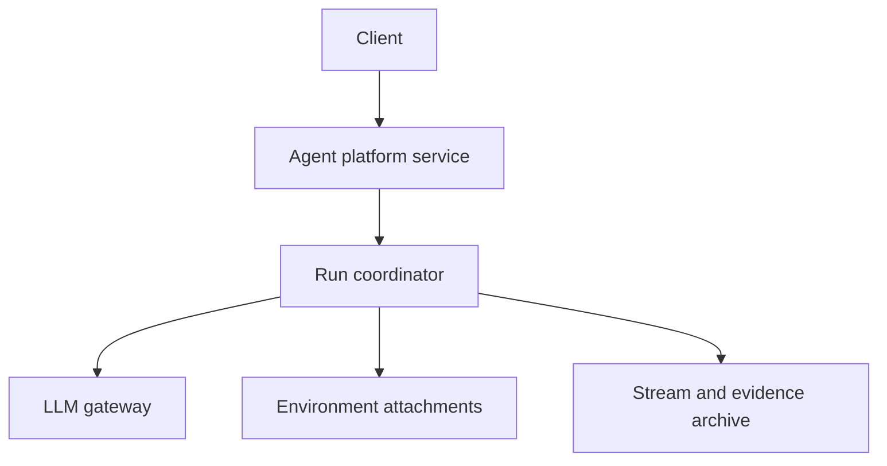
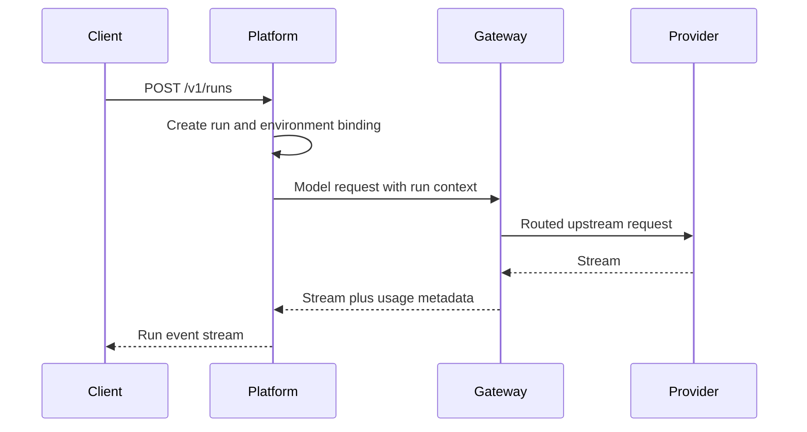

# Agent Platform Service

Status: discussion draft.

The agent platform service is the agent control plane for hosted Starweaver
deployments. It owns conversations, runs, sessions, approvals, environment
attachments, stream replay, and durable execution evidence.

This document complements `../01-platform-service.md`, which contains the
detailed hosted platform service candidate. This file focuses on the relationship
between the agent platform service and the LLM gateway in the shared service
workspace.

## Goals

- Expose service APIs for creating and managing agent runs.
- Persist run, session, approval, and deferred-tool metadata.
- Archive large ordered evidence such as raw run events, display messages,
  message history snapshots, and replay snapshots.
- Attach environments through provider-neutral host contracts.
- Use the LLM gateway as a model egress option without depending on gateway
  internals.

## Non-Goals

- Do not replace the Starweaver runtime engine.
- Do not embed gateway routing logic.
- Do not own upstream provider credentials directly when the gateway is the
  configured model egress path.
- Do not make platform HTTP resources part of the SDK/runtime crate boundary.

## Relationship To Gateway

The platform service may route model traffic through the gateway by default.
That is a deployment topology, not a crate dependency.



The run coordinator should pass context to the gateway through versioned HTTP
headers or request metadata:

- tenant id
- project id
- request id
- trace context
- run id
- conversation or session affinity key
- desired model alias
- budget or policy hint when allowed

The gateway returns model responses, stream chunks, usage metadata, and gateway
decision metadata. The platform records run evidence but does not need to know
which upstream credential or provider endpoint was selected.

## Shared Auth And Permissions

The platform is expected to share some authn/authz foundations with the
gateway, but not by depending on gateway internals. The first implementation
should keep platform authorization service-local while it proves concrete
resource semantics for runs, conversations, agents, approvals, environments, and
evidence archives.

Candidate shared layers should be evaluated after both services have concrete
use cases:

- stable contracts for ids, actor context, tenant/organization/project scope,
  principal references, sessions, service accounts, error envelopes, and audit
  context
- identity domain behavior for login providers, users, external identities,
  sessions, memberships, role bindings, and action grants
- policy helpers for action/resource registries, Cedar schema generation,
  built-in role templates, and validation fixtures

Gateway model permissions and platform run/environment permissions must remain
service-specific namespaces. A shared policy engine is acceptable only if it
preserves those namespaces and contract tests prove neither service can widen
the other's permissions.

## Core Objects

| Object                  | Responsibility                                     |
| ----------------------- | -------------------------------------------------- |
| `Conversation`          | User-visible conversation grouping                 |
| `Session`               | Durable context and replay boundary                |
| `Run`                   | One agent execution attempt                        |
| `RunInput`              | Text, files, or structured input parts             |
| `RunEvent`              | Ordered runtime event record                       |
| `DisplayMessage`        | Client-facing projection                           |
| `Approval`              | Human decision record                              |
| `DeferredTool`          | Resumable tool call record                         |
| `EnvironmentAttachment` | Host-managed environment lease                     |
| `EvidenceArchive`       | Object storage manifest for large ordered evidence |

## Storage Split

PostgreSQL stores queryable metadata:

- tenant, project, user, and service account references
- conversations and sessions
- runs and run status
- approvals and deferred tool records
- environment attachment leases and readiness summaries
- stream cursors and archive manifests
- idempotency keys and service outbox rows

Object storage stores large ordered evidence:

- message history snapshots and deltas
- raw runtime stream records
- display message records
- replay snapshots
- compact view snapshots
- optional trace export payloads after redaction

Redis can be used for hot state:

- live stream fanout
- short-lived idempotency coordination
- distributed locks when unavoidable
- config invalidation
- rate limiting if platform-level client limits are needed

## Candidate HTTP Resources

```text
POST /v1/conversations
GET  /v1/conversations/{conversation_id}
GET  /v1/conversations/{conversation_id}/sessions

POST /v1/runs
GET  /v1/runs/{run_id}
POST /v1/runs/{run_id}:cancel
POST /v1/runs/{run_id}:steer
GET  /v1/runs/{run_id}/events

POST /v1/approvals/{approval_id}:decide
GET  /v1/deferred-tools
POST /v1/deferred-tools/{deferred_tool_id}:resume

POST   /v1/environment-attachments
GET    /v1/environment-attachments
GET    /v1/environment-attachments/{attachment_lease_id}/health
DELETE /v1/environment-attachments/{attachment_lease_id}
```

## Model Egress Contract

The platform should treat model access as a configured endpoint. In production
that endpoint is usually the gateway. In local development it may be a direct
provider endpoint or a test model service.



The platform may use gateway usage metadata to update run usage snapshots, but
gateway remains the source of truth for provider route, upstream credential,
route-group metrics, and model egress cost controls.
