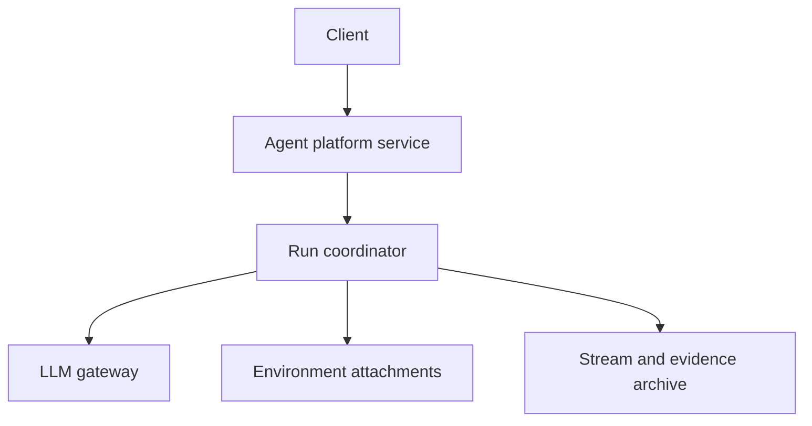
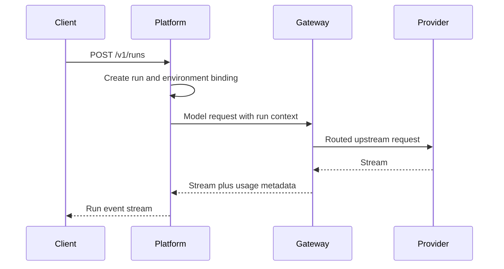

# Agent Platform Service

Status: discussion draft.

The agent platform service is the agent control plane for hosted Starweaver
deployments. It owns conversations, runs, sessions, approvals, environment
attachments, stream replay, and durable execution evidence.

This document complements `../01-platform-service.md`, which contains the
detailed hosted platform service candidate. This file focuses on the relationship
between the agent platform service and the LLM gateway in the shared service
workspace.

## Goals

- Expose service APIs for creating and managing agent runs.
- Persist run, session, approval, and deferred-tool metadata.
- Archive large ordered evidence such as raw run events, display messages,
  message history snapshots, and replay snapshots.
- Attach environments through provider-neutral host contracts.
- Use the LLM gateway as a model egress option without depending on gateway
  internals.

## Non-Goals

- Do not replace the Starweaver runtime engine.
- Do not embed gateway routing logic.
- Do not own upstream provider credentials directly when the gateway is the
  configured model egress path.
- Do not make platform HTTP resources part of the SDK/runtime crate boundary.

## Relationship To Gateway

The platform service may route model traffic through the gateway by default.
That is a deployment topology, not a crate dependency.



The run coordinator should pass context to the gateway through versioned HTTP
headers or request metadata:

- tenant id
- project id
- request id
- trace context
- run id
- conversation or session affinity key
- desired model alias
- budget or policy hint when allowed

The gateway returns model responses, stream chunks, usage metadata, and gateway
decision metadata. The platform records run evidence but does not need to know
which upstream credential or provider endpoint was selected.

## Shared Auth And Permissions

The platform is expected to share some authn/authz foundations with the
gateway, but not by depending on gateway internals. The first implementation
should keep platform authorization service-local while it proves concrete
resource semantics for runs, conversations, agents, approvals, environments, and
evidence archives.

Candidate shared layers should be evaluated after both services have concrete
use cases:

- stable contracts for ids, actor context, tenant/organization/project scope,
  principal references, sessions, service accounts, error envelopes, and audit
  context
- identity domain behavior for login providers, users, external identities,
  sessions, memberships, role bindings, and action grants
- policy helpers for action/resource registries, Cedar schema generation,
  built-in role templates, and validation fixtures

Gateway model permissions and platform run/environment permissions must remain
service-specific namespaces. A shared policy engine is acceptable only if it
preserves those namespaces and contract tests prove neither service can widen
the other's permissions.

Initial platform-local authorization foundation:

- platform actions use the `platform.*` namespace and do not reuse gateway action
  ids
- resource kinds cover conversations, agent sessions, runs, run events,
  approvals, deferred tools, environment attachments, and evidence archives
- built-in roles are scoped to tenant, organization, or project boundaries
- organization-scoped grants can authorize descendant project resources
- project-scoped grants cannot cross project ids
- service account actors can create and read automation resources but cannot use
  user-only actions such as approval decisions or run steering
- item-level filtering must use the same authorization engine as route handlers

The foundation HTTP implementation maps every platform route to a stable action
and resource kind before handlers read or mutate run metadata.

Foundation route metadata should cover:

- conversation create/read and conversation session list routes
- run create/read/cancel/steer/event routes
- approval decision routes
- deferred tool list/resume routes
- environment attachment create/list/health/release routes
- evidence archive read and privileged debug-read routes

Route metadata is the source of truth for handler authorization. Handler code
looks up metadata first, resolves the resource owner from storage, then calls
the platform-local authorization engine.

Storage ownership foundations should keep authorization ownership separate from
handler business logic:

- every resource owner record stores resource kind, resource id, tenant id,
  optional organization id, and optional project id
- project-scoped records require an organization id
- the ownership key includes both resource kind and resource id so different
  resource types can safely reuse ids
- owner records convert directly into authorization resource references
- handlers resolve ownership before reading detailed run, approval,
  environment, or evidence records
- cross-project access must be denied from resolved owner metadata, not from
  caller-provided path or header scope
- business resource records store safe typed projections separately from
  authorization ownership records
- handlers read business projections only after bearer session authentication,
  route metadata resolution, owner lookup, and authorization succeed

Foundation HTTP handler tests currently prove:

- opaque bearer session, API key, and service-token authentication resolve an
  `AuthenticatedActor` before route authorization
- session tokens, API keys, and service tokens are stored by hash, not raw token
  value
- run read authorization succeeds through route metadata and resolved owner
  metadata
- conversation read and run cancel return safe business resource projections
  after authorization
- API key credentials can authorize read handlers through the same ownership and
  grant path as user sessions
- cross-project run read is denied from resolved owner metadata
- approval decisions require a human user actor even when a service account has
  broad grants
- service-token credentials resolve to service-account actors and cannot use
  user-only actions
- approval decisions by a user return safe approval metadata after
  authorization
- environment attachment health reads use the attachment lease owner
- evidence archive reads use evidence archive owner metadata
- missing resource owners return `404` before detailed business records are read
- missing business records return `404` after owner authorization succeeds
- missing bearer session authentication returns `401`
- a revoked session token fails closed and does not fall back to an API key or
  service token with the same raw bearer value
- colon action paths such as `/v1/runs/{run_id}:cancel` are parsed through the
  route metadata matcher

The foundation handler accepts `Authorization: Bearer ...` credentials and
resolves actors through platform-local session, API key, and service-token
stores. The current in-memory stores are foundation adapters; production
entrypoints must back the same actor-resolution contract with durable sessions,
API keys, service tokens, or mTLS credentials before exposure.

The first durable platform schema foundation is now service-local and additive.
It establishes:

- tenant, organization, project, principal, user, service-account, membership,
  role-binding, and action-grant tables
- identity-provider and external-identity tables where generic OIDC is the
  standard login provider shape, GitHub OAuth App is a convenience adapter, and
  single-user mode remains an explicit bootstrap mode
- auth-session and bearer-credential tables that store token hashes, visible
  prefixes, status, expiration, revocation, and actor scope, but never raw
  bearer values
- mTLS identity tables that map verified client certificate subjects or SPIFFE
  ids to scoped platform actors
- resource-owner rows keyed by `(resource_kind, resource_id)` with tenant,
  organization, and project scope
- safe business tables for conversations, agent sessions, runs, run events,
  approvals, deferred tools, environment attachments, evidence archives, and
  idempotency keys

The first PostgreSQL repository adapter is also service-local. It provides typed
async methods for:

- recording and resolving auth sessions by bearer-token hash
- recording and resolving API key or service-token bearer credentials by
  token hash
- recording and resolving verified mTLS subjects
- recording and loading resource ownership by `(resource_kind, resource_id)`
- recording safe business-resource projections with their owner metadata in one
  transaction
- loading safe business-resource projections only after owner metadata is
  present

The foundation HTTP service state has an explicit repository backend profile:

- `in_memory` keeps the deterministic foundation stores for unit tests and
  local contract replay.
- `postgres` routes actor resolution, resource-owner lookup, and safe business
  projection reads through the durable PostgreSQL repository adapter.

Repository backend selection does not change route metadata, action ids,
authorization policy, or response envelopes.

The first startup configuration gate is also platform-local. It reads:

- `STARWEAVER_PLATFORM_LISTEN_ADDR`
- `STARWEAVER_PLATFORM_ENV`
- `STARWEAVER_PLATFORM_DATABASE_URL`
- `STARWEAVER_PLATFORM_REPOSITORY_BACKEND`

The default profile is local and uses the `in_memory` backend for deterministic
contract tests. Production profiles (`prod` or `production`) must select the
`postgres` repository backend and provide `STARWEAVER_PLATFORM_DATABASE_URL`.
Selecting `postgres` in any environment requires a database URL so a future
binary entrypoint cannot silently build a durable backend without a durable
connection. The startup diagnostic model reports all unsafe settings together
instead of failing at the first missing value.

The first binary entrypoint follows the same boundary:

- `starweaver-platform` loads `PlatformConfig`, validates the production gate,
  builds service state, and starts the foundation HTTP router.
- `starweaver-platform migrate run` applies the embedded platform migrations to
  `STARWEAVER_PLATFORM_DATABASE_URL`.
- `starweaver-platform migrate check` verifies that all embedded migration
  versions have been applied.

When the repository backend is `postgres`, startup connects to PostgreSQL, runs
the embedded migrations, and constructs `PlatformServiceState` with the durable
repository adapter before binding the HTTP listener. When the backend is
`in_memory`, startup constructs the deterministic foundation state for local
contract replay.

Generic OIDC provider configuration must be tenant-owned and contain issuer,
JWKS URI, client id, redirect URI, requested scopes, and accepted audiences.
The callback path validates state, nonce, PKCE verifier, token expiry, issuer,
audience, and JWKS-backed ID token signature before linking or creating a local
principal. OIDC login storage is separate from gateway upstream provider OAuth
or model egress credentials.

mTLS actor resolution must consume only verified subjects from trusted service
entrypoints. A reverse proxy, service mesh, or load balancer must terminate mTLS,
verify the client certificate, strip any inbound subject headers, and set the
platform verified-subject header before the platform service resolves it to an
actor.

## Core Objects

| Object                  | Responsibility                                     |
| ----------------------- | -------------------------------------------------- |
| `Conversation`          | User-visible conversation grouping                 |
| `Session`               | Durable context and replay boundary                |
| `Run`                   | One agent execution attempt                        |
| `RunInput`              | Text, files, or structured input parts             |
| `RunEvent`              | Ordered runtime event record                       |
| `DisplayMessage`        | Client-facing projection                           |
| `Approval`              | Human decision record                              |
| `DeferredTool`          | Resumable tool call record                         |
| `EnvironmentAttachment` | Host-managed environment lease                     |
| `EvidenceArchive`       | Object storage manifest for large ordered evidence |

## Storage Split

PostgreSQL stores queryable metadata:

- tenant, project, user, and service account references
- login providers, external identities, memberships, role bindings, and action
  grants
- auth sessions, API keys, and service tokens by hash and status
- conversations and sessions
- runs and run status
- approvals and deferred tool records
- environment attachment leases and readiness summaries
- stream cursors and archive manifests
- idempotency keys and service outbox rows

Object storage stores large ordered evidence:

- message history snapshots and deltas
- raw runtime stream records
- display message records
- replay snapshots
- compact view snapshots
- optional trace export payloads after redaction

Redis can be used for hot state:

- live stream fanout
- short-lived idempotency coordination
- distributed locks when unavoidable
- config invalidation
- rate limiting if platform-level client limits are needed

## Candidate HTTP Resources

```text
POST /v1/conversations
GET  /v1/conversations/{conversation_id}
GET  /v1/conversations/{conversation_id}/sessions

POST /v1/runs
GET  /v1/runs/{run_id}
POST /v1/runs/{run_id}:cancel
POST /v1/runs/{run_id}:steer
GET  /v1/runs/{run_id}/events

POST /v1/approvals/{approval_id}:decide
GET  /v1/deferred-tools
POST /v1/deferred-tools/{deferred_tool_id}:resume

POST   /v1/environment-attachments
GET    /v1/environment-attachments
GET    /v1/environment-attachments/{attachment_lease_id}/health
DELETE /v1/environment-attachments/{attachment_lease_id}

GET /v1/evidence-archives/{evidence_archive_id}
GET /v1/evidence-archives/{evidence_archive_id}/debug
```

## Model Egress Contract

The platform should treat model access as a configured endpoint. In production
that endpoint is usually the gateway. In local development it may be a direct
provider endpoint or a test model service.



The platform may use gateway usage metadata to update run usage snapshots, but
gateway remains the source of truth for provider route, upstream credential,
route-group metrics, and model egress cost controls.
