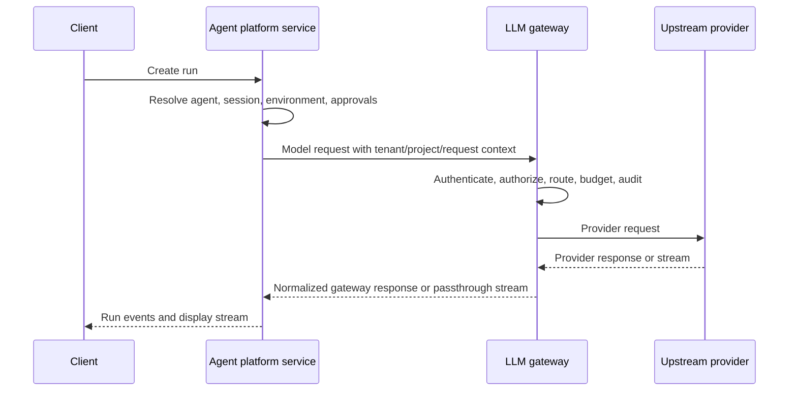

# Service Suite Boundary

Status: discussion draft.

This spec records the proposed boundary for building the LLM gateway and agent
platform service in a new repository.

## Decision

Use a new Git repository with one workspace for both services:

- `starweaver-gateway`: the model egress plane.
- `starweaver-platform-service`: the agent control plane.
- versioned HTTP and schema contracts between the services.

Shared service crates are deferred candidates. They should be extracted only
after a second concrete service use proves the boundary, not for early
convenience.

Authn, identity, permissions, and policy are expected shared candidates, but
they still follow the same rule. The gateway should first prove its own
request, admin, login, dashboard, and export authorization paths. The agent
platform should then prove concrete run, conversation, approval, environment,
and evidence-archive authorization paths. Only after both sides have real usage
should code move into shared layers.

Do not place this workspace inside the existing Starweaver SDK/runtime
repository.

## Why One New Repository

Gateway and agent platform service share enterprise service foundations:

- tenants, projects, users, service accounts, and scopes
- client credentials and upstream credentials
- secret references, masking, rotation state, and credential audit
- usage events, cost estimates, budgets, quota, pricing SKUs, and ledgers
- trace IDs, request IDs, model request IDs, run IDs, and redaction policy
- config versions, admin changes, audit logs, outbox events, and invalidation
- PostgreSQL metadata, Redis hot state, and object storage evidence patterns

These foundations are service-side concerns. Keeping them in one repository
reduces schema drift and keeps deployment, migrations, and admin policy aligned.

## Why Not The SDK Runtime Repository

The SDK/runtime repository should stay focused on agent engine concerns:

- runtime loop
- model protocol adapters
- tools and toolsets
- CLI and local host protocols
- envd integration
- session, stream, and storage contracts for the local/runtime layer

Service infrastructure adds a different dependency profile:

- HTTP servers
- PostgreSQL and Redis adapters
- OpenAPI schemas
- Docker and Helm artifacts
- cloud auth and secret managers
- service migrations
- service observability and SLOs

Mixing those concerns into the SDK/runtime repository would couple release
cadence, CI cost, security reviews, and dependency risk.

## Workspace Shape

Candidate workspace layout:

```text
starweaver-platform/
  Cargo.toml
  crates/
    starweaver-gateway
    starweaver-platform
    xtask
  migrations/
    gateway/
    platform/
  spec/
    shared/
    gateway/
    platform/
    ops/
  deploy/
    docker-compose.yml
    helm/
  docs/
```

The concrete crate list can change. The current implementation should keep the
workspace small and add shared crates only after a stable cross-service
contract has two real owners. Shared candidates may contain contracts, types,
repositories, and small policy helpers. They should not own long-running
service loops.

## Dependency Rules

| Component              | May Depend On                                                               | Must Not Depend On                                    |
| ---------------------- | --------------------------------------------------------------------------- | ----------------------------------------------------- |
| Gateway service        | gateway-local modules and versioned schema contracts                        | agent runtime, platform service internals             |
| Platform service       | platform-local modules, gateway HTTP client, and versioned schema contracts | gateway service internals, local CLI internals        |
| Shared contracts       | serde types, error contracts, small validation helpers                      | service loops, HTTP server frameworks, runtime engine |
| SDK/runtime repository | public gateway endpoint contracts as external HTTP config                   | this repository's internal crates                     |

## Service Relationship

Platform service may use the gateway as its default model egress path, but that
must be a deployment decision. The platform run coordinator should see a model
endpoint, credentials, trace headers, and response stream. It should not know
which route group or upstream credential the gateway used.



## Deferred Shared Contract Candidates

Shared contracts should be small and stable if they are extracted later:

- `TenantId`, `ProjectId`, `UserId`, `ServiceAccountId`
- `ClientCredential`, `CredentialScope`, `CredentialStatus`
- `UpstreamCredentialRef`, `SecretRef`, `CredentialRotationState`
- `UsageEvent`, `CostEstimate`, `BudgetPolicy`, `PricingSku`
- `AuditEvent`, `ConfigVersion`, `ChangeActor`
- `TraceContext`, `RequestContext`, `RedactionPolicy`
- `OutboxEvent`, `InvalidationTopic`

Do not share provider routing implementation, agent run coordination, retry
loops, stream fanout loops, or admin route handlers until a stable need exists.

## Auth And Permission Layering

The final split should be discussed after the gateway and agent platform both
exercise authn/authz in code. The likely layering is:

- shared contracts: ids, actor context, tenant/organization/project scope,
  principal references, session references, service account references, error
  envelopes, and audit context fields
- shared identity domain candidates: login provider config, users, external
  identities, sessions, service accounts, organization membership, project
  membership, role bindings, and action grants
- shared policy candidates: action registry shape, resource registry shape,
  Cedar schema generation, policy validation, built-in role templates, and
  contract tests
- gateway-local policy: model ingress actions, provider grants, upstream
  credentials, routing resources, budget/quota actions, realtime dashboard
  scopes, and provider observability
- platform-local policy: run actions, conversation actions, agent actions,
  approval actions, environment attachment actions, evidence archive actions,
  and platform-specific retention rules

The extraction gate is two concrete owners. A shared module needs at least one
gateway use case and one agent platform use case, plus contract tests proving it
does not widen either service's permissions. Until then, keep modules
service-local and share only versioned HTTP/schema contracts.
