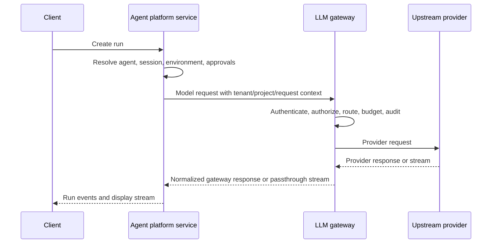

# Service Suite Boundary

Status: discussion draft.

This spec records the proposed boundary for building the LLM gateway and agent
platform service in a new repository.

## Decision

Use a new Git repository with one workspace for both services:

- `starweaver-gateway`: the model egress plane.
- `starweaver-platform-service`: the agent control plane.
- shared service crates: identity, credentials, usage, audit, config versioning,
  storage adapters, and client contracts.

Do not place this workspace inside the existing Starweaver SDK/runtime
repository.

## Why One New Repository

Gateway and agent platform service share enterprise service foundations:

- tenants, projects, users, service accounts, and scopes
- client credentials and upstream credentials
- secret references, masking, rotation state, and credential audit
- usage events, cost estimates, budgets, quota, pricing SKUs, and ledgers
- trace IDs, request IDs, model request IDs, run IDs, and redaction policy
- config versions, admin changes, audit logs, outbox events, and invalidation
- PostgreSQL metadata, Redis hot state, and object storage evidence patterns

These foundations are service-side concerns. Keeping them in one repository
reduces schema drift and keeps deployment, migrations, and admin policy aligned.

## Why Not The SDK Runtime Repository

The SDK/runtime repository should stay focused on agent engine concerns:

- runtime loop
- model protocol adapters
- tools and toolsets
- CLI and local host protocols
- envd integration
- session, stream, and storage contracts for the local/runtime layer

Service infrastructure adds a different dependency profile:

- HTTP servers
- PostgreSQL and Redis adapters
- OpenAPI schemas
- Docker and Helm artifacts
- cloud auth and secret managers
- service migrations
- service observability and SLOs

Mixing those concerns into the SDK/runtime repository would couple release
cadence, CI cost, security reviews, and dependency risk.

## Workspace Shape

Candidate workspace layout:

```text
starweaver-platform/
  Cargo.toml
  crates/
    starweaver-service-core
    starweaver-credentials
    starweaver-gateway-core
    starweaver-gateway
    starweaver-platform-core
    starweaver-platform-service
    starweaver-storage
    starweaver-admin-api
    xtask
  migrations/
    gateway/
    platform/
  spec/
    shared/
    gateway/
    platform/
    ops/
  deploy/
    docker-compose.yml
    helm/
  docs/
```

The concrete crate list can change. The boundary rule should not change:
shared crates contain contracts, types, repositories, and small policy helpers.
They should not own long-running service loops.

## Dependency Rules

| Component              | May Depend On                                                                  | Must Not Depend On                                    |
| ---------------------- | ------------------------------------------------------------------------------ | ----------------------------------------------------- |
| Gateway service        | shared service contracts, gateway core, storage adapters                       | agent runtime, platform service internals             |
| Platform service       | shared service contracts, platform core, storage adapters, gateway HTTP client | gateway service internals, local CLI internals        |
| Shared contracts       | serde types, error contracts, small validation helpers                         | service loops, HTTP server frameworks, runtime engine |
| SDK/runtime repository | public gateway endpoint contracts as external HTTP config                      | this repository's internal crates                     |

## Service Relationship

Platform service may use the gateway as its default model egress path, but that
must be a deployment decision. The platform run coordinator should see a model
endpoint, credentials, trace headers, and response stream. It should not know
which route group or upstream credential the gateway used.



## Shared Contract Candidates

Shared contracts should be small and stable:

- `TenantId`, `ProjectId`, `UserId`, `ServiceAccountId`
- `ClientCredential`, `CredentialScope`, `CredentialStatus`
- `UpstreamCredentialRef`, `SecretRef`, `CredentialRotationState`
- `UsageEvent`, `CostEstimate`, `BudgetPolicy`, `PricingSku`
- `AuditEvent`, `ConfigVersion`, `ChangeActor`
- `TraceContext`, `RequestContext`, `RedactionPolicy`
- `OutboxEvent`, `InvalidationTopic`

Do not share provider routing implementation, agent run coordination, retry
loops, stream fanout loops, or admin route handlers until a stable need exists.
