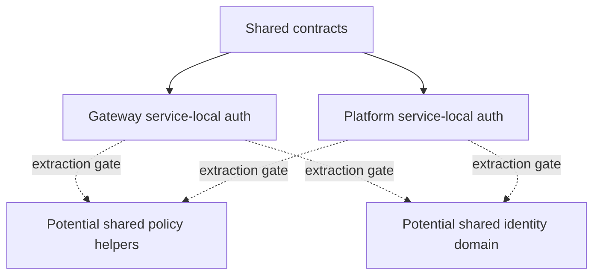

# Auth And Authorization Layering Decision

Status: decision draft.

Date: 2026-06-26.

This document records the current authn/authz layering decision for the
Starweaver service workspace. It is the Stage 13 review output for the gateway
implementation plan, based on the gateway implementation evidence that exists
today and the current agent platform design.

## Decision

Do not extract shared auth, identity, or policy crates yet.

The gateway has concrete authn/authz implementation evidence across runtime
ingress, admin APIs, login, dashboards, exports, notifications, emergency
operations, and background workers. The agent platform now has service-local
route metadata, resource ownership, authorization primitives, and foundation
HTTP handler tests for concrete run, conversation, approval, environment
attachment, and evidence archive paths.

For the next implementation phase:

- share only versioned HTTP/schema contracts between services
- keep gateway authn/authz modules gateway-local
- keep platform authn/authz modules platform-local while the platform connects
  its durable schema foundation to concrete `sqlx` repositories for sessions,
  API keys, service tokens, and any required mTLS authentication paths
- extract a shared crate only after at least one gateway use case and one agent
  platform use case require the same behavior and contract tests prove no
  permission widening

## Layering Model

Shared contracts may contain stable ids, actor context shape, tenant,
organization, and project scope fields, service account references, session
references, error envelopes, audit context fields, pagination envelopes, and
redaction markers.

Shared contracts must not contain service loops, HTTP routers, background
workers, migration ownership, gateway routing behavior, or platform run
coordination behavior.

## Gateway-Local Layer

The following should remain gateway-local:

- model ingress actions and protocol-family route metadata
- API key narrowing for model egress and admin routes
- provider grants and provider endpoint/resource eligibility
- upstream credentials and Codex upstream OAuth lifecycle
- model aliases, model targets, routing groups, route policies, and route
  simulation
- pricing SKUs, cost ledgers, budgets, quota policies, runtime reservations, and
  reconciliation
- Redis-compatible realtime gateway dashboard scopes
- OpenTelemetry exporter config and provider observability dimensions
- notification sinks, export jobs, emergency operations, and gateway runbooks

These concepts are gateway-specific even when they reuse shared actor or scope
contracts.

## Platform-Local Layer

The following should remain platform-local until implemented and tested:

- conversation, session, run, and run-event actions
- agent, tool, approval, deferred-tool, and steering actions
- environment attachment leases, provisioner refs, readiness summaries, and
  release actions
- evidence archive manifests, stream replay cursors, raw/debug event access, and
  retention policy
- platform run usage snapshots and gateway egress metadata projection
- platform-specific rate limits, live stream fanout, and run cancellation
  semantics

These concepts are likely to use the same tenant, organization, project, user,
service-account, and session contracts as the gateway, but their resources and
actions must stay in a platform namespace.

## Shared Domain Candidates

These are candidates only after both services have concrete owners:

| Candidate                       | Extraction Gate                                                                 |
| ------------------------------- | ------------------------------------------------------------------------------- |
| Id and scope contracts          | Both services pass the same actor context through authenticated HTTP boundaries |
| Session and principal contracts | Both services issue or verify server-side sessions with the same envelope       |
| Membership domain               | Platform run access and gateway dashboard access use the same membership graph  |
| Service account domain          | Platform and gateway both support service-account actors and revocation         |
| Role binding and action grants  | Platform route tests and gateway route tests share the same grant semantics     |
| Cedar schema helpers            | Both services generate service-specific action/resource schemas from one shape  |
| Audit context contracts         | Both services store comparable actor/resource/version/redaction evidence        |

Extraction should start with contracts and fixtures, not repository
implementations. Repository adapters should stay service-owned unless both
services intentionally share the same storage table owner.

## Policy Namespace Rules

Action ids must stay service-namespaced:

| Service  | Namespace Examples                                                                 |
| -------- | ---------------------------------------------------------------------------------- |
| Gateway  | `gateway.model.invoke`, `gateway.dashboard.project.read`, `gateway.config.publish` |
| Platform | `platform.run.create`, `platform.approval.decide`, `platform.environment.attach`   |

A shared policy engine is acceptable only if it enforces namespace separation and
resource-kind compatibility. Gateway model permissions must not authorize
platform run access. Platform run permissions must not authorize gateway provider
or credential access.

## Contract Test Requirements

Before extracting any shared auth/authz crate, add contract tests that prove:

- actor context serialization is equivalent across gateway and platform handlers
- tenant, organization, and project scope resolution rejects cross-scope access
- service account actors cannot gain user-only or strong-auth permissions
- service-specific action ids cannot authorize another service's resources
- Cedar schema generation preserves service namespaces and resource-kind
  compatibility
- audit context redaction hides raw secrets, tokens, API keys, provider payloads,
  and platform raw event payloads
- session revocation and user disable behavior are visible to both services
  through the shared contract without sharing router internals

## Migration Rules

Any future extraction must follow these rules:

- extract one layer at a time, starting with pure contracts and fixtures
- define a single schema owner for every persistent table before moving
  repository code
- keep gateway and platform binaries independent
- keep gateway free of platform internals and the agent runtime
- keep platform free of gateway internals; use the gateway through HTTP contracts
- avoid shared crates that own background workers, retry loops, run loops, or
  service-specific route handlers
- require `make ci` plus service-specific contract tests before and after the
  extraction

## Current Outcome

The current outcome is still a documented deferral, not a missing shared crate.
The gateway has enough auth/authz evidence to inform the shared boundary. The
agent platform now has platform-local action, resource, role, grant, actor-kind,
item-filtering, opaque bearer session/API-key/service-token authentication,
route metadata, resource ownership, safe business resource projections, and
foundation HTTP handler tests for conversations, runs, approvals, environment
attachments, deferred tools, and evidence archives.

The agent platform also has a service-local durable schema foundation for
identity providers, generic OIDC external identities, auth sessions, bearer
credentials, resource ownership, and safe business-resource tables. It also has
a first PostgreSQL repository adapter for auth sessions, bearer credentials,
verified mTLS identities, resource ownership, and safe business projections.
The HTTP foundation state now has an explicit repository backend selector that
routes request handling through either deterministic in-memory stores or the
durable PostgreSQL adapter without changing action ids, resource kinds, policy
evaluation, or response envelopes. The platform startup configuration gate now
rejects production profiles that would expose the in-memory backend or omit the
durable PostgreSQL URL. The first platform binary entrypoint uses that gate to
build either deterministic in-memory foundation state or a migrated PostgreSQL
repository-backed state before binding the HTTP listener. Shared extraction
remains gated on contract tests from both services that prove the same actor and
scope semantics without widening service-specific permissions.
